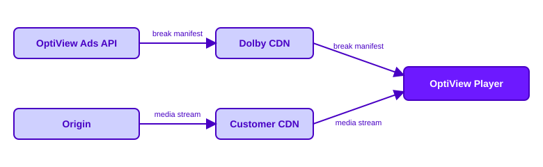

# Break Manifest

The Break Manifest is the contract between the OptiView Ads backend and the player. It is a small JSON document that describes the ad breaks that are currently relevant for a [channel](/ads/concepts/channels), and the OptiView Player polls it to learn which breaks to prepare and play.

## Side-loading

The Break Manifest is **side-loaded**: it is served from its own endpoint, separately from the media manifest. The player fetches the media stream from your CDN as usual and, in parallel, polls the Break Manifest to drive ad break scheduling.



Side-loading has some important advantages:

- **Streaming protocol independent.** Because the Break Manifest travels next to the stream instead of inside it, features do not have to be ported into an existing streaming protocol to support your use cases. It also allows us to bring features that are not possible today due to the limitations of those protocols.
- **Not in your critical path.** OptiView Ads never modifies your media manifest, so ad insertion cannot corrupt the stream and cause an outage the way an insertion platform writing wrong data into the media manifest can.
- **Minimal requirements on the stream.** The only thing the stream needs is time metadata to schedule the breaks against.

## Endpoint

The Break Manifest is served per channel:

```text
GET /manifest/v1/:orgId/channels/:channelId
```

The endpoint is a public read endpoint: it takes no authentication and is served with permissive CORS so that players and CDNs can fetch it directly.

```bash
curl 'https://us.markers.optiview.dolby.com/manifest/v1/org_123/channels/1f7f3a5a-9c2e-4a56-b1d4-3f8a2c9d6e01'
```

:::note Regional domains
The example uses the US region (`https://us.markers.optiview.dolby.com`). For the EU region, replace `us.` with `eu.` (`https://eu.markers.optiview.dolby.com`).
:::

Responses carry a `Cache-Control` header aligned with the channel's active polling interval, so a cached copy is never held longer than the fastest polling cadence the channel advertises.

## Manifest envelope

The Break Manifest document contains the following top-level properties:

| Property              | Description                                                                                                                                                                                                  |
| --------------------- | ------------------------------------------------------------------------------------------------------------------------------------------------------------------------------------------------------------ |
| `version`             | The Break Manifest format version, following Semantic Versioning. Use it to guard against future format changes.                                                                                             |
| `channelId`           | The identifier of the [channel](/ads/concepts/channels) this manifest serves. Players use it for reporting, analytics, and diagnostics.                                                                      |
| `timebase`            | How each break's `start` is expressed: `wallclock` (UTC ISO 8601 timestamp), `pts` (presentation timestamp), or `mediatime` (seconds from the start of a VOD asset). See [Channels](/ads/concepts/channels). |
| `polling`             | How often the player should refresh the manifest. See [Polling](#polling).                                                                                                                                   |
| `vendorConfiguration` | Session-level configuration per vendor integration — for example, the Google Ad Manager network code and custom asset key the player needs to create the stream session.                                     |
| `breaks`              | The breaks currently relevant for the channel. Each entry carries the break's schedule, controls, and variants — see [Breaks](./breaks.mdx) for what a break contains.                                       |

Everything inside a break entry — `start`, `duration`, `resumeOffset`, `controls`, and `variant` — is described on the [Breaks](./breaks.mdx) page.

### Polling

The `polling` object advertises how often the player should refresh the manifest, with two cadences:

- **`polling.idle`** — the interval to poll at when no break is active. A slower cadence keeps request load low while nothing is happening. Default: `10` seconds.
- **`polling.active`** — the interval to poll at while a break is active. A faster cadence lets the player react quickly to duration changes, an early return, or late additions. Default: `1` second.

Both cadences are configured on the channel through its `pollingIdleSeconds` and `pollingActiveSeconds` settings.

### Which breaks are included

The Break Manifest reflects the breaks that are currently relevant for delivery, not the channel's entire break history:

- An upcoming break appears in the manifest ahead of its start, controlled by the channel's ad prefetch window (`adPrefetchMs`, default 10 seconds). This gives the player time to prepare the break before it starts.
- A past break remains included while its window still overlaps the channel's DVR window (`dvrWindowMs`, default 5 minutes), so viewers seeking back still get the break. Breaks that ended before the DVR look-back are dropped.
- Only fully prepared breaks are announced. Breaks that are still being prepared, [cued breaks](./breaks.mdx#cued-breaks) waiting to be punched, and failed breaks never appear — see the [break lifecycle](./breaks.mdx#break-lifecycle).

## Related resources

| Resource                                   | Relationship                                                                                        |
| ------------------------------------------ | --------------------------------------------------------------------------------------------------- |
| [Getting started](/ads/getting-started/)   | Integrating the OptiView Player that polls the Break Manifest.                                      |
| [Channels](./channels.mdx)                 | The parent of the Break Manifest. The timebase and delivery window shape which breaks are included. |
| [Breaks](./breaks.mdx)                     | Scheduled or detected ad opportunities announced through the manifest.                              |
| [Integrations](../integrations/google.mdx) | Channel-level delivery integrations, such as Server-Side Ad Insertion with Google DAI.              |
