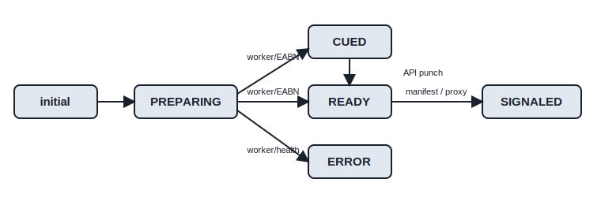
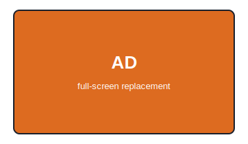
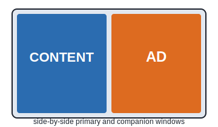
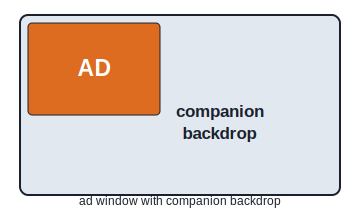
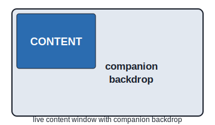
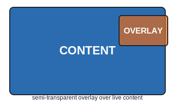

# Breaks

import RebrandingNotice from '../callouts/_rebranding_notice.md';

<RebrandingNotice />

A break is the core monetization entity in OptiView Ads. It represents an ad opportunity scheduled on a channel and contains the timing, lifecycle state, playback controls, layout variants, and typed assets that a player or delivery service needs.

Breaks are scoped to an organization and created for a channel. API calls authenticate with an API key and secret using HTTP Basic authentication and identify the organization with the `X-Org-ID` header.

## Dashboard path

In the OptiView Unified Dashboard, open **Ads → Channels**, open a channel, and select **Breaks**. The Breaks area is used to schedule, inspect, and delete breaks for the channel.

## Break identity

The compound identity of a Break is:

```text
orgId + channelId + id
```

`id` is optional when creating a Break. If omitted, the API generates an identifier. The identity is scoped by both the organization and channel, so the same `id` can exist on different channels or in different organizations.

| Field        | Type             | Description                                                                                                     |
| ------------ | ---------------- | --------------------------------------------------------------------------------------------------------------- |
| `id`         | string           | Break identifier. Auto-generated if omitted on create.                                                          |
| `orgId`      | string           | Organization scope. Supplied by the authenticated `X-Org-ID` context.                                           |
| `channelId`  | string           | Parent channel identifier.                                                                                      |
| `originId`   | string, optional | Provenance for an automatically detected Break. Set internally by the detection worker and not client-settable. |
| `templateId` | string, optional | Identifier of the Template used to create the Break, if any.                                                    |
| `eventId`    | string, optional | Identifier of the Event under which the Break was scheduled, if any.                                            |

The Break also stores internal Google DAI fields such as `podId`, `assetKey`, `networkCode`, `customAssetKey`, and `daiAssetKeys`, plus the lifecycle `status`, optional `errorMessage`, timebase-specific start fields, denormalized indexes, and the raw `data` payload.

### Stored fields

| Field               | Type                   | Required/default behavior                                     |
| ------------------- | ---------------------- | ------------------------------------------------------------- |
| `id`                | string                 | Required; generated when omitted on create.                   |
| `orgId`             | string                 | Required organization scope.                                  |
| `channelId`         | string                 | Required channel scope.                                       |
| `eventId`           | string, optional       | Event association.                                            |
| `templateId`        | string, optional       | Template association retained after creation.                 |
| `podId`             | string, optional       | Google DAI pod identifier after vendor-pod decisioning.       |
| `status`            | enum                   | `PREPARING`, `CUED`, `READY`, `SIGNALED`, or `ERROR`.         |
| `originId`          | string, optional       | Internal provenance for an automatically detected Break.      |
| `markerRuleId`      | string, optional       | Marker rule associated with automatic detection.              |
| `markerDetectionId` | string, optional       | Detection-history record associated with automatic detection. |
| `assetKey`          | string, optional       | Google DAI asset key.                                         |
| `networkCode`       | string, optional       | Organization Google DAI network-code snapshot.                |
| `customAssetKey`    | string, optional       | Channel Google DAI custom-asset-key snapshot.                 |
| `daiAssetKeys`      | string array, optional | Deduplicated SSAI DAI asset-key snapshot.                     |
| `errorMessage`      | string, optional       | Failure reason when status is `ERROR`.                        |
| `timebase`          | `wallclock` or `pts`   | Required; copied from the channel.                            |
| `startWallclock`    | Date, optional         | Wallclock start for wallclock channels.                       |
| `startPts`          | number, optional       | Numeric PTS start for PTS channels.                           |
| `duration`          | number                 | Required duration in seconds.                                 |
| `variantFormats`    | string array, optional | Denormalized variant-format index.                            |
| `assetTypes`        | string array, optional | Denormalized asset-type index.                                |
| `vendors`           | string array, optional | Denormalized vendor index.                                    |
| `data`              | object                 | Required raw `BreakData` payload.                             |
| `createdAt`         | Date                   | Automatically managed creation timestamp.                     |
| `updatedAt`         | Date                   | Automatically managed modification timestamp.                 |

## Related resources

| Resource                           | Relationship                                                                       |
| ---------------------------------- | ---------------------------------------------------------------------------------- |
| [Channels](/ads/concepts/channels) | Parent resource. The channel's timebase determines which start field a Break uses. |
| Events                             | Time windows that group related Breaks.                                            |
| Templates                          | Reusable Break definitions merged into a new Break at creation time.               |
| Origins                            | Manifest sources whose detected markers can create Breaks.                         |
| Marker rules and detection history | Rules and audit records associated with automatically detected Breaks.             |
| Integrations                       | Channel-level delivery integrations, including SSAI DAI cue fan-out.               |

## Scheduling

### Timebase-dependent starts

Every Break copies the timebase of its channel:

| Channel timebase | API `start` value        | Stored field     | Requirement                                             |
| ---------------- | ------------------------ | ---------------- | ------------------------------------------------------- |
| `wallclock`      | ISO 8601 datetime string | `startWallclock` | Optional. Omitting it creates a CUED no-start workflow. |
| `pts`            | Non-negative number      | `startPts`       | Required.                                               |

The API request field is named `start`; the service maps it to `startWallclock` or `startPts` according to the channel timebase. A PTS channel rejects a missing or non-numeric start. A wallclock channel accepts an omitted start, but a supplied start must be a valid ISO datetime.

`duration` is required and is expressed in seconds. A scheduled Break cannot overlap another Break on the same channel. Wallclock overlap is evaluated using wallclock instants; PTS overlap is evaluated using PTS values.

The service also requires a scheduled start to be sufficiently ahead of the current effective playhead. GAM vendor pod Breaks must additionally clear the EABN decisioning margin.

### Create a Break directly

Create a Break by supplying its payload and, when required, its `start`:

```bash
curl -X POST 'https://ads.example.com/api/v1/channels/sports-main/breaks' \
  -u "$ADS_API_KEY:$ADS_API_SECRET" \
  -H 'Content-Type: application/json' \
  -H 'X-Org-ID: org_123' \
  -d '{
    "id": "break-2026-001",
    "start": "2026-07-16T12:15:00.000Z",
    "duration": 120,
    "resumeOffset": 0,
    "controls": {
      "skipOffset": 30,
      "snapback": true
    },
    "variant": {
      "format": "single",
      "assets": [
        {
          "id": "asset-001",
          "type": "static",
          "mediaType": "video",
          "mimeType": "video/mp4",
          "uri": "https://cdn.example.com/ads/asset-001.m3u8"
        }
      ]
    }
  }'
```

### Create from a Template

Supply `templateId` to use a Template as the base. At creation time, the service merges the Template's stored `data` and duration with the request overrides, validates the result, and snapshots the resolved payload into the new Break's `data`. Later Template edits do not change an existing Break.

Supported creation overrides are:

- `id`
- `eventId`
- `start`
- `duration`
- `variant`
- `assetParameters`

```bash
curl -X POST 'https://ads.example.com/api/v1/channels/sports-main/breaks' \
  -u "$ADS_API_KEY:$ADS_API_SECRET" \
  -H 'Content-Type: application/json' \
  -H 'X-Org-ID: org_123' \
  -d '{
    "templateId": "template-sports-spot",
    "id": "break-from-template-001",
    "start": "2026-07-16T12:20:00.000Z",
    "eventId": "event-2026-final",
    "assetParameters": {
      "airingId": "airing-001"
    }
  }'
```

### Create under an Event

An `eventId` must identify an Event belonging to the same organization and channel. For wallclock channels, the Break must satisfy all of these conditions:

- `start >= event.startDate`
- `start <= event.endDate`
- `start + duration <= event.endDate`

PTS channels still require the Event to exist on the same organization and channel, but the service does not compare a numeric PTS start to the Event's wallclock window.

### Scheduling constraints

The API rejects starts that are too close to, or behind, the effective playhead. It also rejects any overlap with an existing Break on the channel. These checks apply to direct and Template-based creation.

## Lifecycle

The exact Break status values are:

```text
PREPARING
CUED
READY
SIGNALED
ERROR
```

`errorMessage` contains the human-readable reason when a Break is moved to `ERROR`.

### Initial status

| Break kind                                                       | Start supplied? | Initial status |
| ---------------------------------------------------------------- | --------------- | -------------- |
| GAM vendor pod (`vendor: "gam"`, `vendorParameters.type: "pod"`) | Either          | `PREPARING`    |
| Non-vendor Break                                                 | Yes             | `READY`        |
| Non-vendor Break on a wallclock channel                          | No              | `CUED`         |



### Status transitions and owners

| Transition          | Owner                  | Behavior                                                                                                                            |
| ------------------- | ---------------------- | ----------------------------------------------------------------------------------------------------------------------------------- |
| `PREPARING → CUED`  | Worker / EABN          | After Google DAI decisioning, a Break without a timebase-appropriate start becomes CUED.                                            |
| `PREPARING → READY` | Worker / EABN          | After Google DAI decisioning, a Break with a timebase-appropriate start becomes READY.                                              |
| `PREPARING → ERROR` | Worker / health worker | A missed unsignaled Break is failed with `Break passed its scheduling window before it could be signaled`.                          |
| `CUED → READY`      | API punch              | Punching assigns `startWallclock` and makes the Break eligible for delivery.                                                        |
| `READY → SIGNALED`  | Manifest service       | The Break Manifest includes READY and SIGNALED Breaks, then changes returned READY Breaks to SIGNALED.                              |
| `READY → SIGNALED`  | Proxy                  | After injecting HLS cues, the proxy changes the injected READY Breaks to SIGNALED. The update is scoped to READY and is idempotent. |

The worker can also reset a superseded active Google Break from `READY` or `SIGNALED` back to `PREPARING` when it is still outside the decision margin.

## Cue and punch workflow

Vendor pod Breaks can be prepared before their exact start is known:

1. Create a GAM vendor pod Break without a start on a wallclock channel. It starts in `PREPARING`.
2. The worker/EABN service pre-decides the Break with Google DAI.
3. After decisioning, the Break receives a `podId` and becomes `CUED`.
4. Punch the Break when it should fire. Punching sets `startWallclock` and changes the status to `READY`.

Only wallclock channels support punch. A GAM CUED Break must have a `podId` from EABN decisioning before it can be punched. The application allows only one no-start Break in `PREPARING` or `CUED` per channel; creating another one fails.

```bash
curl -X POST 'https://ads.example.com/api/v1/channels/sports-main/breaks/gam-cued-001/punch' \
  -u "$ADS_API_KEY:$ADS_API_SECRET" \
  -H 'Content-Type: application/json' \
  -H 'X-Org-ID: org_123' \
  -d '{
    "start": "2026-07-16T12:25:00.000Z"
  }'
```

If the body is omitted, the punch uses the current time. A requested past time is clamped to now.

## Break payload (`data`)

The stored `data` object has this shape:

```ts
type BreakData = {
  duration: number; // required, seconds, >= 0
  resumeOffset?: number; // seconds, >= 0
  controls?: {
    skipOffset?: number; // seconds, >= 0
    snapback?: boolean;
  };
  variant: BreakVariant | BreakVariant[]; // one object or a non-empty array
};
```

| Field                 | Type              | Description                                                    |
| --------------------- | ----------------- | -------------------------------------------------------------- |
| `duration`            | number            | Required Break duration in seconds.                            |
| `resumeOffset`        | number, optional  | Resume offset in seconds.                                      |
| `controls.skipOffset` | number, optional  | Minimum elapsed time before skipping is allowed.               |
| `controls.snapback`   | boolean, optional | Enables snapback behavior.                                     |
| `variant`             | object or array   | One layout variant, or a non-empty array of targeted variants. |

## Layouts and variants

This is the canonical V2 layout and variant reference. Templates use the same payload model and should refer to this section rather than duplicate the layout definitions.


### Asset model

Every asset has these common fields:

```ts
{
  id: string;
  mediaType: "video" | "image";
  mimeType?: string;
  duration?: number;
  interaction?: {
    clickThrough?: string;
  };
}
```

`id` is generated as a UUID when omitted. Asset `type` is one of:

| `type`   | Fields                                                                                                                                                         |
| -------- | -------------------------------------------------------------------------------------------------------------------------------------------------------------- |
| `static` | `uri`: a URL string or an array of `{ value, targeting? }` objects.                                                                                            |
| `vast`   | `uri`: a URL string or an array of `{ value, targeting? }` objects.                                                                                            |
| `vendor` | `vendor: "gam"`, `vendorParameters`, optional `assetParameters`, and `uri`. GAM vendor parameters require `type: "pod"`. The default `uri` is `"placeholder"`. |

For URI arrays, each entry can include optional device targeting:

```ts
{
  value: string;
  targeting?: {
    deviceType?: "desktop" | "tablet" | "mobile" | "tv";
  };
}
```

### `single`



The `single` variant contains a non-empty plain `assets` array:

```ts
{
  format: "single";
  targeting?: { deviceType?: "desktop" | "tablet" | "mobile" | "tv" };
  assets: Asset[];
}
```

Use a full-screen creative. Optimize the asset size for the player and supply companion imagery separately when the player experience requires it.

### `double`



The `double` variant contains a non-empty array in which every entry has a primary asset and a `companion` asset:

```ts
{
  format: "double";
  targeting?: { deviceType?: "desktop" | "tablet" | "mobile" | "tv" };
  assets: Array<Asset & { companion: Asset }>;
}
```

Use 16:9 companion imagery where possible. The double box is unsupported on many smart TVs; provide a single-format fallback for those devices.

### `lshape_ad`



The `lshape_ad` variant uses the same companion-bearing asset shape as `double`:

```ts
{
  format: "lshape_ad";
  targeting?: { deviceType?: "desktop" | "tablet" | "mobile" | "tv" };
  assets: Array<Asset & { companion: Asset }>;
}
```

The ad occupies the smaller window and the companion asset supplies the remaining backdrop. Use 16:9 companion imagery and optimize image dimensions for the target player.

### `lshape_content`



The `lshape_content` variant uses a non-empty plain asset array:

```ts
{
  format: "lshape_content";
  targeting?: { deviceType?: "desktop" | "tablet" | "mobile" | "tv" };
  assets: Asset[];
}
```

The live content occupies the smaller window and the remaining area is supplied by the layout's companion/backdrop treatment.

### `overlay`



The `overlay` variant uses a non-empty plain asset array plus required position and size objects:

```ts
{
  format: "overlay";
  targeting?: { deviceType?: "desktop" | "tablet" | "mobile" | "tv" };
  assets: Asset[];
  position: {
    top?: number;
    bottom?: number;
    left?: number;
    right?: number;
  };
  size: {
    width: number;
    height: number;
  };
  opacity?: number;
}
```

`position` requires at least one of `top` or `bottom` and at least one of `left` or `right`. All position and size values are fractions from `0` through `1`, not percentages. `opacity`, when supplied, is also a fraction from `0` through `1`.

### Multiple variants and device targeting

Set `variant` to an array when one Break contains multiple layouts for different devices. Each variant can have an optional `targeting.deviceType` value:

```json
{
  "duration": 30,
  "variant": [
    {
      "format": "single",
      "targeting": {
        "deviceType": "mobile"
      },
      "assets": [
        {
          "type": "static",
          "mediaType": "video",
          "uri": "https://cdn.example.com/ads/mobile.m3u8"
        }
      ]
    },
    {
      "format": "single",
      "targeting": {
        "deviceType": "tv"
      },
      "assets": [
        {
          "type": "static",
          "mediaType": "video",
          "uri": "https://cdn.example.com/ads/tv.m3u8"
        }
      ]
    },
    {
      "format": "double",
      "targeting": {
        "deviceType": "desktop"
      },
      "assets": [
        {
          "type": "static",
          "mediaType": "video",
          "uri": "https://cdn.example.com/ads/desktop.m3u8",
          "companion": {
            "type": "static",
            "mediaType": "image",
            "uri": "https://cdn.example.com/ads/desktop-companion.jpg"
          }
        }
      ]
    },
    {
      "format": "double",
      "targeting": {
        "deviceType": "tablet"
      },
      "assets": [
        {
          "type": "static",
          "mediaType": "video",
          "uri": "https://cdn.example.com/ads/tablet.m3u8",
          "companion": {
            "type": "static",
            "mediaType": "image",
            "uri": "https://cdn.example.com/ads/tablet-companion.jpg"
          }
        }
      ]
    }
  ]
}
```

## Delivery overview

### Break Manifest polling

The Manifest Service returns `READY` and `SIGNALED` Breaks that remain within the channel's DVR window. It changes returned `READY` Breaks to `SIGNALED` and emits the timebase-specific start, duration, controls, resume offset, and variant data. Players poll the Manifest according to the channel's advertised idle and active polling intervals.

### SSAI cue injection

For wallclock GAM pod Breaks on channels with an SSAI DAI integration, the Proxy injects HLS `EXT-X-DATERANGE` OUT and IN cues into the media playlist. After the cues are written, it changes the injected Breaks from `READY` to `SIGNALED`.

`PREPARING`, `CUED`, and `ERROR` Breaks are not delivered through either path.

## API usage

All examples use the same organization-scoped Basic authentication as the Channels API.

### Create directly

```bash
curl -X POST 'https://ads.example.com/api/v1/channels/sports-main/breaks' \
  -u "$ADS_API_KEY:$ADS_API_SECRET" \
  -H 'Content-Type: application/json' \
  -H 'X-Org-ID: org_123' \
  -d '{
    "id": "break-api-001",
    "start": "2026-07-16T12:30:00.000Z",
    "duration": 60,
    "controls": {
      "skipOffset": 10,
      "snapback": false
    },
    "variant": {
      "format": "single",
      "assets": [
        {
          "type": "vast",
          "mediaType": "video",
          "uri": "https://ads.example.com/vast/creative-001.xml"
        }
      ]
    }
  }'
```

### Create from a Template

```bash
curl -X POST 'https://ads.example.com/api/v1/channels/sports-main/breaks' \
  -u "$ADS_API_KEY:$ADS_API_SECRET" \
  -H 'Content-Type: application/json' \
  -H 'X-Org-ID: org_123' \
  -d '{
    "templateId": "template-sports-spot",
    "start": "2026-07-16T12:31:00.000Z",
    "duration": 45
  }'
```

### List Breaks

```bash
curl 'https://ads.example.com/api/v1/channels/sports-main/breaks?page=1&pageSize=20' \
  -u "$ADS_API_KEY:$ADS_API_SECRET" \
  -H 'X-Org-ID: org_123'
```

`page` defaults to `1`; `pageSize` defaults to `20` and has a maximum of `100`. Lists also accept the optional RSQL `filter` and `sort` parameters.

Filterable fields are:

```text
wallclock, assetType, format, eventId, templateId, duration, status, originId
```

Sortable fields are:

```text
wallclock, duration, status, createdAt
```

Filter by one status:

```bash
curl 'https://ads.example.com/api/v1/channels/sports-main/breaks?filter=status==READY' \
  -u "$ADS_API_KEY:$ADS_API_SECRET" \
  -H 'X-Org-ID: org_123'
```

Filter by either READY or SIGNALED:

```bash
curl 'https://ads.example.com/api/v1/channels/sports-main/breaks?filter=status=in=(READY,SIGNALED)' \
  -u "$ADS_API_KEY:$ADS_API_SECRET" \
  -H 'X-Org-ID: org_123'
```

The `/active` and `/current` variants are also available:

```text
GET /api/v1/channels/{channelId}/breaks/active
GET /api/v1/channels/{channelId}/breaks/current
```

### Get one Break

```bash
curl 'https://ads.example.com/api/v1/channels/sports-main/breaks/break-api-001' \
  -u "$ADS_API_KEY:$ADS_API_SECRET" \
  -H 'X-Org-ID: org_123'
```

### Delete one Break

```bash
curl -X DELETE 'https://ads.example.com/api/v1/channels/sports-main/breaks/break-api-001' \
  -u "$ADS_API_KEY:$ADS_API_SECRET" \
  -H 'X-Org-ID: org_123'
```

### Bulk delete Breaks

```bash
curl -X DELETE 'https://ads.example.com/api/v1/channels/sports-main/breaks' \
  -u "$ADS_API_KEY:$ADS_API_SECRET" \
  -H 'Content-Type: application/json' \
  -H 'X-Org-ID: org_123' \
  -d '{
    "ids": ["break-api-001", "break-api-002"]
  }'
```

### Punch a CUED Break

```bash
curl -X POST 'https://ads.example.com/api/v1/channels/sports-main/breaks/gam-cued-001/punch' \
  -u "$ADS_API_KEY:$ADS_API_SECRET" \
  -H 'Content-Type: application/json' \
  -H 'X-Org-ID: org_123' \
  -d '{
    "start": "2026-07-16T12:35:00.000Z"
  }'
```

## See also

- [Channels](/ads/concepts/channels) — channel timebases, polling policy, origins, marker detection, and delivery integrations.
- Templates — reusable Break definitions and Template-based scheduling.
- Events — event windows and event-scoped Breaks.
- Marker Detection — automatic marker evaluation and Break provenance.
- Vendors and Google DAI — vendor pod decisioning and delivery.
