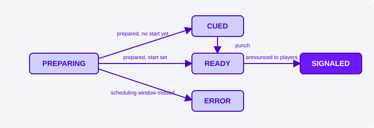
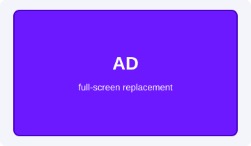
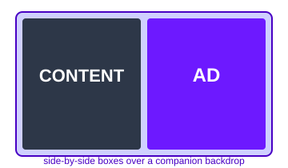
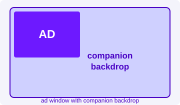
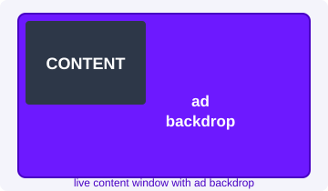
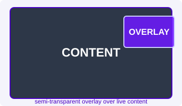

# Breaks

A break is the core monetization entity in OptiView Ads. It represents an ad opportunity scheduled on a channel and describes when the break starts, how long it lasts, what the viewer is allowed to do during the break, and which ad experience is rendered.

Breaks are scoped to an organization and created for a [channel](./channels.mdx). API calls authenticate with an API key and secret using HTTP Basic authentication and identify the organization with the `X-Org-ID` header.

:::note Regional domains
The examples below use the US region (`https://us.ads.optiview.dolby.com`). For the EU region, replace `us.` with `eu.` (`https://eu.ads.optiview.dolby.com`).
:::

## Break identity

Every break has an `id` that is unique within its channel. The `id` is optional when creating a break: if you omit it, OptiView Ads generates one for you. When you supply your own, we recommend using a UUID.

## Scheduling

### Timebase-based scheduling

The [timebase of the channel](./channels.mdx#timebase) defines how a break is scheduled. Every break follows the timebase of its channel, and the break's `start` is expressed on that timeline:

- **`wallclock`** — the break's `start` is a UTC ISO 8601 timestamp (for example `"2026-07-16T12:15:00.000Z"`). Players match it against the wallclock timeline carried by the stream. `start` is optional on wallclock channels: omitting it creates a [cued break](#cued-breaks).
- **`pts`** — the break's `start` is a non-negative number: a presentation timestamp on the encoder's timeline. `start` is required on PTS channels.

`duration` is always required and is expressed in seconds. It is the **maximum** duration of the break.

### Cued breaks

On a wallclock channel you can create a break without a `start`. Such a break is **cued**: it is fully prepared ahead of time, but it is not announced to players yet — it waits for you to assign its start at exactly the right moment. This is ideal for live productions where you know a break is coming but not exactly when.

See [Break punching](#break-punching) for how to fire a cued break.

### Create a break directly

You can create a break manually by supplying the necessary fields: the `start` (when required by the timebase), the `duration`, and the `variant` describing the ad experience. See [Break configuration](#break-configuration) for all the options.

```bash
curl -X POST 'https://us.ads.optiview.dolby.com/api/v1/channels/1f7f3a5a-9c2e-4a56-b1d4-3f8a2c9d6e01/breaks' \
  -u "$ADS_API_KEY:$ADS_API_SECRET" \
  -H 'Content-Type: application/json' \
  -H 'X-Org-ID: org_123' \
  -d '{
    "id": "8c3f6a2e-5b1d-4e7a-9c48-2d6f0b1a3e57",
    "start": "2026-07-16T12:15:00.000Z",
    "duration": 120,
    "resumeOffset": 0,
    "controls": {
      "skipOffset": 30,
      "snapback": true
    },
    "variant": {
      "format": "single",
      "assets": [
        {
          "id": "asset-001",
          "type": "static",
          "mediaType": "video",
          "mimeType": "video/mp4",
          "uri": "https://cdn.example.com/ads/asset-001.m3u8"
        }
      ]
    }
  }'
```

### Create from a template

A [template](./templates.mdx) preconfigures a break: it stores the break payload once so you can schedule consistent breaks quickly. Reference the template with `templateId` when creating the break.

The created break stores a **snapshot** of the template: the template's content is copied onto the break at creation time. Editing the template later does not change breaks that were already created from it.

You can override parts of the template per break. Supported overrides are `id`, `eventId`, `start`, `duration`, and `variant`:

```bash
curl -X POST 'https://us.ads.optiview.dolby.com/api/v1/channels/1f7f3a5a-9c2e-4a56-b1d4-3f8a2c9d6e01/breaks' \
  -u "$ADS_API_KEY:$ADS_API_SECRET" \
  -H 'Content-Type: application/json' \
  -H 'X-Org-ID: org_123' \
  -d '{
    "templateId": "template-sports-spot",
    "id": "9e4b7c1d-2a8f-4d35-b6e9-7c0a5f2d8b14",
    "start": "2026-07-16T12:20:00.000Z",
    "duration": 60
  }'
```

For templates that contain [vendor assets](#vendor-assets), you can additionally pass `assetParameters` (a string map) with the request. These are merged into the vendor assets of the template snapshot — for example to set per-break ad targeting parameters; on duplicate keys, the values you provide win.

### Prepare your breaks under an event

An [event](./events.mdx) is an event on your channel for which you want to prepare breaks, such as a live game or a show. Attach a break to an event by setting `eventId` when creating it.

Preparing breaks under an event is only supported on **wallclock** channels. The event's date window defines the limits within which its breaks can be scheduled:

- The break's start must fall within the event window (`startDate` through `endDate`).
- The entire break must fit inside the window: the break's end (`start` + `duration`) must not pass the event's `endDate`.

A [cued break](#cued-breaks) is not checked against the window at creation, because its start is not known yet; punch it while the event is in progress so its start falls inside the window.

### Scheduling constraints

OptiView Ads enforces a few constraints when scheduling breaks. Each one protects the viewer experience:

- **Breaks cannot overlap.** A scheduled break cannot overlap another break on the same channel. Players render one break at a time; overlapping breaks would make the ad timeline ambiguous for your viewers.
- **The start cannot lie in the past.** A break must start ahead of the current live position of the channel. Players need to receive the break through the [Break Manifest](./break-manifest.mdx) before its start time; a break scheduled behind the live position would never be seen.
- **Ad decisioning needs lead time.** Breaks delivered through an ad server integration such as [Google Ad Manager](../integrations/google.mdx) need a small extra margin before their start, so the ad decisioning can complete before the break begins. Scheduling closer than that margin is rejected rather than risking an empty break.
- **Event boundaries are respected.** A break attached to an event must fit entirely inside the event's date window, so all of an event's breaks stay within the occurrence they belong to.
- **One cued break at a time.** A channel holds at most one [cued break](#cued-breaks). The cued break is "the next break to fire" — allowing several at once would make it ambiguous which break a punch applies to.

## Break Lifecycle

A break moves through a small set of states:

- **`PREPARING`** — the break is being prepared with the ad vendor (for example, waiting for Google Ad Manager to decision the ad pod). Breaks that use a vendor asset always begin in this state.
- **`CUED`** — the break is prepared but has no start time yet. It waits for you to [punch](#break-punching) it. A break created without a `start` enters this state (after preparation completes, or immediately when no vendor preparation is needed).
- **`READY`** — the break has a start time and is ready to be announced to players. A break created with a `start` and no vendor preparation begins in this state.
- **`SIGNALED`** — the break has been announced to players through the [Break Manifest](./break-manifest.mdx) or through [SSAI cue injection](../integrations/google.mdx).
- **`ERROR`** — the break could not be delivered, for example because it passed its scheduling window before preparation completed.



At a high level, the transitions are:

| Transition          | What happens                                                                              |
| ------------------- | ----------------------------------------------------------------------------------------- |
| `PREPARING → READY` | Preparation completed and the break has a start time; it can now be announced to players. |
| `PREPARING → CUED`  | Preparation completed for a break without a start time; it now waits to be punched.       |
| `PREPARING → ERROR` | The break missed its scheduling window before preparation could complete.                 |
| `CUED → READY`      | You punched the break: its start time is set and it becomes eligible for delivery.        |
| `READY → SIGNALED`  | The break was announced to players.                                                       |

## Break punching

Break punching lets you prepare a break ahead of time without yet signaling it to any player. You create the break without a `start`, OptiView Ads prepares everything (including any ad vendor decisioning), and the break waits in the `CUED` state. When the moment arrives — for example, the referee blows the half-time whistle — you **punch** the break: its start time is assigned and it is announced to players right away.

While a break is being prepared or is waiting in the cued state, no other break can be cued on that channel: the cued break is waiting for you to punch it first. Punch (or delete) it before cueing the next one.

Punching is only available on wallclock channels.

```bash
curl -X POST 'https://us.ads.optiview.dolby.com/api/v1/channels/1f7f3a5a-9c2e-4a56-b1d4-3f8a2c9d6e01/breaks/8c3f6a2e-5b1d-4e7a-9c48-2d6f0b1a3e57/punch' \
  -u "$ADS_API_KEY:$ADS_API_SECRET" \
  -H 'Content-Type: application/json' \
  -H 'X-Org-ID: org_123' \
  -d '{
    "start": "2026-07-16T12:25:00.000Z"
  }'
```

The body is optional: if you omit it, the break starts now. A requested start in the past is clamped to now.

## Break configuration

This section describes the different possibilities of a break: its general properties, event based triggers, playback controls, layouts, variants, and the asset model.

### General

Every break carries these general properties:

| Property       | Description                                                                                                                                                                                                  |
| -------------- | ------------------------------------------------------------------------------------------------------------------------------------------------------------------------------------------------------------ |
| `start`        | When the break starts: a position on the channel's timebase (see [Timebase-based scheduling](#timebase-based-scheduling)), or a player event (see [Event based triggers](#event-based-triggers)).            |
| `duration`     | The **maximum** duration of the break, in seconds. When the ad content is longer, the player returns to the content when the duration is reached; when it is shorter, the player returns early.              |
| `resumeOffset` | Where the player resumes the content after the break, in seconds relative to the break's start. `0` resumes at the point where the break started; when omitted, playback resumes after the break's duration. |
| `controls`     | What the viewer is allowed to do during the break — see [Controls](#controls).                                                                                                                               |
| `variant`      | The ad experience(s) to render: the layout and its assets, optionally targeted per device — see [Layouts](#layouts) and [Variants](#variants).                                                               |

### Event based triggers

Instead of a position on the timeline, a break's `start` can be a player event. Event-triggered breaks are described in the Break Manifest with `start: { "type": "event", "event": "<start|pause|end>", "delay": <seconds> }`.

The optional `delay` property postpones the break: it is the number of seconds (≥ 0, default `0`) that must elapse after the event before the break starts. How the delay counts depends on the event, as described below.

#### Start

A `start` break is a **pre-roll**: it fires when content playback begins, once per session. Use it to show an ad before (or shortly after) the viewer starts watching. With a `delay`, the break fires after the viewer has actually watched that many seconds of content — the delay counts played media time only, so pausing or seeking does not advance it.

#### Pause

A `pause` break is a **pause ad**: it fires every time the viewer pauses playback and is dismissed when the viewer resumes. Use it to monetize the pause screen, typically with an image overlay. With a `delay`, the break appears after the viewer has been paused for that many seconds; resuming before the delay elapses cancels the pending break. When multiple `pause` breaks are defined, each pause shows the next one in order.

#### End

An `end` break is a **post-roll**: it fires when playback has ended, once per session. Use it to show an ad after the content finishes. With a `delay`, the break fires that many seconds after playback ended; replaying before the delay elapses cancels the pending break.

### Controls

The `controls` object determines what a viewer is allowed to do during a break:

- **`skipOffset`** — makes the break skippable. The value is the number of seconds into the break after which the viewer can skip it (for example, `skipOffset: 5` makes the break skippable after 5 seconds). When omitted, the break is not skippable.
- **`snapback`** — controls what happens when a viewer seeks over a break. When enabled, a viewer who tries to seek past the break is brought back to the start of the break; after the break finishes, playback continues at the position the viewer wanted to seek to. When omitted, viewers can seek over the break freely.

### Layouts

The layout (`format`) of a variant determines how the ad and your content share the screen. Click a layout to jump to its section:

| [](#single) | [](#double-box) | [](#l-shape-ad) |
| :----------------------------------------------------------: | :------------------------------------------------------------------: | :---------------------------------------------------------------------: |
|                      [Single](#single)                       |                      [Double Box](#double-box)                       |                        [L-shape ad](#l-shape-ad)                        |

| [](#l-shape-content) | [](#overlay) |
| :------------------------------------------------------------------------------------: | :-------------------------------------------------------------: |
|                          [L-shape content](#l-shape-content)                           |                       [Overlay](#overlay)                       |

#### Single


`format: "single"` is the most basic layout: the ad covers the whole video area, replacing the content for the duration of the break. It requires only an `assets` array; companion assets are not allowed.

```json
{
  "format": "single",
  "assets": [
    {
      "type": "static",
      "mediaType": "video",
      "uri": "https://cdn.example.com/ads/fullscreen.m3u8"
    }
  ]
}
```

#### Double Box


`format: "double"` squeezes the content back into its own box alongside a second box that plays the ad. The background behind both boxes is filled by a **companion** asset, which can be an image or a video — every entry in `assets` therefore requires a `companion`.

```json
{
  "format": "double",
  "assets": [
    {
      "type": "static",
      "mediaType": "video",
      "uri": "https://cdn.example.com/ads/spot.m3u8",
      "companion": {
        "type": "static",
        "mediaType": "image",
        "uri": "https://cdn.example.com/ads/backdrop.png"
      }
    }
  ]
}
```

#### L-shape ad


`format: "lshape_ad"` squeezes the content into a corner and **replaces it with an ad**: the ad plays in the main window while a **companion** asset (image or video) fills the L-shaped backdrop. Like Double Box, every entry in `assets` requires a `companion`.

```json
{
  "format": "lshape_ad",
  "assets": [
    {
      "type": "static",
      "mediaType": "video",
      "uri": "https://cdn.example.com/ads/spot.m3u8",
      "companion": {
        "type": "static",
        "mediaType": "image",
        "uri": "https://cdn.example.com/ads/lshape-backdrop.png"
      }
    }
  ]
}
```

#### L-shape content


`format: "lshape_content"` is almost identical to [L-shape ad](#l-shape-ad), except that **your content keeps playing** in the main window instead of being replaced by an ad. The L-shaped backdrop itself is the advertisement, so it is a plain asset — no `companion` is needed.

This is the key difference between the two L-shapes: with `lshape_ad` the viewer watches an ad while a companion fills the backdrop; with `lshape_content` the viewer keeps watching your content while the backdrop is the ad.

```json
{
  "format": "lshape_content",
  "assets": [
    {
      "type": "static",
      "mediaType": "image",
      "uri": "https://cdn.example.com/ads/lshape-ad.png"
    }
  ]
}
```

#### Overlay


`format: "overlay"` renders a non-linear ad on top of the content, which keeps playing. In addition to `assets`, an overlay requires a `position` and a `size`, and accepts an optional `opacity`. All values are fractions of the player surface from `0` through `1`:

- `position` — at least one of `top`/`bottom` and one of `left`/`right`.
- `size` — the `width` and `height` of the overlay.
- `opacity` — the transparency of the overlay.

```json
{
  "format": "overlay",
  "assets": [
    {
      "type": "static",
      "mediaType": "image",
      "uri": "https://cdn.example.com/ads/overlay.png"
    }
  ],
  "position": { "top": 0.05, "right": 0.05 },
  "size": { "width": 0.3, "height": 0.2 },
  "opacity": 0.9
}
```

### Variants

Variants let one break target different devices with different experiences. Set `variant` to a list, and give each variant an optional `targeting.deviceType` (`desktop`, `tablet`, `mobile`, or `tv`):

```json
{
  "duration": 30,
  "variant": [
    {
      "format": "double",
      "targeting": { "deviceType": "desktop" },
      "assets": [
        {
          "type": "static",
          "mediaType": "video",
          "uri": "https://cdn.example.com/ads/desktop.m3u8",
          "companion": {
            "type": "static",
            "mediaType": "image",
            "uri": "https://cdn.example.com/ads/desktop-companion.jpg"
          }
        }
      ]
    },
    {
      "format": "single",
      "targeting": { "deviceType": "mobile" },
      "assets": [
        {
          "type": "static",
          "mediaType": "video",
          "uri": "https://cdn.example.com/ads/mobile.m3u8"
        }
      ]
    },
    {
      "format": "single",
      "assets": [
        {
          "type": "static",
          "mediaType": "video",
          "uri": "https://cdn.example.com/ads/default.m3u8"
        }
      ]
    }
  ]
}
```

The player picks the variant to render:

- A variant **without** `targeting` is the **default**: it matches any device.
- The **order of the variants defines which one is chosen**. The player walks the list in order and picks the first variant it matches and supports. This also applies when multiple variants target the same device, or when multiple defaults exist — the earlier one wins if the player can render it, otherwise the player falls through to the next.

In the example above, a desktop viewer gets the Double Box, a mobile viewer gets the mobile single, and every other device falls back to the default single.

### Asset model

An asset describes one piece of ad media inside a variant. Every asset shares these base properties:

| Property                   | Description                                                                                                                           |
| -------------------------- | ------------------------------------------------------------------------------------------------------------------------------------- |
| `id`                       | Identifier of the asset, unique within the break. Generated when omitted.                                                             |
| `type`                     | How the asset is retrieved: [`static`](#static-assets), [`vast`](#vast-assets), or [`vendor`](#vendor-assets).                        |
| `mediaType`                | Whether the asset is a `video` or an `image`.                                                                                         |
| `mimeType`                 | Optional MIME type of the media, so players can fail fast when they cannot display it.                                                |
| `duration`                 | Optional maximum duration of the asset, in seconds. Required when a break plays multiple assets. The break `duration` takes priority. |
| `interaction.clickThrough` | Optional URL to open when the viewer clicks or taps the asset.                                                                        |

#### Static assets

A `static` asset is a media resource the player retrieves directly — a video or image URL served from your CDN, with no additional ad-serving logic:

```json
{
  "type": "static",
  "mediaType": "video",
  "mimeType": "application/x-mpegurl",
  "uri": "https://cdn.example.com/ads/spot.m3u8"
}
```

#### VAST assets

A `vast` asset points to an ad server that responds with a VAST XML document describing how the ad should be played. The `uri` is the VAST tag URL, and the `mimeType` should be `application/xml` or `text/xml`:

```json
{
  "type": "vast",
  "mediaType": "video",
  "mimeType": "application/xml",
  "uri": "https://adserver.example.com/vast/creative-001.xml"
}
```

#### Vendor assets

A `vendor` asset is delivered through an [ad vendor integration](../integrations/index.mdx), such as Google Ad Manager. The vendor decides the ad content; you identify the vendor and pass the vendor-specific parameters:

```json
{
  "type": "vendor",
  "vendor": "gam",
  "mediaType": "video",
  "vendorParameters": {
    "type": "pod"
  },
  "assetParameters": {
    "airingId": "airing-001"
  }
}
```

`vendorParameters` carries the parameters required to retrieve the asset from the vendor, and the optional `assetParameters` carry ad targeting parameters forwarded to the vendor. See [Google Ad Manager](../integrations/google.mdx) for the supported values.

#### Asset URI targeting

For `static` and `vast` assets, the `uri` can also be a list of `{ value, targeting }` entries, so one asset can point to different resources per device:

```json
{
  "type": "static",
  "mediaType": "image",
  "uri": [
    { "value": "https://cdn.example.com/ads/overlay-tv.png", "targeting": { "deviceType": "tv" } },
    { "value": "https://cdn.example.com/ads/overlay-mobile.png", "targeting": { "deviceType": "mobile" } },
    { "value": "https://cdn.example.com/ads/overlay-default.png" }
  ]
}
```

The selection rules match [Variants](#variants): an entry without `targeting` is the default, and when several entries match, the order in the list decides which one is used.

## Related resources

| Resource                                   | Relationship                                                                           |
| ------------------------------------------ | -------------------------------------------------------------------------------------- |
| [Channels](./channels.mdx)                 | The parent of a break. The channel's timebase defines how breaks are scheduled.        |
| [Templates](./templates.mdx)               | Reusable break presets that can be scheduled on the channel.                           |
| [Events](./events.mdx)                     | An event on your channel for which you want to prepare breaks.                         |
| [Origins](./origins.mdx)                   | Manifest URLs monitored for ad markers. A channel can have multiple origins.           |
| [Break detection](./marker-detection.mdx)  | Configure marker rules to turn ad markers in your stream into breaks.                  |
| [Break Manifest](./break-manifest.mdx)     | The manifest that announces the channel's breaks to players.                           |
| [Integrations](../integrations/google.mdx) | Channel-level delivery integrations, such as Server-Side Ad Insertion with Google DAI. |
