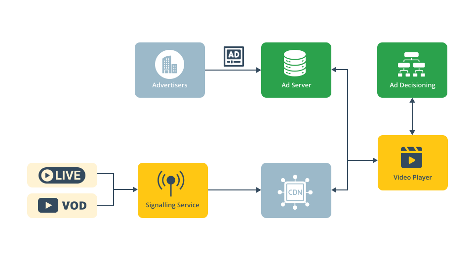

# Signaling service

The Signaling Service is provided as a service and can be integrated into any existing content management workflow through its APIs, enabling seamless adoption without significant changes to your current setup.

Developed and provided by Dolby OptiView, this service operates on your infrastructure, integrated between your CDN and media origin. It performs manifest manipulation to insert adbreaks and additional metadata for the player. Additionally, it ensures scalability of the end-to-end system through early adbreak notifications to ad decisioning servers.



## Infrastructure integration

The service is deployed and operated by Dolby OptiView within the customer’s infrastructure. This setup ensures smooth integration into the existing video workflow with minimal disruption. During onboarding, Dolby OptiView provides the specific infrastructure and network requirements. Once set up, Dolby OptiView bootstraps the service, after which the customer can manage their streams and monitor the service through the REST API.

In collaboration with the customer and Dolby OptiView's solutions team, the integration of the service into the existing video workflow is designed. Deploying the Signaling Service between the CDN and Origin ensures that regionalization, security, and localization features remain unaffected.

> To ensure high availability, we recommend maintaining the original origin stream on a CDN as a backup, while the Signaling Service provides redundancy and failover capabilities to further enhance reliability.

## Monetized streams

After deployment of the Signaling Service has been completed, the next step is the creation of monetized streams. A monetized stream represents an instance of a origin stream that is processed by the Signaling Service to enable OptiView Ads for this origin stream. Created via the locally deployed REST API, it exposes a standardized HTTPS (or HTTP) endpoint for the CDN to fetch the augmented manifest. This setup ensures seamless ad insertion without needing CDN reconfiguration, even if the monetized stream is stopped and recreated.

The monetized stream holds the following information:

- `streamId`: Unique identifier for the monetized stream within the environment.
- `name`: Self defined descriptive name for the monetized stream.
- `description`: Optional descriptive information for the monetized stream.
- `labels`: Array of self defined labels (string).
- `layout`: Default experience layout, see [ad experience layout](/ads/how-to-guides/override-layout/).
- `origin`: Your media origin host from where the origin manifests are loaded.
- `segmentOrigin`: Your publicly available segments origin host from where the stream's video and audio segments are hosted. In most cases this is identical to the `origin` parameter.
- `assetKey`: Optional Google DAI Asset-Key linked to this stream, see [Google DAI](https://support.google.com/admanager/topic/7062524?hl=en).
- `networkCode`: Optional Google DAI Network-Code, see [Google DAI](https://support.google.com/admanager/topic/7062524?hl=en).
- `assetURI`: Optional default custom asset URI which is to be used during adbreaks. If not set it will request an adbreak through Google Pod Serving using the `assetKey` and `networkCode` parameters.
- `backdropURI`: Optional URI containing the default back-drop to be used during the double box or L-shape ads.
- `streamType`: Optional property to specify this stream's type to be either 'LIVE' (the default) or 'VOD'. Note: this is only relevant for scheduling overlays for now and mostly takes care of expiry of scheduled adbreaks for 'LIVE'.

```json
{
  "streamId": "optiview-ads-demo",
  "name": "OptiView Ads Demo",
  "description": "SGAI OptiView Ads Demo",
  "labels": [],
  "layout": "DOUBLE",
  "origin": "https://domain.com",
  "segmentOrigin": "https://segment-domain.com",
  "assetKey": "google-sgai-demo",
  "networkCode": "12345",
  "assetURI": "https://asset.m3u8",
  "backdropURI": "https://backdrop.svg"
}
```

### Creating a new monetized stream

The following API endpoint creates a bare minimal new monetized stream with GAM360 Pod serving for the adbreaks using the 'SINGLE' layout:

```bash
curl -L 'https://<optiview-ads-host>/ads-client/api/v1/monetized-streams' \
  -H 'Content-Type: application/json' \
  -H 'Accept: application/json' \
  -d '{
      "streamId": "string",
      "name": "string",
      "layout": "SINGLE",
      "origin": "string",
      "segmentOrigin": "string",
      "assetKey": "string",
      "networkCode": "string",
  }'
```

Alternatively, you can use the assetURI variant when GAM360 Pod serving is not required:

```bash
curl -L 'https://<optiview-ads-host>/ads-client/api/v1/monetized-streams' \
  -H 'Content-Type: application/json' \
  -H 'Accept: application/json' \
  -d '{
      "streamId": "string",
      "name": "string",
      "layout": "SINGLE",
      "origin": "string",
      "segmentOrigin": "string",
      "assetURI": "string"
  }'
```

### Updating an existing monetized stream

The following API endpoint updates the properties of an existing monetized stream based on it's `streamId`:

```bash
curl -L -X PATCH 'https://<optiview-ads-host>/ads-client/api/v1/monetized-streams/:streamId' \
  -H 'Content-Type: application/json' \
  -H 'Accept: application/json' \
  -d '{
      "streamId": "string",
      "name": "string",
      "description": "string",
      "labels": [
        "string"
      ],
      "origin": "string",
      "segmentOrigin": "string",
      "assetKey": "string",
      "networkCode": "string",
      "assetURI": "string"
  }'
```

### Deleting an existing monetized stream

The following API endpoint deletes an existing monetized stream based on it's `streamId`.

```bash
curl -L -X DELETE 'https://<optiview-ads-host>/ads-client/api/v1/monetized-streams/:streamId' \
  -H 'Accept: application/json'
```

### Retrieving all monetized streams

The following API endpoint returns all existing monetized streams in the deployed environment.

```bash
curl -X GET 'https://<optiview-ads-host>/ads-client/api/v1/monetized-streams' \
  -H 'accept: application/json'
```

The response is an array of the existing monetized stream resources.

```json
[
  {
    "id": "optiview-ads-demo",
    "payload": {
      "streamId": "optiview-ads-demo",
      "name": "OptiView Ads Demo",
      "description": "SGAI OptiView Ads Demo",
      "labels": [],
      "layout": "DOUBLE",
      "origin": "https://domain.com",
      "segmentOrigin": "https://segment-domain.com",
      "assetKey": "google-sgai-demo",
      "networkCode": "12345"
    },
    "state": "created",
    "type": "monetized-stream"
  }
]
```

### Retrieving an individual monetized stream

The following API endpoint returns an existing monetized stream based on its identifier (`streamId`).

```bash
curl -L 'https://<optiview-ads-host>/ads-client/api/v1/monetized-streams/:streamId' \
  -H 'Accept: application/json'
```

The response is the monetized stream resource.

```json
{
  "id": "optiview-ads-demo",
  "payload": {
    "streamId": "optiview-ads-demo",
    "name": "OptiView Ads Demo",
    "description": "SGAI OptiView Ads Demo",
    "labels": [],
    "layout": "DOUBLE",
    "origin": "https://domain.com",
    "segmentOrigin": "https://segment-domain.com",
    "assetKey": "google-sgai-demo",
    "networkCode": "12345"
  },
  "state": "created",
  "type": "monetized-stream"
}
```

Please refer to the [API reference](/ads/api/signaling/theoads-api/) for even more detailed information on the REST API.

### Player source

When playing an OptiView Ads source corresponding to a monetized stream, it is expected to pass a source that looks like this:

```js
src: 'https://<optiview-ads-host>/signaling-service/api/v1/<monetized-stream-id>/hls/MANIFEST-URI';
```

In this URI, the `<optiview-ads-host>` points to the network endpoint where the OptiView Ads service is deployed, preferably a DNS entry pointing to the service IP endpoint and reachable from the CDN.
Secondly, the `<monetized-stream-id>` corresponds to the `streamId` for the monetized stream.
Finally, the `MANIFEST-URI` part points to the origin's manifest relative to the configured `origin` property of the monetized stream. The signaling service will concatenate the `origin` property and the MANIFEST-URI to build the origin manifest URI.
For example:

```js
src: 'https://<optiview-ads-host>/signaling-service/api/v1/<monetized-stream-id>/hls/manifest.m3u8';
```

Segment URLs in the media playlists should be absolute URLs however. Segment requests don't need to pass through the Signaling Service but should be fetched directly from the CDN to the origin so as to keep the benefit of scaling via the CDN.
The `segmentOrigin` parameter should contain this publicly available endpoint to fetch the segments directly. The signaling service will concatenate the `segmentOrigin` parameter with the segment URI's in the playlists to build an absolute segment URI.

## Scheduling adbreaks

Once all the required monetized streams are configured, the next step is scheduling adbreaks for these monetized streams.
To accurately schedule adbreaks, the origin manifest must be valid and include date and time indications.
For HLS, this means the `EXT-X-PROGRAM-DATE-TIME` tag must be present.
Adbreaks can be signaled through either the provided REST API or by including the relevant information in the manifest itself.

### Manifest

When using manifest signaling, the following tags are supported:

- `#EXT-X-DATERANGE` tag
  - this is recommended because of its standardization and ability to provide more comprehensive data for improved integration.
- `#EXT-X-OATCLS-SCTE35` tag
- `#EXT-X-CUE-OUT` and `#EXT-X-CUE-OUT-CONT` tags

Optionally, SCTE markers can be included with the tags for extra metadata.

### REST API

For scheduling adbreaks through the REST API, please refer to the [API definitions](/ads/api/signaling/create-monetized-stream-break/) and the example below.

```bash
curl --location 'https://<optiview-ads-host>/ads-client/api/v1/monetized-streams/stream-1/break' \
--header 'Content-Type: application/json' \
--header 'Accept: application/json' \
--data '{
  "id": "626cd35a-4fbf-48b8-b0cd-acc246266f88",
  "startDate": "2024-09-03T08:00:00.000Z",
  "duration": 60,
  "source": "",
  "layout": "LSHAPE_AD"
}'
```

For more in depth information on scheduling adbreaks we refer to our [How-to guide: Scheduling breaks](/ads/how-to-guides/scheduling-breaks/)

For more information on this topic we refer to our [workflow integration](/ads/how-to-guides/workflow-integration/).

# More information

- [API reference](/ads/api/signaling/theoads-api/)
- [What is OptiView Ads?](https://optiview.dolby.com/products/server-guided-ad-insertion/)
- [The Advantages of Server-Guided Ad Insertion](https://optiview.dolby.com/solutions/personalized-advertising/)
- [Is Server-Guided Ad-Insertion (SGAI) revolutionizing streaming monetization? (blog)](https://optiview.dolby.com/resources/blog/advertising/what-is-sgai-server-guided-ad-insertion-in-streaming/)
