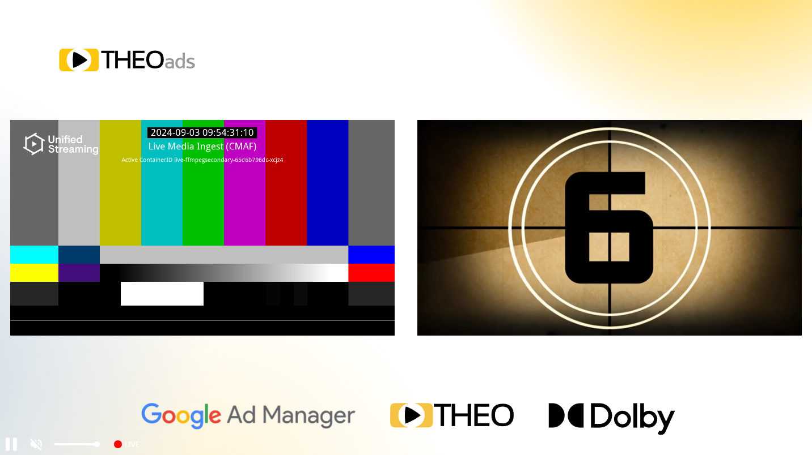

# Getting started with OptiView Ads on Web

This guide will get you started with OptiView Ads in your THEOplayer Web SDK: configure the license, update dependencies and set the source description.

## Prerequisites

1. You need to have a THEOplayer license which is compatible with OptiView Ads. This can be done through the [player portal](https://portal.theoplayer.com).
2. You need a correctly deployed [OptiView Ads signaling service](signaling-service.mdx).
3. Your THEOplayer SDK needs to have the `theoads` feature enabled.

   As of THEOplayer version 8.2.0, this feature is enabled by default in the main `theoplayer` package so we recommend to use at least this version, preferable the latest available version.
   You can install this package with the following command:

   ```bash
   npm install theoplayer
   ```

## Integration

This guide assumes you know how to set up THEOplayer. For more information regarding this, check out the [THEOplayer getting started](/theoplayer/getting-started/sdks/web/getting-started/).

### Google DAI library

Since OptiView Ads integrates with Google DAI Pod Serving, it is required to load the Google DAI script on your page:

```html
<script src="https://imasdk.googleapis.com/js/sdkloader/ima3_dai.js"></script>
```

### Player configuration

To make use of the OptiView Ads integration, first enable the feature in your player configuration:

```javascript
const player = new THEOplayer.Player(element, {
  libraryLocation: 'YOUR-LIBRARY-LOCATION',
  license: 'YOUR-LICENSE-WITH-OPTIVIEW-ADS',
  ads: {
    theoads: true,
  },
});
```

Then, specify a source with an OptiView Ads-enabled ad description:

```javascript
player.source = {
  sources: {
    src: 'PATH-TO-SIGNALING-SERVER/hls/MANIFEST-URI',
    type: 'application/x-mpegurl',
    hlsDateRange: true,
  },
  ads: [
    {
      integration: 'theoads',
      networkCode: 'NETWORK-CODE',
      customAssetKey: 'CUSTOM-ASSET-KEY',
      backdropDoubleBox: 'PATH-TO-DOUBLE-BOX-BACKDROP-IMAGE', // Optional
      backdropLShape: 'PATH-TO-L-SHAPE-BACKDROP-IMAGE', // Optional
    },
  ],
};
```

- Notice that the `src` is different as usual. For OptiView Ads, a signaling server needs to be set up which acts as a proxy to parse the given manifest and insert the ad interstitials. More information can be found [here](signaling-service.mdx).
- The `hlsDateRange` flag needs to be set to `true` as the ad markers are done using `EXT-X-DATERANGE` tags.
- The `ads` object needs to have its integration set to `theoads`. Furthermore, the `networkCode` and `customAssetKey` needs to be set according to your configured Google account.

## Integrating with Open Video UI

OptiView Ads works seamlessly together with [Open Video UI for Web](/open-video-ui/web/). You can pass your OptiView Ads-enabled source directly to the UI's `source` property:

```html
<theoplayer-default-ui></theoplayer-default-ui>
<script>
  const ui = document.querySelector('theoplayer-default-ui');
  ui.configuration = {
    libraryLocation: 'YOUR-LIBRARY-LOCATION',
    license: 'YOUR-LICENSE-WITH-OPTIVIEW-ADS',
    ads: {
      theoads: true,
    },
  };
  ui.source = {
    sources: {
      src: 'PATH-TO-SIGNALING-SERVER/hls/MANIFEST-URI',
      type: 'application/x-mpegurl',
      hlsDateRange: true,
    },
    ads: [
      {
        integration: 'theoads',
        networkCode: 'NETWORK-CODE',
        customAssetKey: 'CUSTOM-ASSET-KEY',
      },
    ],
  };
</script>
```

It should look something like this:



## More information

- [API references](pathname:///theoplayer/v9/api-reference/web/interfaces/TheoAdDescription.html)
- [What is OptiView Ads?](https://optiview.dolby.com/products/server-guided-ad-insertion/)
- [The Advantages of Server-Guided Ad Insertion](https://optiview.dolby.com/solutions/personalized-advertising/)
- [Is Server-Guided Ad-Insertion (SGAI) revolutionizing streaming monetization? (blog)](https://optiview.dolby.com/resources/blog/advertising/what-is-sgai-server-guided-ad-insertion-in-streaming/)
