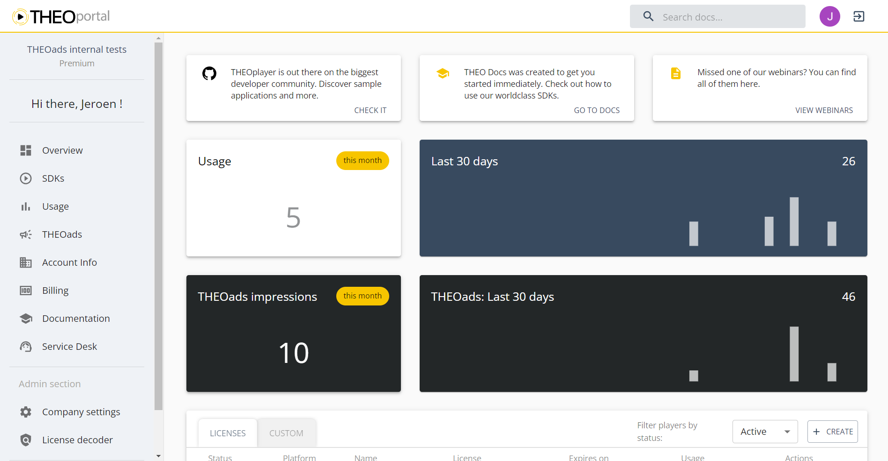

# Ad impression tracking

When inserting an ad experience using OptiView Ads, the player sends a beacon to OptiView's server to track the ad impression usage. An ad impression refers to each ad experience inserted into the content and presented to the viewer using OptiView Ads, counted from the first presentation of the experience.

:::note
The ad impression is beaconed simultaneously with the firing of the player's `adbreakbegin` event.
:::

## Information tracked

The information passed only contains an identifier of the THEOplayer license build so the impressions are linked to the customer. It also includes the ad experience type
No information about the viewers is passed along.

## View my impression usage

You can view your ad impressions on the portal dashboard underneath the THEOplayer license impressions.

