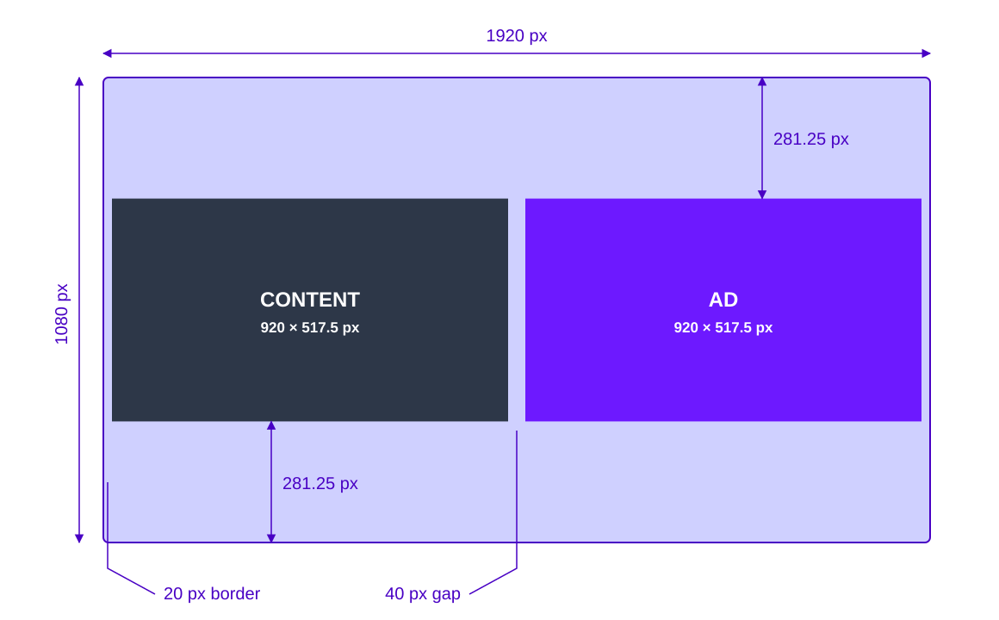
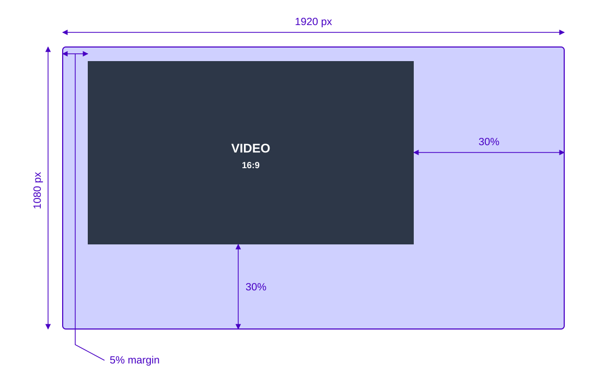

# Create backdrop images

A backdrop is a companion image that is shown along with the player during an ad.
This image is intended to provide either some additional information about an advertisement or a companion advertisement next to the main content.

## Backdrop layout options

There are two primary backdrop layout options, each serving a specific purpose in presenting ads effectively.

### 1. Double Box layout

The **Double Box** layout places the video content and advertisement side by side, allowing viewers to see both elements simultaneously.

- **Screen ratio**: 16:9 for optimal viewing on widescreen displays.
- **Border**: A fixed 20px border is applied around the video elements, ensuring a clean, defined separation between the content and the ad.

#### Example template

Below is a template for the Double Box layout tailored for 1080p resolution:

### 2. L-shape layouts

The **L-shape** layout scales the video down towards the top-left corner of the screen, creating space for the backdrop image on the right and bottom.
This configuration allows viewers to see the content or an ad and the backdrop image simultaneously.

- **Screen ratio**: 16:9, ensuring compatibility with most screens.
- **Positioning**: The video keeps a small margin from the top-left corner, with the backdrop image filling the remaining space.

#### Example template

Below is a template for the L-shape layout:

## Considerations and limitations

While both layouts serve distinct purposes, certain limitations should be considered:

- **Device compatibility**: Not every device can render every layout — most Smart TVs, for example, cannot show two video streams at the same time, which rules out the Double Box layout. Use [variants](./variant-selection.md) to handle this: schedule the break with your preferred layout first and a fallback such as L-shape or Single for less capable devices, and each device renders the first variant it supports.
- **Resolution adaptability**: Templates are made for 1080p resolution, but scaling considerations should be taken into account for lower or higher resolutions to maintain the quality and layout proportions.
- **File size and load times**: To ensure smooth playback and quick loading times, backdrop images should be optimized, especially for mobile and lower-capability devices.

## Related resources

| Resource                                    | Description                                          |
| ------------------------------------------- | ---------------------------------------------------- |
| [Variant selection](./variant-selection.md) | Serving a different layout per device with variants. |
| [Breaks](../concepts/breaks.mdx)            | Break configuration, layouts, and the asset model.   |
