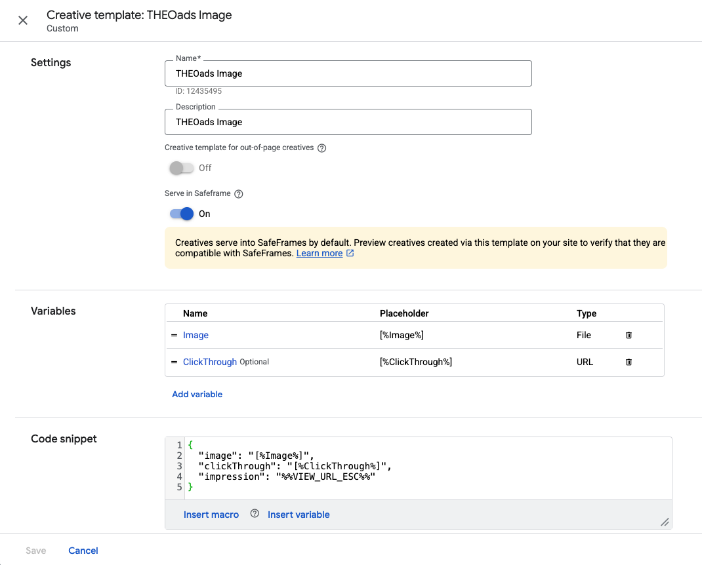
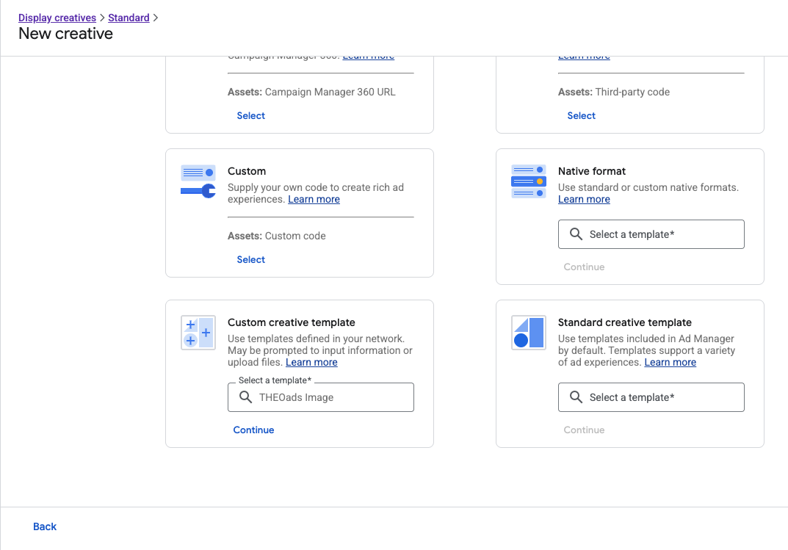
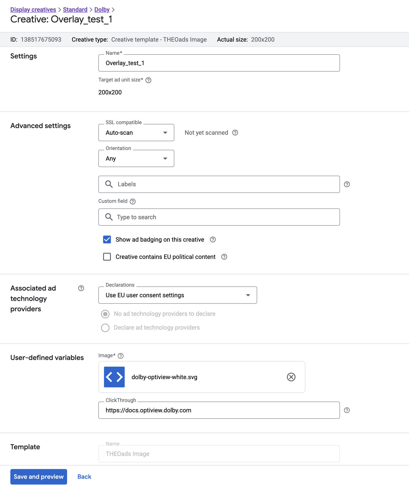

# Custom GAM Creatives

When using GAM for delivering dynamic backdrops or overlays respectively through the `backdropURIGamProperties` or `gamProperties` properties, you need to first configure corresponding Creatives in the GAM console.

First off, you need to define a custom creative template specifically for OptiView Ads as documented [here](https://support.google.com/admanager/answer/1138308#custom-templates).

You can either import this [pre-defined template](pathname:///ads/templates/OptiView_Ads_gam_template.json), or follow the steps below.

Apart from assigning a `Name` and optional `Description`, you need to perform the following changes:

- Configure a File type variable `Image`, optionally limiting the allowed file types:


- Optionally configure a URL type variable `ClickThrough`:


- Configure the `Code snippet` as follows:

```json
{
  "image": "[%Image%]",
  "clickThrough": "[%ClickThrough%]",
  "impression": "%%VIEW_URL_ESC%%"
}
```

Note the `impression` field which is needed for the player to properly handle impression tracking. The special macro `%%VIEW_URL_ESC%%` is supplied by GAM and will contain a GAM specfic impression URL which is called when the backdrop is shown on the client.

In the end it should look like this:



Now that the template is set up, you can start adding creatives as you would otherwise when using standard image creative, except you need to select this Custom creative template when adding the new creatives:



When editing the creative itself, make sure to select an appropriate `Target ad unit size` as you would with a standard image creative also. This size corresponds to the `sz` property values inside the `gamProperties`.

Besides that, you need to at least also upload or select a suitable image for display.



Now that the creatives are defined, make sure to add them to a line item that is at least in status 'Ready' so delivery can commence (Ref GAM [documentation](https://support.google.com/admanager/answer/82991?hl=en&ref_topic=7506394&sjid=17311913585360515246-EU)).

That's it! You should now be able to add dynamic backdrops and image overlays which should show up inside the player at the appropriate time and location.
