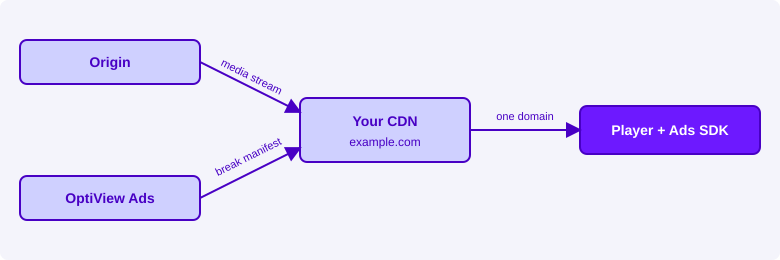

# Serve the Break Manifest from your CDN

By default, your player fetches your stream from your CDN, while the OptiView Ads SDK fetches the [Break Manifest](../concepts/break-manifest.mdx) from the OptiView Ads domain (`us.markers.optiview.dolby.com`). This guide shows how to serve the Break Manifest from **your own domain** instead, by letting your CDN forward a path to OptiView Ads. Your app then fetches everything from one domain you control:

| Resource       | Default                                                                        | Served from your CDN                          |
| -------------- | ------------------------------------------------------------------------------ | --------------------------------------------- |
| Stream         | `https://example.com/channel-5/index.m3u8`                                     | `https://example.com/channel-5/index.m3u8`    |
| Break Manifest | `https://us.markers.optiview.dolby.com/manifest/v1/ORG-ID/channels/CHANNEL-ID` | `https://example.com/channel-5/timeline.json` |

No change is needed on the OptiView Ads side: the setup is a routing rule on your CDN and a different `manifestUrl` in your player.

## Why serve the Break Manifest from your domain

When the Break Manifest comes from a separate, recognizable domain, a few things are outside your control:

- **Ad blockers can block it.** Blockers maintain lists of ad-related domains. When the Break Manifest request is blocked, the SDK learns about no breaks and the viewer sees no ads, while the stream keeps playing normally.
- **Every app and network needs to allow a second domain.** Content Security Policies, firewalls, and network rules on managed networks must include the OptiView Ads domain next to your own.
- **You have no view of the traffic.** Requests to the OptiView Ads domain do not show up in your CDN logs, monitoring, or analytics.

Serving the Break Manifest from your own domain solves this:

- **Harder to block.** The Break Manifest arrives on the same domain as your stream. A blocker can no longer block it by domain without also blocking your content. See [Ad blockers: what this solves and what it does not](#ad-blockers-what-this-solves-and-what-it-does-not).
- **One domain to allow.** Your apps and your viewers' networks only need to reach your domain.
- **One place to observe.** Break Manifest requests appear in your own CDN logs and dashboards, next to your stream.

## How it works

Your CDN gets one extra routing rule. Requests for the stream go to your origin as today; requests for the Break Manifest path are forwarded to OptiView Ads. Your app only sees your domain.



OptiView Ads keeps producing the Break Manifest exactly as before, including its caching headers and signature. Your CDN only needs to pass the response through unchanged.

## Before you start

You need:

- **Your organization ID and the channel ID.** They are part of the channel's Break Manifest URL; see [retrieving the required values](../player-integration/optiview-ads-sdk/index.mdx#retrieving-the-required-values).
- **Your region's OptiView Ads domain.** `us.markers.optiview.dolby.com` for the US region, or `eu.markers.optiview.dolby.com` for the EU region.
- **Access to your CDN's routing configuration.** Your CDN must be able to route a path to a different origin and **rewrite the path** on the way. Most CDNs support this through path rewrite rules or edge functions.

## Step 1: Choose the Break Manifest path

Pick the URL the SDK will use for the Break Manifest. Two patterns work well:

| Pattern                              | Example                                             | Best for                                                |
| ------------------------------------ | --------------------------------------------------- | ------------------------------------------------------- |
| **Next to the stream** (per channel) | `https://example.com/channel-5/timeline.json`       | Making the Break Manifest as hard to block as possible. |
| **One prefix for all channels**      | `https://example.com/bm/ORG-ID/channels/CHANNEL-ID` | A single rule that serves every channel.                |

When ad blocking matters to you, place the Break Manifest **under the same path as the stream** and give it a **neutral name**:

- **Use the stream's path prefix.** A rule that blocks the whole prefix (`example.com/channel-5/*`) also blocks your stream, so blocking only the Break Manifest takes a rule written for that exact URL.
- **Avoid recognizable words.** Names containing `ad`, `ads`, `break`, `marker`, or `manifest` are likely to match generic filter lists. Neutral names such as `timeline.json` or `state.json` are not.
- **Keep it stable.** The URL goes into your player configuration, so choose a name you do not need to change.

## Step 2: Forward the path to OptiView Ads

Add a rule on your CDN that sends the Break Manifest path to OptiView Ads and rewrites it to the channel's Break Manifest endpoint, `/manifest/v1/{orgId}/channels/{channelId}`:

| Pattern                         | Incoming request                   | Forwarded to                                                                     |
| ------------------------------- | ---------------------------------- | -------------------------------------------------------------------------------- |
| **Next to the stream**          | `/channel-5/timeline.json`         | `https://us.markers.optiview.dolby.com/manifest/v1/ORG-ID/channels/CHANNEL-ID`   |
| **One prefix for all channels** | `/bm/{orgId}/channels/{channelId}` | `https://us.markers.optiview.dolby.com/manifest/v1/{orgId}/channels/{channelId}` |

With the per-channel pattern, add one rule per channel. With the prefix pattern, a single rule replaces the `/bm` prefix with `/manifest/v1` and keeps the rest of the path.

Configure the OptiView Ads origin in your CDN as follows:

- **Protocol:** HTTPS on port 443.
- **Host header and TLS server name (SNI):** your region's OptiView Ads domain, for example `us.markers.optiview.dolby.com`, not your own domain. OptiView Ads routes requests by host name.
- **Methods:** `GET`, `HEAD`, and `OPTIONS`.
- **Forwarded request headers:** none are required. Do not forward cookies or authorization headers; the Break Manifest endpoint is public and ignores them.

## Step 3: Keep the response intact

Your CDN must deliver the Break Manifest response to the player as OptiView Ads sends it. Check each of the following, because a miss can stop ads silently while your stream keeps playing:

| Requirement                                   | Why                                                                                                                                                                                                                   | If it is missed                                                                          |
| --------------------------------------------- | --------------------------------------------------------------------------------------------------------------------------------------------------------------------------------------------------------------------- | ---------------------------------------------------------------------------------------- |
| **Forward the `X-Manifest-Signature` header** | Every Break Manifest response is signed. The SDK verifies the signature before it uses the manifest.                                                                                                                  | The SDK rejects the manifest and schedules no breaks.                                    |
| **Do not modify the body**                    | The signature covers the exact response body. Compression (gzip, Brotli) is fine; minifying, reformatting, or injecting content is not.                                                                               | The signature no longer matches; the SDK rejects the manifest and schedules no breaks.   |
| **Respect the origin's `Cache-Control`**      | For live channels, the cache lifetime equals the channel's active polling interval (1 second by default), so players learn about new breaks and changes in time. Errors are cached for a few seconds only.            | Players receive breaks late or miss them, or keep seeing an error after it is resolved.  |
| **Cache on the path only**                    | Every viewer of a channel receives the same Break Manifest. Leave query strings, cookies, and device headers out of the cache key, but keep honoring `Vary: Accept-Encoding`.                                         | Your cache hit ratio drops, or clients receive a compressed response they cannot decode. |
| **Pass the CORS headers through** (web only)  | Browsers need `Access-Control-Allow-Origin` to read the response, and `Access-Control-Expose-Headers: X-Manifest-Signature` to let the SDK read the signature. Only needed when your web page runs on another domain. | The browser blocks the request, or hides the signature so the SDK rejects the manifest.  |

:::tip[Adding your own CORS headers]
If your CDN sets its own CORS headers instead of passing through those from OptiView Ads, include `X-Manifest-Signature` in `Access-Control-Expose-Headers`. Without it, browsers hide the signature from the SDK.
:::

## Step 4: Point the SDK at your URL

Pass your own URL as the `manifestUrl` when you start the session. Nothing else in your integration changes. See the [OptiView Ads SDK](../player-integration/optiview-ads-sdk/index.mdx) documentation for the full integration.

import Tabs from '@theme/Tabs';
import TabItem from '@theme/TabItem';

<Tabs groupId="platform" queryString>
  <TabItem value="web" label="Web">

```typescript
await sdk.startSession({
  manifestUrl: 'https://example.com/channel-5/timeline.json',
});
```

  </TabItem>
  <TabItem value="android" label="Android">

```kotlin
sdk.startSession(
    SessionConfig(
        manifestUrl = "https://example.com/channel-5/timeline.json",
    )
)
```

  </TabItem>
  <TabItem value="ios" label="iOS">

```swift
try await sdk.startSession(
    SessionConfig(
        manifestUrl: "https://example.com/channel-5/timeline.json"
    )
)
```

  </TabItem>
  <TabItem value="react-native" label="React Native">

```typescript
await ads.startSession({
  manifestUrl: 'https://example.com/channel-5/timeline.json',
});
```

  </TabItem>
</Tabs>

## Verify your setup

Request the Break Manifest through your CDN and check the response headers:

```bash
curl -s -D - -o /dev/null -H 'Origin: https://www.example.com' 'https://example.com/channel-5/timeline.json'
```

A working setup returns:

```text
HTTP/2 200
content-type: application/json; charset=utf-8
cache-control: public, max-age=1
access-control-allow-origin: *
access-control-expose-headers: X-Manifest-Signature
x-manifest-signature: eyJhbGciOiJFZERTQSIs...
```

Check that:

- the status is `200` and the body is the channel's Break Manifest, with the expected `channelId`;
- `x-manifest-signature` is present;
- `cache-control` shows the same `max-age` as a request made directly to the OptiView Ads domain;
- on a second request within that `max-age`, your CDN reports a cache hit, and after it expires the response is refreshed.

Then play the channel with the new `manifestUrl` and confirm that a break plays. If the SDK rejects the manifest, it reports the `DA-MANIFEST-SIGNATURE-INVALID` diagnostic.

## Ad blockers: what this solves and what it does not

Serving the Break Manifest from your domain makes it considerably harder to block, but it is not a guarantee:

- **DNS-level blockers** — such as Pi-hole, NextDNS, or blocking on the router — only see domain names. They cannot block the Break Manifest without blocking your stream.
- **Browser extensions** — such as uBlock Origin — match full URLs. Generic filter lists no longer catch the Break Manifest, but a rule written for your exact URL can still block it. Following the path advice in [step 1](#step-1-choose-the-break-manifest-path) makes such a rule a deliberate, site-specific effort.
- **The ads themselves** — the ad creatives, ad server responses, ad SDKs (such as the Google IMA SDK), and tracking requests — come from the ad server's domains. Blockers can block those regardless of where the Break Manifest is served from.

## Troubleshooting

| Symptom                                                  | Likely cause                                                                                                             |
| -------------------------------------------------------- | ------------------------------------------------------------------------------------------------------------------------ |
| `404 Not found` from your URL                            | The path rewrite is wrong (check the organization and channel IDs), or the rule does not match the incoming path.        |
| Error page from OptiView Ads, or a TLS error             | The `Host` header or TLS server name is set to your domain instead of the OptiView Ads domain.                           |
| Stream plays, no breaks, `DA-MANIFEST-SIGNATURE-INVALID` | The `X-Manifest-Signature` header is stripped, the body is modified, or (on web) the header is not exposed through CORS. |
| Breaks start late or changes arrive late                 | Your CDN caches the Break Manifest longer than the origin's `Cache-Control` allows.                                      |
| Works in the apps but not in the browser                 | CORS headers are missing or replaced on the way through your CDN.                                                        |

## Related resources

| Resource                                                             | Description                                                  |
| -------------------------------------------------------------------- | ------------------------------------------------------------ |
| [Break Manifest](../concepts/break-manifest.mdx)                     | The side-loaded contract between the backend and the player. |
| [Workflow integration](./workflow-integration.md)                    | How OptiView Ads fits into your existing delivery workflow.  |
| [OptiView Ads SDK](../player-integration/optiview-ads-sdk/index.mdx) | Integrating the SDK with your player.                        |
