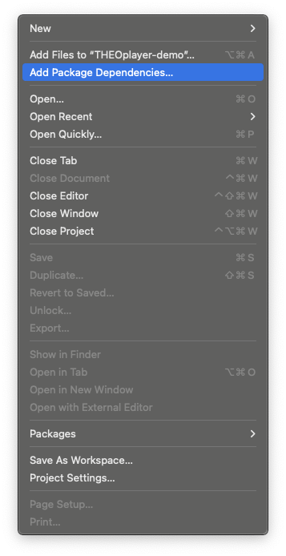
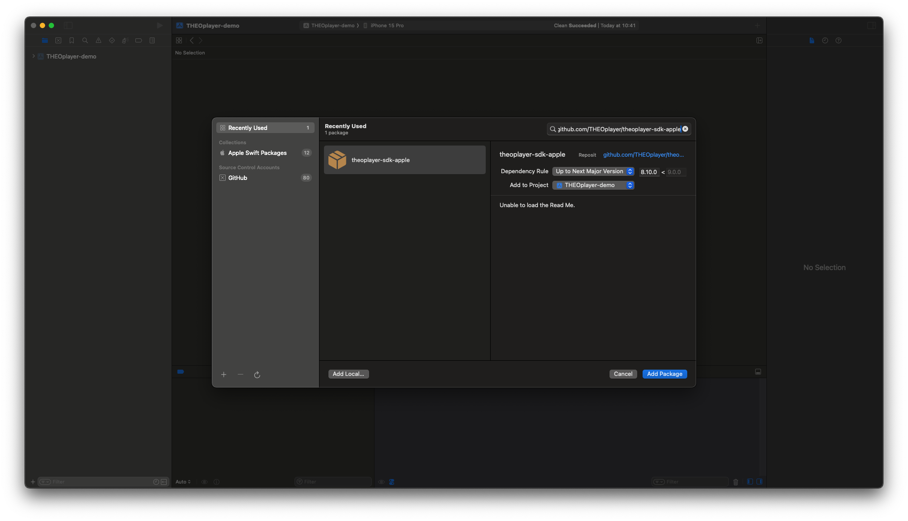
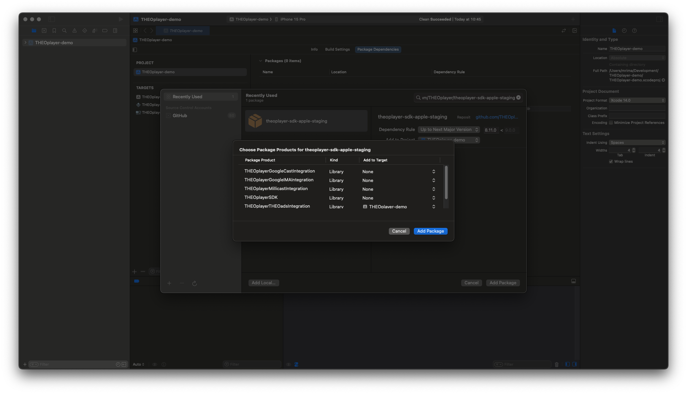
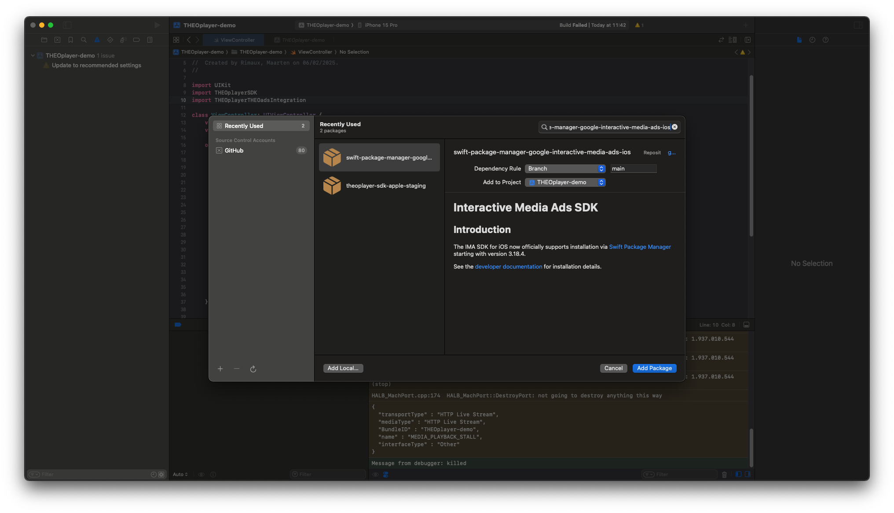
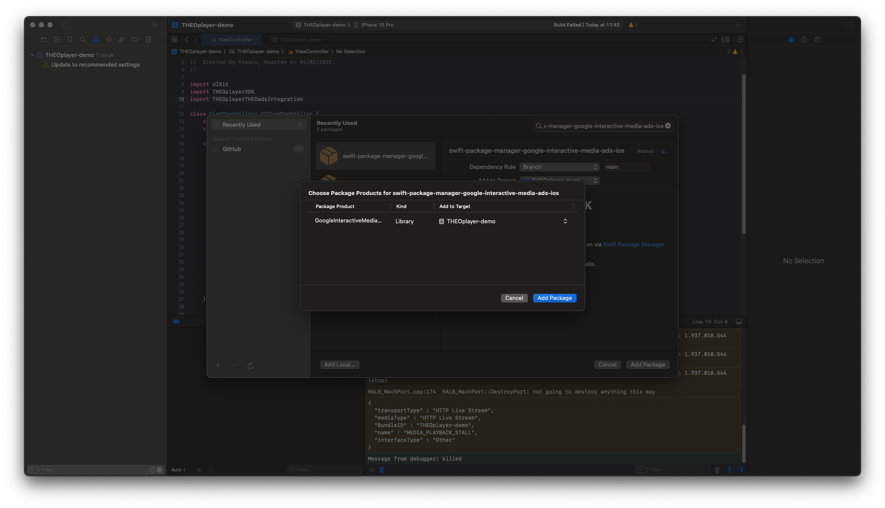

# OptiView Ads on iOS

This guide configures OptiView Ads in the OptiView Player iOS SDK 11.x.

## Prerequisites

import Tabs from '@theme/Tabs';
import TabItem from '@theme/TabItem';

1. Obtain an OptiView Player license compatible with OptiView Ads from the [player portal](https://portal.theoplayer.com).
2. Add `THEOplayer-Integration-THEOads` to your project.

<Tabs queryString="lang">
<TabItem value="cocoapods" label="CocoaPods">

```ruby
pod 'THEOplayer-Integration-THEOads', '~> 11.6.1'
```

</TabItem>
<TabItem value="swiftpm" label="SwiftPM">

Add `https://github.com/THEOplayer/theoplayer-sdk-apple` and select `THEOplayerTHEOadsIntegration`.







</TabItem>
</Tabs>

3. Add Google IMA. CocoaPods uses `GoogleAds-IMA-iOS-SDK`; SwiftPM uses the `GoogleInteractiveMediaAds` product.

   

   

   

## Integration

```swift
import THEOplayerSDK
import THEOplayerTHEOadsIntegration

let theoads = THEOadsIntegrationFactory.createIntegration(on: theoplayer)
theoplayer.addIntegration(theoads)

let typedSource = TypedSource(
    src: "CHANNEL-MONETIZED-HLS-URL",
    type: "application/x-mpegurl",
    hlsDateRange: true
)
let theoad = THEOAdDescription(
    networkCode: "NETWORK-CODE",
    customAssetKey: "CUSTOM-ASSET-KEY",
    breakManifestUrl: URL(string: "https://ADS-HOST/manifest/v1/ORG-ID/channels/CHANNEL-ID"),
    adTagParameters: ["key": "value"]
)
theoplayer.source = SourceDescription(source: typedSource, ads: [theoad])
```

`breakManifestUrl` points to the v2 Break Manifest. `hlsDateRange` enables handling of the SSAI cues in the channel's monetized HLS media playlist.

## Verify

Load the channel's monetized HLS source and start playback. Confirm that the Break Manifest or SSAI cues schedule a break, the ad renders, and the OptiView impression appears in the portal.

## More information

- [iOS `THEOAdDescription` API](https://optiview.dolby.com/docs/theoplayer/v11/api-reference/ios/Structs/THEOAdDescription.html)
- [Ad impression tracking](../../../how-to-guides/ad-impressions)
- [What is OptiView Ads?](https://optiview.dolby.com/products/server-guided-ad-insertion/)
