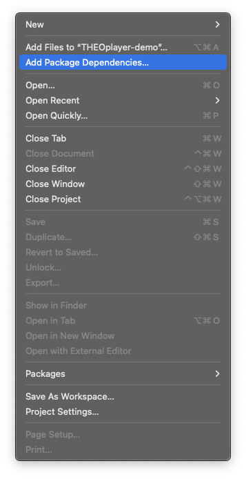
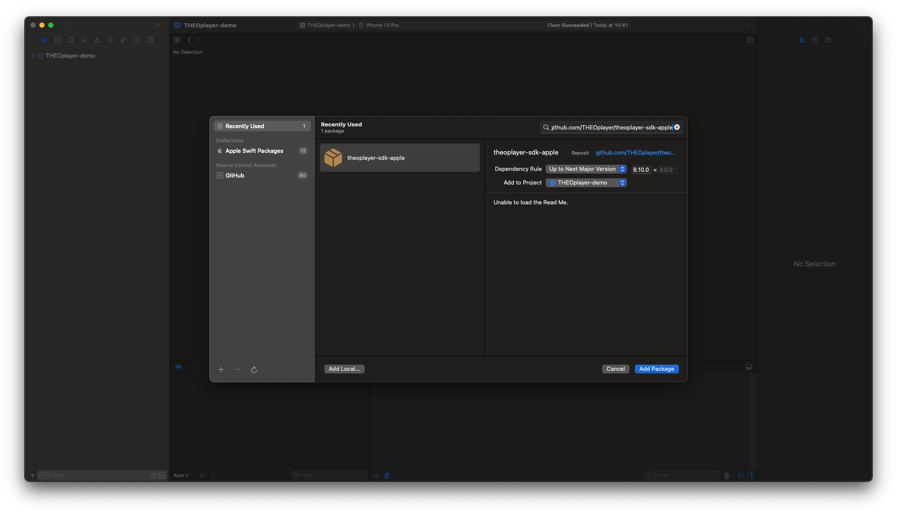
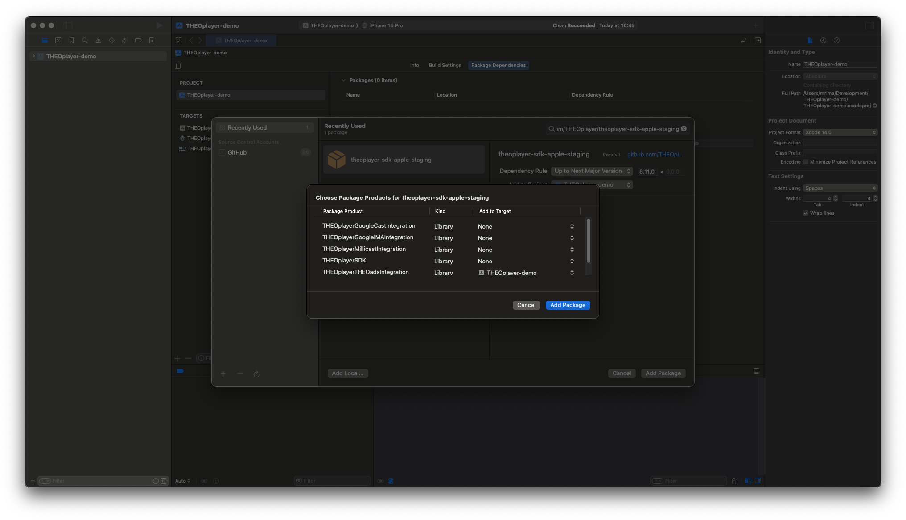
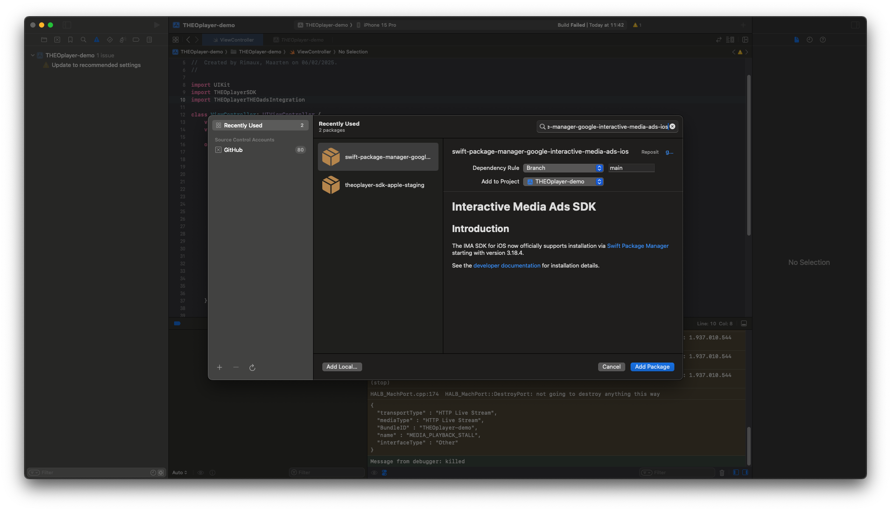
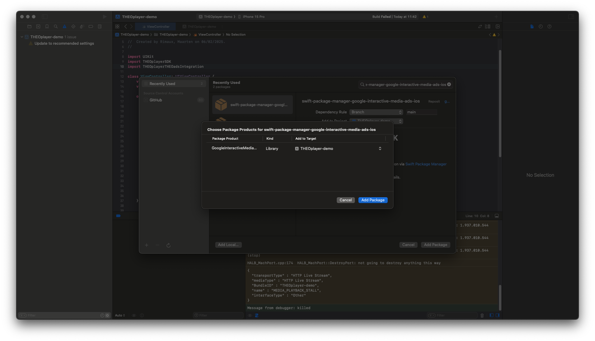

# OptiView Ads on iOS

This guide configures OptiView Ads in the OptiView Player iOS SDK. Version **11.9.x or later** is required.

## Prerequisites

import Tabs from '@theme/Tabs';
import TabItem from '@theme/TabItem';

1. Obtain an OptiView Player license compatible with OptiView Ads from the [player portal](https://portal.theoplayer.com).
2. Retrieve the Break Manifest URL for your channel. See the [Break Manifest endpoint](../../concepts/break-manifest.mdx#endpoint).
3. Add `THEOplayer-Integration-THEOads` to your project.

<Tabs queryString="lang">
<TabItem value="cocoapods" label="CocoaPods">

```ruby
pod 'THEOplayer-Integration-THEOads', '~> 11.9'
```

</TabItem>
<TabItem value="swiftpm" label="SwiftPM">

Add `https://github.com/THEOplayer/theoplayer-sdk-apple` and select `THEOplayerTHEOadsIntegration`.







</TabItem>
</Tabs>

4. Add Google IMA. CocoaPods uses `GoogleAds-IMA-iOS-SDK`; SwiftPM uses the `GoogleInteractiveMediaAds` product.

   

   

   

## Step 1 — Enable OptiView Ads

Create the OptiView Ads integration and add it to the player:

```swift
import THEOplayerSDK
import THEOplayerTHEOadsIntegration

let theoads = THEOadsIntegrationFactory.createIntegration(on: theoplayer)
theoplayer.addIntegration(theoads)
```

## Step 2 — Configure the OptiView Ads source

Set a source that combines your media stream with a `THEOAdDescription`:

```swift
let typedSource = TypedSource(
    src: "YOUR-STREAM-URL",
    type: "application/x-mpegurl"
)
let theoad = THEOAdDescription(
    networkCode: "NETWORK-CODE",
    customAssetKey: "CUSTOM-ASSET-KEY",
    breakManifestUrl: URL(string: "https://us.markers.optiview.dolby.com/manifest/v1/ORG-ID/channels/CHANNEL-ID"),
    adTagParameters: ["key": "value"]
)
theoplayer.source = SourceDescription(source: typedSource, ads: [theoad])
```

The media source itself is not important to OptiView Ads: it only needs to carry timing information (such as `EXT-X-PROGRAM-DATE-TIME`) that the player can schedule breaks against.

The ad description properties:

- `breakManifestUrl` — the channel's [Break Manifest](../../concepts/break-manifest.mdx) URL. This is the most important part: it is where the player learns about the channel's breaks.
- `networkCode` — your Google Ad Manager network code, for [Google Pod Serving](../../integrations/google/pod-serving.mdx). See the [Google Ad Manager prerequisites](../../integrations/google/index.mdx).
- `customAssetKey` — the channel's custom asset key, for [Google Pod Serving](../../integrations/google/pod-serving.mdx).
- `adTagParameters` — player-side [ad tag parameters](../../integrations/google/pod-serving.mdx#ad-tag-parameters) for Google Pod Serving. Use these for values that are only known on the device, such as device identifiers; they override the break's `assetParameters` on duplicate keys.

## Step 3 — Verify playback

Start playback, then schedule a break through the API or dashboard and confirm that the ad plays out.
