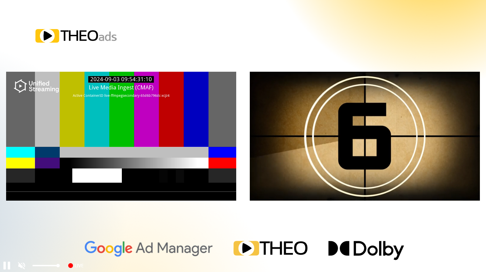

# OptiView Ads on Web

This guide configures OptiView Ads in the OptiView Player Web SDK 11.x.

## Prerequisites

1. Obtain an OptiView Player license compatible with OptiView Ads from the [player portal](https://portal.theoplayer.com).
2. Use the channel's monetized HLS playback URL (proxy/CDN).
3. Install the Web SDK:

   ```bash
   npm install @opentelly/theoplayer
   ```

## Integration

Load the Google DAI library:

```html
<script src="https://imasdk.googleapis.com/js/sdkloader/ima3_dai.js"></script>
```

Configure the player and source:

```javascript
const player = new THEOplayer.Player(element, {
  libraryLocation: 'YOUR-LIBRARY-LOCATION',
  license: 'YOUR-LICENSE-WITH-OPTIVIEW-ADS',
  ads: { theoads: true },
});

player.source = {
  sources: {
    src: 'CHANNEL-MONETIZED-HLS-URL',
    type: 'application/x-mpegurl',
    hlsDateRange: true,
  },
  ads: [
    {
      integration: 'theoads',
      networkCode: 'NETWORK-CODE',
      customAssetKey: 'CUSTOM-ASSET-KEY',
      breakManifestUrl: 'https://ADS-HOST/manifest/v1/ORG-ID/channels/CHANNEL-ID',
      adTagParameters: { key: 'value' },
    },
  ],
};
```

`breakManifestUrl` is the v2 Break Manifest endpoint. `hlsDateRange: true` enables handling of the SSAI cues in the monetized HLS media playlist.

## Integrating with Open Video UI

OptiView Ads works with [Open Video UI for Web](/open-video-ui/web/). Pass the same source and ad description to the UI's `source` property.



## Verify

Load the channel's monetized HLS source and start playback. Confirm that a break is scheduled from the Break Manifest or SSAI cues, the ad renders, and the OptiView impression appears in the portal.

## More information

- [Web `TheoAdDescription` API](https://optiview.dolby.com/docs/theoplayer/v11/api-reference/web/interfaces/TheoAdDescription.html)
- [Ad impression tracking](../../../how-to-guides/ad-impressions)
- [What is OptiView Ads?](https://optiview.dolby.com/products/server-guided-ad-insertion/)
