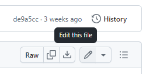
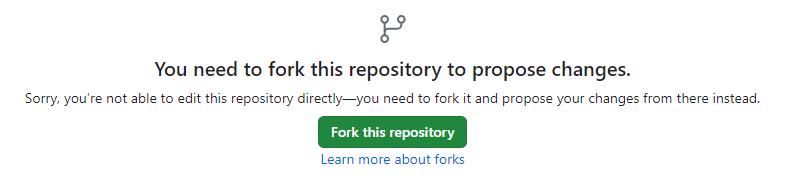
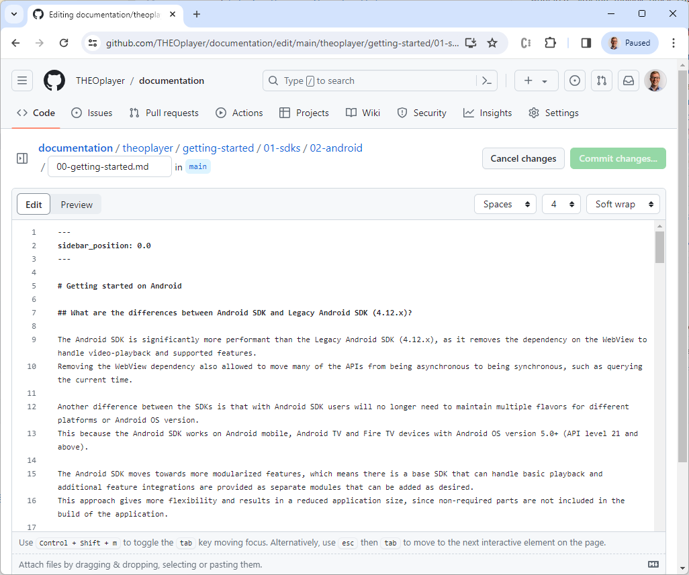
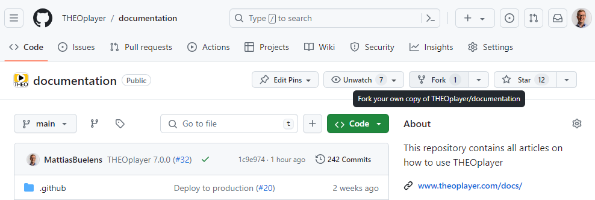
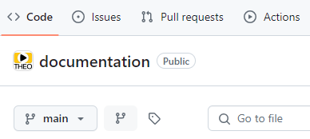
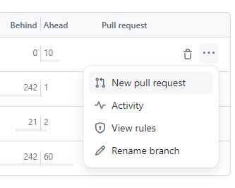
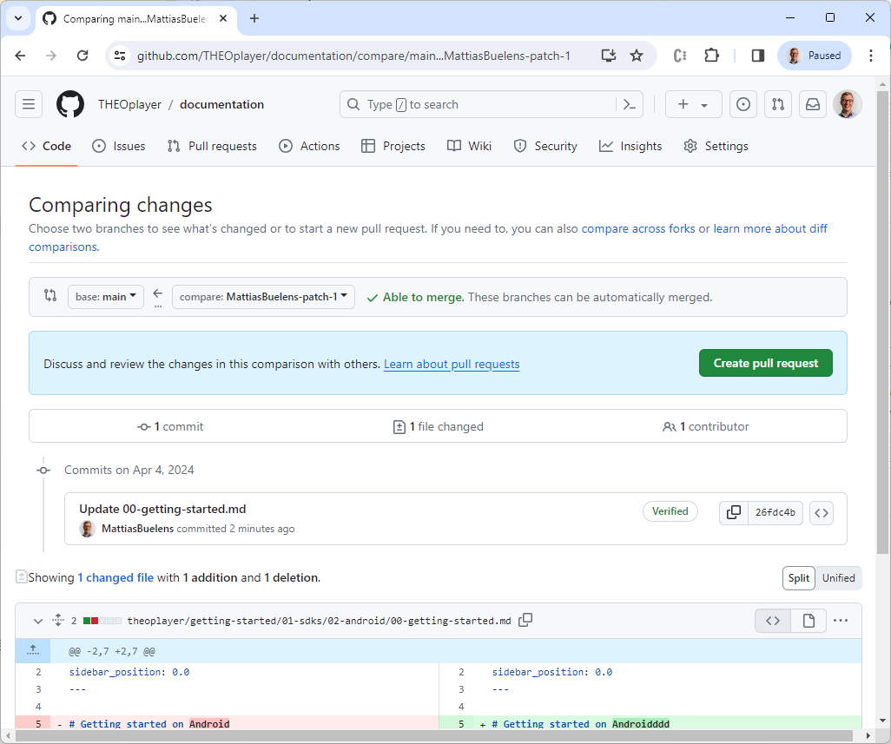
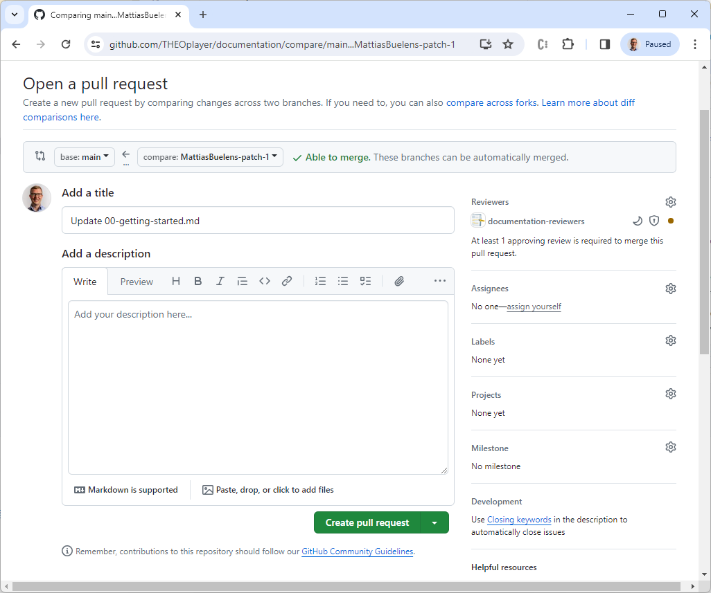

# Writing documentation: a step-by-step guide

This article will guide you through writing new or updating an existing documentation article, submitting your changes
as a pull request, and finally getting your new documentation on the live website.

## 1. Make your changes

For changes to a single file, [you can do everything from the GitHub website itself](#1a-making-a-change-on-github).

If your changes are more substantial, we
recommend [cloning the repository locally](#1b-making-a-change-on-your-local-machine).
For example, you may want to add new images or live examples to your article, or you may want to re-structure multiple
articles at once.

### 1.a. Making a change on GitHub

1. Find the article you want to edit on the website.
   In this example, we'll update
   the ["Getting started on Android" article](/theoplayer/getting-started/sdks/android/getting-started/).
2. Scroll to the bottom of the page, and click on the "✏️ Edit this page" link.
3. This will open the source of that article on GitHub.
   In this example, it'll take you
   to: https://github.com/THEOplayer/documentation/blob/main/theoplayer/getting-started/01-sdks/02-android/00-getting-started.md
4. Click the <kbd>✏️</kbd> (Edit this page) button in the top right.  
   
5. If you're not a THEO employee, you'll need to fork the repository first.  
   
6. This will take you to a page where you can edit the article.

   - In the "Edit" view, you can make changes to the Markdown source. See
     the [Markdown features article from Docusaurus](https://docusaurus.io/docs/markdown-features) for an overview of
     the available Markdown features supported by Docusaurus.
   - In the "Preview" view, you can see what the final article will look like when rendered.

     :::warning
     Note that this is an approximation: GitHub only recognizes a _subset_ of
     the Markdown features supported by Docusaurus.
     :::

   

7. When you're done, click <kbd>Commit changes...</kbd>
8. Write a commit message and description, briefly explaining your changes.
   - If you're a THEO employee, you can also choose a branch name, which will be pushed
     to [the main documentation repository](https://github.com/THEOplayer/documentation).
   - Otherwise, you'll be committing your changes to the main branch of your fork.
9. Click <kbd>Propose changes</kbd>
10. Proceed with [step 2](#2-create-a-pull-request).

### 1.b. Making a change on your local machine

1. If you're a THEO employee, go to directly to step 5.
2. If you're not a THEO employee, you'll need to fork the repository first. Go
   to https://github.com/THEOplayer/documentation and click <kbd>Fork</kbd>.  
   
3. Click <kbd>Create fork</kbd>.
4. You'll now be taken to your forked repository, which will look something
   like `https://github.com/YOUR_USERNAME/documentation`.
5. Click <kbd>\<\> Code</kbd>, then click the "Copy url to clipboard" button.
6. Use your favorite Git client to clone the repository. (Make sure to also initialize the Git submodules.)  
   Alternatively, you can use the Git command line:
   ```sh
   $ git clone --recurse-submodules https://github.com/YOUR_USERNAME/documentation.git
   ```
7. Install the project's dependencies.
   ```sh
   $ cd documentation
   $ npm install
   ```
8. Start the development server. After a few seconds, the site should be ready.

   ```sh
   $ npm start
   [INFO] Starting the development server...
   [SUCCESS] Docusaurus website is running at: http://localhost:3000/docs/

   √ Client
   Compiled successfully in 762.24ms

   client (webpack 5.90.0) compiled successfully
   ```

9. Open `http://localhost:3000/docs/` in a web browser. You should now see the documentation website, similar to how it
   appears on this website.
10. If you're a THEO employee, make sure you're on a new branch (not `main`).
    ```sh
    $ git branch my-change
    $ git checkout my-change
    ```
11. Open the file(s) for the article(s) you want to edit.

    :::tip
    At the bottom of every article, you'll find an "✏️ Edit this page" link. This will take your to the source file of
    that article on GitHub. You can the file path on GitHub to find the file on your local machine.

    For example, the source for
    the ["Getting started on Android" article](/theoplayer/getting-started/sdks/android/getting-started/) can be found
    at https://github.com/THEOplayer/documentation/blob/main/theoplayer/getting-started/01-sdks/02-android/00-getting-started.md.  
    You can then find that file on your local machine
    in `theoplayer/getting-started/01-sdks/02-android/00-getting-started.md`.
    :::

12. Make your changes.
    See the [Markdown features article from Docusaurus](https://docusaurus.io/docs/markdown-features) for an overview of
    the available Markdown features supported by Docusaurus.
13. You should see the results immediately in your web browser.
14. Once you're happy, commit your changes. Choose a descriptive commit message.
    ```sh
    $ git commit -am "Update article A and B"
    ```
15. Push your changes to GitHub.
    ```sh
    $ git push origin
    ```
16. Open your (forked) repository again on GitHub, and click on the "Branches" button (next to "main").  
    
17. Find your newly pushed branch in the list. Then, click the <kbd>...</kbd> button and select "New pull request".  
    
18. Proceed with [step 2](#2-create-a-pull-request).

## 2. Create a pull request

1. If you're not a THEO employee, you'll first be taken to the "Comparing changes" page. Click <kbd>Create a pull
   request</kbd> to continue.  
   
2. You're now on the "Open a pull request page". Review your title, description and proposed changes one last time.
   When you're ready, click <kbd>Create pull request</kbd>.  
   
3. You're done! One of our employees will review your changes.
   If all goes well, your changes will be accepted and show up on the documentation website.  
   Thanks for your contribution! 😄
