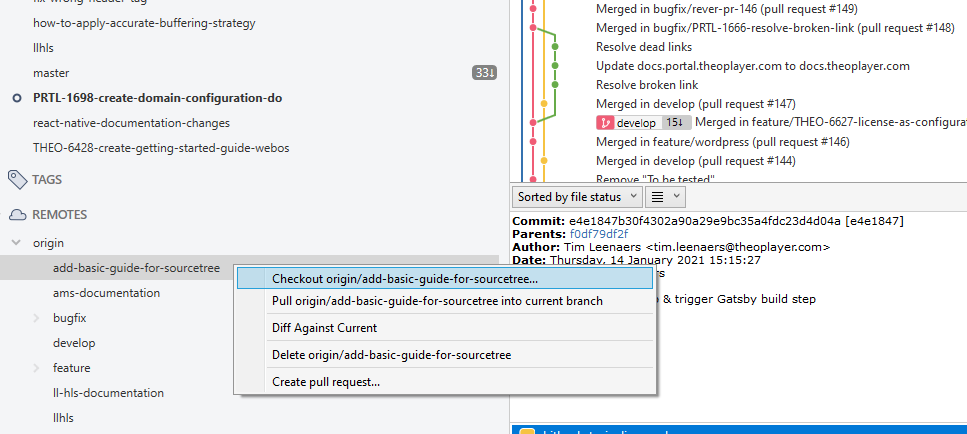
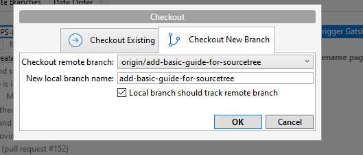
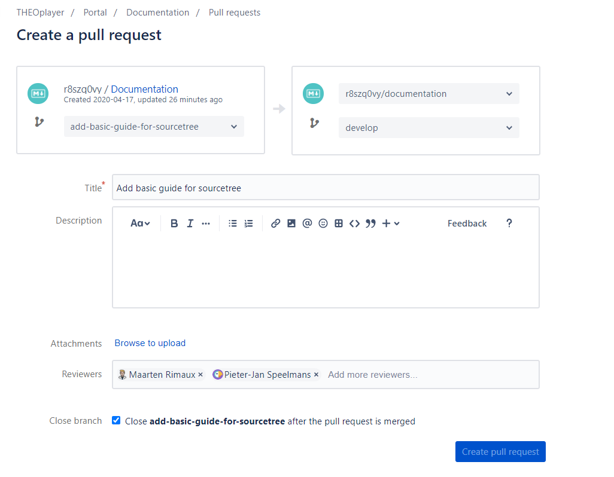

# Step by Step Guide using Sourcetree

This document contains a small guide how to create a new branch, how to check it out locally on Sourcetree, how to make changes to that local branch, how push them back to the origin, and how to make a Pull Request in the end.

## Step 1: Create a new branch on Bitbucket

1. Go to https://bitbucket.org/r8szq0vy/documentation/ and hit the "Branches" menu item in the navigation bar on the left, or go directly to [here](https://bitbucket.org/r8szq0vy/documentation/branches/)
2. On the Branches page, click on "Create branch". A modal will show up.
3. In this modal, make sure the "From branch" is always set to **develop**. Give your branch a unique name. The type doesn't really matter.

## Step 2: Checkout the branch locally in Sourcetree

1. Open Sourcetree, in the menu bar on the left under "**Remotes**" open `origin`. Your newly created branch should be visible here.
2. Right click on it and select `Checkout <branch-name>`.
   

3. In the modal that will show next, you can just hit "OK"

## Step 3: Make changes to the files using and editor

Open the Documentation project using your favorite editor. Good examples: VS Code, Webstorm. They offer some great extensions for Markdown as well. You can find more Tips and Tricks in [this document](./tips-and-tricks.md).

## Step 4: Pushing changes back to Bitbucket

- When you're done editing or creating files, go back to Sourcetree and hit "**Commit**" at the top-left.
- A new screen will show: make sure to move all your files to the "Staged files" section. Write a nice description and hit "Commit".
- Once committed, it's time to really push the changes back to our origin (Bitbucket). Do this by hitting "Push" at the top.

## Step 5: Create a Pull Request

- Go back to [the branches overview](https://bitbucket.org/r8szq0vy/documentation/branches/) on Bitbucket.
- Find your branch and click "**Create**" in the Pull Request column.
- Set a title, add some reviewers, select the box to close the branch once it's merged and hit "Create Pull Request".
- The reviewers will be notified and review the PR when they have time. When this gets merged to the `develop` branch, it will get merged to `master` every Monday, which means it will also appear online at https://docs.theoplayer.com. If it's something urgent and needs to be shown online immediately, contact a member of the Portal team and they will help you out as fast as they can ;)

