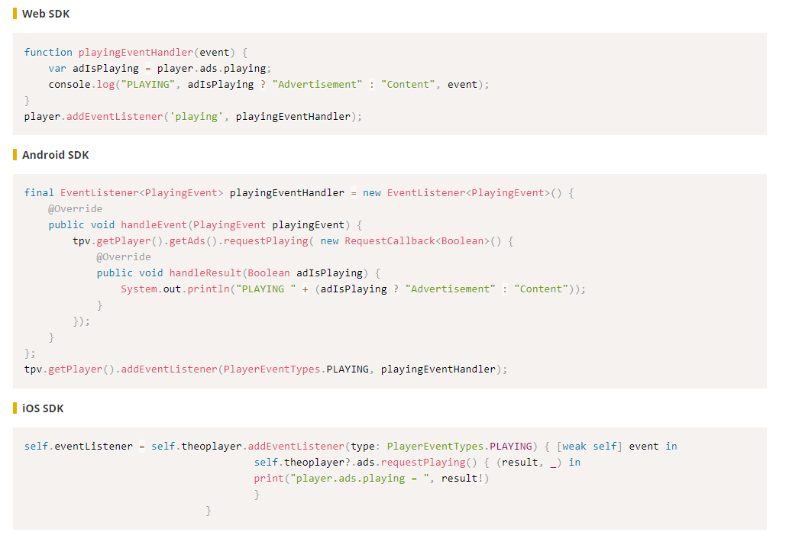

# Tips and Tricks

This article will provide some dos and don'ts and some general information on how to write documentation in Markdown.

**A cheat sheet will all the Markdown features** can be found [here](https://github.com/adam-p/markdown-here/wiki/Markdown-Cheatsheet).

If you're using Visual Code to write markdown files, install this **great extension**: https://marketplace.visualstudio.com/items?itemName=yzhang.markdown-all-in-one . It allows to use keyboard shortcuts, and lets you create the Table of Contents automatically.

## Naming convention directories and files

For ordering reasons, each file and directory should have a **numerical prefix**, consisting of **two digits**. The path structure of a specific file will look as follows: `category/xx-directory/yy-directory/zz-article-title.md`, with

- `xx`, `yy`, `zz` being numbers, and
- `category` being 'knowledge-base', 'getting-started', 'how-to-guides' or 'faq'. Categories **don't** need a numerical prefix.

**Example:** A file that should show up in _Getting Started > SDKs > Web > Getting started on Web_, will have the following path:

`getting-started/01-sdks/01-web/00-getting-started.md`

## A file should ALWAYS start with the article title

The first line of each document should contain a hashtag (#), followed with the title of the article. Documents that don't follow this approach will be rejected!

**Example:**

```markdown
# Title of the Article

...
Content
...
```

## Always use backticks when using HTML tags

When using HTML tags like `<p>Some example</p>`, `<video>`, ... always surround them with backticks (`). If not, things won't render correctly on Gatsby.

**Example:**

```markdown
`<p>Some example</p>`
```

## Using links

You can define a link in Markdown as follows:

```markdown
[this is a link](path-to-follow)
```

When linking to **another document**, use the **relative path**, including the file extension:

```markdown
[a relative link](../how-to-guides/01-ads/01-02-customizing-the-ad-overlay-text.md)
```

When linking to the **API reference**, use the **absolute path**:

```markdown
[ChromelessPlayer](https://docs.theoplayer.com/api-reference/web/theoplayer.chromelessplayer.md)
```

When linking to an **external page**:

```markdown
[link text](https://www.theoplayer.com)
```

When using anchor links: the link will look like `#title-of-section`. **Anchor links should always be in lower case!** (current Gatsby limitation)

**Example:** we want to link to the section which has as title `SDKs`, and one with title `Code Examples`:

```markdown
[Anchor link to SDKs](#sdks)
[Anchor link to Code Examples](#code-examples)

## SDKs

...

## Code Examples

...
```

## Using images

**IMPORTANT:** the image name should NOT contain any spaces. If not following this rule, the image will not show up in Github. Example: `my-image.png`.

Images should be stored in the `assets/img` directory.

To insert an image in a document, use the **relative path**:

```markdown
An image will be shown below:


```

## Rules when inserting code blocks

When inserting a code block, always specify the language you're using so the code gets highlighted correctly.

- For Web, use <code>```js</code>
- For Android, use <code>```java</code>
- For iOS, use <code>```swift</code>

When you want to show code examples for different SDKs, make use of headings per SDK. In Gatsby, we will render h5 headings differently so they will pop out. Therefor, use `##### SDK Type`.

**Example**

````markdown
Let's see some code examples for the various SDKs.

##### Web SDK

```js
function playingEventHandler(event) {
    var adIsPlaying = player.ads.playing;
    console.log("PLAYING", adIsPlaying ? "Advertisement" : "Content", event);
}
player.addEventListener('playing', playingEventHandler);
```

##### Android SDK

```java
final EventListener<PlayingEvent> playingEventHandler = new EventListener<PlayingEvent>() {
    @Override
    public void handleEvent(PlayingEvent playingEvent) {
        tpv.getPlayer().getAds().requestPlaying( new RequestCallback<Boolean>() {
            @Override
            public void handleResult(Boolean adIsPlaying) {
                System.out.println("PLAYING " + (adIsPlaying ? "Advertisement" : "Content"));
            }
        });
    }
};
tpv.getPlayer().addEventListener(PlayerEventTypes.PLAYING, playingEventHandler);
```

##### iOS/tvOS SDK and Legacy iOS/tvOS SDK (4.12.x)

```swift
self.eventListener = self.theoplayer.addEventListener(type: PlayerEventTypes.PLAYING) { [weak self] event in
                                      self.theoplayer?.ads.requestPlaying() { (result, _) in
                                      print("player.ads.playing = ", result!)
                                      }
                              }
```
````

Will result in


