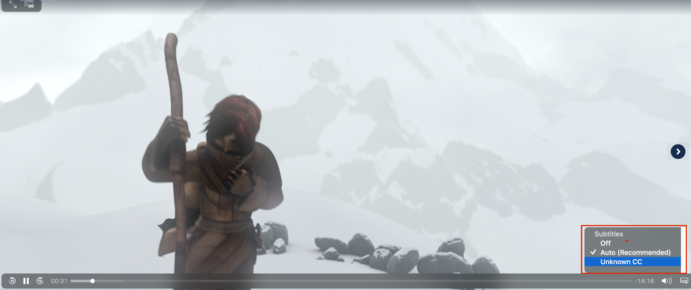
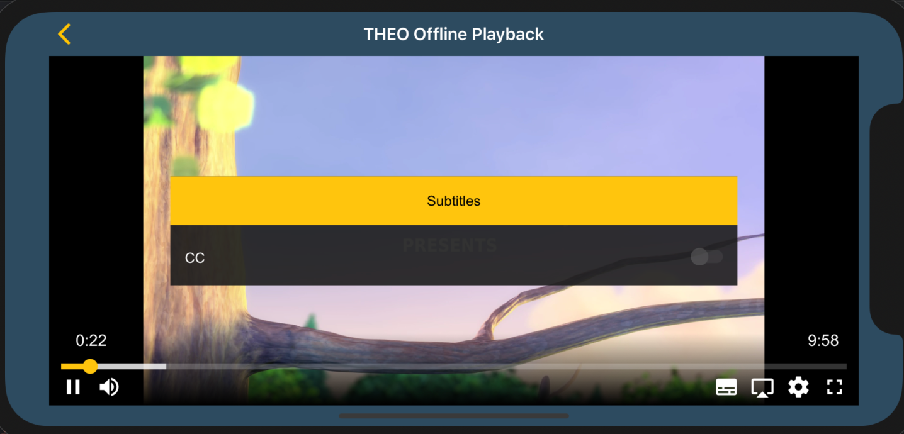

# How to remove onwanted CC track in iOS or Safari

This article is intended to show how to remove any unwanted CC tracks that might be showing up in iOS or Safari. This can be done by editing the HLS master playlist.

**Unwanted CC in Safari native**



**Unwanted CC in THEOplayer iOS**



## How to remove unwanted cc tracks?

To remove any unwanted cc tracks, the “CLOSED-CAPTION” attribute has to be set to “NONE” inside the HLS master playlist. This is to be compatible with the HLS specification: https://tools.ietf.org/html/draft-pantos-hls-rfc8216bis-02

If it is a multi-variant stream, this has to be done for all variants.

```
CLOSED-CAPTION=NONE
```
