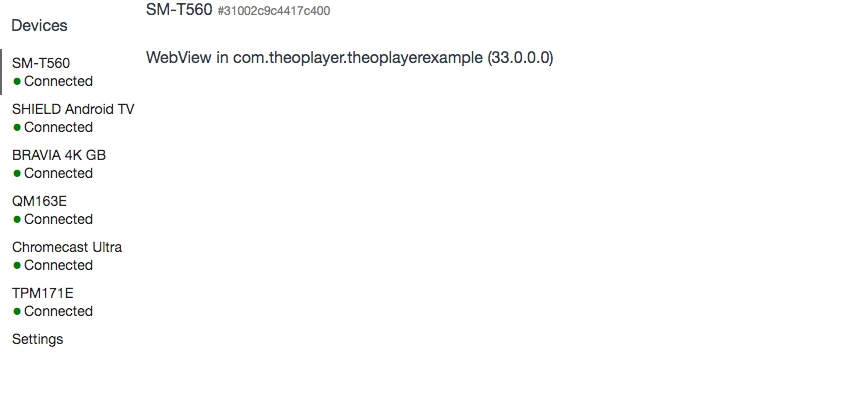

# I'm unable to inspect Webview with the Android SDK


Sometimes when you're Android app is running and you want to inspect the webview for debugging/reproduction purposes, you don't see the inspect button that is usually there.

It does however detect the device and it's webview, as seen below.



## Solution
This is likely a problem caused by the Android version being quite old (4.4.4 and older).

Where you would normally write `WebView.setWebContentsDebuggingEnabled(true);` to enable webview inspecting, older versions require you to add the following snippet:

```java
...
import org.xwalk.core.XWalkCookieManager;
import org.xwalk.core.XWalkPreferences;
import org.xwalk.core.XWalkResourceClient;
import org.xwalk.core.XWalkSettings;
import org.xwalk.core.XWalkUIClient;
import org.xwalk.core.XWalkView;
import org.xwalk.core.XWalkWebResourceRequest;
import org.xwalk.core.XWalkWebResourceResponse;
 
public class MainActivity extends AppCompatActivity {
 
...
 
    @Override
    protected void onCreate(Bundle savedInstanceState) {
        ...
        // This line is used for newer Android versions instead of the XWalk bits
        // WebView.setWebContentsDebuggingEnabled(true);
 
        XWalkPreferences.setValue(XWalkPreferences.REMOTE_DEBUGGING, true);
        ...
 
...
```

The lines including "XWalk" are the ones that need to be added for older Android versions (< 5.0.0).

Your webview should now be inspectable through Chrome developer tools.