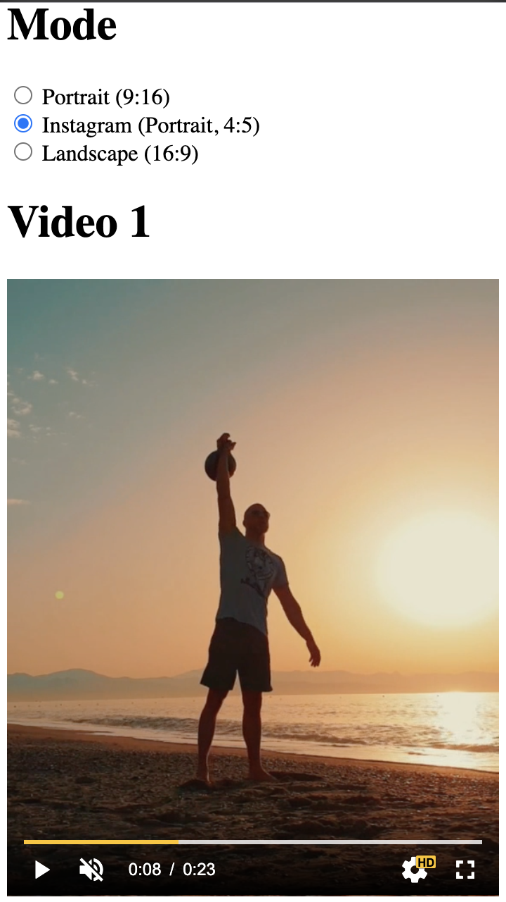

# Is Portrait mode supported

Yes. THEOplayer supports vertical video playback, which is also known as portrait mode.

More specifically, you can configure the aspect ratio of the container which holds the THEOplayer video player instance.

* If your video is shot in 9:16 (i.e. portrait), you can configure your container to respect this aspect ratio,
and THEOplayer will fill the container.
* If your video is shot in 16:9 (i.e. landscape), you can configure your container to respect this aspect ratio,
and THEOplayer will fill the container.

Of course, you can also configure your container to respect any other aspect ratio, like 5:4, which is employed by Instagram.

## Demo

A demo is available at [https://cdn.theoplayer.com/demos/vertical/index.html](https://cdn.theoplayer.com/demos/vertical/index.html).
This demo provides a sample implementation which allow you to switch between popular viewing modes. This demo is best viewed on a mobile browser.

