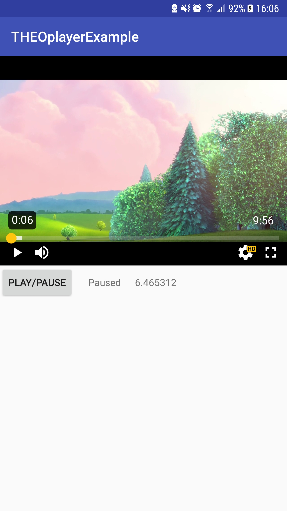

# Getting started with the Android SDK

This guide will provide a end-to-end explanation of how to setup an Android and Android TV application with THEOplayer included. It will cover setting up an IDE, including all dependencies, adding THEOplayer to your activity and interacting with the API.

You can follow the guide step-by-step, or for each step you will find a link to the corresponding commit in our [Android Github](https://github.com/THEOplayer/android-sdk-starter-project) repository. We also provide a full project for [Android TV](https://github.com/THEOplayer/android-tv-sdk-starter-project) and for [both](https://github.com/THEOplayer/android-and-android-tv-sdk-starter-project) together.

## Prerequisites

1.  Download and install [Android Studio](https://developer.android.com/studio/index.html). 
2.  Obtain a THEOplayer Android / Android TV SDK license. If you don't have a license yet, contact your sales contact or email us at [support@theoplayer.com](mailto:support@theoplayer.com).

## Setup a starter project ([source](https://github.com/THEOplayer/android-sdk-starter-project/tree/a235d1d449552cc0013018254f1b5eff56aadeb1))

Start with opening Android Studio. You will be greeted with the following screen. To begin, choose the "**Start a new Android Studio project**" option. 


Choose your application name, domain and project location then hit "**Next**".


THEOplayer supports Android devices with **Android version 4.1 (Jelly Bean - API 16)** and Android TV devices with **Android TV version 5.0 (Lollipop - API 21)**, so select your minimum SDK requirement (Only the phone and tablet option).


On the next screen we can choose from pre-built Activities.  
An Activity is a screen of the application, it provides the window in which the app draws its UI. Because we want to show our THEOplayer on the Activity, we will go on with an empty one.

So select "**Empty Activity**" and press "**Next**". 


Now we have the opportunity to rename the default "**MainActivity**" and the default "**activity_main**" layout file. For now in our example application the default values are good enough.

We can just hit "**Next**" and continue.


And we are done with the setup of the new project. Now Android Studio is downloading the dependencies and project requirements and indexing your files. You can see the progress at the bottom of the window.


## Project structure

By default, Android Studio displays your project files in the **Android** view. This view does not reflect the actual file hierarchy on disk, but is organized by modules and file types to simplify navigation between key source files of your project, hiding certain files or directories that are not commonly used.


*   **manifests**
    *   Contains the [AndroidManifest.xml](https://developer.android.com/guide/topics/manifest/manifest-intro.html) file.

*   **java**
    *   Contains the Java source code files, separated by package names, including JUnit test code.

*   **res**
    *   Contains all non-code resources, such as XML layouts, UI strings, and bitmap images, divided into corresponding sub-directories. For more information about all possible resource types, see [Providing Resources](https://developer.android.com/guide/topics/resources/providing-resources.html).

*   **Gradle Scripts**
    *   Shows all the project's build-related configuration files

To see the actual file structure of the project including all files hidden from the **Android** view, select **Project **from the dropdown at the top of the Project window.


When you select **Project** view, you can see a lot more files and directories. The most important of which are the following:


*   **app/**
    *   Contains all module files: 

*   *   **build/**
        *   Contains build outputs
    *   **libs/**
        *   Contains private libraries
    *   **src/**
        *   Contains all code and resource files for the module in the following subdirectories:
    *   **src/androidTest/**
        *   Contains code for instrumentation tests that run on an Android device. For more information, see the [Android Test documentation](https://developer.android.com/tools/testing/index.html).
    *   **src/main/**
        *   Contains the "main" sourceset files: the Android code and resources shared by all build variants
    *   **src/main/java/**
        *   Contains Java code sources.
    *   **src/main/res/**
        *   Contains application resources, such as drawable files, layout files, and UI string. See [Application Resources](https://developer.android.com/guide/topics/resources/index.html) for more information.
    *   **src/main/AndroidManifest.xml**
        *   Describes the nature of the application and each of its components. For more information, see the [AndroidManifest.xml ](https://developer.android.com/guide/topics/manifest/manifest-intro.html)documentation.
    *   **build.gradle **(module)
        *   This defines the module-specific build configurations.
*   **build.gradle **(project)
    *   This defines your build configuration that apply to all modules

## Add THEOplayer library to your application ([source](https://github.com/THEOplayer/android-sdk-starter-project/commit/1ec4834a5de05115d81994aef4f24b7cd781ce0e?diff=unified))

Your THEOplayer Android / Android TV SDK license file (zip) contains the following files:

*   theoplayer-android-xxx-VERSION-**minapi21**-release.aar
    *   Supports **all mobile and TV devices** starting with Lollipop (5.0)
*   theoplayer-android-xxx-VERSION-**minapi16**-release.aar
    *   Supports **all mobile devices** starting with Android Jellybean (4.1)
    *   This is not relevant for Android TV
*   theoplayer-android-xxx-VERSION-**javadoc**.jar
    *   Contains the API documentation for the library
*   theoplayer-android-xxx-VERSION-**sources**.aar
    *   Contains the source code of the exposed API of THEOplayer Android / Android TV SDK

About the file extensions:

*   A **JAR** is a package file format typically used to aggregate many Java class files and associated metadata and resources into one file for distribution.
*   Android Archive (**AAR**) files, unlike JAR files, can contain Android resources and a manifest file, which allows you to bundle in shared resources like layouts and drawables in addition to Java classes and methods. Usually Android Library projects are compiled to AAR file for distribution.
*   Android Package (**APK**) is the package file format used by the Android operating system for distribution and installation of mobile apps. (Your application containing THEOplayer will compile to an APK file) 

With the **minApi16** version, you can support the largest possible amount of devices. However, the file size of this version is about 50MB while the **minApi21** version is around 2MB. For that reason, it is useful to use both in a way so that the users who have Android Lollipop or higher will have a much smaller APK file. 

We will demonstrate the steps with the **minApi16** version, but they are the same for the **minApi21** version. 

First add your THEOplayer **minApi16** AAR file to "**app/libs"** folder (in our example project we call it **theoplayer.aar**)


Now we have to modify the **build.gradle** files to load "**theoplayer.aar"** library.

In your **top-level** (project) **build.gradle** file add the following lines to allow loading library files from the "**libs**" folder

```
allprojects {
    repositories {
        google()
        jcenter()

        **flatDir {
            dirs 'libs'
        }**

    }
}
```


In the **module-level build.gradle** file ("**app/build.gradle**") we need to specify for Gradle to load and compile our library from the libs folder.  
THEOplayer SDK has an external dependency on [Gson](https://github.com/google/gson) from Google. We use this library to convert Java object to and from JSON representation. In addition to this, all android TV applications also have the [leanback](https://developer.android.com/topic/libraries/support-library/packages#v17-leanback) dependency. We make use of the APIs provided by this library to build the UI on TV devices. So add this dependency for Android TV.

```
dependencies {
    implementation fileTree(dir: 'libs', include: ['*.jar'])

    /* both mobile and TV */
 **implementation(name:'theoplayer', ext:'aar')
    implementation 'com.google.code.gson:gson:2.8.2'** /* only TV */**  
    implementation 'com.android.support:leanback-v17:27.1.1'**

    implementation 'com.android.support:appcompat-v7:27.1.1'
    implementation 'com.android.support.constraint:constraint-layout:1.1.0'
    testImplementation 'junit:junit:4.12'
    androidTestImplementation 'com.android.support.test:runner:1.0.1'
    androidTestImplementation 'com.android.support.test.espresso:espresso-core:3.0.1'
}
```


After the modification of the **.gradle** files, Android Studio asks you to sync with Gradle. Do so by pressing the "**Sync Now**" button on the top of the window.

## Add THEOplayer view to your application ([source](https://github.com/THEOplayer/android-sdk-starter-project/commit/db0205f330009febe0cf8b8a29d600e453445926?diff=unified))
To play online videos with THEOplayer, first we need to add [**INTERNET**](https://developer.android.com/reference/android/Manifest.permission.html#INTERNET) permission into the **AndroidManifest.xml** file ("**app/src/main/AndroidManifest.xml"**):

```xml
<uses-permission android:name="android.permission.INTERNET" />
```


For Android TV, we need to declare that leanback support is enabled and that touch is not required. Without this, your application would not be available in the play store on a Android TV.

```xml
<uses-feature android:name="android.software.leanback"  
    android:required="false" />  
<uses-feature android:name="android.hardware.touchscreen"  
    android:required="false" />```

Now we add the Android TV activity. First make a MainActivityTV.java file in the same directory as the MainActivity.java file and let the MainActivityTV extend **Activity**. For the purpose of this guide, the two activities should be completely the same aside from the extend Activity but feel free to change this in your own application. We then need to add the activity to the AndroidManifest.xml file.

```xml
<activity  
    android:name=".MainActivityTV"  
    android:label="@string/app_name"  
    android:theme="@style/Theme.Leanback">  

    <intent-filter>  
        <action android:name="android.intent.action.MAIN" />  
        <category android:name="android.intent.category.LEANBACK_LAUNCHER" />  
    </intent-filter>  

</activity>
```

Finally, Android requires us to provide a banner. Add an image of 320 by 180 pixels to the drawable folder and add the following to the application in the manifest file.

```
android:banner="@drawable/banner"
```

In the following steps we will add some code to the MainActivity.java file. If you are also using Android TV, please add the code to your MainActivityTV.java file as well.

We can now add the **THEOplayerView** to the layout of the **MainActivity** ("**/app/src/main/java/com/theoplayer/theoplayerexample/MainActivity.java**").  
The example "Hello World!" text can be completely removed. We put the **THEOplayerView** instead.  
At least the "**width**", "**height**" and "**id**" attributes need to be specified on the new view.

The "**id**" is important, it is used to identify the view object in you **MainActivity** class.

```xml
<com.theoplayer.android.api.THEOplayerView
        android:layout_width="match_parent"
        android:layout_height="300dp"
        android:id="@+id/theoplayer">

    </com.theoplayer.android.api.THEOplayerView>
```


Now in the **MainActivity.java** we can retrieve the **THEOplayerView **by the "**id**" we set earlier using the **findViewById** method provided by the Android SDK.


## Use THEOplayer API in your application

#### 1. Configure source ([source](https://github.com/THEOplayer/android-sdk-starter-project/commit/b57ccd82f8b6391636245d74f4f2a68faae227c4?diff=unified))

To play a video in THEOplayer, we need to **configure a source** for the player in our **MainActivity**:

```java
        TypedSource typedSource = TypedSource.Builder
                .typedSource()
                .src("https://cdn.theoplayer.com/video/dash/big_buck_bunny/BigBuckBunny_10s_simple_2014_05_09.mpd")
                .type(SourceType.DASH)
                .build();

        SourceDescription sourceDescription = SourceDescription.Builder
                .sourceDescription(typedSource)
                .build();

        theoPlayerView.getPlayer().setSource(sourceDescription);
```


#### 2\. Control THEOplayer through the API ([source](https://github.com/THEOplayer/android-sdk-starter-project/commit/c9a2b448ef1a920dc6899bf0fb7aee6ac1e15e33?diff=unified))

We will now introduce a button to start/stop the video in the player.

First add the button to our **activity_main.xml** layout file


Then set an **OnClickListener()** on the button in our **MainActivity** code to trigger play and pause in the player.

```java
Button btnPlayPause;

        ...

        btnPlayPause = findViewById(R.id.btn_playpause);
        btnPlayPause.setOnClickListener(new View.OnClickListener() {
            @Override
            public void onClick(View v) {
                if (theoPlayerView.getPlayer().isPaused()) {
                    theoPlayerView.getPlayer().play();
                } else {
                    theoPlayerView.getPlayer().pause();
                }
            }
        });
```


####  3. Listen for THEOplayer events ([source](https://github.com/THEOplayer/android-sdk-starter-project/commit/52f4a46b6c856d402f2fa2dfca249779d2b22967?diff=unified))
The next step is listening for player events. We will now listen for "**PLAY**", "**PAUSE**" and "**TIMEUPDATE**" in this example.

```java
TextView txtPlayStatus, txtTimeUpdate;

        ...

        txtPlayStatus = findViewById(R.id.txt_playstatus);
        txtTimeUpdate = findViewById(R.id.txt_timeupdate);

        theoPlayerView.getPlayer().addEventListener(PlayerEventTypes.PLAY, new EventListener() {
            @Override
            public void handleEvent(PlayEvent playEvent) {
                txtPlayStatus.setText("Playing");
            }
        });

        theoPlayerView.getPlayer().addEventListener(PlayerEventTypes.PAUSE, new EventListener() {
            @Override
            public void handleEvent(PauseEvent pauseEvent) {
                txtPlayStatus.setText("Paused");
            }
        });

        theoPlayerView.getPlayer().addEventListener(PlayerEventTypes.TIMEUPDATE, new EventListener() {
            @Override
            public void handleEvent(TimeUpdateEvent timeUpdateEvent) {
                txtTimeUpdate.setText(String.valueOf(timeUpdateEvent.getCurrentTime()));
            }
        });
```


When the events are triggered we will update the **MainActivity** UI with the corresponding state.

```xml
<Button
        android:layout_width="wrap_content"
        android:layout_height="wrap_content"
        android:id="@+id/btn_playpause"
        android:text="PLAY/PAUSE"
        app:layout_constraintTop_toBottomOf="@+id/theoplayer"/>

    <TextView
        android:layout_width="wrap_content"
        android:layout_height="wrap_content"
        android:id="@+id/txt_playstatus"
        app:layout_constraintLeft_toRightOf="@+id/btn_playpause"
        app:layout_constraintTop_toBottomOf="@+id/theoplayer"
        app:layout_constraintBaseline_toBaselineOf="@+id/btn_playpause"
        android:layout_marginLeft="20dp"/>

    <TextView
        android:layout_width="wrap_content"
        android:layout_height="wrap_content"
        android:id="@+id/txt_timeupdate"
        app:layout_constraintLeft_toRightOf="@+id/txt_playstatus"
        app:layout_constraintTop_toBottomOf="@+id/theoplayer"
        app:layout_constraintBaseline_toBaselineOf="@+id/btn_playpause"
        android:layout_marginLeft="20dp"/>
```


#### 4. Play fullscreen video in landscape mode([source](https://github.com/THEOplayer/android-sdk-starter-project/commit/c327296197ab5cd30d206dd0cd2f5f64f4a3b6ff?diff=unified))

THEOplayer SDK contains a default fullscreen activity which can be started automatically when you rotate your device.

The achieve this we have to configure our player instance in the **MainActivity** to react to orientation changes and start the Fullscreen activity.

```java
   @Override
    protected void onCreate(Bundle savedInstanceState) {

        // ...

        theoPlayerView = findViewById(R.id.theoplayer);
        **theoPlayerView.getSettings().setFullScreenOrientationCoupled(true);**

        // ...

    }
```

In order to work properly and in sync with the [Activity lifecycle changes](https://developer.android.com/guide/components/activities/activity-lifecycle) (e.g. when we rotate the device or start a new Activity or the app goes to background), THEOplayer also needs to react. We need to call the "**onResume"**, "**onPause"** and "**onDestroy"** methods of the **THEOplayerView** when the matching methods are called in the Activity.

```java
public class MainActivity extends AppCompatActivity

    // ...

    @Override
    protected void onPause() {
        super.onPause();
        theoPlayerView.onPause();
    }

    @Override
    protected void onResume() {
        super.onResume();
        theoPlayerView.onResume();
    }

    @Override
    protected void onDestroy() {
        super.onDestroy();
        theoPlayerView.onDestroy();
    }

    // ...

}  

```

We can also disable in the **AndroidManifest.xml** the default orientation behaviour on our MainActivity and lock it in portrait.  
Then, because we enabled fullscreen orientation coupling with the **setFullScreenOrientationCoupled(true) **method eariler, THEOplayer will take care of the support of seamless landscape activity transition at rotation.

```xml
<?xml version="1.0" encoding="utf-8"?>
<manifest xmlns:android="http://schemas.android.com/apk/res/android"
    package="com.theoplayer.theoplayerexample">

    <uses-permission android:name="android.permission.INTERNET" />

    <application
        android:allowBackup="true"
        android:icon="@mipmap/ic_launcher"
        android:label="@string/app_name"
        android:roundIcon="@mipmap/ic_launcher_round"
        android:supportsRtl="true"
        android:theme="@style/AppTheme">
        <activity android:name=".MainActivity"
 **android:screenOrientation="userPortrait"
            android:configChanges="orientation|screenSize"**
            >
            <intent-filter>
                <action android:name="android.intent.action.MAIN" />

                <category android:name="android.intent.category.LAUNCHER" />
            </intent-filter>
        </activity>
    </application>

</manifest>
```     

If you would like to customize the Fullscreen Activity, you can follow our tutorial [here](./android-1-android-sdk-customization.md).

## Run your application

To run your application, you have to click on the **green "Play" icon** next to the "app" module on the Toolbar of Android Studio.


Then you on the popup have two choices:

*   connect your device via usb to your computer
*   run the application in an emulator


We suggest you to **run the application on your real device** for the best performance.

You can either plug in a usb cable between your device and your computer, or enable network debugging on your device and connect using adb connect IP-ADDRESS.

Also keep in mind, on emulators which run Android 7.0 and above the video in THEOplayer is not showing. If you want to still test in emulators you need to use a version with Android 6.0 or below.

And finally, here you have some screenshots from the running application:


Start screen


Playing screen



Paused screen


Rotated fullscreen

## Summary

In this guide we have focused on creating an Android / Android TV application from scratch and we integrated it with THEOplayer.

We have learned how to interact with the player via the available APIs in Java, we have registered for player events and we have learned how to enable automatic orientation detection.

You can find much more interesting features of THEOplayer on our [demo](https://www.theoplayer.com/demo-zone) page.

The full source of this application is available on [GitHub](https://github.com/THEOplayer/android-sdk-starter-project).

In case you encountered any problems, please contact us at [support@theoplayer.com](mailto:support@theoplayer.com)!
