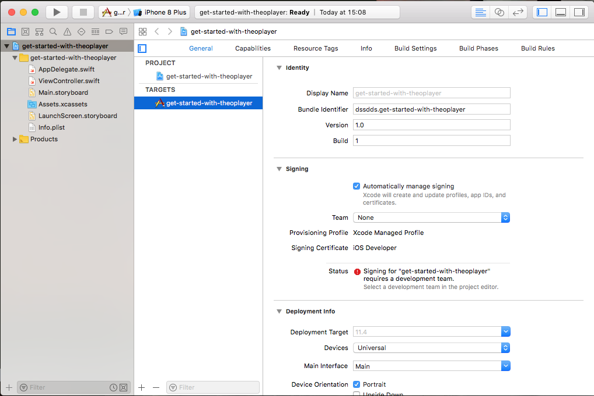
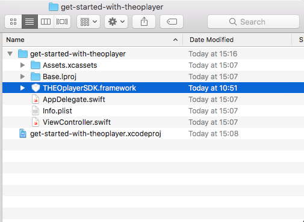
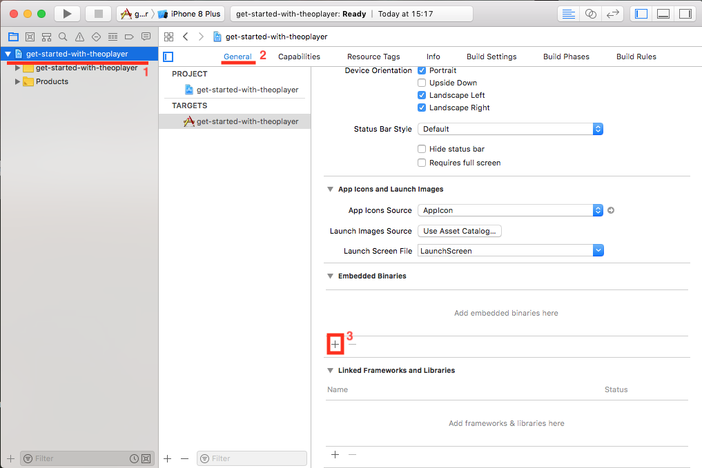
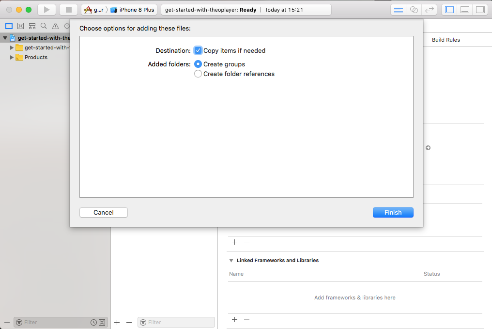
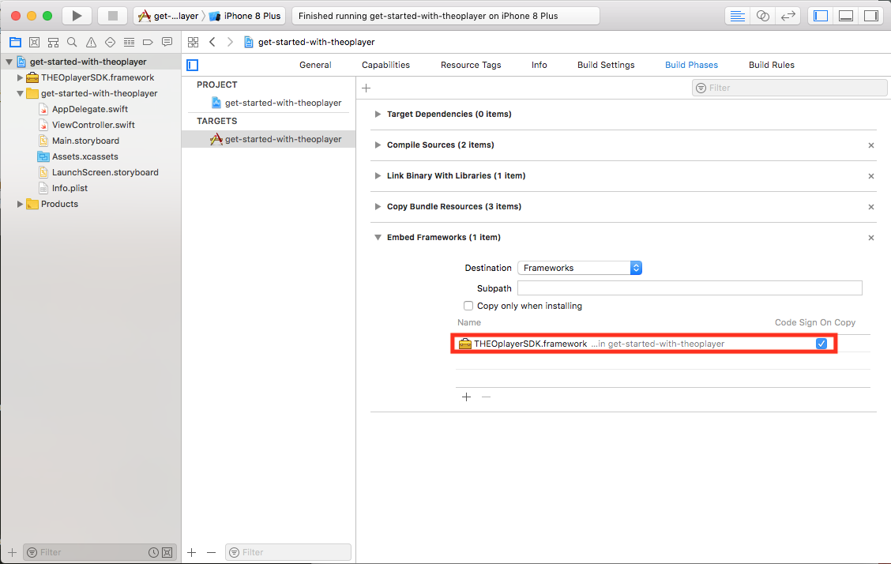

# Getting started with the iOS SDK

This page shows how to get THEOplayer running on iOS apps.

## Objectives

*   Create a new iOS project
*   Configure THEOplayer SDK framework
*   Develop an app that uses the SDK

## Before you begin

*   Make sure you have a valid THEOplayerSDK.framework

## Creating a new iOS project

Steps for creating a new project

- Create new project (cmd + shift + n)
- Select Single View App, click 'next'
- Enter project details, click 'next'

After selecting the directory location, you should see something similar to the screenshot below



## Configure THEOplayer SDK framework

Steps for adding a framework

- Open finder and add your THEOplayerSDK.framework to the project directory



- Go to the project configuration (1), select the General tab (2), and finally scroll down to the Embedded Binaries section and click '+' (3)



- A submenu will open, click 'Add Other...'
- Select the previously added THEOplayerSDK.framework
- A menu will open. They have sufficient defaults. Click 'Finish'



Validate that the framework will correctly be added during builds

- Go to the Build Phases tab in the project configuration, go to the Embed Frameworks section
- Check that the THEOplayerSDK.framework is present



## Develop the app using the THEOplayer SDK

Steps for a minimal app using THEOplayer

- Open the ViewController
- Import THEOplayerSDK
- Setup a player during `viewDidLoad()`, it is important to keep a reference to this instance
- Set a source on the player

The result is the following snippet:

```swift
import UIKit
import THEOplayerSDK

class ViewController: UIViewController {
    var theoplayer: THEOplayer!
    
    override func viewDidLoad() {
        super.viewDidLoad()
        setupTheoPlayer()
        self.theoplayer.source = sampleSource
    }
    
    func setupTheoPlayer() {
        var frame: CGRect = UIScreen.main.bounds
        frame.origin.y = 0
        frame.size.height = frame.size.width * 9 / 16
        
        self.theoplayer = THEOplayer()
        self.theoplayer.frame =  frame
        self.theoplayer.addAsSubview(of: self.view)
    }

    var sampleSource: SourceDescription {
        return SourceDescription(
            source: TypedSource(
                src: "https://cdn.theoplayer.com/video/elephants-dream/playlist.m3u8",
                type: "application/x-mpegurl"
            )
        )
    }
}
```

Steps for adding and removing event listeners

Use the THEOplayer API to add an eventlistener
- Add `var listeners : [String: EventListener] = [:]` to ViewController
- Use the THEOplayer API to add an event listener and handler
- Add `attachEventListeners()` to the setup of THEOplayer

The result is the following snippet:

```swift
import Foundation
import THEOplayerSDK

extension ViewController {
    
    func attachEventListeners() {
        self.listeners["play"] = self.theoplayer.addEventListener(type: PlayerEventTypes.PLAY, listener: onPlay)
        self.listeners["pause"] = self.theoplayer.addEventListener(type: PlayerEventTypes.PAUSE, listener: onPause)
    }
    
    func removeEventListeners() {
        self.theoplayer.removeEventListener(type: PlayerEventTypes.PLAY, listener: listeners["play"]!)
        self.theoplayer.removeEventListener(type: PlayerEventTypes.PAUSE, listener: listeners["pause"]!)
    }

    func onPlay(event: PlayEvent) {
        print("Play event occured")
    }
    
    func onPause(event: PauseEvent) {
        print("Pause event occured")
    }
}
```

Validate that the tutorial was completed succesfully

- Run the application, you can boot a similator or use your own device
- Click the big play button