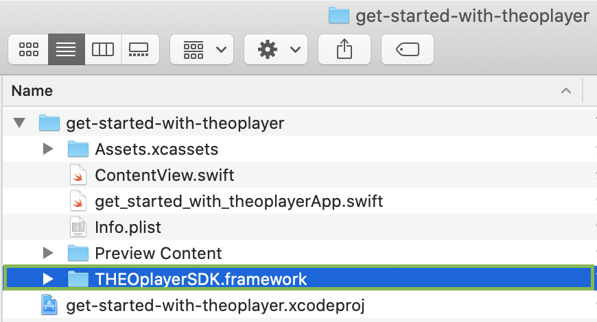

# Getting started with the iOS SDK

This page is a step-by-step guide on how to get THEOplayer iOS SDK running on iOS apps.
This example was made with Xcode version 12.0.1 (12A7300) and macOS Catalina version 10.15.7.

## Objectives

*   Create a new iOS project in Xcode.
*   Include and configure THEOplayer SDK framework for iOS.
*   Develop an app that uses the SDK.

## Before you begin

*   Make sure you have a valid THEOplayerSDK.framework.

## Creating a new iOS project

Steps for creating a new project:

1. Create new project (cmd + shift + n).
2. Select new App and click 'next'.
    


3.  Enter project details, set interface to 'storyboard' and click 'next'.


After selecting the directory location, you should see something similar to the screenshot below.


## Configure THEOplayer SDK framework

Steps for adding a framework:

Open finder and drag your THEOplayerSDK.framework into to the project directory.



This screen pops up, make sure these settings are selected and click finish. 


Go to the project configuration (1), select the General tab (2), and make sure the THEOplayerSDK.framework is embeded and signed in.(3) Add it with the "+" if necessary.


Validate that the framework will correctly be added during builds:

Go to the Build Phases tab in the project configuration. Then, go to the Embed Frameworks section and check that the THEOplayerSDK.framework is present.


## Develop the app using the THEOplayer SDK

Steps for a minimal app using THEOplayer:

1. Open the ViewController.
    
    The file should look like this:

    

2. Import THEOplayerSDK.
    ```swift
        import THEOplayerSDK
    ```
3. Make the setupTheoPlayer() function:
    
    This function sets all the initial dimensions for the player and adds it to the view when called.
   ```swift
    func setupTheoPlayer() {
        var frame: CGRect = UIScreen.main.bounds
        frame.origin.y = 0
        frame.size.height = frame.size.width * 9 / 16
        
        self.theoplayer = THEOplayer()
        self.theoplayer.frame  = frame
        self.theoplayer.addAsSubview(of: self.view)
    }
   ```
   
4. Define the sampleSource:
   ```swift
   var sampleSource: SourceDescription {
        return SourceDescription(
            source: TypedSource(
            src: "https://cdn.theoplayer.com/video/elephants-dream/playlist.m3u8",
            type: "application/x-mpegurl"
            )
        )
    }
   ```
5. Setup a player during `viewDidLoad()`, it is important to keep a reference to this instance
   ```swift
    override func viewDidLoad() {
        super.viewDidLoad()
        setupTheoPlayer()
        self.theoplayer.source = sampleSource
        /* Do any additional setup after loading the view.*/
    }
   ```

The result is the following snippet:

```swift
import UIKit
import THEOplayerSDK

class ViewController: UIViewController {
    var theoplayer: THEOplayer!
    
    override func viewDidLoad() {
        super.viewDidLoad()
        setupTheoPlayer()
        self.theoplayer.source = sampleSource
    }
    
    func setupTheoPlayer() {
        var frame: CGRect = UIScreen.main.bounds
        frame.origin.y = 0
        frame.size.height = frame.size.width * 9 / 16
        
        self.theoplayer = THEOplayer()
        self.theoplayer.frame =  frame
        self.theoplayer.addAsSubview(of: self.view)
    }

    var sampleSource: SourceDescription {
        return SourceDescription(
            source: TypedSource(
                src: "https://cdn.theoplayer.com/video/elephants-dream/playlist.m3u8",
                type: "application/x-mpegurl"
            )
        )
    }
}
```

## Steps for adding and removing event listeners.

1. Add `var listeners: [String: EventListener] = [:]` to ViewController
  ```swift
    var theoplayer: THEOplayer!
    var listeners: [String: EventListener] = [:]
  ```

2. Write the functions to create and delete the EventListeners on play and pause events.

```swift
class ViewController: UIViewController {
    
    ...

    func attachEventListeners() {
        self.listeners["play"] = self.theoplayer.addEventListener(type: PlayerEventTypes.PLAY, listener: onPlay)
        self.listeners["pause"] = self.theoplayer.addEventListener(type: PlayerEventTypes.PAUSE, listener: onPause)
    }
    
    func removeEventListeners() {
        self.theoplayer.removeEventListener(type: PlayerEventTypes.PLAY, listener: listeners["play"]!)
        self.theoplayer.removeEventListener(type: PlayerEventTypes.PAUSE, listener: listeners["pause"]!)
    }

    func onPlay(event: PlayEvent) {
        print("Play event occured")
    }
    
    func onPause(event: PauseEvent) {
        print("Pause event occured")
    }
}
```

3. Add `attachEventListeners()` to the setupTheoPlayer() function to create the EventListeners when the Theoplayer is initialized.
 
 ```swift
 func setupTheoPlayer() {
        var frame: CGRect = UIScreen.main.bounds
        frame.origin.y = 0
        frame.size.height = frame.size.width * 9 / 16
            
        self.theoplayer = THEOplayer()
        self.theoplayer.frame =  frame
        self.theoplayer.addAsSubview(of: self.view)
        
        attachEventListeners()
    }
 ```
 4. Modify the `viewWillDisappear()` method to also delete the EventListeners we previously made when the current view is inactive.
```swift
override func viewWillDisappear(_ animated: Bool) {
    super.viewWillDisappear()
    removeEventListeners()
}
 ``` 


## Full code overview:
```swift
import UIKit
import THEOplayerSDK

class ViewController: UIViewController {
    var theoplayer: THEOplayer!
    var listeners: [String: EventListener] = [:]

    override func viewDidLoad() {
        super.viewDidLoad()
        setupTheoPlayer()
        self.theoplayer.source = sampleSource
    }
        
    func setupTheoPlayer() {
        var frame: CGRect = UIScreen.main.bounds
        frame.origin.y = 0
        frame.size.height = frame.size.width * 9 / 16
            
        self.theoplayer = THEOplayer()
        self.theoplayer.frame =  frame
        self.theoplayer.addAsSubview(of: self.view)
        
        attachEventListeners()
    }

    var sampleSource: SourceDescription {
        return SourceDescription(
            source: TypedSource(
            src: "https://cdn.theoplayer.com/video/elephants-dream/playlist.m3u8",
            type: "application/x-mpegurl"
            )
        )
    }
    override func viewWillDisappear(_ animated: Bool) {
        super.viewWillDisappear()
        removeEventListeners()
    }

    func attachEventListeners() {
        self.listeners["play"] = self.theoplayer.addEventListener(type: PlayerEventTypes.PLAY, listener: onPlay)
        self.listeners["pause"] = self.theoplayer.addEventListener(type: PlayerEventTypes.PAUSE, listener: onPause)
    }
    
    func removeEventListeners() {
        self.theoplayer.removeEventListener(type: PlayerEventTypes.PLAY, listener: listeners["play"]!)
        self.theoplayer.removeEventListener(type: PlayerEventTypes.PAUSE, listener: listeners["pause"]!)
    }

    func onPlay(event: PlayEvent) {
        print("Play event occured")
    }
    
    func onPause(event: PauseEvent) {
        print("Pause event occured")
    }
}

```
Validate that the tutorial was completed succesfully:

- Run the application, you can boot a similator or use your own device.
- Click the big play button.