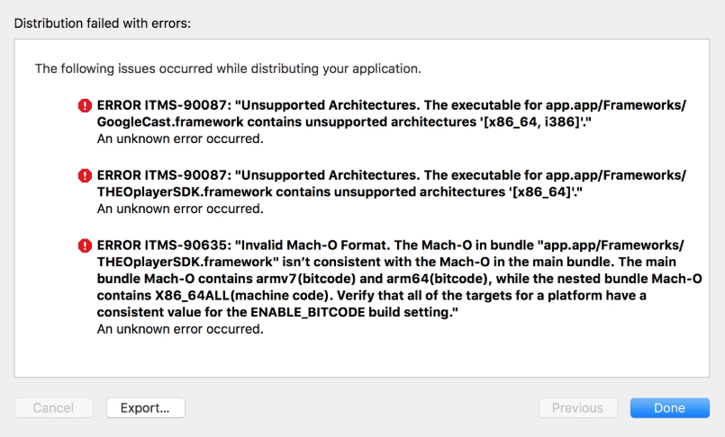

# My app does not want to build for the app store

Depending on the configuration of your iOS application, it might be possible that Apple complains when bundling the code into an application with the intend to submit it to the App Store. This could be due to the THEOplayer iOS SDK containing simulator architectures, for example to integrate with Chromecast.

This issue can typically be resolved by omitting unnecessary architectures. This can be done through the following script:

```bash
APP_PATH="${TARGET_BUILD_DIR}/${WRAPPER_NAME}"
# This script loops through the frameworks embedded in the application and
# removes unused architectures.
find "$APP_PATH" -name '*.framework' -type d | while read -r FRAMEWORK
do
FRAMEWORK_EXECUTABLE_NAME=$(defaults read "$FRAMEWORK/Info.plist" CFBundleExecutable)
FRAMEWORK_EXECUTABLE_PATH="$FRAMEWORK/$FRAMEWORK_EXECUTABLE_NAME"
echo "Executable is $FRAMEWORK_EXECUTABLE_PATH"

EXTRACTED_ARCHS=()

for ARCH in $ARCHS
do
echo "Extracting $ARCH from $FRAMEWORK_EXECUTABLE_NAME"
lipo -extract "$ARCH" "$FRAMEWORK_EXECUTABLE_PATH" -o "$FRAMEWORK_EXECUTABLE_PATH-$ARCH"
EXTRACTED_ARCHS+=("$FRAMEWORK_EXECUTABLE_PATH-$ARCH")
done

echo "Merging extracted architectures: ${ARCHS}"
lipo -o "$FRAMEWORK_EXECUTABLE_PATH-merged" -create "${EXTRACTED_ARCHS[@]}"
rm "${EXTRACTED_ARCHS[@]}"

echo "Replacing original executable with thinned version"
rm "$FRAMEWORK_EXECUTABLE_PATH"
mv "$FRAMEWORK_EXECUTABLE_PATH-merged" "$FRAMEWORK_EXECUTABLE_PATH"
done
```

A potential symptom of the above issue is shown in the screenshot below.



