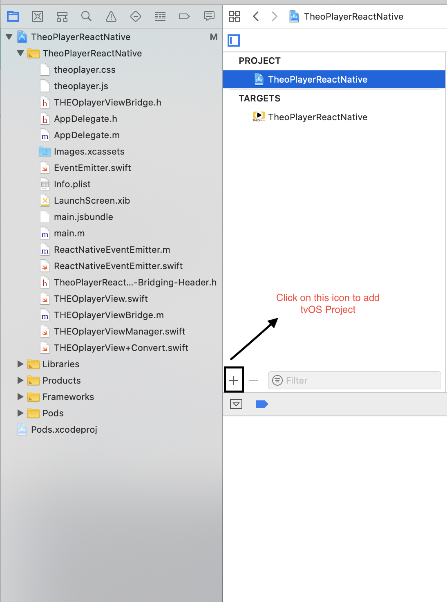
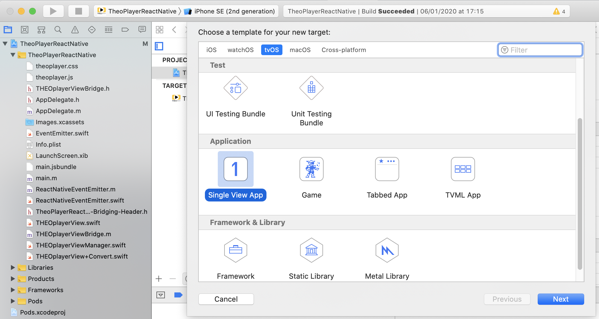
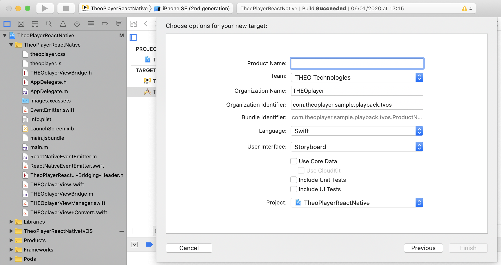
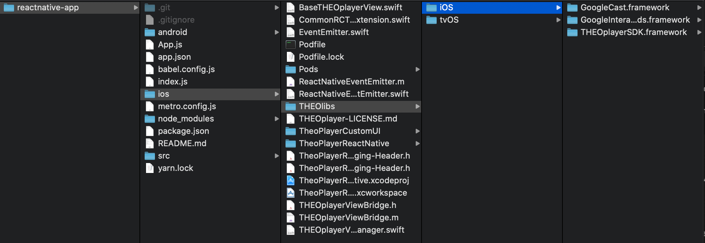
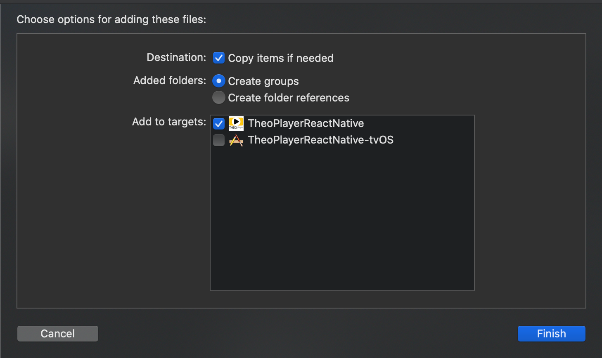
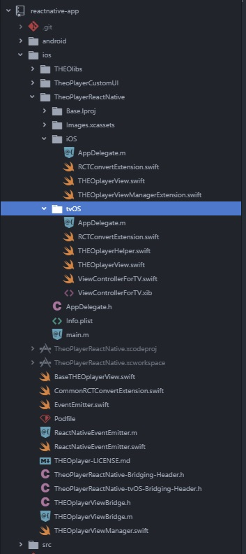

# How to add tvOS project in React Native and THEOplayer

This how-to guide describes how to set-up the THEOplayer tvOS SDK with an existing project in React Native application.

## General Information

### tvOS

- Yarn 1.19.1
- React native TVOS 0.62.2-1
- Xcode 11.3
- THEOplayer 2.75.1
- Swift 5.1.

THEOplayer tvOS SDK can be used for tvOS devices using iOS 10.0+ and Swift 5.0+

## Getting Started tvOS Project

As a first step create or use project that contains IOS target. Next add TVOS target:

1. In Xcode select File → New → Target → TVOS or Click on the ` + ` icon like below



2. Select tvOS target and Single view app.



3. Fill up neccessery information.



4. Click 'Finish'.

### Add tvOS React Native dependancy to Package.json 

TVOS logic was separated from the React Native and exists as a separate library, so we need to add it to package.json:

```json
{
  "name": "TheoPlayerReactNative",
  "version": "0.0.1",
  "private": true,
  "scripts": {
    "android": "react-native run-android",
    "ios": "react-native run-ios",
    "start": "react-native start",
    "test": "jest",
    "lint": "eslint ."
  },
  "dependencies": {
    "react": "16.9.0",
    "react-native": "npm:react-native-tvos@0.60.4-6" // here we are declaring react native dependency for the react native tvos, which is compatible with the react 16.9
  },
  "devDependencies": {
    "@babel/core": "^7.6.2",
    "@babel/runtime": "^7.6.2",
    "@react-native-community/eslint-config": "^0.0.5",
    "babel-jest": "^24.9.0",
    "eslint": "^6.5.1",
    "jest": "^24.9.0",
    "metro-react-native-babel-preset": "^0.56.0",
    "react-test-renderer": "16.9.0"
  },
  "jest": {
    "preset": "react-native"
  }
}

```
## Importing THEOplayer SDK [iOS + tvOS]
To have THEOPlayer iOS and tvOS SDKs in single project it is necessary to keep them in separate folders. In the React Native project open ios folder and create two folders - one for iOS and one for tvOS framework. Add iOS THEOPlayerSDK framework to iOS folder and tvOS framework to tvOS folder.



Importing the THEOplayer SDK Library can be done in two ways.

- By drag and drop:  [How to add THEOplayer SDK in Xcode](https://github.com/THEOplayer/samples-ios-sdk/tree/master/Basic-Playback/Guides/howto-theoplayer-ios-sdk-integration)

1. Add folders to Xcode by dragging them to project tree.
2. Select Copy items if needed and Create groups -> folder should be added to only one target.



- By importing in Xcode:

1. Open finder and add your THEOplayerSDK.framework to the project directory
2. Go to the project configuration, select the General tab, and finally scroll down to the Embedded Binaries section and click `+`
3. Click 'Add Other' and select previously added THEOPlayerSDK.framework
4. Click 'Finish'

## Native Module Implementation

### File Structure

- For better code management it is best to use seperate structure for the IOS and TVOS targets, so create folder for the IOS and TVOS files




### THEOPlayer Implementation 

- For THEOplayer implementation in iOS : [Getting Started with THEOplayer Android/iOS in React Native](https://docs.portal.theoplayer.com/getting-started/02-frameworks/03-react-native/01-how-to-get-started-with-theo.md)

- For THEOplayer implementation in tvOS :
1. Create new swift class inside tvos/ e.g. `THEOplayerView.swift` for integrating in native modules. 

```swift
import Foundation
import UIKit
import THEOplayerSDK
 
@objc(THEOplayerView)
class THEOplayerView: BaseTHEOplayerView {
  init() {
    let playerConfig = THEOplayerConfiguration(chromeless: false)
    let player = THEOplayer(configuration: playerConfig)
    super.init(player: player)
  }
 
  required init?(coder aDecoder: NSCoder) {
    fatalError("init(coder:) has not been implemented")
  }
}
```
**Note:** This class will extend `BaseTHEOplayerView.swift` (use only needed methods), that should be declarated in main ios/ folder like below:

```swift
import Foundation
import UIKit
import THEOplayerSDK
 
@objc(BaseTHEOplayerView)
class BaseTHEOplayerView: UIView {
 
  var player: THEOplayer
  var onSeek: RCTBubblingEventBlock?
  var onPlay: RCTBubblingEventBlock?
  var onPause: RCTBubblingEventBlock?
 
  private var listeners: [String: EventListener] = [:]
 
  init(player: THEOplayer) {
    self.player = player
 
    EventEmitter.sharedInstance.registerPlayer(player: player)
 
    super.init(frame: .zero)
    player.addAsSubview(of: self)
 
    initListeners(forPlayer: player)
  }
   
  private func initListeners(forPlayer player: THEOplayer) {
    let seekListener = player.addEventListener(type: PlayerEventTypes.SEEKED) { [unowned self] event in
      print("Received \(event.type) event at \(event.currentTime)")
      guard self.onSeek != nil else {
        return
      }
       
      self.onSeek!(["currentTime": event.currentTime])
    }
    listeners[PlayerEventTypes.SEEKED.name] = seekListener
     
    let playListener = player.addEventListener(type: PlayerEventTypes.PLAY) { [unowned self] event in
      print("Received \(event.type) event at \(event.currentTime)")
      guard self.onPlay != nil else {
        return
      }
       
      self.onPlay!([:])
    }
    listeners[PlayerEventTypes.PLAY.name] = playListener
     
    let pauseListener = player.addEventListener(type: PlayerEventTypes.PAUSE) { [unowned self] event in
      print("Received \(event.type) event at \(event.currentTime)")
      guard self.onPause != nil else {
        return
      }
       
      self.onPause!([:])
    }
    listeners[PlayerEventTypes.PAUSE.name] = pauseListener
  }
 
  required init?(coder aDecoder: NSCoder) {
    fatalError("init(coder:) has not been implemented")
  }
 
  @objc(setSource:) func setSource(source: SourceDescription) {
    player.source = source
  }
 
  @objc(setAutoplay:) func setAutoplay(autoplay: Bool) {
    player.autoplay = autoplay
  }
   
  @objc(setFullscreenOrientationCoupling:) func setFullscreenOrientationCoupling(fullscreenOrientationCoupling: Bool) { }
 
  @objc(setOnSeek:) func setOnSeek(seek: @escaping RCTBubblingEventBlock) {
    onSeek = seek
  }
 
  @objc(setOnPlay:) func setOnPlay(play: @escaping RCTBubblingEventBlock) {
    onPlay = play
  }
 
  @objc(setOnPause:) func setOnPause(pause: @escaping RCTBubblingEventBlock) {
    onPause = pause
  }
 
  override func layoutSubviews() {
    super.layoutSubviews()
    player.frame = frame
    player.autoresizingMask = [.flexibleBottomMargin, .flexibleHeight, .flexibleLeftMargin, .flexibleRightMargin, .flexibleTopMargin, .flexibleWidth]
  }
 
  deinit {
    for (eventName, listener) in listeners {
      switch eventName {
      case "play":
        player.removeEventListener(type: PlayerEventTypes.PLAY, listener: listener)
 
      case "pause":
        player.removeEventListener(type: PlayerEventTypes.PAUSE, listener: listener)
 
      case "seeked":
        player.removeEventListener(type: PlayerEventTypes.SEEKED, listener: listener)
 
      default:
        break
      }
    }
  }
}
```
2. Create a View Controller for tvOS, inside tvos/ e.g. `ViewControllerForTV.swift`:

```swift
import UIKit
 
class ViewControllerForTV: UIViewController {
 
    override func viewDidLoad() {
        super.viewDidLoad()
    }
}
```
3. Additionally Create a intit Class inside tvos/ e.g. `THEOplayerHelper.swift` for the View Controller:

```swift
import Foundation
import THEOplayerSDK
 
@objc final class THEOplayerHelper: NSObject {
 
  @objc static func initTheoPlayer() {
    THEOplayer.prepare(withFirstViewController: ViewControllerForTV())
  }
}
```
4. Create a new Objective-C class inside main ios/ e.g. `THEOplayerViewBridgeSecondly.h` which acts as bridge for the View to export properties, modules and methods:

```swift
#ifndef THEOplayerViewBridge_h
#define THEOplayerViewBridge_h
 
#import <React/RCTBridgeModule.h>
 
#endif /* THEOplayerViewBridge_h */
```
**Note:** In this example, we will export some properties and methods (use only needed properties) which would be used in tvOS and iOS. Create a new Objective-C class inside ios/ e.g. `THEOplayerViewBridge.m`:

```swift
#import "React/RCTView.h"
#import "React/RCTBridgeModule.h"
#import "React/RCTViewManager.h"
 
@interface RCT_EXTERN_MODULE(THEOplayerViewManager, RCTViewManager)
 
RCT_EXPORT_VIEW_PROPERTY(source, SourceDescription);
RCT_EXPORT_VIEW_PROPERTY(autoplay, BOOL);
RCT_EXPORT_VIEW_PROPERTY(fullscreenOrientationCoupling, BOOL);
RCT_EXPORT_VIEW_PROPERTY(onSeek, RCTBubblingEventBlock);
RCT_EXPORT_VIEW_PROPERTY(onPlay, RCTBubblingEventBlock);
RCT_EXPORT_VIEW_PROPERTY(onPause, RCTBubblingEventBlock);
 
RCT_EXTERN_METHOD(play);
RCT_EXTERN_METHOD(pause);
RCT_EXTERN_METHOD(stop);
RCT_EXTERN_METHOD(scheduleAd:(nonnull NSDictionary *)jsAdDescription);
 
RCT_EXTERN_METHOD(getCurrentTime:(RCTPromiseResolveBlock *)resolve reject:(RCTPromiseRejectBlock *));
RCT_EXTERN_METHOD(setCurrentTime:(nonnull NSNumber *)newValue);
RCT_EXTERN_METHOD(getDuration:(RCTPromiseResolveBlock *)resolve reject:(RCTPromiseRejectBlock *)reject);
RCT_EXTERN_METHOD(getDurationWithCallback:(RCTResponseSenderBlock)callback);
RCT_EXTERN_METHOD(getPaused:(RCTPromiseResolveBlock *)resolve reject:(RCTPromiseRejectBlock *)reject);
RCT_EXTERN_METHOD(getPreload:(RCTPromiseResolveBlock *)resolve reject:(RCTPromiseRejectBlock *)reject);
RCT_EXTERN_METHOD(setPreload:(nonnull NSString *)newValue);
RCT_EXTERN_METHOD(getPresentationMode:(RCTPromiseResolveBlock *)resolve reject:(RCTPromiseRejectBlock *)reject);
RCT_EXTERN_METHOD(setPresentationMode:(nonnull NSString *)newValue);
RCT_EXTERN_METHOD(setSource:(nonnull NSDictionary *)newValue);
RCT_EXTERN_METHOD(getCurrentAds:(RCTPromiseResolveBlock *)resolve reject:(RCTPromiseRejectBlock *)reject);
 
@end
```

5. Create a new swift class inside main ios/ e.g. `THEOplayerViewManager.swift` to add initialization of View Manager (use only needed methods) which will be used in tvOS and iOS:

```swift
import Foundation
import THEOplayerSDK
 
@objc(THEOplayerViewManager) class THEOplayerViewManager: RCTViewManager {
 
  var playerView = THEOplayerView()
 
  override func view() -> UIView! {
    return playerView
  }
 
  // Override implementation of queue setup
  // Returns: when true class initialized on the main thread,
  //          when false class initialized on a background thread
  @objc
  override static func requiresMainQueueSetup() -> Bool {
    return true;
  }
 
  @objc
  func play() {
    playerView.player.play()
  }
 
  @objc
  func pause() {
    playerView.player.pause()
  }
 
  @objc
  func stop() {
    playerView.player.stop()
  }
 
  @objc(getCurrentTime:reject:)
  func getCurrentTime(_ resolve: @escaping RCTPromiseResolveBlock, _ reject: @escaping RCTPromiseRejectBlock) {
    return playerView.player.requestCurrentTime() { result, error in
      if error != nil {
        reject(nil, nil, error!)
      } else {
        resolve(result ?? nil)
      }
    }
  }
 
  @objc
  func setCurrentTime(_ newValue: NSNumber) {
    playerView.player.setCurrentTime(newValue.doubleValue)
  }
 
  @objc(getDuration:reject:)
  func getDuration(_ resolve: @escaping RCTPromiseResolveBlock, _ reject: @escaping RCTPromiseRejectBlock) {
    resolve(playerView.player.duration)
  }
 
  @objc(getDurationWithCallback:)
  func getDurationWithCallback(_ callback : @escaping RCTResponseSenderBlock) {
    callback([NSNull(), playerView.player.duration ?? 0]);
  }
 
  @objc(getPaused:reject:)
  func getPaused(_ resolve: @escaping RCTPromiseResolveBlock, _ reject: @escaping RCTPromiseRejectBlock) {
    resolve(playerView.player.paused)
  }
 
  @objc(getpreload:reject:)
  func getPreload(_ resolve: @escaping RCTPromiseResolveBlock, _ reject: @escaping RCTPromiseRejectBlock) {
    resolve(playerView.player.preload.rawValue)
  }
 
  @objc
  func setPreload(_ newValue: NSString) {
    if let preload = Preload(rawValue: newValue as String) {
      playerView.player.setPreload(preload)
    }
  }
 
  @objc(getPresentationMode:reject:)
  func getPresentationMode(_ resolve: @escaping RCTPromiseResolveBlock, _ reject: @escaping RCTPromiseRejectBlock) {
    resolve(playerView.player.presentationMode.rawValue)
  }
 
  @objc
  func setPresentationMode(_ newValue: NSString) {
    if let presentationMode = PresentationMode(rawValue: newValue as String) {
      playerView.player.presentationMode = presentationMode
    }
  }
 
  @objc
  func setSource(_ newValue: [String : Any]) {
    do {
      let data = try JSONSerialization.data(withJSONObject: newValue)
      let sourceDescription = try JSONDecoder().decode(SourceDescription.self, from: data)
      playerView.player.source = sourceDescription
    } catch {
      print(error)
    }
  }
 
}
```

**Note:** You can also extend THEOplayerViewManager for customisation in iOS or tvOS, e.g. `ios/TheoPlayerReactNative/iOS/THEOPlayerViewManagerExtension.swift`:

```swift
import Foundation
import THEOplayerSDK
 
@objc extension THEOplayerViewManager {
   
  @objc
  func scheduleAd(_ jsAdDescription: [String : Any]) {
    do {
      let data = try JSONSerialization.data(withJSONObject: jsAdDescription)
      let adDescription = try JSONDecoder().decode(THEOAdDescription.self, from: data)
      playerView.player.ads.schedule(adDescription: adDescription)
    } catch {
      print(error)
    }
  }
   
  @objc(getCurrentAds:reject:)
  func getCurrentAds(_ resolve: @escaping RCTPromiseResolveBlock, _ reject: @escaping RCTPromiseRejectBlock) {
    playerView.player.ads.requestCurrentAds{ result, error in
      if error != nil || result == nil {
        reject(nil, nil, error!)
      } else {
        resolve(result!.count)
      }
    }
  }
   
}
```
6. Create a new swift class inside tvos/ e.g. `RCTConvertExtension.swift` to add View Convert which will manage source properties structure:

```swift
import Foundation
import THEOplayerSDK
 
@objc extension RCTConvert {
   
  @objc(SourceDescription:)
  class func sourceDescription(_ json: [String:AnyObject]) -> SourceDescription? {
    guard let sources = (json["sources"] as? [AnyObject]).flatMap(RCTConvert.typedSourceArray) else {
      return nil
    }
     
    return SourceDescription(
      sources: sources,
      textTracks: (json["textTracks"] as? [AnyObject]).flatMap(RCTConvert.textTrackArray),
      poster: RCTConvert.nsString(json["poster"]),
      metadata: nil
    )
  } 
}
```

**Note:** Create a new swift class inside main ios/ e.g. `CommonRCTConvertExtension.swift` which extends RCTConverter to use common declared converter:

```swift
import THEOplayerSDK
 
@objc extension RCTConvert {
   
  @objc(TypedSource:)
  class func typedSource(_ json: [String:AnyObject]) -> TypedSource? {
    guard
      let src = RCTConvert.nsString(json["src"]),
      let type = RCTConvert.nsString(json["type"])
      else {
        return nil
    }
     
    if let drm = RCTConvert.nsDictionary(json["drm"]),
      let fairplay = RCTConvert.nsDictionary(drm["fairplay"]),
      let integrationType = RCTConvert.nsString(drm["integration"]) {
      let licenseAcquisitionURL = RCTConvert.nsString(fairplay["licenseAcquisitionURL"]);
      let certificateURL = RCTConvert.nsString(fairplay["certificateURL"]);
      var baseDrm: THEOplayerSDK.DRMConfiguration? = nil
       
      // If you want other integration add next case and drm configurator supported by theoplayer sdk
      switch integrationType {
      case "ezdrm":
        baseDrm = EzdrmDRMConfiguration(licenseAcquisitionURL: licenseAcquisitionURL!, certificateURL: certificateURL!)
        break
      case "uplynk":
        baseDrm = UplynkDRMConfiguration(licenseAcquisitionURL: licenseAcquisitionURL, certificateURL: certificateURL!)
        break
      default:
        break
      }
       
      return TypedSource(src: src, type: type, drm: baseDrm)
    } else {
      return TypedSource(src: src, type: type)
    }
  }
   
  @objc(TypedSourceArray:)
  class func typedSourceArray(_ json: [AnyObject]) -> [TypedSource]? {
    let sources = RCTConvertArrayValue(#selector(typedSource), json)
      .compactMap { $0 as? TypedSource }
    return sources.count > 0 ? sources : nil
  }
   
  @objc(TextTrack:)
  class func textTrack(_ json: [String:AnyObject]) -> TextTrackDescription? {
    if let src = json["src"].flatMap(RCTConvert.nsString),
      let srclang = json["srcLang"].flatMap(RCTConvert.nsString) {
      return TextTrackDescription(
        src: src,
        srclang: srclang,
        isDefault: json["default"].flatMap(RCTConvert.bool),
        kind: json["kind"].flatMap(RCTConvert.nsString).flatMap {
          TextTrackKind.init(rawValue: $0)
        },
        label: json["label"].flatMap(RCTConvert.nsString)
      )
    } else {
      return nil
    }
  }
   
  @objc(TextTrackArray:)
  class func textTrackArray(_ json: [AnyObject]) -> [TextTrackDescription]? {
    let sources = RCTConvertArrayValue(#selector(textTrack), json)
      .compactMap { $0 as? TextTrackDescription }
    return sources.count > 0 ? sources : nil
  }
   
}
```

- If you want to use other methods like `EventListeners` check this article [Add EventListeners from THEOPlayer - React Native](https://docs.portal.theoplayer.com/getting-started/02-frameworks/03-react-native/04-event-listeners.md)


## Player Module Registration 

We have now working player structure but we need to register it to our application.

1. Configure an Objective-C bridging header(Objective-C and Swift code will be mixed so bridging is required), go to main `ios/<your-project-name>-Bridging-Header.h` and add create a bridge for the tvos e.g. `TheoPlayerReactNative-tvOS-Bridging-Header.h`:

```swift
#import "React/RCTBridgeModule.h"
#import "React/RCTViewManager.h"
#import "React/RCTEventEmitter.h"
#import "AppDelegate.h"
```
and for iOS, `TheoPlayerReactNative-Bridging-Header.h`:

```swift
#import <React/RCTViewManager.h>
#import <React/RCTEventEmitter.h>
#import "AppDelegate.h
```

2. Now create an implementation that will delegate THEOplayer. For tvos in `ios/<your-project-name/tvos e.g. TheoPlayerReactNative>/tvOS/AppDelegate.m`:

```swift
#import "AppDelegate.h"
 
#import <React/RCTBridge.h>
#import <React/RCTBundleURLProvider.h>
#import <React/RCTRootView.h>
#import <THEOplayerSDK/THEOplayerSDK-Swift.h>
#import "TheoPlayerReactNative_tvOS-Swift.h"
 
#if RCT_DEV
#import <React/RCTDevLoadingView.h>
#endif
 
@implementation AppDelegate
 
- (BOOL)application:(UIApplication *)application didFinishLaunchingWithOptions:(NSDictionary *)launchOptions
{
  RCTBridge *bridge = [[RCTBridge alloc] initWithDelegate:self launchOptions:launchOptions];
  #if RCT_DEV
    [bridge moduleForClass:[RCTDevLoadingView class]];
  #endif
    RCTRootView *rootView = [[RCTRootView alloc] initWithBridge:bridge
                                                     moduleName:@"TheoPlayerReactNative"
                                              initialProperties:nil];
   
  [THEOplayerHelper initTheoPlayer];
 
  rootView.backgroundColor = [[UIColor alloc] initWithRed:1.0f green:1.0f blue:1.0f alpha:1];
 
  self.window = [[UIWindow alloc] initWithFrame:[UIScreen mainScreen].bounds];
  UIViewController *rootViewController = [UIViewController new];
  rootViewController.view = rootView;
  self.window.rootViewController = rootViewController;
  [self.window makeKeyAndVisible];
  return YES;
}
 
- (NSURL *)sourceURLForBridge:(RCTBridge *)bridge
{
#if DEBUG
  return [[RCTBundleURLProvider sharedSettings] jsBundleURLForBundleRoot:@"index" fallbackResource:nil];
#else
  return [[NSBundle mainBundle] URLForResource:@"main" withExtension:@"jsbundle"];
#endif
}
 
@end
```
and for iOS, `ios/<your-project-name/ios e.g. TheoPlayerReactNative>/ios/AppDelegate.m`:

```swift
#import "AppDelegate.h"
 
#import <React/RCTBridge.h>
#import <React/RCTBundleURLProvider.h>
#import <React/RCTRootView.h>
#import <THEOplayerSDK/THEOplayerSDK-Swift.h>
#import "TheoPlayerReactNative-Swift.h"
 
#if RCT_DEV
#import <React/RCTDevLoadingView.h>
#endif
 
@implementation AppDelegate
 
- (BOOL)application:(UIApplication *)application didFinishLaunchingWithOptions:(NSDictionary *)launchOptions
{
  RCTBridge *bridge = [[RCTBridge alloc] initWithDelegate:self launchOptions:launchOptions];
  #if RCT_DEV
    [bridge moduleForClass:[RCTDevLoadingView class]];
  #endif
    RCTRootView *rootView = [[RCTRootView alloc] initWithBridge:bridge
                                                     moduleName:@"TheoPlayerReactNative"
                                              initialProperties:nil];
 
  rootView.backgroundColor = [[UIColor alloc] initWithRed:1.0f green:1.0f blue:1.0f alpha:1];
 
  self.window = [[UIWindow alloc] initWithFrame:[UIScreen mainScreen].bounds];
  UIViewController *rootViewController = [UIViewController new];
  rootViewController.view = rootView;
  self.window.rootViewController = rootViewController;
  [self.window makeKeyAndVisible];
  return YES;
}
 
- (NSURL *)sourceURLForBridge:(RCTBridge *)bridge
{
#if DEBUG
  return [[RCTBundleURLProvider sharedSettings] jsBundleURLForBundleRoot:@"index" fallbackResource:nil];
#else
  return [[NSBundle mainBundle] URLForResource:@"main" withExtension:@"jsbundle"];
#endif
}
 
@end
```

## React Native Implementation

Now we can use theoplayer in react.

1. Import requireNativeComponent: **import { requireNativeComponent } from 'react-native';**

2. Create react native component: **const THEOplayerViewNative = requireNativeComponent('THEOplayerView', THEOplayerView);**

3. Use in JSX `App.js`:

```js
...
render() {
    return (
    <THEOplayerViewNative
        autoplay={true}
        fullscreenOrientationCoupling={true}
        source={
        {
            sources: [{
                type: 'application/x-mpegurl',
                src: 'https://cdn.theoplayer.com/video/big_buck_bunny/big_buck_bunny.m3u8',
            }],
            poster: 'https://cdn.theoplayer.com/video/big_buck_bunny/poster.jpg'
        }
        }
    />;
    );
}
...
```

## Additional Resources

- React Native tvOS Documentation: https://github.com/react-native-community/react-native-tvos
- For more informations, Check native modules for iOS: https://facebook.github.io/react-native/docs/native-modules-ios
- THEOplayer Github Demo Project: https://github.com/THEOplayer/samples-react-native

## Remarks

- **Disclaimer:** THEO Technologies does not provide THEOplayer React Native components. This How-to-Article describes how our current THEOplayer iOS and Android SDKs can be wrapped in React Native Bridges. The sample React Native bridge code is provided AS-IS without any explicit nor implicit guarantees. The React Native bridge sample code only provides mapping for a number of commonly used THEOplayer APIs, it is the customer’s responsibility to further expand the mapping and subsequently maintain the code and ensure compatibility with future versions of THEOplayer SDKs.

- **Note:** There is a know issue in THEOplayer Android SDK whereby scaling of Video (aspectRatio and scrollView combination) could be an issue while using Full Screen property. Please read the article [How to fix FullScreen issue of THEOplayer in React Native](./11-fixing-fullscreen-issue.md)