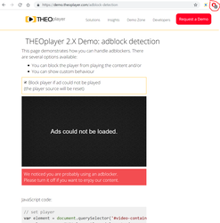

# Adblock detection

The THEOplayer Ads API allows developers to detect adblockers, and react accordingly. 




## SDKs

| Web SDK | Android SDK | iOS SDK | tvOS SDK| Android TV SDK | Chromecast SDK |
| :-----: | :---------: | :-----: | :--: | :------------: | :------------: |
|   Yes   |     N/A     |   N/A   | N/A  |      N/A       |      N/A       |

Adblock detection is typically a challenge in browsers. Hence, SDKs besides the Web SDK are considered 'not applicable'.

## API

Below are some resources on adblock detection through the Ads API:

- API reference: [Ads API](https://docs.portal.theoplayer.com/api-reference/web/theoplayer.ads.md)
- Online demo: [Adblock Detection Demo](https://demo.theoplayer.com/adblock-detection)
- Advertisement guide: [Advertising User Guide](../../knowledge-base/01-advertisement/01-user-guide.md) (mentions adblock detection)

## Code examples

##### Web SDK

The below code snippet uses the `aderror` event to detect ad blockers, and `blockContentIfAdError` to halt playback in-case of an adblocker.

```js
// add an eventlistener to get custom behavior if there is an ad error
player.ads.addEventListener("aderror", function(event) {
  // do something
});

// set the player source with ads and the blockContentIfAdError property
player.source = {
  sources: {
    src:
      "http://amssamples.streaming.mediaservices.windows.net/91492735-c523-432b-ba01-faba6c2206a2/AzureMediaServicesPromo.ism/manifest(format=m3u8-aapl)"
  },
  ads: [
    {
      sources:
        "http://cdn.theoplayer.com/demos/advertisement/livereal-no-skip.xml"
    }
  ],
  // set this to true if you want to block the content
  // default value is false
  blockContentIfAdError: true
};
```

Note that `blockContentIfAdError` only works when you use the default advertisement integration. If you'd use [Google IMA](../../how-to-guides/01-ads/03-how-to-set-up-vast-and-vmap.md) (or any other integration), you'll have to use the `aderror` event to halt playback.
