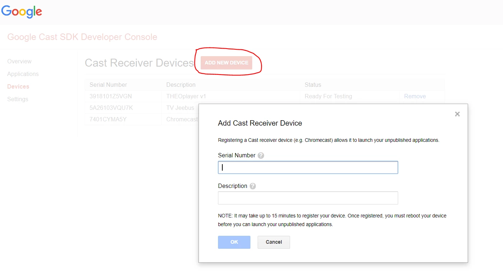
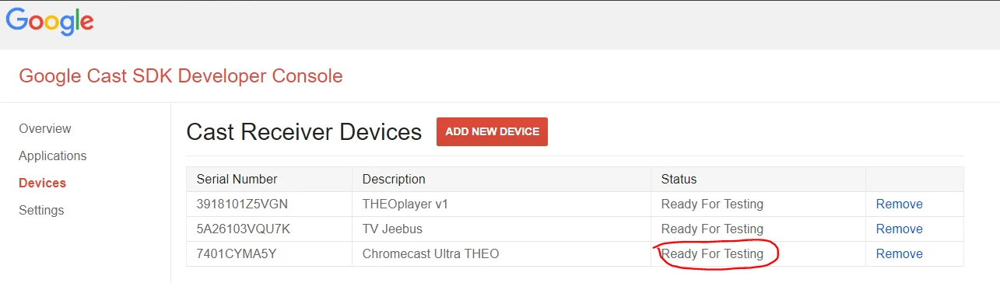
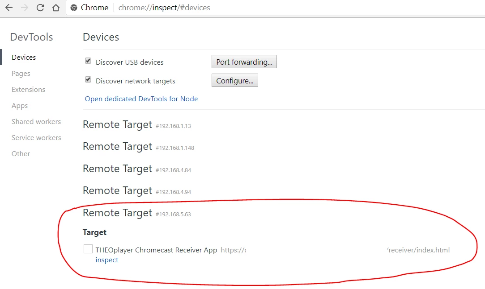
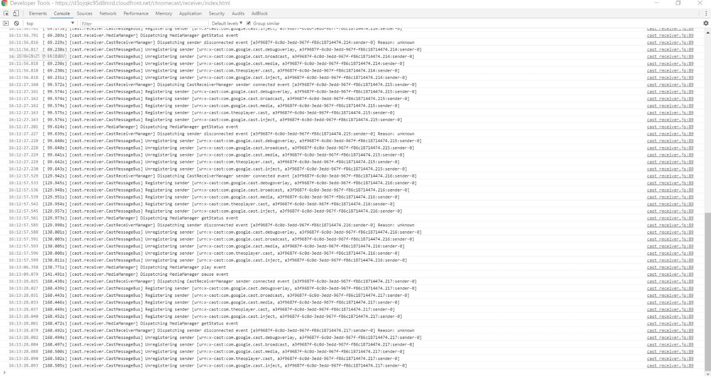

# Debugging

This how-to guide describes how to debug a Chromecast Receiver application using the THEOplayer Web SDK.

## Step-by-step guide

1. Ensure that you are on the same network as your Chromecast device.
2. Publish a new device at [https://cast.google.com/u/1/publish/#/devices](https://cast.google.com/u/1/publish/#/devices) by clicking "ADD NEW DEVICE".

3. Wait until the status is "Ready For Testing".

4. Find out what the IP-address of your Chromecast device is. (Tip: Use the Google Home app to look this up.)
5. Go to chrome://inspect and add the IP-address (plus port 9222) of your Chromecast device.
6. Start your Chromecast session.
7. Go to chrome://inspect and wait until your Chromecast device appears in the list.
8. Press "inspect".

9. You should now have access to the Chrome Developer Tools of your Chromecast Receiver application. If you are familiar with debugging through Chrome's Developer Tools, you can look into issues, try out new CSS styles and monitor network traffic.

<!-- ## Related articles

- 
Page:

[Pass subtitle selection on to Chromecast](/wiki/spaces/THEOSD/pages/1244365085/Pass+subtitle+selection+on+to+Chromecast)

- 
Page:

[Chromecast SDK Setup](/wiki/spaces/THEOSD/pages/325648385/Chromecast+SDK+Setup)

- 
Page:

[How to investigate (or debug) a ticket (or issue)](/wiki/spaces/THEOSD/pages/1193934925)

- 
Page:

[How to configure a different stream to Chromecast](/wiki/spaces/THEOSD/pages/830668924/How+to+configure+a+different+stream+to+Chromecast)

- 
Page:

[Chromecast on my webplayer does not work any longer despite no change in my implementation](/wiki/spaces/THEOSD/pages/1147568148/Chromecast+on+my+webplayer+does+not+work+any+longer+despite+no+change+in+my+implementation)
 -->
