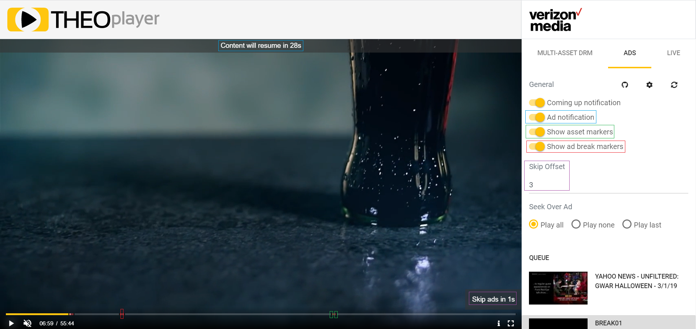

# Introduction

THEOplayer and Verizon Media are partners in the streaming industry. The [Verizon Media Platform](https://www.verizondigitalmedia.com/) offers services like encoding, transcoding, server-side ad-insertion, a CDN and more.

Verizon Media offers services which can enhance the API, UI and UX of video players and applications. The most popular services are called Preplay, Ping and Asset Info. THEOplayer integrates these services so that developers and viewers can benefit from them.

For example,

* Viewers can skip over ads;
* Viewers can see when an ad is playing (and stopping);
* Developers can define the behavior when viewers try to seek over an ad;
* Developers can query metadata to render a playlist in their application.

A live demo of THEOplayer's integration of Verizon Media is available at https://cdn.theoplayer.com/demos/verizon-media/index.html.

For more information on the integration and available APIs, continue your read on the pages below.

- [Preplay](../../../how-to-guides/07-miscellaneous/02-verizon-media/01-preplay.md): this article provides information on how to configure a Verizon Media stream.
- [Configuration](04-configuration.md): this article provides information on which UX and UI features you can configure when setting up a THEOplayer instance.
- [Interface](05-interface.md): this article provides information on the available properties, methods and events developers can leverage related to Verizon Media.
- [Ads](../../../how-to-guides/07-miscellaneous/02-verizon-media/02-ads.md): this article provides information on which APIs can be leveraged to track and enhance the ad-viewing experience.
- [Ping](../../../how-to-guides/07-miscellaneous/02-verizon-media/03-ping.md): this article provides information on how to leverage the Ping service and which THEOplayer APIs you should use.

Sample Git projects are available on the following links:

* Web: https://github.com/THEOplayer/samples-html5-sdk/tree/master/reference-apps/verizon-media-app
* Android: https://github.com/THEOplayer/samples-android-sdk/tree/master/Verizon-Media
* iOS: https://github.com/THEOplayer/samples-ios-sdk/tree/master/Verizon-Media

 