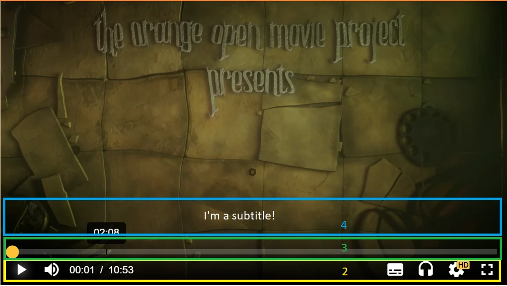
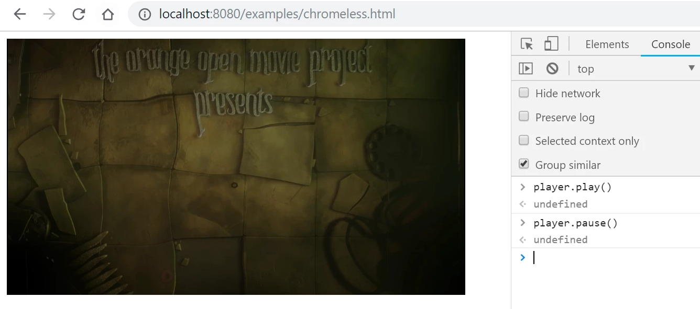
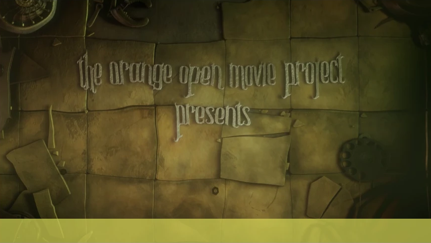
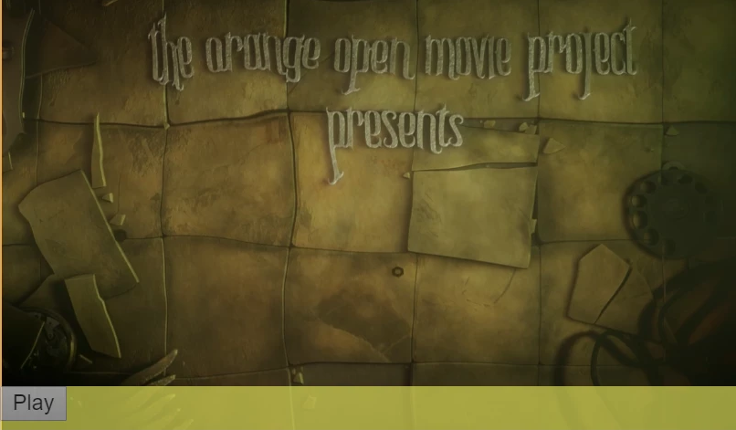
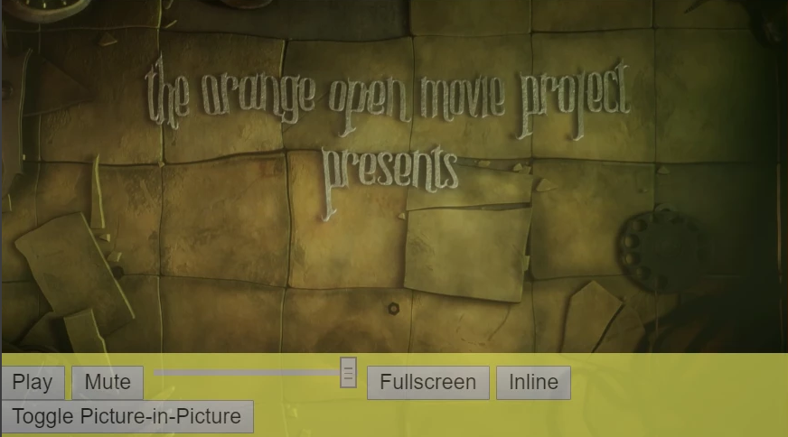
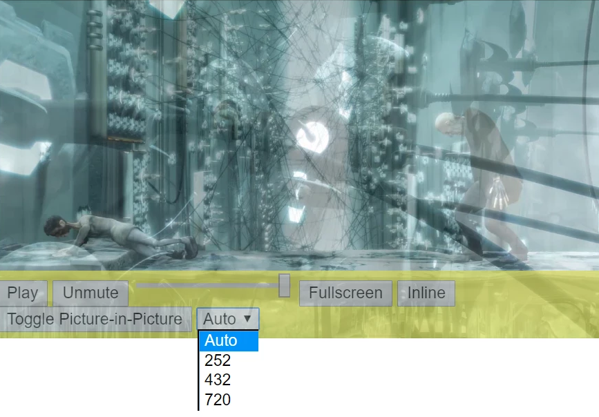
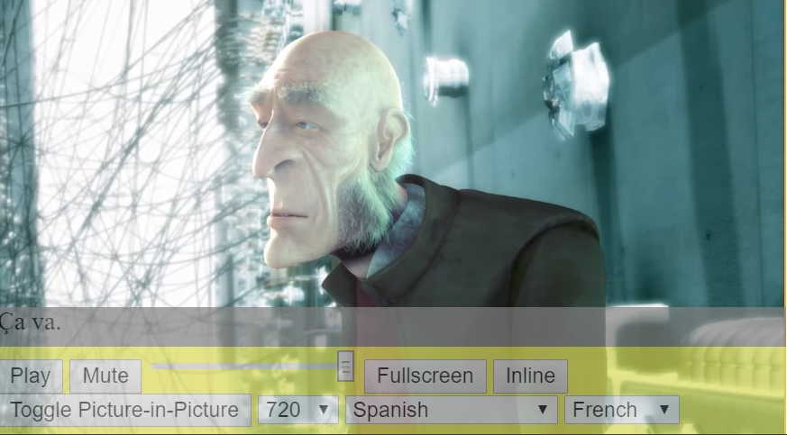

# How to build a Chromeless UI

This guide explains the components of a video player UI and demonstrates how to implement a UI on top a Chromeless THEOplayer.
There's no UI when THEOplayer is Chromeless. The developer built a UI from scratch, and hooks their custom UI into the THEOplayer API.

### Table of Contents
- [Components of a video player UI](#components-of-a-video-player-ui)
- [Video frame](#video-frame)
  - [Relevant APIs](#relevant-apis)
- [Control bar](#control-bar)
  - [Sub-components](#sub-components)
  - [Play / pause button](#play--pause-button)
  - [Volume mute button](#volume-mute-button)
  - [Volume increase slider](#volume-increase-slider)
  - [Fullscreen / inline / picture-in-picture button](#fullscreen--inline--picture-in-picture-button)
  - [Switch-video-quality button](#switch-video-quality-button)
  - [Switch-audio-track button](#switch-audio-track-button)
  - [Switch-subtitle-track button](#switch-subtitle-track-button)
  - [Chromecast button](#chromecast-button)
  - [Airplay button](#airplay-button)
- [Timeline](#timeline)
  - [Sub-components](#sub-components-1)
  - [Playhead position](#playhead-position)
  - [Duration](#duration)
  - [Seekbar](#seekbar)
  - [Buffered blocks](#buffered-blocks)
- [UX Enhancements](#ux-enhancements)
- [Error handling](#error-handling)
- [Sample applications](#sample-applications)
## Components of a video player UI

A video player UI can be split in three main components:

1. Video frame: the frame rendering the actual video content.
2. Control bar: the container containing the buttons to pause/play the video, to switch to fullscreen, to change the volume, and much more.
3. Timeline: the seekbar which can be used to navigate to another position in the timeline. The timeline usually illustrates the video duration and the current playhead position, and parts of the video which have been added to the buffer. The timeline is arguably a sub-component of the control bar, but deserves sufficient attention.

There are also less apparent components:

1. Subtitles: the rendering of the subtitle cues.
2. UX enchancements: a poster image, a loading icon, ... .
3. Error handling: visualizing playback issues to the viewer.



3. Implementing components

This section demonstrates how to implement these 4 components in a Chromeless THEOplayer.

Regardless of which platform (Web, iOS/Xcode, Android, ...) you're targetting, you'll need to hook into the THEOplayer API, so we'll list which APIs are relevant per component.

## Video frame

The video frame is the container (or View) which renders the actual video content. The other two components are often children of this container.

When you initialize a Chromeless THEOplayer instance, you have to pass along the container in which THEOplayer should render the video content.
You should use the native platform techniques to style this container. For example, when doing Browser development, and using our Web SDK, a DOM-element (usually a `<div>`-element) is used as a container. You can use HTML, CSS and JavaScript to do the styling.

The sub-sections below demonstrate how to initialize a Chromeless THEOplayer instance.

##### Web SDK

The snippet below is a starting template.

```html
<!DOCTYPE html>
<html lang="en">
  <head>
    <meta charset="utf-8" />
    <meta
      name="viewport"
      content="width=device-width, initial-scale=1, shrink-to-fit=no"
    />
    <meta http-equiv="x-ua-compatible" content="ie=edge" />
    <title>Chromeless THEOplayer</title>
    <script
      type="text/javascript"
      src="//cdn.theoplayer.com/dash/theoplayer/THEOplayer.js"
    ></script>
    <style>
      .theoplayer-container {
        width: 500px;
        height: 280px;
        background: orange;
        position: relative;
      }
    </style>
  </head>
  <body>
    <div class="theoplayer-container"></div>
    <script type="text/javascript">
      var element = document.querySelector(".theoplayer-container");
      var player = new THEOplayer.ChromelessPlayer(element, {
        libraryLocation: "//cdn.theoplayer.com/dash/theoplayer/"
      });

      player.src = "//cdn.theoplayer.com/video/elephants-dream/playlist.m3u8";
    </script>
  </body>
</html>
```

You could run this on a local web server and open up through [http://localhost.](http://localhost.) The video frame appears as a black container because although the stream has been loaded, there hasn't been a video play request. Calling player.play() in the Console will start the video.



### Relevant APIs

To initialize a Chromeless video player instance and connect it with a container can be achieved with the APIs below.

| Use-case                                    | Web SDK Api                                                                                        | Android SDK Api                                                                                                                                    | iOS SDK API                                                                                                 |
| :------------------------------------------ | :------------------------------------------------------------------------------------------------- | :------------------------------------------------------------------------------------------------------------------------------------------------- | :---------------------------------------------------------------------------------------------------------- |
| Initialize a Chromeless THEOplayer instance | [Player API](https://docs.theoplayer.com/api-reference/web/theoplayer.player.md) (`new THEOplayer.ChromelessPlayer(...)`) | [THEOplayerConfig API](https://cdn.theoplayer.com/doc/android/2.55.1/com/theoplayer/android/api/THEOplayerConfig.Builder.html)`(chromeless(true))` | [THEOplayerConfiguration](https://cdn.theoplayer.com/doc/ios/2.55.1/Classes/THEOplayerConfiguration.html#/) |

## Control bar

The control bar is the container which allows users to play and pause the video, to change the volume, to toggle fullscreen, and much more.

The sub-section below describes how you could create such a component. Later on we will describe how you can put separate user controls (e.g. a "play" component) which hook into the THEOplayer API.

##### Web SDK

The snippet below is an extension of the previous snippet. This snippet adds a controls container at the bottom of your video container.

```html
<!DOCTYPE html>
<html lang="en">
  <head>
    <meta charset="utf-8" />
    <meta
      name="viewport"
      content="width=device-width, initial-scale=1, shrink-to-fit=no"
    />
    <meta http-equiv="x-ua-compatible" content="ie=edge" />
    <title>Chromeless THEOplayer</title>
    <script
      type="text/javascript"
      src="//cdn.theoplayer.com/dash/theoplayer/THEOplayer.js"
    ></script>
    <style>
      .theoplayer-container {
        width: 500px;
        height: 280px;
        background: orange;
        position: relative;
      }
      .controls {
        width: 100%;
        height: 10%;
        position: absolute;
        z-index: 2;
        bottom: 0;
        background: grey;
        opacity: 0.7;
      }
      .control-bar {
        width: 100%;
        height: 100%;
        position: relative;
        background: yellow;
        opacity: 0.7;
      }
    </style>
  </head>
  <body>
    <div class="theoplayer-container">
      <div class="controls">
        <div class="control-bar"></div>
      </div>
    </div>
    <script type="text/javascript">
      var element = document.querySelector(".theoplayer-container");
      var player = new THEOplayer.ChromelessPlayer(element, {
        libraryLocation: "//cdn.theoplayer.com/dash/theoplayer/"
      });

      player.src = "//cdn.theoplayer.com/video/elephants-dream/playlist.m3u8";
    </script>
  </body>
</html>
```

The image below demonstrates the expected result.




As you can notice, there's a yellow container at the bottom which will contain the control bar controls.
You can also subtly observe orange borders on the left and right side of the video frame. This is due to rendering the frame in a 500x280px container, which does not respect the video's aspect ratio of 16:9. THEOplayer will fill the void with the orange background color as expected.

### Sub-components

A control bar usually contains the following sub-components:

| Sub-component                                   | Web SDK API                                                                                                                                          | Android SDK API | iOS SDK API                                                                                                       |
| :---------------------------------------------- | :--------------------------------------------------------------------------------------------------------------------------------------------------- | :-------------- | :---------------------------------------------------------------------------------------------------------------- |
| Play / pause button                             | [Player API](https://docs.theoplayer.com/api-reference/web/theoplayer.player.md) (e.g. `player.play()` / `player.pause()`)                                                  |                 | [Player API](https://cdn.theoplayer.com/doc/ios/2.55.1/Classes/THEOplayer.html)                                   |
| Volume mute button                              | [Player API](https://docs.theoplayer.com/api-reference/web/theoplayer.player.md) (e.g. `player.muted = true`)                                                               |                 | [Player API](https://cdn.theoplayer.com/doc/ios/2.55.1/Classes/THEOplayer.html)                                   |
| Volume increase slider                          | [Player API](https://docs.theoplayer.com/api-reference/web/theoplayer.player.md) (e.g. `player.volume = 0.5`)                                                               |                 | [Player API](https://cdn.theoplayer.com/doc/ios/2.55.1/Classes/THEOplayer.html)                                   |
| Fullscreen / inline / picture-in-picture button | _You need to build it yourself - as would be expected from a Chromeless UI_                                                                          | _Same_          | _Same_                                                                                                            |
| Switch-video-quality button                     | [VideoTrack API](https://docs.theoplayer.com/api-reference/web/theoplayer.mediatrack.md) (e.g. `player.videoTracks[0] .targetQuality = player.videoTracks[0].qualities[0]`) |                 | iOS SDK only supports 'auto' ABR as of 2019-02-18                                                                 |
| Switch-audio-track button                       | [AudioTrack API](https://docs.theoplayer.com/api-reference/web/theoplayer.mediatrack.md) (e.g. `player.audioTracks[0].enabled = true`)                                      |                 | [AudioTrack API](https://cdn.theoplayer.com/doc/ios/2.55.1/THEOplayer%20API.html#/s:13THEOplayerSDK10AudioTrackP) |
| Switch-subtitle-track button                    | [TextTrack API](https://docs.theoplayer.com/api-reference/web/theoplayer.texttrack.md) (e.g. `player.textTracks[0].mode = 'showing'`)                                       |                 | [TextTrack API](https://cdn.theoplayer.com/doc/ios/2.55.1/Protocols/TextTrack.html)                               |
| Chromecast button                               | [Cast API](https://docs.theoplayer.com/api-reference/web/theoplayer.cast.md) (e.g. `player.cast.chromecast.start()`)                                                        |                 | [Chromecast API](https://cdn.theoplayer.com/doc/ios/2.55.1/Protocols/Chromecast.html)                             |
| Airplay button                                  | [Cast API](https://docs.theoplayer.com/api-reference/web/theoplayer.cast.md) (e.g. `player.cast.airplay.start()`)                                                           |                 | _You need to build it yourself_                                                                                   |

### Play / pause button

To add a play / pause button to your UI, you need to hook your on-click (or on-touch or ...) behavior with the THEOplayer API. The THEOplayer API exposes a play() method to initiate playback and a pause() button to halt playback.

If the player is in a PAUSED state you want to show a play button, and when the player is in a PLAYING state you want to show a pause button. The THEOplayer API exposes event listeners to track play and pause events.

##### Web SDK

The snippet below adds a play and pause button to the UI. Only the pause button will be visible if the video is playing, and only the play button will be visible if the video is paused.

```html
<!DOCTYPE html>
<html lang="en">
  <head>
    ...
    <style>
      ... .hidden {
        display: none;
      }
    </style>
  </head>
  <body>
    <div class="theoplayer-container">
      <div class="controls">
        <div class="control-bar">
          <button class="button-play">Play</button>
          <button class="button-pause hidden">Pause</button>
        </div>
      </div>
    </div>
    <script type="text/javascript">
      var element = document.querySelector(".theoplayer-container");
      var player = new THEOplayer.ChromelessPlayer(element, {
        libraryLocation: "//cdn.theoplayer.com/dash/theoplayer/"
      });

      registerControlBarComponents();

      player.src = "//cdn.theoplayer.com/video/elephants-dream/playlist.m3u8";

      function registerControlBarComponents() {
        var buttonPlay = document.querySelector(".button-play"),
          buttonPause = document.querySelector(".button-pause");
        buttonPlay.addEventListener("click", function() {
          player.play();
        });
        buttonPause.addEventListener("click", function() {
          player.pause();
        });
        player.addEventListener("play", function(e) {
          buttonPlay.classList.toggle("hidden");
          buttonPause.classList.toggle("hidden");
        });
        player.addEventListener("pause", function(e) {
          buttonPause.classList.toggle("hidden");
          buttonPlay.classList.toggle("hidden");
        });
      }
    </script>
  </body>
</html>
```

The image below demonstrates the expected result.


### Volume mute button

To add a mute / unmute button to your UI, you need to connect your on-click (or on-touch or ...) behavior with the THEOplayer API. The THEOplayer API exposes a muted property (or method) to (un)mute the player.

If the player is in a MUTED state you want to show a unmute button, and when the player is in a UNMUTED state you want to show a mute button. The THEOplayer API exposes event listeners to track volumechange events.

##### Web SDK

The snippet below adds a mute and unmute button. Only one button is shown, depending whether the player is already muted

```html
<!DOCTYPE html>
<html lang="en">
  <head>
    ...
  </head>
  <body>
    <div class="theoplayer-container">
      <div class="controls">
        <div class="control-bar">
          <button class="button-play">Play</button>
          <button class="button-pause hidden">Pause</button>
          <button class="button-muted">Mute</button>
          <button class="button-unmuted hidden">Unmute</button>
        </div>
      </div>
    </div>
    <script type="text/javascript">
      var element = document.querySelector(".theoplayer-container");
      var player = new THEOplayer.ChromelessPlayer(element, {
        libraryLocation: "//cdn.theoplayer.com/dash/theoplayer/"
      });

      registerControlBarComponents();

      player.src = "//cdn.theoplayer.com/video/elephants-dream/playlist.m3u8";

      function registerControlBarComponents() {
        var buttonPlay = document.querySelector(".button-play"),
          buttonPause = document.querySelector(".button-pause"),
          buttonMuted = document.querySelector(".button-muted"),
          buttonUnmuted = document.querySelector(".button-unmuted");
        buttonPlay.addEventListener("click", function() {
          player.play();
        });
        buttonPause.addEventListener("click", function() {
          player.pause();
        });
        buttonMuted.addEventListener("click", function() {
          player.muted = true;
        });
        buttonUnmuted.addEventListener("click", function() {
          player.muted = false;
        });
        player.addEventListener("play", function(e) {
          buttonPlay.classList.toggle("hidden");
          buttonPause.classList.toggle("hidden");
        });
        player.addEventListener("pause", function(e) {
          buttonPause.classList.toggle("hidden");
          buttonPlay.classList.toggle("hidden");
        });
        player.addEventListener("volumechange", function(e) {
          buttonMuted.classList.toggle("hidden");
          buttonUnmuted.classList.toggle("hidden");
        });
      }
    </script>
  </body>
</html>
```

The image blow demonstrates the expected result.

### Volume increase slider

To add a volume slider to your UI, you need to connect your on-click (or on-touch or ...) behavior with the THEOplayer API. The THEOplayer API exposes a volume property (or method) to adjust the player volume.

##### Web SDK

The snippet below implements a slider which allows the user to change the volume levle.

```html
<!DOCTYPE html>
<html lang="en">
  <head>
    ...
  </head>
  <body>
    <div class="theoplayer-container">
      <div class="controls">
        <div class="control-bar">
          <button class="button-play">Play</button>
          <button class="button-pause hidden">Pause</button>
          <button class="button-muted">Mute</button>
          <button class="button-unmuted hidden">Unmute</button>
        </div>
      </div>
    </div>
    <script type="text/javascript">
      ...

      function registerControlBarComponents() {
          var buttonPlay = document.querySelector('.button-play'),
              buttonPause = document.querySelector('.button-pause'),
              buttonMuted = document.querySelector('.button-muted'),
              buttonUnmuted = document.querySelector('.button-unmuted'),
              sliderVolume = document.querySelector('.slider-volume');
          ...
          buttonUnmuted.addEventListener('click', function () {
              player.muted = false;
          });
          sliderVolume.addEventListener('input', function (e) {
              player.volume = e.target.value;
          });
          player.addEventListener('play', function(e) {
              buttonPlay.classList.toggle('hidden');
              buttonPause.classList.toggle('hidden');
          });
          player.addEventListener('pause', function(e) {
              buttonPause.classList.toggle('hidden');
              buttonPlay.classList.toggle('hidden');
          });
          var wasPreviouslyMuted = false;
          player.addEventListener('volumechange', function(e) {
              if (player.muted != wasPreviouslyMuted) {
                  wasPreviouslyMuted = player.muted;
                  buttonMuted.classList.toggle('hidden');
                  buttonUnmuted.classList.toggle('hidden');
              }
          });
      }
    </script>
  </body>
</html>
```

### Fullscreen / inline / picture-in-picture button

To add a fullscreen / inline / picture-in-picture button to your UI, you need to connect your on-click (or on-touch or ...) behavior with the platform-native API. (THEOplayer's Presentation API is naturally not available in Chromeless mode.)

If the player is in a INLINE state you want to show a fullscreen button, and when the player is in a FULLSCREEN state you want to show a inline button.

##### Web SDK

The snippet below implements three buttons which allows you to switch between presentation states. The presentation state changes are triggered through platform-native APIs.

```html
<!DOCTYPE html>
<html lang="en">
  <head>
    ...
  </head>
  <body>
    <div class="theoplayer-container">
      <div class="controls">
        <div class="control-bar">
          <button class="button-play">Play</button>
          <button class="button-pause hidden">Pause</button>
          <button class="button-muted">Mute</button>
          <button class="button-unmuted hidden">Unmute</button>
          <input
            class="slider-volume"
            type="range"
            min="0"
            max="1"
            step="0.01"
            value="1"
          />
          <button class="button-fullscreen">Fullscreen</button>
          <button class="button-inline">Inline</button>
          <button class="button-picture-in-picture">
            Toggle Picture-in-Picture
          </button>
        </div>
      </div>
    </div>
    <script type="text/javascript">
      ...

      function registerControlBarComponents() {
          var buttonPlay = document.querySelector('.button-play'),
              buttonPause = document.querySelector('.button-pause'),
              buttonMuted = document.querySelector('.button-muted'),
              buttonUnmuted = document.querySelector('.button-unmuted'),
              sliderVolume = document.querySelector('.slider-volume'),
              buttonFullscreen = document.querySelector('.button-fullscreen'),
              buttonInline = document.querySelector('.button-inline'),
              buttonPictureInPicture = document.querySelector('.button-picture-in-picture');
          buttonPlay.addEventListener('click', function() {
              player.play();
          });
          buttonPause.addEventListener('click', function() {
              player.pause();
          });
          buttonMuted.addEventListener('click', function () {
              player.muted = true;
          });
          buttonUnmuted.addEventListener('click', function () {
              player.muted = false;
          });
          sliderVolume.addEventListener('input', function (e) {
              player.volume = e.target.value;
          });
          buttonFullscreen.addEventListener('click', function () {
              openFullscreen();
          });
          buttonInline.addEventListener('click', function () {
              closeFullscreen();
          });
          var video = element.querySelectorAll('video')[1],
              isPictureInPictureEnabled = false;
          buttonPictureInPicture.addEventListener('click', function () {
              if (!isPictureInPictureEnabled) {
                  video.requestPictureInPicture();
              } else {
                  document.exitPictureInPicture();
              }
          });
          video.addEventListener('enterpictureinpicture', function() {
              isPictureInPictureEnabled = true;
          });

          video.addEventListener('leavepictureinpicture', function() {
              isPictureInPictureEnabled = false;
          });
          player.addEventListener('play', function(e) {
              buttonPlay.classList.toggle('hidden');
              buttonPause.classList.toggle('hidden');
          });
          player.addEventListener('pause', function(e) {
              buttonPause.classList.toggle('hidden');
              buttonPlay.classList.toggle('hidden');
          });
          var wasPreviouslyMuted = false;
          player.addEventListener('volumechange', function(e) {
              if (player.muted != wasPreviouslyMuted) {
                  wasPreviouslyMuted = player.muted;
                  buttonMuted.classList.toggle('hidden');
                  buttonUnmuted.classList.toggle('hidden');
              }
          });
          function openFullscreen() {
              if (element.requestFullscreen) {
                  element.requestFullscreen();
              } else if (element.mozRequestFullScreen) { /* Firefox */
                  element.mozRequestFullScreen();
              } else if (element.webkitRequestFullscreen) { /* Chrome, Safari and Opera */
                  element.webkitRequestFullscreen();
              } else if (element.msRequestFullscreen) { /* IE/Edge */
                  element.msRequestFullscreen();
              }
          }
          function closeFullscreen() {
              if (document.exitFullscreen) {
                  document.exitFullscreen();
              } else if (document.mozCancelFullScreen) { /* Firefox */
                  document.mozCancelFullScreen();
              } else if (document.webkitExitFullscreen) { /* Chrome, Safari and Opera */
                  document.webkitExitFullscreen();
              } else if (document.msExitFullscreen) { /* IE/Edge */
                  document.msExitFullscreen();
              }
          }
      }
    </script>
  </body>
</html>
```

The image below demonstrates the expected result.




### Switch-video-quality button

To add a switch-video-quality dropdown to your UI, you need to connect your on-change behavior with the THEOplayer VideoTrack API. The VideoTrack API exposes a targetQuality property (or method) to change the video quality.

The VideoTrack API exposes event handlers which allows you to identify the qualities present in the stream.

##### Web SDK

The snippet below adds a select-element which allows users to switch between qualities. Additionally, it uses event listeners to identify the available qualities and renders them in the UI.

```html
<!DOCTYPE html>
<html lang="en">
  <head>
    <meta charset="utf-8" />
    <meta
      name="viewport"
      content="width=device-width, initial-scale=1, shrink-to-fit=no"
    />
    <meta http-equiv="x-ua-compatible" content="ie=edge" />
    <title>Chromeless THEOplayer</title>
    <script
      type="text/javascript"
      src="//cdn.theoplayer.com/dash/theoplayer/THEOplayer.js"
    ></script>
    <style>
      .theoplayer-container {
        width: 500px;
        height: 280px;
        background: orange;
        position: relative;
      }
      .controls {
        width: 100%;
        height: 20%;
        position: absolute;
        z-index: 2;
        bottom: 0;
        background: grey;
        opacity: 0.7;
      }
      .control-bar {
        width: 100%;
        height: 100%;
        position: relative;
        background: yellow;
        opacity: 0.7;
      }
      .hidden {
        display: none;
      }
    </style>
  </head>
  <body>
    <div class="theoplayer-container">
      <div class="controls">
        <div class="control-bar">
          <button class="button-play">Play</button>
          <button class="button-pause hidden">Pause</button>
          <button class="button-muted">Mute</button>
          <button class="button-unmuted hidden">Unmute</button>
          <input
            class="slider-volume"
            type="range"
            min="0"
            max="1"
            step="0.01"
            value="1"
          />
          <button class="button-fullscreen">Fullscreen</button>
          <button class="button-inline">Inline</button>
          <button class="button-picture-in-picture">
            Toggle Picture-in-Picture
          </button>
          <select class="select-video-qualities"
            ><option value="">Auto</option></select
          >
        </div>
      </div>
    </div>
    <script type="text/javascript">
      var element = document.querySelector(".theoplayer-container");
      var player = new THEOplayer.ChromelessPlayer(element, {
        libraryLocation: "//cdn.theoplayer.com/dash/theoplayer/"
      });

      registerControlBarComponents();

      player.src = "//cdn.theoplayer.com/video/elephants-dream/playlist.m3u8";

      function registerControlBarComponents() {
        /**
         * Play, Pause, Muted, Unmuted, Volume, Fullscreen, Inline, Picture-in-Picture
         * */
        var buttonPlay = document.querySelector(".button-play"),
          buttonPause = document.querySelector(".button-pause"),
          buttonMuted = document.querySelector(".button-muted"),
          buttonUnmuted = document.querySelector(".button-unmuted"),
          sliderVolume = document.querySelector(".slider-volume"),
          buttonFullscreen = document.querySelector(".button-fullscreen"),
          buttonInline = document.querySelector(".button-inline"),
          buttonPictureInPicture = document.querySelector(
            ".button-picture-in-picture"
          );
        buttonPlay.addEventListener("click", function() {
          player.play();
        });
        buttonPause.addEventListener("click", function() {
          player.pause();
        });
        buttonMuted.addEventListener("click", function() {
          player.muted = true;
        });
        buttonUnmuted.addEventListener("click", function() {
          player.muted = false;
        });
        sliderVolume.addEventListener("input", function(e) {
          player.volume = e.target.value;
        });
        buttonFullscreen.addEventListener("click", function() {
          openFullscreen();
        });
        buttonInline.addEventListener("click", function() {
          closeFullscreen();
        });
        var video = element.querySelectorAll("video")[1],
          isPictureInPictureEnabled = false;
        buttonPictureInPicture.addEventListener("click", function() {
          if (!isPictureInPictureEnabled) {
            video.requestPictureInPicture();
          } else {
            document.exitPictureInPicture();
          }
        });
        video.addEventListener("enterpictureinpicture", function() {
          isPictureInPictureEnabled = true;
        });

        video.addEventListener("leavepictureinpicture", function() {
          isPictureInPictureEnabled = false;
        });
        player.addEventListener("play", function(e) {
          buttonPlay.classList.toggle("hidden");
          buttonPause.classList.toggle("hidden");
        });
        player.addEventListener("pause", function(e) {
          buttonPause.classList.toggle("hidden");
          buttonPlay.classList.toggle("hidden");
        });
        var wasPreviouslyMuted = false;
        player.addEventListener("volumechange", function(e) {
          if (player.muted != wasPreviouslyMuted) {
            wasPreviouslyMuted = player.muted;
            buttonMuted.classList.toggle("hidden");
            buttonUnmuted.classList.toggle("hidden");
          }
        });
        function openFullscreen() {
          if (element.requestFullscreen) {
            element.requestFullscreen();
          } else if (element.mozRequestFullScreen) {
            /* Firefox */
            element.mozRequestFullScreen();
          } else if (element.webkitRequestFullscreen) {
            /* Chrome, Safari and Opera */
            element.webkitRequestFullscreen();
          } else if (element.msRequestFullscreen) {
            /* IE/Edge */
            element.msRequestFullscreen();
          }
        }
        function closeFullscreen() {
          if (document.exitFullscreen) {
            document.exitFullscreen();
          } else if (document.mozCancelFullScreen) {
            /* Firefox */
            document.mozCancelFullScreen();
          } else if (document.webkitExitFullscreen) {
            /* Chrome, Safari and Opera */
            document.webkitExitFullscreen();
          } else if (document.msExitFullscreen) {
            /* IE/Edge */
            document.msExitFullscreen();
          }
        }

        /**
         * Video quality
         */
        var selectVideoQualities = document.querySelector(
          ".select-video-qualities"
        );
        selectVideoQualities.addEventListener("change", function() {
          var value = selectVideoQualities.value;
          if (value == "") {
            player.videoTracks[0].targetQuality = null;
          } else {
            player.videoTracks[0].targetQuality =
              player.videoTracks[0].qualities[value];
          }
        });
        player.videoTracks.addEventListener("addtrack", function(e) {
          e.track.qualities.forEach(function(quality, index) {
            var option = document.createElement("option");
            option.value = index;
            option.innerText = quality.height;
            selectVideoQualities.appendChild(option);
          });
        });
      }
    </script>
  </body>
</html>
```

The image below demonstrates the expected result.




### Switch-audio-track button

To add a switch-audio-track dropdown to your UI, you need to connect your on-change behavior with the THEOplayer AudioTrack API. The AudioTrack API exposes an `enabled` property (or method) to change the video quality.

The TextTrack API exposes event handlers which allows you to identify the audio tracks present in the stream.

##### Web SDK

The snippet below adds a select-element which allows users to switch between audio tracks. Additionally, it uses event listeners to identify the available audio tracks and renders them in the UI.

```html
<!DOCTYPE html>
<html lang="en">
  <head>
    <meta charset="utf-8" />
    <meta
      name="viewport"
      content="width=device-width, initial-scale=1, shrink-to-fit=no"
    />
    <meta http-equiv="x-ua-compatible" content="ie=edge" />
    <title>Chromeless THEOplayer</title>
    <script
      type="text/javascript"
      src="//cdn.theoplayer.com/dash/theoplayer/THEOplayer.js"
    ></script>
    <style>
      .theoplayer-container {
        width: 500px;
        height: 280px;
        background: orange;
        position: relative;
      }
      .controls {
        width: 100%;
        height: 30%;
        position: absolute;
        z-index: 2;
        bottom: 0;
        background: grey;
        opacity: 0.7;
      }
      .control-bar {
        width: 100%;
        height: 70%;
        position: relative;
        background: yellow;
        opacity: 0.7;
      }
      .subtitles-container {
        height: 30%;
        width: 100%;
        background: grey;
      }
      .hidden {
        display: none;
      }
    </style>
  </head>
  <body>
    <div class="theoplayer-container">
      <div class="controls">
        <div class="subtitles-container"></div>
        <div class="control-bar">
          <button class="button-play">Play</button>
          <button class="button-pause hidden">Pause</button>
          <button class="button-muted">Mute</button>
          <button class="button-unmuted hidden">Unmute</button>
          <input
            class="slider-volume"
            type="range"
            min="0"
            max="1"
            step="0.01"
            value="1"
          />
          <button class="button-fullscreen">Fullscreen</button>
          <button class="button-inline">Inline</button>
          <button class="button-picture-in-picture">
            Toggle Picture-in-Picture
          </button>
          <select class="select-video-qualities"
            ><option value="">Auto</option></select
          >
          <select class="select-audio-track"
            ><option value="">Default</option></select
          >
          <select class="select-subtitle-track"
            ><option value="">Off</option></select
          >
        </div>
      </div>
    </div>
    <script type="text/javascript">
      var element = document.querySelector(".theoplayer-container");
      var player = new THEOplayer.ChromelessPlayer(element, {
        libraryLocation: "//cdn.theoplayer.com/dash/theoplayer/"
      });

      registerControlBarComponents();

      player.src = "//cdn.theoplayer.com/video/elephants-dream/playlist.m3u8";

      function registerControlBarComponents() {
        /**
         * Play, Pause, Muted, Unmuted, Volume, Fullscreen, Inline, Picture-in-Picture
         * */
        var buttonPlay = document.querySelector(".button-play"),
          buttonPause = document.querySelector(".button-pause"),
          buttonMuted = document.querySelector(".button-muted"),
          buttonUnmuted = document.querySelector(".button-unmuted"),
          sliderVolume = document.querySelector(".slider-volume"),
          buttonFullscreen = document.querySelector(".button-fullscreen"),
          buttonInline = document.querySelector(".button-inline"),
          buttonPictureInPicture = document.querySelector(
            ".button-picture-in-picture"
          );
        buttonPlay.addEventListener("click", function() {
          player.play();
        });
        buttonPause.addEventListener("click", function() {
          player.pause();
        });
        buttonMuted.addEventListener("click", function() {
          player.muted = true;
        });
        buttonUnmuted.addEventListener("click", function() {
          player.muted = false;
        });
        sliderVolume.addEventListener("input", function(e) {
          player.volume = e.target.value;
        });
        buttonFullscreen.addEventListener("click", function() {
          openFullscreen();
        });
        buttonInline.addEventListener("click", function() {
          closeFullscreen();
        });
        var video = element.querySelectorAll("video")[1],
          isPictureInPictureEnabled = false;
        buttonPictureInPicture.addEventListener("click", function() {
          if (!isPictureInPictureEnabled) {
            video.requestPictureInPicture();
          } else {
            document.exitPictureInPicture();
          }
        });
        video.addEventListener("enterpictureinpicture", function() {
          isPictureInPictureEnabled = true;
        });

        video.addEventListener("leavepictureinpicture", function() {
          isPictureInPictureEnabled = false;
        });
        player.addEventListener("play", function(e) {
          buttonPlay.classList.toggle("hidden");
          buttonPause.classList.toggle("hidden");
        });
        player.addEventListener("pause", function(e) {
          buttonPause.classList.toggle("hidden");
          buttonPlay.classList.toggle("hidden");
        });
        var wasPreviouslyMuted = false;
        player.addEventListener("volumechange", function(e) {
          if (player.muted != wasPreviouslyMuted) {
            wasPreviouslyMuted = player.muted;
            buttonMuted.classList.toggle("hidden");
            buttonUnmuted.classList.toggle("hidden");
          }
        });
        function openFullscreen() {
          if (element.requestFullscreen) {
            element.requestFullscreen();
          } else if (element.mozRequestFullScreen) {
            /* Firefox */
            element.mozRequestFullScreen();
          } else if (element.webkitRequestFullscreen) {
            /* Chrome, Safari and Opera */
            element.webkitRequestFullscreen();
          } else if (element.msRequestFullscreen) {
            /* IE/Edge */
            element.msRequestFullscreen();
          }
        }
        function closeFullscreen() {
          if (document.exitFullscreen) {
            document.exitFullscreen();
          } else if (document.mozCancelFullScreen) {
            /* Firefox */
            document.mozCancelFullScreen();
          } else if (document.webkitExitFullscreen) {
            /* Chrome, Safari and Opera */
            document.webkitExitFullscreen();
          } else if (document.msExitFullscreen) {
            /* IE/Edge */
            document.msExitFullscreen();
          }
        }

        /**
         * Video quality
         */
        var selectVideoQualities = document.querySelector(
          ".select-video-qualities"
        );
        selectVideoQualities.addEventListener("change", function() {
          var value = selectVideoQualities.value;
          if (value == "") {
            player.videoTracks[0].targetQuality = null;
          } else {
            player.videoTracks[0].targetQuality =
              player.videoTracks[0].qualities[value];
          }
        });
        player.videoTracks.addEventListener("addtrack", function(e) {
          e.track.qualities.forEach(function(quality, index) {
            var option = document.createElement("option");
            option.value = index;
            option.innerText = quality.height;
            selectVideoQualities.appendChild(option);
          });
        });

        /**
         * Audio quality
         */
        var selectAudioTrack = document.querySelector(".select-audio-track"),
          defaultAudioTrack;
        selectAudioTrack.addEventListener("change", function() {
          var value = selectAudioTrack.value;
          player.audioTracks.forEach(function(track) {
            track.enabled = false;
          });
          if (value == "") {
            player.audioTracks[0].enabled = true;
          } else {
            player.audioTracks[value].enabled = true;
          }
        });
        player.audioTracks.addEventListener("addtrack", function(e) {
          var option = document.createElement("option");
          option.value = player.audioTracks.indexOf(e.track);
          option.innerText = e.track.label;
          selectAudioTrack.appendChild(option);
          if (e.track.enabled) {
            defaultAudioTrack = option.value;
          }
        });
      }
    </script>
  </body>
</html>
```

### Switch-subtitle-track button

To add a switch-video-quality dropdown to your UI, you need to connect your on-change behavior with the THEOplayer VideoTrack API. The VideoTrack API exposes a targetQuality property (or method) to change the video quality.

The VideoTrack API exposes event handlers which allows you to identify the qualities present in the stream.

##### Web SDK

The snippet below adds a select-element which allows users to switch between subtitle tracks, but also to disable them. Additionally, it uses event listeners to identify the available subtitle tracks and renders them in the UI.

```html
<!DOCTYPE html>
<html lang="en">
  <head>
    <meta charset="utf-8" />
    <meta
      name="viewport"
      content="width=device-width, initial-scale=1, shrink-to-fit=no"
    />
    <meta http-equiv="x-ua-compatible" content="ie=edge" />
    <title>Chromeless THEOplayer</title>
    <script
      type="text/javascript"
      src="//cdn.theoplayer.com/dash/theoplayer/THEOplayer.js"
    ></script>
    <style>
      .theoplayer-container {
        width: 500px;
        height: 280px;
        background: orange;
        position: relative;
      }
      .controls {
        width: 100%;
        height: 30%;
        position: absolute;
        z-index: 2;
        bottom: 0;
        background: grey;
        opacity: 0.7;
      }
      .control-bar {
        width: 100%;
        height: 70%;
        position: relative;
        background: yellow;
        opacity: 0.7;
      }
      .subtitles-container {
        height: 30%;
        width: 100%;
        background: grey;
      }
      .hidden {
        display: none;
      }
      .theoplayer-container .theoplayer-texttracks {
        display: none !important;
      }
    </style>
  </head>
  <body>
    <div class="theoplayer-container">
      <div class="controls">
        <div class="subtitles-container"></div>
        <div class="control-bar">
          <button class="button-play">Play</button>
          <button class="button-pause hidden">Pause</button>
          <button class="button-muted">Mute</button>
          <button class="button-unmuted hidden">Unmute</button>
          <input
            class="slider-volume"
            type="range"
            min="0"
            max="1"
            step="0.01"
            value="1"
          />
          <button class="button-fullscreen">Fullscreen</button>
          <button class="button-inline">Inline</button>
          <button class="button-picture-in-picture">
            Toggle Picture-in-Picture
          </button>
          <select class="select-video-qualities"
            ><option value="">Auto</option></select
          >
          <select class="select-audio-track"
            ><option value="">Default</option></select
          >
          <select class="select-subtitle-track"
            ><option value="">Off</option></select
          >
        </div>
      </div>
    </div>
    <script type="text/javascript">
      var element = document.querySelector(".theoplayer-container");
      var player = new THEOplayer.ChromelessPlayer(element, {
        libraryLocation: "//cdn.theoplayer.com/dash/theoplayer/"
      });

      registerControlBarComponents();

      player.src = "//cdn.theoplayer.com/video/elephants-dream/playlist.m3u8";

      function registerControlBarComponents() {
        /**
         * Play, Pause, Muted, Unmuted, Volume, Fullscreen, Inline, Picture-in-Picture
         * */
        var buttonPlay = document.querySelector(".button-play"),
          buttonPause = document.querySelector(".button-pause"),
          buttonMuted = document.querySelector(".button-muted"),
          buttonUnmuted = document.querySelector(".button-unmuted"),
          sliderVolume = document.querySelector(".slider-volume"),
          buttonFullscreen = document.querySelector(".button-fullscreen"),
          buttonInline = document.querySelector(".button-inline"),
          buttonPictureInPicture = document.querySelector(
            ".button-picture-in-picture"
          );
        buttonPlay.addEventListener("click", function() {
          player.play();
        });
        buttonPause.addEventListener("click", function() {
          player.pause();
        });
        buttonMuted.addEventListener("click", function() {
          player.muted = true;
        });
        buttonUnmuted.addEventListener("click", function() {
          player.muted = false;
        });
        sliderVolume.addEventListener("input", function(e) {
          player.volume = e.target.value;
        });
        buttonFullscreen.addEventListener("click", function() {
          openFullscreen();
        });
        buttonInline.addEventListener("click", function() {
          closeFullscreen();
        });
        var video = element.querySelectorAll("video")[1],
          isPictureInPictureEnabled = false;
        buttonPictureInPicture.addEventListener("click", function() {
          if (!isPictureInPictureEnabled) {
            video.requestPictureInPicture();
          } else {
            document.exitPictureInPicture();
          }
        });
        video.addEventListener("enterpictureinpicture", function() {
          isPictureInPictureEnabled = true;
        });

        video.addEventListener("leavepictureinpicture", function() {
          isPictureInPictureEnabled = false;
        });
        player.addEventListener("play", function(e) {
          buttonPlay.classList.toggle("hidden");
          buttonPause.classList.toggle("hidden");
        });
        player.addEventListener("pause", function(e) {
          buttonPause.classList.toggle("hidden");
          buttonPlay.classList.toggle("hidden");
        });
        var wasPreviouslyMuted = false;
        player.addEventListener("volumechange", function(e) {
          if (player.muted != wasPreviouslyMuted) {
            wasPreviouslyMuted = player.muted;
            buttonMuted.classList.toggle("hidden");
            buttonUnmuted.classList.toggle("hidden");
          }
        });
        function openFullscreen() {
          if (element.requestFullscreen) {
            element.requestFullscreen();
          } else if (element.mozRequestFullScreen) {
            /* Firefox */
            element.mozRequestFullScreen();
          } else if (element.webkitRequestFullscreen) {
            /* Chrome, Safari and Opera */
            element.webkitRequestFullscreen();
          } else if (element.msRequestFullscreen) {
            /* IE/Edge */
            element.msRequestFullscreen();
          }
        }
        function closeFullscreen() {
          if (document.exitFullscreen) {
            document.exitFullscreen();
          } else if (document.mozCancelFullScreen) {
            /* Firefox */
            document.mozCancelFullScreen();
          } else if (document.webkitExitFullscreen) {
            /* Chrome, Safari and Opera */
            document.webkitExitFullscreen();
          } else if (document.msExitFullscreen) {
            /* IE/Edge */
            document.msExitFullscreen();
          }
        }

        /**
         * Video quality
         */
        var selectVideoQualities = document.querySelector(
          ".select-video-qualities"
        );
        selectVideoQualities.addEventListener("change", function() {
          var value = selectVideoQualities.value;
          if (value == "") {
            player.videoTracks[0].targetQuality = null;
          } else {
            player.videoTracks[0].targetQuality =
              player.videoTracks[0].qualities[value];
          }
        });
        player.videoTracks.addEventListener("addtrack", function(e) {
          e.track.qualities.forEach(function(quality, index) {
            var option = document.createElement("option");
            option.value = index;
            option.innerText = quality.height;
            selectVideoQualities.appendChild(option);
          });
        });

        /**
         * Audio quality
         */
        var selectAudioTrack = document.querySelector(".select-audio-track"),
          defaultAudioTrack;
        selectAudioTrack.addEventListener("change", function() {
          var value = selectAudioTrack.value;
          player.audioTracks.forEach(function(track) {
            track.enabled = false;
          });
          if (value == "") {
            player.audioTracks[0].enabled = true;
          } else {
            player.audioTracks[value].enabled = true;
          }
        });
        player.audioTracks.addEventListener("addtrack", function(e) {
          var option = document.createElement("option");
          option.value = player.audioTracks.indexOf(e.track);
          option.innerText = e.track.label;
          selectAudioTrack.appendChild(option);
          if (e.track.enabled) {
            defaultAudioTrack = option.value;
          }
        });

        /**
         * Subtitle track
         */
        var selectSubtitleTrack = document.querySelector(
            ".select-subtitle-track"
          ),
          subtitlesContainer = document.querySelector(".subtitles-container");
        selectSubtitleTrack.addEventListener("change", function() {
          var value = selectSubtitleTrack.value;
          player.textTracks.forEach(function(track) {
            track.mode = "disabled";
          });
          if (value == "") {
          } else {
            player.textTracks[value].mode = "showing";
          }
        });
        player.textTracks.addEventListener("addtrack", function(e) {
          var option = document.createElement("option");
          option.value = player.textTracks.indexOf(e.track);
          option.innerText = e.track.label;
          selectSubtitleTrack.appendChild(option);

          e.track.addEventListener("addcue", function(e1) {
            e1.cue.addEventListener("enter", function(e2) {
              subtitlesContainer.innerText = e2.cue.content;
            });
            e1.cue.addEventListener("exit", function(e2) {
              subtitlesContainer.innerText = "";
            });
          });
        });
      }
    </script>
  </body>
</html>
```

The image below demonstrates the expected result.




### Chromecast button

_In progress ..._

##### Web SDK

### Airplay button

_In progress ..._

##### Web SDK

## Timeline

The timeline consists of a set of controls which allow you to interpret and manipulate the playhead position of the video.

### Sub-components

A timeline usually contains the following sub-components:

|                                                                                       | Web SDK API                                                                                           | Android SDK API | iOS SDK API                                                                     |
| :------------------------------------------------------------------------------------ | :---------------------------------------------------------------------------------------------------- | :-------------- | :------------------------------------------------------------------------------ |
| Playhead position: the current time in the timeline.                                  | [Player API](https://docs.theoplayer.com/api-reference/web/theoplayer.player.md)(e.g.`player.currentTime`)                   |                 | [Player API](https://cdn.theoplayer.com/doc/ios/2.55.1/Classes/THEOplayer.html) |
| Duration: the duration of the stream.                                                 | [Player API](https://docs.theoplayer.com/api-reference/web/theoplayer.player.md)(e.g.`player.duration`)                      |                 | [Player API](https://cdn.theoplayer.com/doc/ios/2.55.1/Classes/THEOplayer.html) |
| Seekbar: allows you to change the playhead position.                                  | [Player API](https://docs.theoplayer.com/api-reference/web/theoplayer.player.md)(e.g.`player.currentTime`/`player.duration`) |                 | [Player API](https://cdn.theoplayer.com/doc/ios/2.55.1/Classes/THEOplayer.html) |
| Buffered blocks: shows you which parts of the timeline have been added to the buffer. | [Player API](https://docs.theoplayer.com/api-reference/web/theoplayer.player.md)(e.g.`player.buffered`)                      |                 | [Player API](https://cdn.theoplayer.com/doc/ios/2.55.1/Classes/THEOplayer.html) |

### Playhead position

The current playhead position can be requested through the THEOplayer Player API. The Player API exposes a currentTime property (or method) to request the current playhead position.

The playhead position is always changing duration playback (or when seeking to a new playhead position). The Player API exposes a `timeupdate` event listener which is being dispatched periodically during playback, and is appropriate to update the playhead position field.

##### Web SDK

A timeline-container has been added to the DOM through HTML, as well as a placeholder for the playhead position. We update this placeholder value in every callback of the `timeupdate` event through `player.currentTime`. We also add some CSS.

```html
<!DOCTYPE html>
<html lang="en">
  <head>
    <meta charset="utf-8" />
    <meta
      name="viewport"
      content="width=device-width, initial-scale=1, shrink-to-fit=no"
    />
    <meta http-equiv="x-ua-compatible" content="ie=edge" />
    <title>Chromeless THEOplayer</title>
    <script
      type="text/javascript"
      src="//cdn.theoplayer.com/dash/theoplayer/THEOplayer.js"
    ></script>
    <style>
      .theoplayer-container {
        width: 500px;
        height: 280px;
        background: orange;
        position: relative;
      }
      .controls {
        width: 100%;
        height: 50%;
        position: absolute;
        z-index: 2;
        bottom: 0;
        background: grey;
        opacity: 0.7;
      }
      .control-bar {
        width: 100%;
        height: 40%;
        position: relative;
        background: yellow;
        opacity: 0.7;
      }
      .subtitles-container {
        height: 30%;
        width: 100%;
        background: grey;
      }
      .timeline-container {
        height: 30%;
        width: 100%;
        background: green;
      }
      .playhead-position {
        display: inline-block;
        width: 10%;
      }
      .hidden {
        display: none;
      }
      .theoplayer-container .theoplayer-texttracks {
        display: none !important;
      }
    </style>
  </head>
  <body>
    <div class="theoplayer-container">
      <div class="controls">
        <div class="subtitles-container"></div>
        <div class="timeline-container">
          <div class="playhead-position">0</div>
        </div>
        <div class="control-bar">
          <button class="button-play">Play</button>
          <button class="button-pause hidden">Pause</button>
          <button class="button-muted">Mute</button>
          <button class="button-unmuted hidden">Unmute</button>
          <input
            class="slider-volume"
            type="range"
            min="0"
            max="1"
            step="0.01"
            value="1"
          />
          <button class="button-fullscreen">Fullscreen</button>
          <button class="button-inline">Inline</button>
          <button class="button-picture-in-picture">
            Toggle Picture-in-Picture
          </button>
          <select class="select-video-qualities"
            ><option value="">Auto</option></select
          >
          <select class="select-audio-track"
            ><option value="">Default</option></select
          >
          <select class="select-subtitle-track"
            ><option value="">Off</option></select
          >
        </div>
      </div>
    </div>
    <script type="text/javascript">
      var element = document.querySelector('.theoplayer-container');
      var player = new THEOplayer.ChromelessPlayer(element, {
          libraryLocation: '//cdn.theoplayer.com/dash/theoplayer/'
      });

      registerControlBarComponents();

      player.src = "//cdn.theoplayer.com/video/elephants-dream/playlist.m3u8";

      function registerControlBarComponents() {

          /**
              * Play, Pause, Muted, Unmuted, Volume, Fullscreen, Inline, Picture-in-Picture
              * */
          ...

          /**
              * Playhead position
              */
          var divPlayheadPosition = document.querySelector('.playhead-position');
          player.addEventListener('timeupdate', function(e) {
              var isLive = (player.duration === Infinity);
              if (!isLive) { // if VOD
                  divPlayheadPosition.innerText = formatSecondsToHHMMSS(player.currentTime);
              } else if (player.currentProgramDateTime) { // if stream exposes PDT timestamp
                  divPlayheadPosition.innerText = formatDate(player.currentProgramDateTime);
              } else { // if stream doesn't expose PDT timestamp
                  divPlayheadPosition.innerText = formatDate(calculateLivePlayheadPosition(player.currentTime, player.seekable.end(player.seekable.length-1)));
              }
          });

          // formate date as HH:MM:SS
          function formatDate(date) {
              var seconds = (date.getSeconds()<10?'0':'') + date.getSeconds();
              var minutes = (date.getMinutes()<10?'0':'') + date.getMinutes();
              var hour = (date.getHours()<10?'0':'') + date.getHours();
              return hour+':'+minutes+':'+seconds;
          }

          // format total seconds as HH:MM:SS
          function formatSecondsToHHMMSS(seconds) {
              var hrs = Math.floor(seconds / 3600);
              var min = Math.floor((seconds - (hrs * 3600)) / 60);
              var sec = seconds - (hrs * 3600) - (min * 60);
              sec = Math.round(Math.round(sec * 100) / 100);
              var result = (hrs == 0) ? '' : ((hrs < 10 ? '0' + hrs : hrs)+':');
              result += (min < 10 ? '0' + min : min)+':';
              result += (sec < 10 ? '0' + sec : sec);
              return result;
          }

          // return and calculate playhead position as a date for livestreams which don't expose PDT timestamp
          function calculateLivePlayheadPosition(currentTime, seekableEnd) {
              var toDeduct = seekableEnd - currentTime;
              var date = new Date();
              date.setSeconds(date.getSeconds() - toDeduct);
              return date;
          }

      }
    </script>
  </body>
</html>
```

### Duration

The duration of the asset can be requested through the THEOplayer Player API. The Player API exposes a duration property (or method) to request the stream's duration.

The Player API exposes a durationchange event listener which is dispatched when the value of the duration changes; but also when the initial duration value is set. This event can be used to update the duration field value at an appropriate moment.

##### Web SDK

The snippet above is very similar to the playhead-position snippet. We leverage the `durationchange` event and update through player.duration. We also add some CSS.

```html
<!DOCTYPE html>
<html lang="en">
  <head>
    <meta charset="utf-8" />
    <meta
      name="viewport"
      content="width=device-width, initial-scale=1, shrink-to-fit=no"
    />
    <meta http-equiv="x-ua-compatible" content="ie=edge" />
    <title>Chromeless THEOplayer</title>
    <script
      type="text/javascript"
      src="//cdn.theoplayer.com/dash/theoplayer/THEOplayer.js"
    ></script>
    <style>
      .theoplayer-container {
        width: 500px;
        height: 280px;
        background: orange;
        position: relative;
      }
      .controls {
        width: 100%;
        height: 50%;
        position: absolute;
        z-index: 2;
        bottom: 0;
        background: grey;
        opacity: 0.7;
      }
      .control-bar {
        width: 100%;
        height: 40%;
        position: relative;
        background: yellow;
        opacity: 0.7;
      }
      .subtitles-container {
        height: 30%;
        width: 100%;
        background: grey;
      }
      .timeline-container {
        height: 30%;
        width: 100%;
        background: green;
      }
      .playhead-position {
        display: inline-block;
        width: 10%;
      }
      .duration {
        display: inline-block;
        width: 10%;
      }
      .hidden {
        display: none;
      }
      .theoplayer-container .theoplayer-texttracks {
        display: none !important;
      }
    </style>
  </head>
  <body>
    <div class="theoplayer-container">
      <div class="controls">
        <div class="subtitles-container"></div>
        <div class="timeline-container">
          <div class="playhead-position">0</div>
          <div class="duration">0</div>
        </div>
        <div class="control-bar">
          <button class="button-play">Play</button>
          <button class="button-pause hidden">Pause</button>
          <button class="button-muted">Mute</button>
          <button class="button-unmuted hidden">Unmute</button>
          <input
            class="slider-volume"
            type="range"
            min="0"
            max="1"
            step="0.01"
            value="1"
          />
          <button class="button-fullscreen">Fullscreen</button>
          <button class="button-inline">Inline</button>
          <button class="button-picture-in-picture">
            Toggle Picture-in-Picture
          </button>
          <select class="select-video-qualities"
            ><option value="">Auto</option></select
          >
          <select class="select-audio-track"
            ><option value="">Default</option></select
          >
          <select class="select-subtitle-track"
            ><option value="">Off</option></select
          >
        </div>
      </div>
    </div>
    <script type="text/javascript">
      var element = document.querySelector('.theoplayer-container');
      var player = new THEOplayer.ChromelessPlayer(element, {
          libraryLocation: '//cdn.theoplayer.com/dash/theoplayer/'
      });

      registerControlBarComponents();

      player.src = "//cdn.theoplayer.com/video/elephants-dream/playlist.m3u8";

      function registerControlBarComponents() {

          /**
              * Play, Pause, Muted, Unmuted, Volume, Fullscreen, Inline, Picture-in-Picture
              * */
          ...

          /**
              * Playhead position
              */
          var divPlayheadPosition = document.querySelector('.playhead-position');
          player.addEventListener('timeupdate', function(e) {
              var isLive = (player.duration === Infinity);
              if (!isLive) { // if VOD
                  divPlayheadPosition.innerText = formatSecondsToHHMMSS(player.currentTime);
              } else if (player.currentProgramDateTime) { // if stream exposes PDT timestamp
                  divPlayheadPosition.innerText = formatDate(player.currentProgramDateTime);
              } else { // if stream doesn't expose PDT timestamp
                  divPlayheadPosition.innerText = formatDate(calculateLivePlayheadPosition(player.currentTime, player.seekable.end(player.seekable.length-1)));
              }
          });

          // formate date as HH:MM:SS
          function formatDate(date) {
              var seconds = (date.getSeconds()<10?'0':'') + date.getSeconds();
              var minutes = (date.getMinutes()<10?'0':'') + date.getMinutes();
              var hour = (date.getHours()<10?'0':'') + date.getHours();
              return hour+':'+minutes+':'+seconds;
          }

          // format total seconds as HH:MM:SS
          function formatSecondsToHHMMSS(seconds) {
              var hrs = Math.floor(seconds / 3600);
              var min = Math.floor((seconds - (hrs * 3600)) / 60);
              var sec = seconds - (hrs * 3600) - (min * 60);
              sec = Math.round(Math.round(sec * 100) / 100);
              var result = (hrs == 0) ? '' : ((hrs < 10 ? '0' + hrs : hrs)+':');
              result += (min < 10 ? '0' + min : min)+':';
              result += (sec < 10 ? '0' + sec : sec);
              return result;
          }

          // return and calculate playhead position as a date for livestreams which don't expose PDT timestamp
          function calculateLivePlayheadPosition(currentTime, seekableEnd) {
              var toDeduct = seekableEnd - currentTime;
              var date = new Date();
              date.setSeconds(date.getSeconds() - toDeduct);
              return date;
          }

          /**
              * Duration
              */
          var divDuration = document.querySelector('.duration');
          player.addEventListener('durationchange', function(e) {
              var isLive = (player.duration === Infinity);
              if (!isLive) {
                  divDuration.innerText = formatSecondsToHHMMSS(player.duration);
              } else if (player.currentProgramDateTime) {
                  divDuration.innerText = formatDate(calculateLiveDuration(player.currentTime, player.currentProgramDateTime, player.seekable.end(player.seekable.length-1)));
              } else {
                  divDuration.innerText = player.duration;
              }
          });

          // return and calculate duration as a date for livestreams which expose PDT timestamp
          function calculateLiveDuration(currentTime, currentProgramDateTime, seekableEnd) {
              var toAdd = seekableEnd - currentTime;
              var date = new Date(currentProgramDateTime);
              date.setSeconds(date.getSeconds() + toAdd);
              return date;
          }

      }
    </script>
  </body>
</html>
```

### Seekbar

Your UI could also offer a seekbar which allows your viewers to navigate through the stream's timeline.You could visualize it with a slide-bar which has a minimum value and a maximum value. When the viewer selects a position between this range, the player should seek to this position.
The THEOplayer Player API exposes a currentTime property (or method) to update the playhead position.

##### Web SDK

The snippet below adds a seekbar-container and an input[type="range"] to the DOM through HTML. The `durationchange` callback updates the max value of the slider. 
When the viewer is sliding, we block the `timeupdate` event from updating the playhead-position field and set a new playhead-position through the `currentTime` property.
We also add some CSS.

```html
<!DOCTYPE html>
<html lang="en">
  <head>
    <meta charset="utf-8" />
    <meta
      name="viewport"
      content="width=device-width, initial-scale=1, shrink-to-fit=no"
    />
    <meta http-equiv="x-ua-compatible" content="ie=edge" />
    <title>Chromeless THEOplayer</title>
    <script
      type="text/javascript"
      src="//cdn.theoplayer.com/dash/theoplayer/THEOplayer.js"
    ></script>
    <style>
      .theoplayer-container {
        width: 500px;
        height: 280px;
        background: orange;
        position: relative;
      }
      .controls {
        width: 100%;
        height: 50%;
        position: absolute;
        z-index: 2;
        bottom: 0;
        background: grey;
        opacity: 0.7;
      }
      .control-bar {
        width: 100%;
        height: 40%;
        position: relative;
        background: yellow;
        opacity: 0.7;
      }
      .subtitles-container {
        height: 30%;
        width: 100%;
        background: grey;
      }
      .timeline-container {
        height: 30%;
        width: 100%;
        background: green;
      }
      .playhead-position {
        display: inline-block;
        width: 10%;
      }
      .seekbar-container {
        display: inline-block;
        width: 70%;
        background: lawngreen;
        position: relative;
      }
      .seekbar-container .slider-seek {
        width: 100%;
      }
      .duration {
        display: inline-block;
        width: 10%;
      }
      .hidden {
        display: none;
      }
      .theoplayer-container .theoplayer-texttracks {
        display: none !important;
      }
    </style>
  </head>
  <body>
    <div class="theoplayer-container">
      <div class="controls">
        <div class="subtitles-container"></div>
        <div class="timeline-container">
          <div class="playhead-position">0</div>
          <div class="seekbar-container">
            <input
              class="slider-seek"
              type="range"
              min="0"
              max="1"
              step="0.01"
              value="0"
            />
          </div>
          <div class="duration">0</div>
        </div>
        <div class="control-bar">
          <button class="button-play">Play</button>
          <button class="button-pause hidden">Pause</button>
          <button class="button-muted">Mute</button>
          <button class="button-unmuted hidden">Unmute</button>
          <input
            class="slider-volume"
            type="range"
            min="0"
            max="1"
            step="0.01"
            value="1"
          />
          <button class="button-fullscreen">Fullscreen</button>
          <button class="button-inline">Inline</button>
          <button class="button-picture-in-picture">
            Toggle Picture-in-Picture
          </button>
          <select class="select-video-qualities"
            ><option value="">Auto</option></select
          >
          <select class="select-audio-track"
            ><option value="">Default</option></select
          >
          <select class="select-subtitle-track"
            ><option value="">Off</option></select
          >
        </div>
      </div>
    </div>
    <script type="text/javascript">
      var element = document.querySelector('.theoplayer-container');
      var player = new THEOplayer.ChromelessPlayer(element, {
          libraryLocation: '//cdn.theoplayer.com/dash/theoplayer/'
      });

      registerControlBarComponents();

      player.src = "//cdn.theoplayer.com/video/elephants-dream/playlist.m3u8";

      function registerControlBarComponents() {

          /**
              * Play, Pause, Muted, Unmuted, Volume, Fullscreen, Inline, Picture-in-Picture
              * */
          ...

          /**
              * Seekbar
              */
          var sliderSeek = document.querySelector('.slider-seek');
          var divPlayheadPosition = document.querySelector('.playhead-position');
          var divDuration = document.querySelector('.duration');
          var isSliding = false;
          sliderSeek.addEventListener('input', function (e) {
              isSliding = true;
              var value = e.target.value;
              var playheadPosition = calculateNewPlayHeadPosition(value);
              player.currentTime = playheadPosition;
          });
          sliderSeek.addEventListener('change', function (e) {
              isSliding = false;
          });

          function calculateNewPlayHeadPosition(value) {
              if (player.seekable.length > 0) {
                  var start = player.seekable.start(0);
                  var end = player.seekable.end(player.seekable.length-1);
                  var range = end - start;
                  var playheadPosition = start + range * (value/100);
                  return playheadPosition;
              } else {
                  return 0;
              }
          }

          /**
              * Playhead position
              */
          player.addEventListener('timeupdate', function(e) {
              var isLive = (player.duration === Infinity);
              if (!isLive) {
                  divPlayheadPosition.innerText = formatSecondsToHHMMSS(player.currentTime);
              } else if (player.currentProgramDateTime) {
                  divPlayheadPosition.innerText = formatDate(player.currentProgramDateTime);
                  divDuration.innerText = formatDate(calculateLiveDuration(player.currentTime, player.currentProgramDateTime, player.seekable.end(player.seekable.length-1))); // adjust duration for livestream with PDT
              } else {
                  divPlayheadPosition.innerText = formatDate(calculateLivePlayheadPosition(player.currentTime, player.seekable.end(player.seekable.length-1)));
                  divDuration.innerText = formatDate(new Date()); // we're assuming that viewers can max. seek to the current timestamp
              }
              if (!isSliding) { // don't overwrite slider value when we're sliding
                  sliderSeek.value = calculateSliderValue(); // or e.currentTime
              }

          });

          // slider range is relative, so it has to be mapped correctly to the timeline, which can be different for VOD, Live, and Live with PDT
          function calculateSliderValue() {
              if (player.seekable.length > 0) {
                  var start = player.seekable.start(0);
                  var end = player.seekable.end(player.seekable.length - 1);
                  var range = end - start;
                  var sliderValue = 100 * (player.currentTime - start) / range;
                  return sliderValue;
              } else {
                  return 0;
              }
          }

          /**
              * Duration
              */

          player.addEventListener('durationchange', function(e) {
              var isLive = (player.duration === Infinity);
              if (!isLive) {
                  divDuration.innerText = formatSecondsToHHMMSS(player.duration);
              } else if (player.currentProgramDateTime) {
                  divDuration.innerText = formatDate(calculateLiveDuration(player.currentTime, player.currentProgramDateTime, player.seekable.end(player.seekable.length-1)));
              } else {
                  divDuration.innerText = player.duration;
              }
          });

          function formatDate(date) {
              var seconds = (date.getSeconds()<10?'0':'') + date.getSeconds();
              var minutes = (date.getMinutes()<10?'0':'') + date.getMinutes();
              var hour = (date.getHours()<10?'0':'') + date.getHours();
              return hour+':'+minutes+':'+seconds;
          }

          function formatSecondsToHHMMSS(seconds) {
              var hrs = Math.floor(seconds / 3600);
              var min = Math.floor((seconds - (hrs * 3600)) / 60);
              var sec = seconds - (hrs * 3600) - (min * 60);
              sec = Math.round(Math.round(sec * 100) / 100);
              var result = (hrs == 0) ? '' : ((hrs < 10 ? '0' + hrs : hrs)+':');
              result += (min < 10 ? '0' + min : min)+':';
              result += (sec < 10 ? '0' + sec : sec);
              return result;
          }

          function calculateLiveDuration(currentTime, currentProgramDateTime, seekableEnd) {
              var toAdd = seekableEnd - currentTime;
              var date = new Date(currentProgramDateTime);
              date.setSeconds(date.getSeconds() + toAdd);
              return date;
          }

          function calculateLivePlayheadPosition(currentTime, seekableEnd) {
              var toDeduct = seekableEnd - currentTime;
              var date = new Date();
              date.setSeconds(date.getSeconds() - toDeduct);
              return date;
          }

      }
    </script>
  </body>
</html>
```

### Buffered blocks

The pieces of content buffered by the player can be requested through THEOplayer Player API. The Player API exposes a buffered property (or method) to request this information.

The Player API exposes a `progress`event listener which is dispatched when new data is being added to the buffer. This event can be used to visualize the buffered blocks.

##### Web SDK

The snippet below is adds a CSS class which will be used to represent a 'buffered-block'.
On every `progress` event, we dynamically create a new 'buffered-block', but before that, also clear all existing buffered-blocks. We loop through `player.buffered` to fetch every buffered timerange.

```html
<!DOCTYPE html>
<html lang="en">
  <head>
    <meta charset="utf-8" />
    <meta
      name="viewport"
      content="width=device-width, initial-scale=1, shrink-to-fit=no"
    />
    <meta http-equiv="x-ua-compatible" content="ie=edge" />
    <title>Chromeless THEOplayer</title>
    <script
      type="text/javascript"
      src="//cdn.theoplayer.com/dash/theoplayer/THEOplayer.js"
    ></script>
    <style>
      .theoplayer-container {
        width: 500px;
        height: 280px;
        background: orange;
        position: relative;
      }
      .controls {
        width: 100%;
        height: 50%;
        position: absolute;
        z-index: 2;
        bottom: 0;
        background: grey;
        opacity: 0.7;
      }
      .control-bar {
        width: 100%;
        height: 40%;
        position: relative;
        background: yellow;
        opacity: 0.7;
      }
      .subtitles-container {
        height: 30%;
        width: 100%;
        background: grey;
      }
      .timeline-container {
        height: 30%;
        width: 100%;
        background: green;
      }
      .playhead-position {
        display: inline-block;
        width: 10%;
      }
      .seekbar-container {
        display: inline-block;
        width: 70%;
        background: lawngreen;
        position: relative;
      }
      .seekbar-container .slider-seek {
        width: 100%;
      }
      .duration {
        display: inline-block;
        width: 10%;
      }
      .buffered-block {
        position: absolute;
        background: darkolivegreen;
        height: 10px;
      }
      .hidden {
        display: none;
      }
      .theoplayer-container .theoplayer-texttracks {
        display: none !important;
      }
    </style>
  </head>
  <body>
    <div class="theoplayer-container">
      <div class="controls">
        <div class="subtitles-container"></div>
        <div class="timeline-container">
          <div class="playhead-position">0</div>
          <div class="seekbar-container">
            <input
              class="slider-seek"
              type="range"
              min="0"
              max="100"
              step="0.01"
              value="0"
            />
          </div>
          <div class="duration">0</div>
        </div>
        <div class="control-bar">
          <button class="button-play">Play</button>
          <button class="button-pause hidden">Pause</button>
          <button class="button-muted">Mute</button>
          <button class="button-unmuted hidden">Unmute</button>
          <input
            class="slider-volume"
            type="range"
            min="0"
            max="1"
            step="0.01"
            value="1"
          />
          <button class="button-fullscreen">Fullscreen</button>
          <button class="button-inline">Inline</button>
          <button class="button-picture-in-picture">
            Toggle Picture-in-Picture
          </button>
          <select class="select-video-qualities"
            ><option value="">Auto</option></select
          >
          <select class="select-audio-track"
            ><option value="">Default</option></select
          >
          <select class="select-subtitle-track"
            ><option value="">Off</option></select
          >
        </div>
      </div>
    </div>
    <script type="text/javascript">
      var element = document.querySelector(".theoplayer-container");
      var player = new THEOplayer.ChromelessPlayer(element, {
        libraryLocation: "//cdn.theoplayer.com/dash/theoplayer/"
      });

      registerControlBarComponents();

      player.src = "//cdn.theoplayer.com/video/elephants-dream/playlist.m3u8";

      function registerControlBarComponents() {
        /**
         * Play, Pause, Muted, Unmuted, Volume, Fullscreen, Inline, Picture-in-Picture
         * */
        var buttonPlay = document.querySelector(".button-play"),
          buttonPause = document.querySelector(".button-pause"),
          buttonMuted = document.querySelector(".button-muted"),
          buttonUnmuted = document.querySelector(".button-unmuted"),
          sliderVolume = document.querySelector(".slider-volume"),
          buttonFullscreen = document.querySelector(".button-fullscreen"),
          buttonInline = document.querySelector(".button-inline"),
          buttonPictureInPicture = document.querySelector(
            ".button-picture-in-picture"
          );
        buttonPlay.addEventListener("click", function() {
          player.play();
        });
        buttonPause.addEventListener("click", function() {
          player.pause();
        });
        buttonMuted.addEventListener("click", function() {
          player.muted = true;
        });
        buttonUnmuted.addEventListener("click", function() {
          player.muted = false;
        });
        sliderVolume.addEventListener("input", function(e) {
          player.volume = e.target.value;
        });
        buttonFullscreen.addEventListener("click", function() {
          openFullscreen();
        });
        buttonInline.addEventListener("click", function() {
          closeFullscreen();
        });
        var video = element.querySelectorAll("video")[1],
          isPictureInPictureEnabled = false;
        buttonPictureInPicture.addEventListener("click", function() {
          if (!isPictureInPictureEnabled) {
            video.requestPictureInPicture();
          } else {
            document.exitPictureInPicture();
          }
        });
        video.addEventListener("enterpictureinpicture", function() {
          isPictureInPictureEnabled = true;
        });

        video.addEventListener("leavepictureinpicture", function() {
          isPictureInPictureEnabled = false;
        });
        player.addEventListener("play", function(e) {
          buttonPlay.classList.toggle("hidden");
          buttonPause.classList.toggle("hidden");
        });
        player.addEventListener("pause", function(e) {
          buttonPause.classList.toggle("hidden");
          buttonPlay.classList.toggle("hidden");
        });
        var wasPreviouslyMuted = false;
        player.addEventListener("volumechange", function(e) {
          if (player.muted != wasPreviouslyMuted) {
            wasPreviouslyMuted = player.muted;
            buttonMuted.classList.toggle("hidden");
            buttonUnmuted.classList.toggle("hidden");
          }
        });
        function openFullscreen() {
          if (element.requestFullscreen) {
            element.requestFullscreen();
          } else if (element.mozRequestFullScreen) {
            /* Firefox */
            element.mozRequestFullScreen();
          } else if (element.webkitRequestFullscreen) {
            /* Chrome, Safari and Opera */
            element.webkitRequestFullscreen();
          } else if (element.msRequestFullscreen) {
            /* IE/Edge */
            element.msRequestFullscreen();
          }
        }
        function closeFullscreen() {
          if (document.exitFullscreen) {
            document.exitFullscreen();
          } else if (document.mozCancelFullScreen) {
            /* Firefox */
            document.mozCancelFullScreen();
          } else if (document.webkitExitFullscreen) {
            /* Chrome, Safari and Opera */
            document.webkitExitFullscreen();
          } else if (document.msExitFullscreen) {
            /* IE/Edge */
            document.msExitFullscreen();
          }
        }

        /**
         * Video quality
         */
        var selectVideoQualities = document.querySelector(
          ".select-video-qualities"
        );
        selectVideoQualities.addEventListener("change", function() {
          var value = selectVideoQualities.value;
          if (value == "") {
            player.videoTracks[0].targetQuality = null;
          } else {
            player.videoTracks[0].targetQuality =
              player.videoTracks[0].qualities[value];
          }
        });
        player.videoTracks.addEventListener("addtrack", function(e) {
          e.track.qualities.forEach(function(quality, index) {
            var option = document.createElement("option");
            option.value = index;
            option.innerText = quality.height;
            selectVideoQualities.appendChild(option);
          });
        });

        /**
         * Audio quality
         */
        var selectAudioTrack = document.querySelector(".select-audio-track"),
          defaultAudioTrack;
        selectAudioTrack.addEventListener("change", function() {
          var value = selectAudioTrack.value;
          player.audioTracks.forEach(function(track) {
            track.enabled = false;
          });
          if (value == "") {
            player.audioTracks[0].enabled = true;
          } else {
            player.audioTracks[value].enabled = true;
          }
        });
        player.audioTracks.addEventListener("addtrack", function(e) {
          var option = document.createElement("option");
          option.value = player.audioTracks.indexOf(e.track);
          option.innerText = e.track.label || e.track.kind;
          selectAudioTrack.appendChild(option);
          if (e.track.enabled) {
            defaultAudioTrack = option.value;
          }
        });

        /**
         * Subtitle track
         */
        var selectSubtitleTrack = document.querySelector(
            ".select-subtitle-track"
          ),
          subtitlesContainer = document.querySelector(".subtitles-container");
        selectSubtitleTrack.addEventListener("change", function() {
          var value = selectSubtitleTrack.value;
          player.textTracks.forEach(function(track) {
            track.mode = "disabled";
          });
          if (value == "") {
            subtitlesContainer.style.display = "none";
          } else {
            player.textTracks[value].mode = "showing";
            subtitlesContainer.style.display = "block";
          }
        });
        player.textTracks.addEventListener("addtrack", function(e) {
          var option = document.createElement("option");
          option.value = player.textTracks.indexOf(e.track);
          option.innerText = e.track.label;
          if (e.track.mode == "showing") {
            option.selected = true;
          }
          selectSubtitleTrack.appendChild(option);

          e.track.addEventListener("addcue", function(e1) {
            e1.cue.addEventListener("enter", function(e2) {
              subtitlesContainer.innerText = e2.cue.content;
            });
            e1.cue.addEventListener("exit", function(e2) {
              subtitlesContainer.innerText = "";
            });
          });
        });

        /**
         * Seekbar
         */
        var sliderSeek = document.querySelector(".slider-seek");
        var divPlayheadPosition = document.querySelector(".playhead-position");
        var divDuration = document.querySelector(".duration");
        var isSliding = false;
        sliderSeek.addEventListener("input", function(e) {
          isSliding = true;
          var value = e.target.value;
          var playheadPosition = calculateNewPlayHeadPosition(value);
          player.currentTime = playheadPosition;
        });
        sliderSeek.addEventListener("change", function(e) {
          isSliding = false;
        });

        function calculateNewPlayHeadPosition(value) {
          if (player.seekable.length > 0) {
            var start = player.seekable.start(0);
            var end = player.seekable.end(player.seekable.length - 1);
            var range = end - start;
            var playheadPosition = start + range * (value / 100);
            return playheadPosition;
          } else {
            return 0;
          }
        }

        /**
         * Playhead position
         */
        player.addEventListener("timeupdate", function(e) {
          var isLive = player.duration === Infinity;
          if (!isLive) {
            divPlayheadPosition.innerText = formatSecondsToHHMMSS(
              player.currentTime
            );
          } else if (player.currentProgramDateTime) {
            divPlayheadPosition.innerText = formatDate(
              player.currentProgramDateTime
            );
            divDuration.innerText = formatDate(
              calculateLiveDuration(
                player.currentTime,
                player.currentProgramDateTime,
                player.seekable.end(player.seekable.length - 1)
              )
            );
          } else {
            divPlayheadPosition.innerText = formatDate(
              calculateLivePlayheadPosition(
                player.currentTime,
                player.seekable.end(player.seekable.length - 1)
              )
            );
            divDuration.innerText = formatDate(new Date());
          }
          if (!isSliding) {
            sliderSeek.value = calculateSliderValue(); // or e.currentTime
          }
        });

        function calculateSliderValue() {
          if (player.seekable.length > 0) {
            var start = player.seekable.start(0);
            var end = player.seekable.end(player.seekable.length - 1);
            var range = end - start;
            var sliderValue = (100 * (player.currentTime - start)) / range;
            return sliderValue;
          } else {
            return 0;
          }
        }

        /**
         * Duration
         */

        player.addEventListener("durationchange", function(e) {
          var isLive = player.duration === Infinity;
          if (!isLive) {
            divDuration.innerText = formatSecondsToHHMMSS(player.duration);
          } else if (player.currentProgramDateTime) {
            divDuration.innerText = formatDate(
              calculateLiveDuration(
                player.currentTime,
                player.currentProgramDateTime,
                player.seekable.end(player.seekable.length - 1)
              )
            );
          } else {
            divDuration.innerText = player.duration;
          }
        });

        function formatDate(date) {
          var seconds = (date.getSeconds() < 10 ? "0" : "") + date.getSeconds();
          var minutes = (date.getMinutes() < 10 ? "0" : "") + date.getMinutes();
          var hour = (date.getHours() < 10 ? "0" : "") + date.getHours();
          return hour + ":" + minutes + ":" + seconds;
        }

        function formatSecondsToHHMMSS(seconds) {
          var hrs = Math.floor(seconds / 3600);
          var min = Math.floor((seconds - hrs * 3600) / 60);
          var sec = seconds - hrs * 3600 - min * 60;
          sec = Math.round(Math.round(sec * 100) / 100);
          var result = hrs == 0 ? "" : (hrs < 10 ? "0" + hrs : hrs) + ":";
          result += (min < 10 ? "0" + min : min) + ":";
          result += sec < 10 ? "0" + sec : sec;
          return result;
        }

        function calculateLiveDuration(
          currentTime,
          currentProgramDateTime,
          seekableEnd
        ) {
          var toAdd = seekableEnd - currentTime;
          var date = new Date(currentProgramDateTime);
          date.setSeconds(date.getSeconds() + toAdd);
          return date;
        }

        function calculateLivePlayheadPosition(currentTime, seekableEnd) {
          var toDeduct = seekableEnd - currentTime;
          var date = new Date();
          date.setSeconds(date.getSeconds() - toDeduct);
          return date;
        }

        /**
         * Buffered
         */
        var seekBarContainer = document.querySelector(".seekbar-container");
        player.addEventListener("progress", function(e) {
          clearAllBufferedBlocks();
          for (var i = 0; i < player.buffered.length; i++) {
            insertBufferedBlock(
              player.buffered.start(i),
              player.buffered.end(i)
            );
          }
        });
        function clearAllBufferedBlocks() {
          var bufferedBlocks = document.querySelectorAll(".buffered-block");
          for (var i = 0; i < bufferedBlocks.length; i++) {
            var bufferedBlock = bufferedBlocks[i];
            bufferedBlock.parentNode.removeChild(bufferedBlock);
          }
        }
        function insertBufferedBlock(start, end) {
          var length = end - start;
          var lengthPerc = length / player.duration;
          var offset = start / player.duration;
          var bufferedBlock = document.createElement("div");
          bufferedBlock.className = "buffered-block";
          bufferedBlock.style.width = Math.round(100 * lengthPerc) + "%";
          bufferedBlock.style.left = Math.round(100 * offset) + "%";
          seekBarContainer.appendChild(bufferedBlock);
        }
      }
    </script>
  </body>
</html>
```

## UX Enhancements

You can make your user-experience more appealing by reacting to certain player states. For example, when the player is out of video data and is waiting for additional content you could show a 'loading' indication.

This sub-section implements the following additions:

1. Loading spinner: provide an indication when no video data is available.
2. Poster: show a poster (thumbnail) before initial play-request, and when the video is complete.

## Error handling

A UI should also be capable of handling errors and informing the viewer.

This sub-section describes which APIs you could leverage to catch errors, and how to inform the viewer.

## Sample applications

Below is a collection of sample apps which implement a Chromeless THEOplayer instance.

- Web SDK: [https://drive.google.com/file/d/1h7WT1vYWExAf0YfMEgavbdB2flBXcGRO/view?usp=sharing](https://drive.google.com/file/d/1h7WT1vYWExAf0YfMEgavbdB2flBXcGRO/view?usp=sharing)
