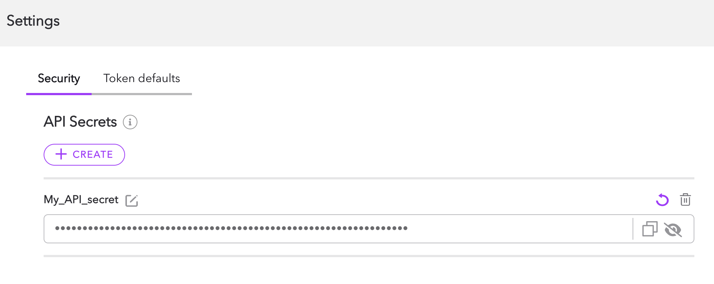

Dolby.io Real-time Streaming provide a Graph API to query both stats and real time info about the service. The url entry point for the service is:

https://api.millicast.com/graphql

To perform requests to the api, you need to authenticate using a bearer Authorization request header with the [API token from the Dolby.io dashboard](/millicast/streaming-dashboard/token-api.md)acquiring-your-api-token).





## Entities

You will be able to query the following entities:

- **Feeds**: Information about a media source being published into a stream

- **StreamViews**: Information about the viewers of a stream

This information will only be accessible during 30 days after publication/view is ended, and the number of records returned is limited.

## Aggregated stats

Dolby.io Real-time Streaming will aggregate the stats for each stream in 5 minutes intervals and provide the following 

- **StreamStats**: started views, ended views, active views, duration of the views

- **AccountStats**: Aggregated stats for your account

The stats will be available within 1 year after being generated, so you can perform historical queries. 

For example, to find the current active publications you can perform the following query:

```text GraphQL query example
{
 feedFindMany(filter: {active: true}) {
  started
  active
  ended
  streamId
 }
}
```

See the [GraphQL](ref:overview-graphql) documentation and the [GraphQL Reference API](/millicast/graphql-api-reference) for additional information on available models, resolvers, and types.
