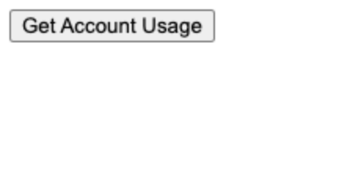
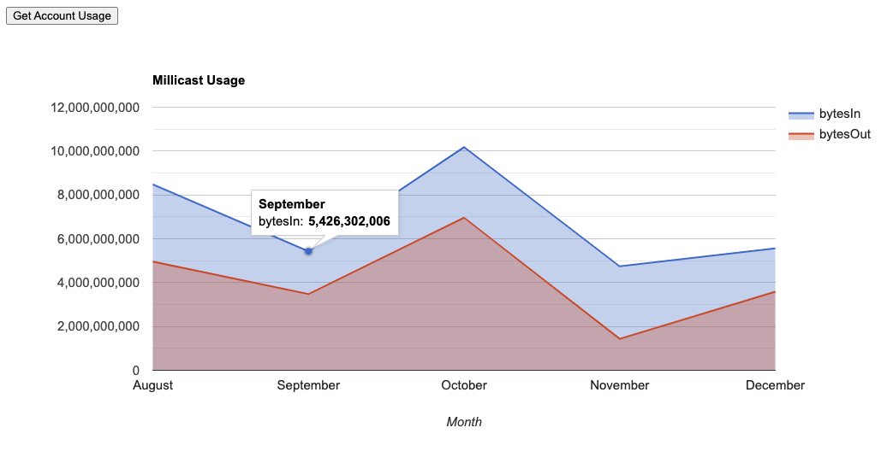
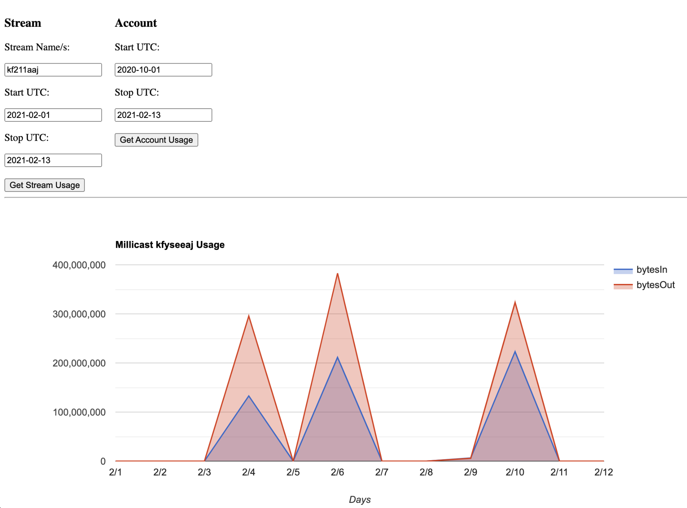
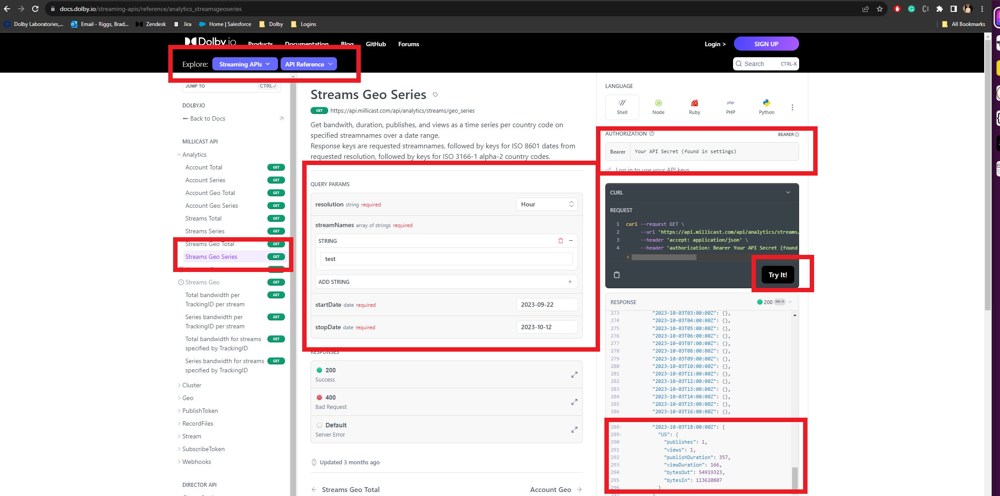

The Analytics APIs allow you to query your usage independent of the Dolby.io dashboard and get details of how your users are consuming your streams.

To access the analytics APIs you must have an API token. To learn more on how to get your API token, please read the following article [Acquiring Your API Token](/millicast/streaming-dashboard/token-api.mdx).

Another thing to note is that analytics API calls will not work directly from the Browser, there is no CORS support. To successfully call the API you must use Curl or a back end solution like Nodejs, Java, or anything outside the browser that can do HTTPS requests.

All requests made to the analytics APIs require that you provide a **start** and **stop** date range. The date must be structured in a UTC format containing the year, month, day and hour (eg 2020-01-01T00:00:00Z). These series based requests require you to set an analytics formatting resolution value of "Month", "Day" or "Hour", the resulting data will follow the specified format accordingly. The time part of your date string is optional and used only if you're querying the API for hourly information.

## Access restrictions

There are few restrictions to note regarding the Analytics APIs. Currently the stats are updated every 15 minutes of the hour (ex: XX:00, XX:15, XX:30, XX:45). Also, analytics providing a daily breakdown of your usage (Day) are stored for a window of **90 days**, and the hourly data (Hour) is stored for a window of **7 days**. This means you can query your data using the **Day** format for a maximum timeframe of the last 90 days. **Hourly** data is available to be queried for a maximum timeframe of last 7 days from the current day of your query. After the respective timeframes, this detailed data is purged from our system and you will then only have access to summarized monthly data.

A breakdown of per-stream data is also only available within a 7 day window. This includes geographic data as well as detailed bandwidth usage information per stream. If this detailed usage data is valuable to you, it is advised that you regularly download this data before it expires and is no longer available for querying.

To query for a particular month’s data, the API requires the date range to be from **day 1** of the month in question to **day 1** of the next month. An example of the query would look like this: startDate=2021-**01-01**&stopDate=2021-**02-01**&resolution=**Month**. This query would return the total bandwidth usage for the month of January 2021.

It is advised that you save your Daily and Hourly data if you feel that you would need it beyond the 90 and 7 day retention provided by Dolby.io Real-time Streaming.

Wildcards

The Dolby.io Real-time Streaming publisher token provides a Wildcard option which allows you to use an arbitrary stream name on-the-fly, rather than specifying the stream name in advance. This is beneficial if you are dynamically generating streams and are not sure how many streams you will need to generate or which names you will need to use. Because queries for stream analytics require a stream name, it is important for you to keep track of which stream names are being used if you would later like to query the analytics data for these individual streams.

## Basic call structure

In this example we want to query the API to get usage information for our entire account. There are 3 main calls you can do to get this information, Account Total, Account Series and Account Geo. Each one respectively has its own format and function, however, each call at the minimum requires a **start** and a **stop** date.

**Account Total** will give you the total bandwidth usage in bytes for your overall account based on a specified date range. **Account Geo** will do the same but will provide the totals based on the geographic region of the viewers. Similar to Geo, the **Account Series** will also breakdown the totals based on your specified resolution. For example if you chose "monthly" as your resolution format, the data would be broken down by month and so on. You can save this data into your own database for your own querying later, or you can plug this data into data visualizers like Google Charts to visually display the results of your usage.

## Example tutorial: JS / Nodejs

In the following example, we will use the Analytics APIs to query a Dolby.io Real-time Streaming account for a date range of usage and display it in a graph using Google Charts (see: https://developers.google.com/chart/interactive/docs/gallery/areachart)

Before proceeding we assume you are familiar with Nodejs and have some familiarity with Google Charts. For this example we used a Nodejs server version 12.19 (the latest stable version as of February 2021).

As with all API calls to our platform you must have your API token ready, you can find this in your Dolby.io dashboard.

Let's start by creating a new Nodejs project:

npm init

Create an app.js file that will run the code for the API calls. Then add the following code snippet to your app.js file.

```javascript
const express = require('express');
const https = require('https');
const fs = require('fs');

const port = 8443;
const startUTC = '2020-08-01'; // UTC year-month-day
const stopUTC = '2021-01-01';
const token = '__TOKEN__';

// Dolby.io Real-time Streaming request details
const options = {
  hostname: 'api.millicast.com',
  path: '/api/analytics/account/series?startDate=' + startUTC + '&stopDate=' + stopUTC + '&resolution=Month',
  method: 'GET',
  headers: {
    Authorization: 'Bearer ' + token,
    'Content-Type': 'application/json',
  },
};
console.log('options: ', options);

const app = express();

// app.use(bodyParser.json());
app.use((req, resp, next) => {
  resp.setHeader('Access-Control-Allow-Origin', '*');
  next();
});

app.get('/usage', (req, resp, next) => {
  console.log('app.get ', arguments.length);
  // Call api
  let apiReq = https
    .request(options, (res) => {
      console.log('result:', res.statusCode);
      let body = '';
      res.on('data', (d) => {
        body = body + d;
      });
      res.on('end', () => {
        let s = JSON.parse(body);
        console.log('END:', s);
        resp.send(body);
      });
    })
    .on('error', (e) => {
      console.log('ERROR', e);
      resp.satus(404).json(e);
    });
  apiReq.end();
});

https.createServer({ key: fs.readFileSync('ssl/key.pem'), cert: fs.readFileSync('ssl/cert.pem') }, app).listen(port);

console.log('running! see port https://localhost:' + port + '/usage');
```

In this example we use the standard Express module along with the built in HTTPS module to handle secure requests coming from the client HTML side and for calls going out to the Dolby.io Real-time Streaming from the server. This example uses openssl self-signed certificates to satisfy the key and conf requirement in the HTTPS module on Nodejs. We are testing locally so we run a simple local web server from the Visual Studio Code editor to do the calls over HTTPS locally (https://localhost:8443/). In this case, you would only need to bypass the browser warning that comes up to access your HTML file.

The express **"get"** method handles the request call to the API when the HTML user makes calls via the "/usage" path specified in the method. The path here is an arbitrary label, feel free to use whatever path name you prefer, just remember the call on the HTML counterpart has to match the path.

```javascript
app.get('/usage', (req, resp, next) => {
  console.log('app.get ', arguments.length);
  // Call api
  let apiReq = https
    .request(options, (res) => {
      console.log('result:', res.statusCode);
      let body = '';
      res.on('data', (d) => {
        body = body + d;
      });
      res.on('end', () => {
        let s = JSON.parse(body);
        console.log('END:', s);
        resp.send(body);
      });
    })
    .on('error', (e) => {
      console.log('ERROR', e);
      resp.satus(404).json(e);
    });
  apiReq.end();
});
```

The **GET** call will run a HTTPS request to query the API for the account usage using the **"account/series"** call (see: [Analytics AccountSeries API](/millicast/api/analytics-account-series). It is required that you add a date range which you can adjust yourself using the **"startUTC"** and **"stopUTC"** variables at the top of this example. Remember, the time value you use needs to be set in a UTC format, the data that is returned will also be in UTC time format so please take note of this.

If you wanted to do a quick test without the client counterpart you can run your node server (node app.js) and your webserver, then browse to **"https://localhost:8443/usage"** (again, bypass the security message if you are using a self-signed cert) to see the results.

Next, we can create our client html code that will do the actual call to our nodejs server using Javascript and the built in **"fetch"** call.

First open your editor and create a blank html file, save it as index.html. In your editor add the following bit of code into your index.html file.

```html

<html lang="en">
<head>
        <meta charset="UTF-8">
        <meta name="viewport" content="width=device-width, initial-scale=1.0">
        <title>Document</title>
        <script type="text/javascript" src="https://www.gstatic.com/charts/loader.js"></script>
</head>
<body>
        <button id="fetchButton">Get Account Usage</button>
        <div id="chart_div" style={{width: "100%", height: "500px"}}></div>
        <script type="text/javascript">

                const btn = document.getElementById('fetchButton');

                var months = ['January','February','March','April','May','June','July','August','September','October','November','December'];
                var bwData = {};

                btn.addEventListener('click', e => {
                        const url = **'https://localhost:8443/usage'**;
                        console.log('fetching data:',url);
                        **fetch**(url)
                                .then( resp =>{
                                        return resp.json();
                                }).then( o => {
                                        bwData = o.data.bandwidth;
                                        google.charts.load('current', {'packages':['corechart']});
                                        google.charts.setOnLoadCallback(drawBandwidthChart);
                                }).catch( e => {
                                        console.log('error: ',e);
                                });
                })

                function drawBandwidthChart(){
                        console.log('bw',bwData);
                        // table headers
                        let o = [ ['Month', 'bytesIn', 'bytesOut'] ];
                        let n = 1;//shift array position to next slot
                        for(let i in bwData){
                                let mth = new Date(i).**getUTCMonth();
                                let bw = bwData[i];
                                o[n++] = [months[mth], bw.bytesIn, bw.bytesOut];
                        }
                        console.log('sorted table:',o);
                        let data = google.visualization.arrayToDataTable(o);

                        let opt = {
                                title: 'Dolby.io Real-time Streaming Usage',
                                hAxis: {title: 'Month', titleTextStyle: {color: '#333'}},
                                vAxis: {minValue: 0}
                        };

                        let chart = new google.visualization.AreaChart(document.getElementById('chart_div'));
                        chart.draw(data, opt);
                }

        </script>
</body>
</html>
```

On the client end, there is only a simple button to fetch the data using the dates specified on the server. You can design the user application as advanced as you want, however, for the sake of simplicity we are just doing a simple request here to show its function.



A simple click on the button will call our Nodejs server counterpart using the **"fetch"** command. Once the data from the API is received on the client JavaScript, we convert the data back into JSON and then sort it in a table that Google Charts can understand and display.

Remember the data is in UTC format which a simple Date object can accept, however, calling "getMonth" from the date object will result in a date that is based on your local time, in the case above we’ve kept it UTC time so that there is no confusion.

Once the data is sorted and the chart is created, you can push the table data to the Google Chart to display it visually.



You can add the other API calls in the Nodejs side to load more information about your usage. You could also provide a HTML form to allow the user to specify query dates to send up to Nodejs, just remember to format the date information to UTC before you query it.

See more API calls here: [Account Analytics](/millicast/api/analytics-account-total.api.mdx)

## Bandwidth per stream

The Analytics API allows you to not only get the bandwidth you need from your account itself but also from each individual stream. These calls follow the same rules as the call structure explained above ([Basic Call Structure](/millicast/analytics/index.md#basic-call-structure)).

There is one slight difference we have to be aware of. For the fact that we are requesting data for a stream, in the query it is necessary to include the stream names along with the start and stop times. The use of multiple stream names is also supported. In order to use this feature you simply add each stream to a "streamNames" variable in the query, as an example your query stream might look like this:  
startDate=2020-01-01&stopDate=2020-04-01&**streamNames**=mystream&**streamNames**=otherstream  
You can add up to 10 stream names at a time.

To begin, below is the new modified app.js code from the example above, that supports a request for the stream data. The calls are modified to accept incoming data from the client side, making our data gathering more dynamic.

```javascript
const express = require('express'); const https = require('https');
const fs = require('fs');

const port = 8443;
const token = '__TOKEN__';
const app = express();

app.use(express.urlencoded({extended: false}));
app.use( (req, resp, next) => {
        resp.setHeader('Access-Control-Allow-Origin', '*');
        next();
});

app.get( '/usage', (req, resp, next) => {
        console.log('/usage - time start:',req.query.start,' stop:',req.query.stop);
        let start = req.query.start;
        let stop = req.query.stop;// Must be max 90 day UTC window form today for monthly or 7 days for daily/hourly.
        let o = {
                hostname: 'api.millicast.com',
                path: '/api/analytics/account/series?startDate='+start+'&stopDate='+stop+'&resolution=Month',
                method: 'GET',
                headers: {
                        'Authorization': 'Bearer ' + token,
                        'Content-Type': 'application/json'
                }
        }
        // Call api
        let apiReq = https.request(o, res => {
                console.log('result:',res.statusCode);
                let body = '';
                res.on('data', d => {
                        body = body + d;
                })
                res.on('end', () => {
                        let s = JSON.parse(body);
                        resp.send(body);
                })
        })
        .on('error', e => {
                console.log('ERROR',e);
                resp.satus(404).json(e);
        });
        apiReq.end();
});

app.**get( '/streamusage'**, (req, resp, next) => {
        console.log('/streamusage - streamName:',req.query.streamNames,'time start:',req.query.start,' stop:',req.query.stop);
        // Millicast API request details
        let **streamNames** = req.query.streamNames;
        let start = dreq.query.start;
        let stop = req.query.stop;// Must be max 90 day UTC window form today for monthly or 7 days for the daily/hourly data.
        let o = {
                hostname: 'api.millicast.com',
                path: '/api/analytics/streams/series?startDate='+start+'&stopDate='+stop+'&streamNames='+streamNames+'&resolution=Day',
                method: 'GET',
                headers: {
                        'Authorization': 'Bearer '+token,
                        'Content-Type': 'application/json'
                }
        }
        console.log('app.get ',o);
        // Call api
        let apiReq = https.request( o, res => {
                console.log('result:',res.statusCode);
        let body = '';
                res.on('data', d => {
                        body = body + d;
                })
                res.on('end', () => {
                        let s = JSON.parse(body);
                        console.log('END:',s);
                        resp.send(body);
                })
        })
        .on('error', e => {
                console.log('ERROR',e);
                resp.satus(404).json(e);
        });
        apiReq.end();
});

https.createServer(
        {key: fs.readFileSync('ssl/key.pem'),
                cert: fs.readFileSync('ssl/cert.pem')},
        app )
.listen(port);

console.log('running! see port https://localhost:'+port+'/');
```

We’ve changed the original **"/usage"** call to get its start and stop time from the request (req) argument instead of a global variable. With that, we moved the call options object into the method **get '/usage'** itself in order to update every time new dates are sent by the client.

The new method, labeled **'/streamusage'** is what securely handles the call to the API for our client code, which is also updated. The call basically mirrors the original one above it, however we use a "streamNames" variable to handle the requirement needed for querying streams. You can definitely join these into 1 method but for the example we'll keep them separated, feel free to modify as needed.

Notice, in the method, where we receive the start, stop and streamName strings, these variables are to be sent by our client code so they must match.

Below is a sample of the new client index.html code.

```html

<html lang="en">
<head>
        <meta charset="UTF-8">
        <meta name="viewport" content="width=device-width, initial-scale=1.0">
        <title>Document</title>
        <script type="text/javascript" src="https://www.gstatic.com/charts/loader.js"></script>
        <style>
                #forms {
                        display: flex;
                }
                .m-r-20 {
                        margin-right: 20px;
                }
        </style>
</head>
<body>
        <div id="forms">
                <div class="m-r-20">
                        <h3>Stream </h3>
                        <div>
                                <p>Stream Name/s:</p>
                                <input id="strmNameTxt" type="text" value="myfeed1">
                        </div>
                        <div>
                                <p>Start UTC:</p>
                                <input id="startTxt" type="text" value="2021-02-01">
                        </div>
                        <div>
                                <p>Stop UTC:</p>
                                <input id="stopTxt" type="text" value="2021-02-13">
                        </div>
                        <br/>
                        <button id="strmButton">Get Stream Usage</button>
                </div>
                <div>
                        <h3>Account </h3>
                        <div>
                                <p>Start UTC:</p>
                                <input id="accStartTxt" type="text" value="2020-10-01">
                        </div>
                        <div>
                                <p>Stop UTC:</p>
                                <input id="accStopTxt" type="text" value="2021-02-13">
                        </div>
                        <br/>
                        <button id="acctButton">Get Account Usage</button>
                </div>
        </div>
        <hr/>

        <div id="chart_div" style={{width: "100%", height: "500px"}}></div>

        <script type="text/javascript">

                const btnAccnt = document.getElementById('acctButton');
                const btnStrm = document.getElementById('strmButton');
                const txtStart = document.getElementById('startTxt');
                const txtStop = document.getElementById('stopTxt');
                const txtStrmName = document.getElementById('strmNameTxt');

                var months = ['January','February','March','April','May','June','July','August','September','October','November','December'];
                var acctBWData = {};
                var strmBWData = {};
                var selStreamName = '';

                btnAccnt.addEventListener('click', e => {
                        let startDt = accStartTxt.value;
                        let stopDt = accStopTxt.value;
                        const url = 'https://localhost:8443/usage?start='+startDt+'&stop='+stopDt;
                        console.log('fetching data:',url);
                        fetch(url)
                                .then( resp =>{
                                        return resp.json();
                                }).then( o => {
                                        acctBWData = o.data.bandwidth;
                                        google.charts.load('current', {'packages':['corechart']});
                                        google.charts.setOnLoadCallback(drawAcctBWChart);
                                }).catch( e => {
                                        console.log('error: ',e);
                                });
                })

                btnStrm.addEventListener('click', e => {
                        // Get user input data
                        selStreamName = txtStrmName.value;
                        let startDt = txtStart.value;
                        let stopDt = txtStop.value;
                        const url = 'https://localhost:8443/streamusage?streamNames='+selStreamName+'&start='+startDt+'&stop='+stopDt;
                        console.log('fetching data at:',url);
                        fetch(url)
                                .then( resp =>{
                                        return resp.json();
                                }).then( o => {
                                        console.log('o ',o);
                                        let d = o.data[selStreamName];
                                        strmBWData = !!d ? d.bandwidth : {};
                                        google.charts.load('current', {'packages':['corechart']});
                                        google.charts.setOnLoadCallback(drawStrmBWChart);
                                }).catch( e => {
                                        console.log('error: ',e);
                                });
                })

                function drawAcctBWChart(){
                        console.log('drawAcctBWChart',acctBWData);
                        // Table headers
                        let o = [ ['Month', 'bytesIn', 'bytesOut'] ];
                        let n = 1;//shift array position to next slot
                        for(let i in acctBWData){
                                let mth = new Date(i).getUTCMonth();
                                let bw = acctBWData[i];
                                o[n++] = [months[mth], bw.bytesIn, bw.bytesOut];
                        }
                        console.log('sorted table:',o);
                        let data = google.visualization.arrayToDataTable(o);

                        let opt = {
                                title: 'Millicast Account Usage',
                                hAxis: {title: 'Month', titleTextStyle: {color: '#333'}},
                                vAxis: {minValue: 0}
                        };

                        let chart = new google.visualization.AreaChart(document.getElementById('chart_div'));
                        chart.draw(data, opt);
                }

                function **drawStrmBWChart(){
                        console.log('drawStrmBWChart',strmBWData);
                        // Table headers
                        let o = [ ['Day', 'bytesIn', 'bytesOut'] ];
                        let n = 1;//shift array position to next slot
                        for(let i in strmBWData){
                                let mth = new Date(i).getUTCMonth();
                                let dy = new Date(i).getUTCDate();
                                let bw = strmBWData[i];
                                o[n++] = [(mth+1)+'/'+dy, bw.bytesIn, bw.bytesOut];
                        }
                        console.log('sorted table:',o);
                        let data = google.visualization.arrayToDataTable(o);

                        let opt = {
                                title: 'Millicast '+selStreamName+' Usage',
                                hAxis: {title: 'Days', titleTextStyle: {color: '#333'}},
                                vAxis: {minValue: 0}
                        };

                        let chart = new google.visualization.AreaChart(document.getElementById('chart_div'));
                        chart.draw(data, opt);
                }

        </script>
</body>
</html>
```

The new index.html file has been modified to be more dynamic and add more interactivity than the original one. In this example, we’ve added some rudimentary forms for each call to send the dates and stream names to the server. Remember to write your dates in UTC format (2021-02-01) so that our Nodejs server counterpart can send them successfully.

If you noticed in the new method "drawStrmBWChart", the sorting procedure is different than the one for account bandwidth. The data is similar but formatted to separate not just the dates but the streams as well. Here, we also use a "Day" format for daily breakdown instead of a monthly one. This format breaks down the data for daily totals instead of monthly.

The Google chart is updated accordingly and we can see each visual as we switch it out by pressing the corresponding buttons and adding the dates.



Notice, the data sent to the server is in the same format that is expected on the methods we added to the app.js file earlier. You can try another method using the Geo calls, just remember to format accordingly.

## Viewers per stream

Calculating the viewers per stream (daily or hourly), which region they viewed from, and how much bandwidth they consumed is a straightforward process. Navigate to the Dolby.io API reference and select the [Analytics Streams Geo Series API](/millicast/api/analytics-streams-geo-series). Add your startDate, stopDate, resolution, and streamName. Additionally, in the top right corner, add your API Secret key found in the [Settings Tab](../streaming-dashboard/index.mdx#settings) of the dashboard. Once all the fields have correct values click the `Try It!` button to get your data.

> 🚧 Get your data before it expires!
>
> Hourly data is only stored seven days after the stream started. For more information see [Access Restrictions](../analytics/index.md#access-restrictions).



## Troubleshooting

### No Results Returned for Stream

#### Special Characters in Stream Names

When querying usage with the [Analytics](/millicast/api/analytics-streams-series) APIs using `streamNames` it is expected that the streams have not used special characters such as `/`, `*`, or `--` as this will fail to report results. Recommendation is to avoid using special characters in stream names and sticking with alpha-numeric characters and single dashes.
