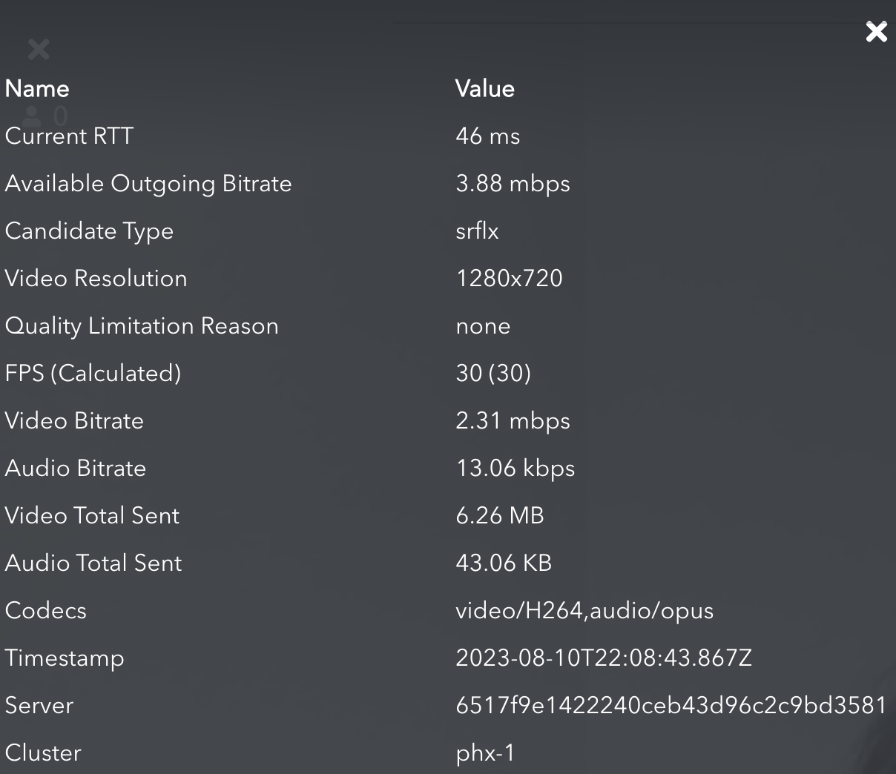

Both the [Live Broadcaster](/millicast/streaming-dashboard/how-to-broadcast-in-dashboard.md) and [Hosted Viewer](/millicast/playback/hosted-viewer.md) provide a **Media Stats** option to open a modal overlay during broadcast or playback that displays information that can be helpful in judging the performance or diagnosing issues when troubleshooting.

- **RTT**: Round trip time in milliseconds for sending and receiving the stream.
- **Video Resolution**: Width and height of the video frame.
- **FPS **(Calculated): Frames per second.
- **Video Bitrate**: Video kb per second.
- **Audio Bitrate**: Audio kb per second.
- **Video Total Received**: Sum data transfer for the bandwidth attributed to the video stream.
- **Audio Total Received**: Sum data transfer for the bandwidth attributed to the audio stream.
- **Video Packet Loss**: The number of video packets lost.
- **Audio Packet Loss**: The number of audio packets lost.
- **Video Jitter**: The typical deviation of video packet reception times in milliseconds.
- **Audio Jitter**: The typical deviation of audio packet reception times in milliseconds.
- **Capture Timestamp**: The time when the frame was sent by the encoder. Note: This field is only available in Chromium-based browsers.
- **Capture Delta Time**: The difference between the local system timestamp at the time the frame was received, and the timestamp received in the Capture Timestamp field. Note: This field is only available in Chromium-based browsers.
- **Codecs**: The audio and video codecs used by the broadcaster.
- **Timestamp**: The date and time (UTC) for when the browser gathered media stats.
- **Server**: This can be provided to our support team as an aid to troubleshooting network issues.
- **Cluster**: The data center being used for the broadcast origin. See [Cluster Regions](/millicast/distribution/multi-region-support/index.mdx) for more details on this data.

> 📘 Active Broadcast
>
> The Media Stats are only available during an active broadcast. You may also be interested in other means of gathering [Client Analytics](/millicast/playback/client-analytics-and-monitoring.md) and monitoring the playback experience.

## Example

An example of what values from a broadcast might report.

