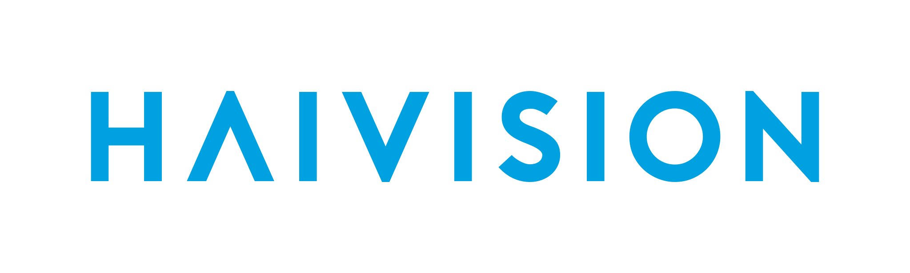

import DocCardList from '@theme/DocCardList';

# Hardware Encoders

In today's digital landscape, the demand for real-time streaming content has skyrocketed, prompting broadcasters and video creators to prioritize the efficient delivery of high-quality video and audio streams. Hardware-based encoders play a crucial role in this process with their offerings of superior encoding capabilities and seamless transmission. Needless to say, workflows don't have to be interrupted in order to better a stream. Using the Dolby.io Streaming API protocols like [SRT](/millicast/broadcast/using-srt.md), [NDI](/millicast/broadcast/using-ndi.md), and [WHIP](/millicast/broadcast/webrtc-whip.mdx) can be ingested directly from the encoders like [Teradek](/millicast/hardware-encoders/broadcasting-teradek-vidiu.md), [Osprey](/millicast/hardware-encoders/using-osprey-talon-whip-hardware-encoder.md), and [Videon](/millicast/hardware-encoders/videon.md) and distributed in WebRTC.

# Integration guides

Review these guides for how to setup your preferred tools for real-time streaming integrations.

import { IconGrid, IconGridButton } from '@site/src/components/IconGrid';

<!-- prettier-ignore-start -->
<IconGrid>
  <IconGridButton large></IconGridButton>
  <IconGridButton large></IconGridButton>
  <IconGridButton large></IconGridButton>
  <IconGridButton large></IconGridButton>
  <IconGridButton large></IconGridButton>
</IconGrid>
<!-- prettier-ignore-end -->

## Elgato

[How-to integrate using Elgato Stream Deck](/millicast/hardware-encoders/using-elgato-stream-deck-with-obs-studio-webrtc-version.md)

**Elgato Stream Deck** is a versatile control panel that simplifies from broadcasting to editing with programmable keys. This tool can help in managing [OBS](/millicast/software-encoders/using-obs.md) streams by automating specific actions in a physical board.

## Haivision

[How-to integrate using Haivision KB Encoder](/millicast/hardware-encoders/using-haivision-kb-encoder.md)

The **Haivision KB Encoder** is a high-performance video encoding device that efficiently converts video signals into compressed formats for reliable live streaming and distribution over IP networks.

## Osprey

[How-to integrate using Osprey Talon Encoder](/millicast/using-osprey-talon-whip-hardware-encoder)

**Osprey Talon** is a form-factor H.264 (AVC) and H.265 (HEVC) encoder designed to be easy to use, portable, and easily stream low latency 4k and UHD video encoding from SDI and HDMI. By supporting [WHIP](/millicast/broadcast/webrtc-whip.mdx), Osprey is able to offer an encoder that can natively encode WebRTC streams at broadcast-level quality.

## Teradek

[How-to integrate using Teradek VidiU Go](/millicast/hardware-encoders/broadcasting-teradek-vidiu.md)

**Teradek VidiU Go** is a portable and reliable streaming encoder with broadcast quality of 1080p60 video, bonded network redundancy, and cutting-edge HEVC compression designed for the most challenging production environments.

## Videon

[How-to integrate using Videon EdgeCaster](/millicast/hardware-encoders/videon.md)

**Videon EdgeCaster** is a versatile and powerful edge compute encoder that securely delivers high-quality live video streams to multiple platforms simultaneously, offering a comprehensive solution for efficient video distribution.

# Learn more

You can find examples of using [Videon EdgeCaster](https://dolby.io/blog/unleash-superior-streaming-harnessing-dolby-io-streaming-api-and-videon-edgecaster-encoder-for-multi-bitrate-simulcasting/), [Osprey Talon](https://dolby.io/blog/webrtc-hardware-encoding-and-streaming/), and more on the [developer blog](https://dolby.io/blog/tag/encoder/).

<DocCardList
  items={[
    {
      type: 'link',
      href: 'https://github.com/orgs/dolbyio-samples/repositories?q=encoder',
      customProps: {
        icon: 'github',
      },
      label: 'Explore GitHub samples',
    },
    {
      type: 'link',
      href: 'https://dolby.io/blog/tag/encoder/',
      label: 'Find related blog posts',
    },
  ]}
/>
