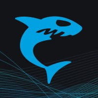
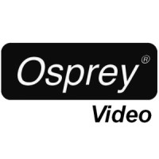

import DocCardList from '@theme/DocCardList';

In today's digital landscape, the demand for real-time streaming content has skyrocketed, prompting broadcasters and video creators to prioritize the efficient delivery of high-quality video and audio streams. Hardware-based encoders play a crucial role in this process with their offerings of superior encoding capabilities and seamless transmission. Needless to say, workflows don't have to be interrupted in order to better a stream. Using the Dolby.io Streaming API protocols like [SRT](/millicast/broadcast/srt.mdx), [NDI](/millicast/broadcast/ndi.md), and [WHIP](/millicast/broadcast/webrtc-and-whip.mdx) can be ingested directly from the encoders like [Teradek](teradek.mdx), [Osprey](osprey.mdx), and [Videon](videon.mdx) and distributed in WebRTC.

## Integration guides

Review these guides for how to setup your preferred tools for real-time streaming integrations.

import { IconGrid, IconGridButton } from '@site/src/components/IconGrid';

<IconGrid>
  <IconGridButton large>
    
  </IconGridButton>
  <IconGridButton large>
    
  </IconGridButton>
  <IconGridButton large>
    
  </IconGridButton>
  <IconGridButton large>
    
  </IconGridButton>
  <IconGridButton large>
    
  </IconGridButton>
  <IconGridButton large>
    
  </IconGridButton>
</IconGrid>

### Elgato

[How-to integrate using Elgato Stream Deck](elgato.mdx)

**Elgato Stream Deck** is a versatile control panel that simplifies from broadcasting to editing with programmable keys. This tool can help in managing [OBS](/millicast/broadcast/software-encoders/obs/index.mdx) streams by automating specific actions in a physical board.

### Haivision

[How-to integrate using Haivision KB Encoder](haivision.mdx)

The **Haivision KB Encoder** is a high-performance video encoding device that efficiently converts video signals into compressed formats for reliable live streaming and distribution over IP networks.

### Magewell

[How-to integrate using Magewell Ultra Encode](magewell.mdx)

The **Magewell Ultra Encode** is a leading encoder manufacturer that supports connecting to the Dolby OptiView Streaming Service for broadcasting real-time streams.

### Osprey

[How-to integrate using Osprey Talon Encoder](osprey.mdx)

**Osprey Talon** is a form-factor H.264 (AVC) and H.265 (HEVC) encoder designed to be easy to use, portable, and easily stream low latency 4k and UHD video encoding from SDI and HDMI. By supporting [WHIP](/millicast/broadcast/webrtc-and-whip.mdx), Osprey is able to offer an encoder that can natively encode WebRTC streams at broadcast-level quality.

### Teradek

[How-to integrate using Teradek VidiU Go](teradek.mdx)

**Teradek VidiU Go** is a portable and reliable streaming encoder with broadcast quality of 1080p60 video, bonded network redundancy, and cutting-edge HEVC compression designed for the most challenging production environments.

### Videon

[How-to integrate using Videon EdgeCaster](videon.mdx)

**Videon EdgeCaster** is a versatile and powerful edge compute encoder that securely delivers high-quality live video streams to multiple platforms simultaneously, offering a comprehensive solution for efficient video distribution.
