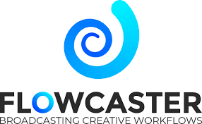

import DocCardList from '@theme/DocCardList';

A software encoder can take raw video frames and convert it into a digital format that is compatible for distribution with Dolby.io. This type of integration can typically be done without additional hardware requirements and eases adoption of real-time streaming workflows.

## Integration Guides

Review these guides for how to setup your preferred tools for real-time streaming integrations.

import { IconGrid, IconGridButton } from '@site/src/components/IconGrid';

<!-- prettier-ignore-start -->

<IconGrid>
    <IconGridButton large></IconGridButton>
    <IconGridButton large></IconGridButton>
    <IconGridButton large></IconGridButton>
    <IconGridButton large></IconGridButton>
    <IconGridButton large></IconGridButton>
    <IconGridButton large></IconGridButton>

    <!--
    <IconGridButton large></IconGridButton>
    -->

</IconGrid>
<!-- prettier-ignore-end -->

### Drastic Technologies

**FlowCaster** from Drastic Technologies lets you share high quality video over IP for remote collaboration and review workflows. This tool supports broadcasting with [WHIP](/millicast/broadcast/webrtc-whip.mdx).

[How-to integrate with Flowcaster](/millicast/software-encoders/using-whip-with-flowcaster.md)

### FFmpeg

**FFmpeg** is a free open-source software project with command-line tools for handling video, audio, and other multimedia. The `ffmpeg` command-line tool can be used to forward streams with [RTMP](/millicast/broadcast/using-rtmp-and-rtmps.mdx). This can be helpful for quickly streaming a media file from disk.

[How-to integrate with FFmpeg](/millicast/software-encoders/using-ffmpeg.md)

### GStreamer

**GStreamer** is a free open-source software project and multimedia framework to build media processing pipelines. The tools can be used to ingest streams with [WHIP](/millicast/broadcast/webrtc-whip.mdx). This can be helpful for complex workflows that operate on media streams.

[How-to integrate with GStreamer](/millicast/software-encoders/using-whip-with-gstreamer.md)

### Open Broadcaster Software (OBS)

**OBS** is a free open-source application for broadcasting and recording streams from your desktop computer. It supports broadcasting with [WebRTC](/millicast/broadcast/webrtc-whip.mdx), [SRT](/millicast/broadcast/using-srt.mdx), and [RTMP](/millicast/broadcast/using-rtmp-and-rtmps.mdx) to support many different use cases.

[How-to integrate with OBS](/millicast/software-encoders/using-obs.md)

### LiveU

**LiveU Studio** is a cloud production tool for live video feeds. It supports [WHIP](/millicast/broadcast/webrtc-whip.mdx).

[How-to integrate with LiveU Studio](/millicast/software-encoders/liveu-studio-using-whip.md)

### vMix

**vMix** is a Windows desktop applicationi that provides a vision mixer and encoder. You can use this tool as both a [RTMP](/millicast/broadcast/using-rtmp-and-rtmps.mdx) or [NDI](/millicast/broadcast/using-ndi.md) source.

[How-to integrate with vMix](/millicast/software-encoders/broadcasting-with-vmix.md)

### Zoom

**Zoom** is a video collaboration platform. The application supports streaming use cases with [RTMP](/millicast/broadcast/using-rtmp-and-rtmps.mdx) which allows you to distribute your meeting with Dolby.io Real-time Streaming.

[How-to integrate with Zoom Meetings](/millicast/software-encoders/broadcasting-jitsi-or-zoom-meetings.md)

## Learn more

You can find examples of using [Avid Media Composer](https://dolby.io/blog/collaborative-post-production-with-avid-media-composer/), [OBS](https://dolby.io/blog/using-webrtc-in-obs-for-remote-live-production/), and more on the [developer blog](https://dolby.io/blog/tag/encoder/).

<DocCardList
  items={[
    {
      type: 'link',
      href: 'https://github.com/orgs/dolbyio-samples/repositories?q=encoder',
      customProps: {
        icon: 'github',
      },
      label: 'Explore GitHub samples',
    },
    {
      type: 'link',
      href: 'https://dolby.io/blog/tag/encoder/',
      label: 'Find related blog posts',
    },
  ]}
/>
