**NDI**® Tools is a free suite of applications designed to introduce you to the world of IP. NDI makes it possible to connect to any device, in any location, anywhere in the world – and transmit live video to wherever you are. NDI systems and sources on your network. Combine NDI with Dolby.io Real-time Streaming to deliver real-time video for remote or interactive experiences.

This guide will outline four options for NDI delivery:

1. [How-to Publish NDI with Dolby.io Dashboard Broadcaster](/millicast/broadcast/using-ndi.md)how-to-publish-ndi-with-dolbyio-dashboard-broadcaster)
2. [How-to Publish NDI with OBS-WebRTC](/millicast/broadcast/using-ndi.md)how-to-publish-ndi-with-obs-webrtc)
3. [How-to Publish Video Editor with NDI](/millicast/broadcast/using-ndi.md)how-to-publish-video-editor-with-ndi)
4. [How-to Publish NDI with vMix](/millicast/broadcast/using-ndi.md)how-to-publish-ndi-with-vmix)

# NDI publishing

> 👍 Getting Started
> 
> If you haven't already, begin by following the [Getting Started](/millicast/getting-started/introduction-to-streaming-apis.md) tutorial to create a Dolby.io application and start your first broadcast. You'll need your _publish token_ and _stream name_ for the steps described below.

Install the [NDI tools](https://ndi.video/type/ndi-tools/) on your computer. If you do not have a NDI camera, you can download NDI HX Camera or similar to test the below workflows on you mobile device.

## How-to publish NDI with Dolby.io dashboard broadcaster

Sign in to your [Dolby.io Real-Time Streaming dashboard](https://dashboard.dolby.io/) and create a stream token. Press the broadcast button, and inside the Broadcaster, select the camera icon on the bottom left. Here you will see a list of possible camera selections. If you have an NDI camera like NewTek, Angekis, or AIDA, it will show up in the dropdown, and you are ready to go. 

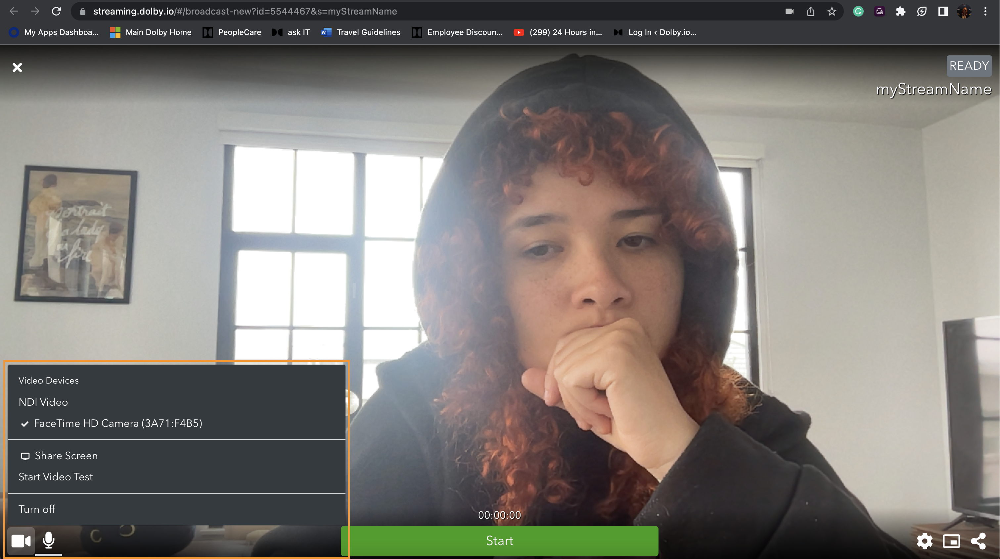

To enable it, open up the NDI Launcher on your computer. 

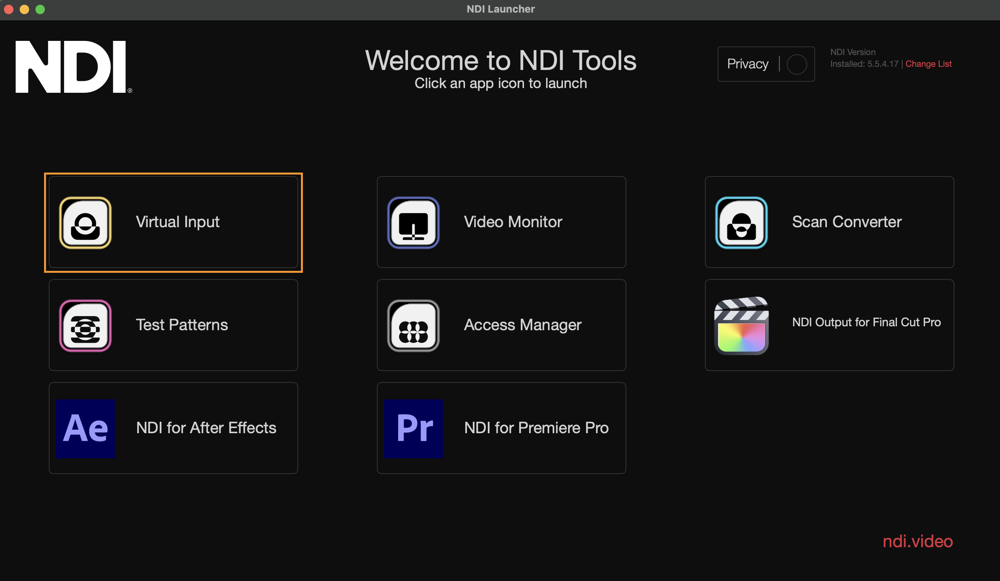

Select the Virtual Input button. Install and launch the NDI app on your mobile device and tap the NDI button, turning it blue, enabling you to share NDI videos on the network.

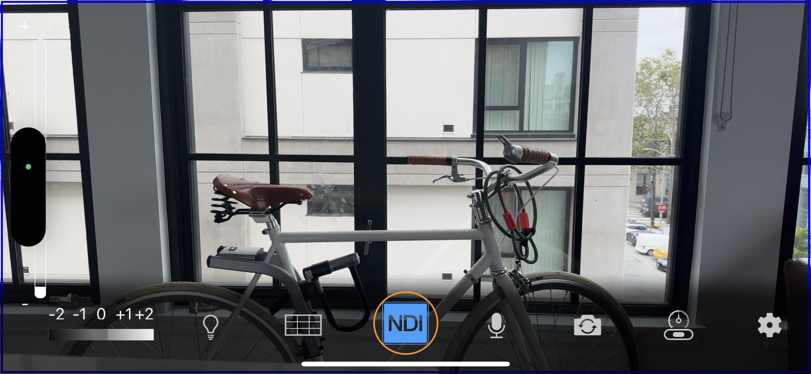

Run NDI Virtual Input and select your phone from the list. 

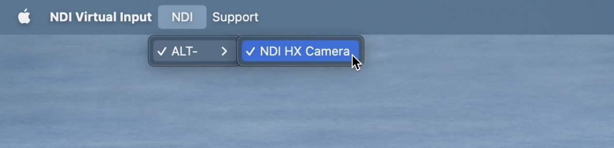

Go back into Dolby.io Broadcaster and select NDI Video from the video devices option in the camera icon. Now, point your mobile device anywhere, and you will see the stream coming in.

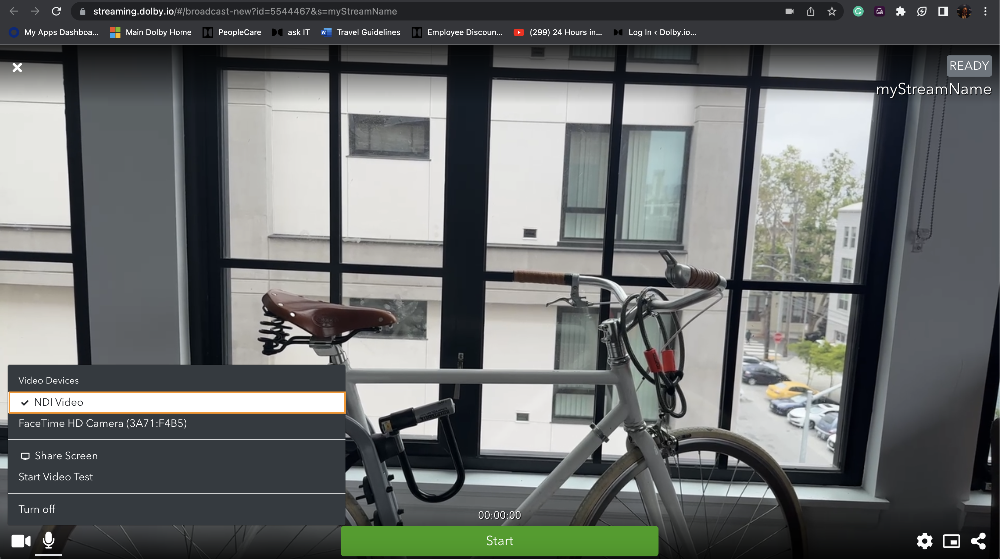

From here click the "Start" button to begin broadcasting the camera feed globally in real-time with Dolby.io.

## How-to publish NDI with OBS-WebRTC

[Open Broadcast Software](https://github.com/CoSMoSoftware/OBS-studio-webrtc), OBS, is a popular screencasting and streaming tool available as free, open-source software. After downloading the forked software, open up the program and create a scene by clicking on the "+" of Scenes.

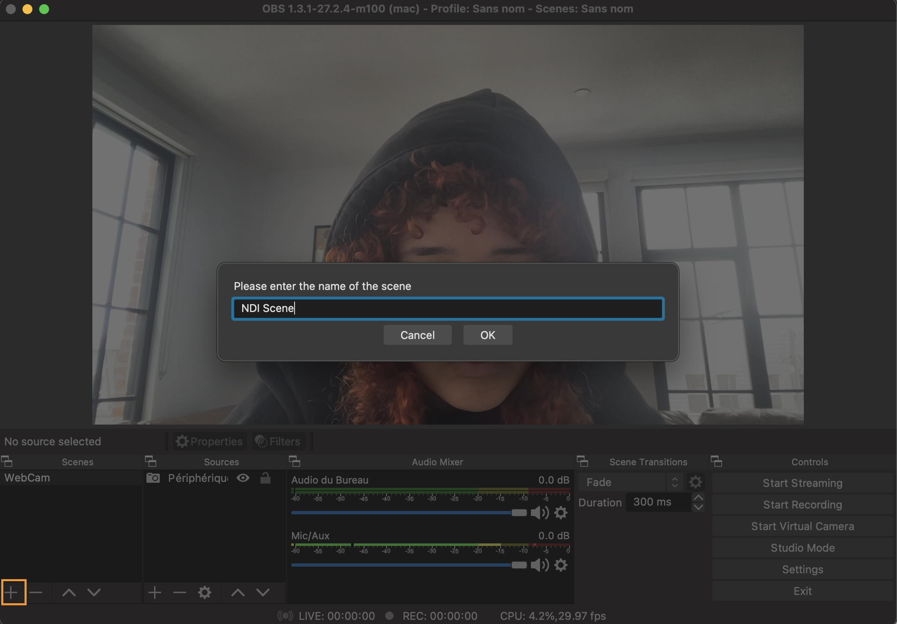

With a scene created, a source needs to be added. Press on the "+" of Sources and select Video Capture Device and create a new label for the camera. 

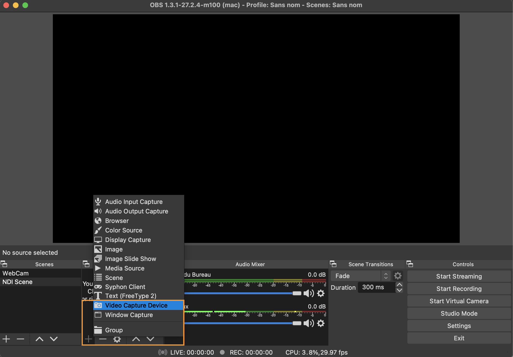

Inside the properties, indicate which NDI camera you will be using. We will continue using NDI HX from a mobile device for this example. If you do not see the NDI option, you may have to add the plug-in [here](https://github.com/Palakis/obs-ndi). 

- Note: Since we are testing with [NDI HX](https://ndi.video/), ensure the NDI Virtual Input app is open on your computer with the phone selected from the list. Otherwise, it will show up as a black screen on OBS.

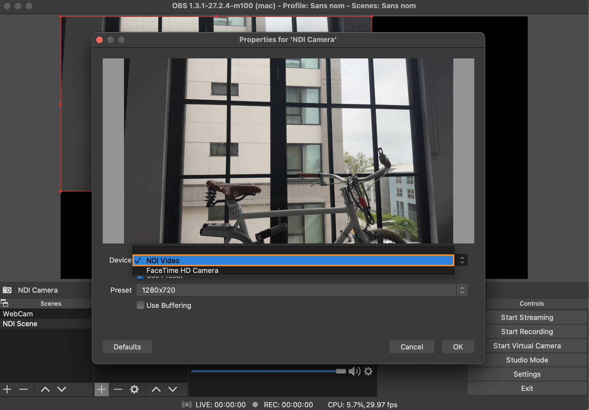

After that, OBS needs to connect to our Dolby.io account. Go to Settings and click on the Stream button to add our stream token information. 

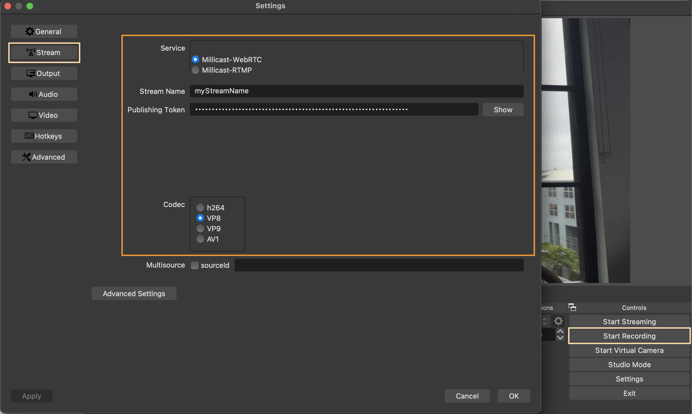

To obtain the stream name and publishing token, go into the stream token's settings, and from Token Details, copy the information. Visit [our OBS guide](/millicast/software-encoders/using-obs.md) for any further questions. Close all of the settings and begin streaming. To see the stream, copy the Hosted Player Path from the stream token's Playback. 

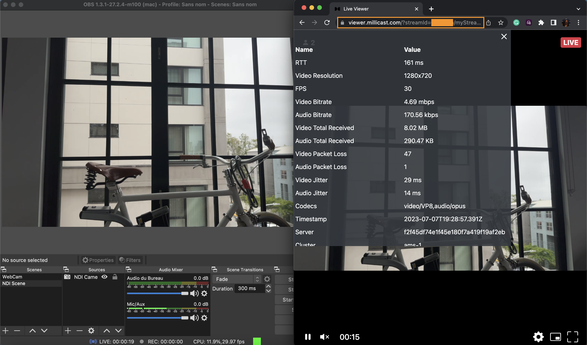

## How-to publish video editor with NDI

NDI can be very useful for enabling real-time, renderless playback and preview over IP right from the timeline of a video editor. Actions like these can allow remote collaboration with creators all over the globe aside from allowing stakeholders to watch your work, in real-time with minimal delay.

First, open Playback Preferences in Premiere Pro. 

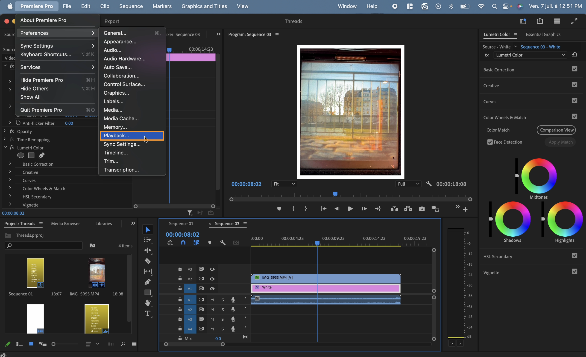

Enable NDI in the Video Preview section with NDI Output selected in the Audio Device list as well as the Video Device list.

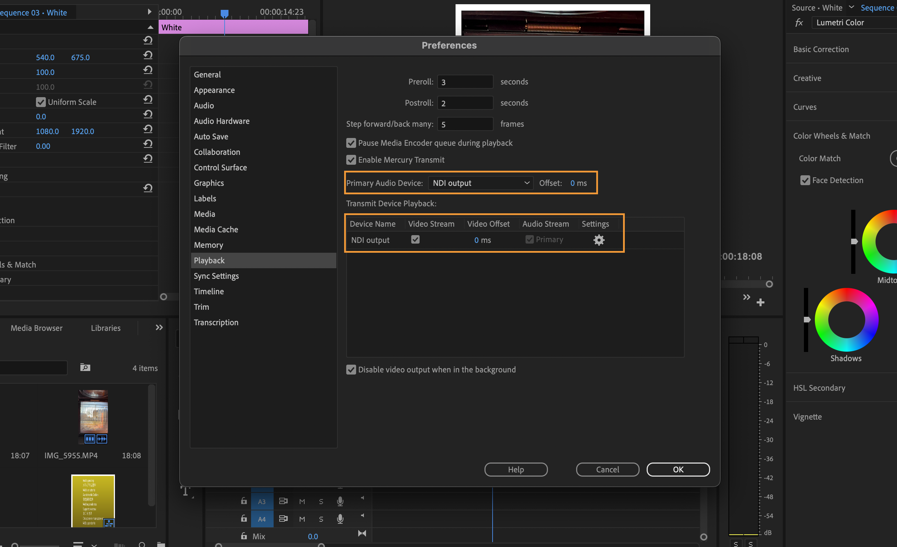

Open NDI Virtual Input to select where the broadcast is coming from.

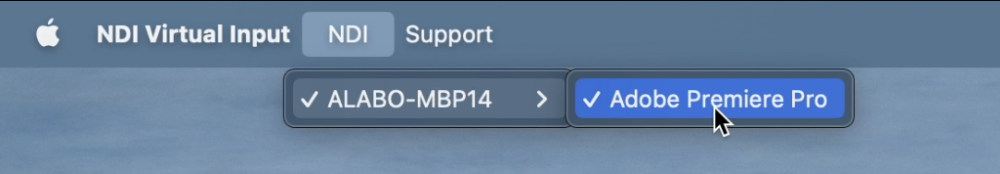

Inside Dolby.io's Broadcaster, select the camera option to be the NDI video, and you should see the playback before going live on your stream. Afterward, share the viewer link by pressing on the bottom right corner of the Broadcaster. These same steps can be repeated with Adobe After Effect. 

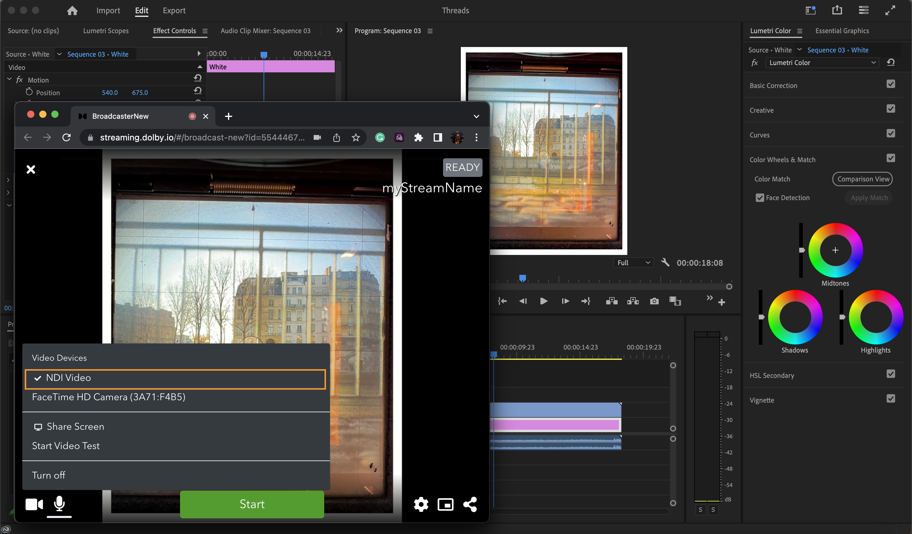

To stream the playback from Final Cut Pro, go into your System Preferences on the Mac and set the Sound > Sound Output as the NDI Audio. For the configuration of the video, search NDI Output in the System Preferences and set the video format and frame rate to be the same as your Final Cut Pro project. 

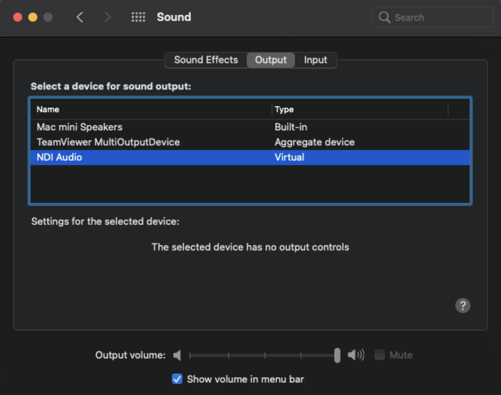

Open up a new Final Cut Pro project with it matching your NDI configuration and enable A/V Output in the Window menu. Check that your NDI Virtual Input is selected as Final Cut Pro, and the NDI Video is checked off in the Dolby.io Broadcaster to see the playback on the stream. 

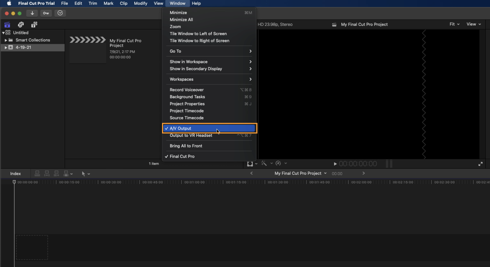

## How-to publish NDI with vMix

You can also use [vMix as NDI](/millicast/software-encoders/broadcasting-with-vmix.md) source if you do not wish to purchase the NDI HDX. This allows will allow vMix to be used as your switcher or remote source and flexibility with Dolby.io Real-time Streaming codecs with real-time publishing.

# Learn more

Learn more by exploring the [developer blog](https://dolby.io/blog/tag/broadcast/) and [code samples](https://github.com/orgs/dolbyio-samples/repositories?q=broadcast).

