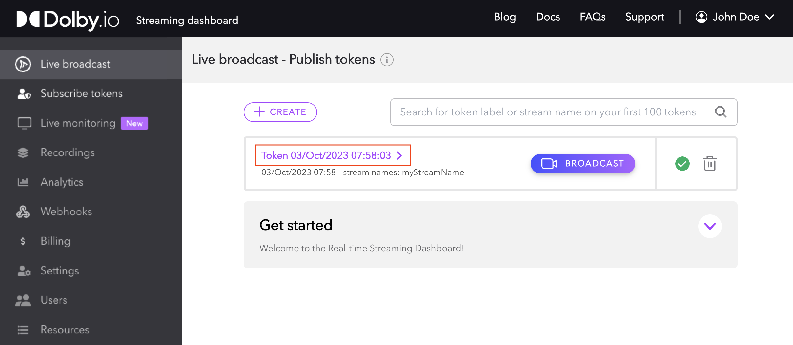
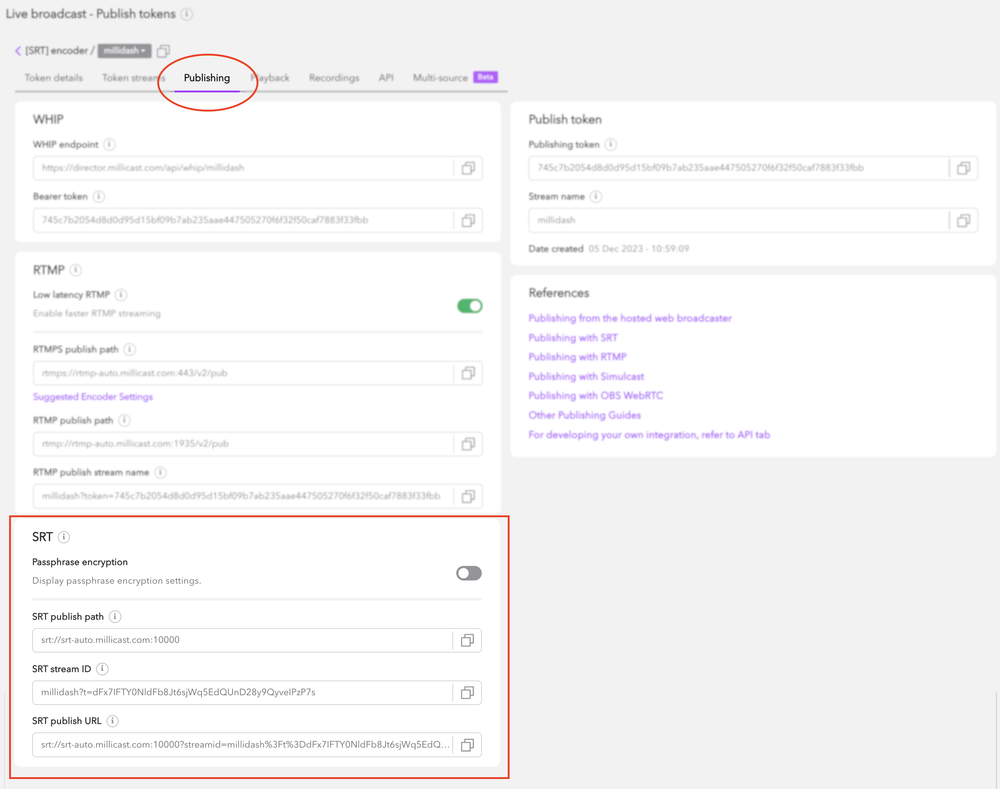
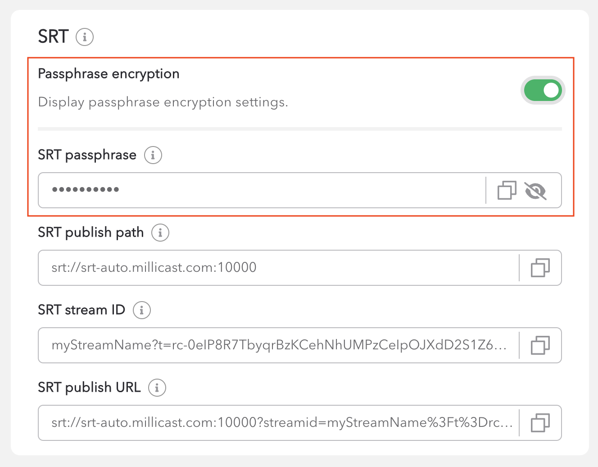
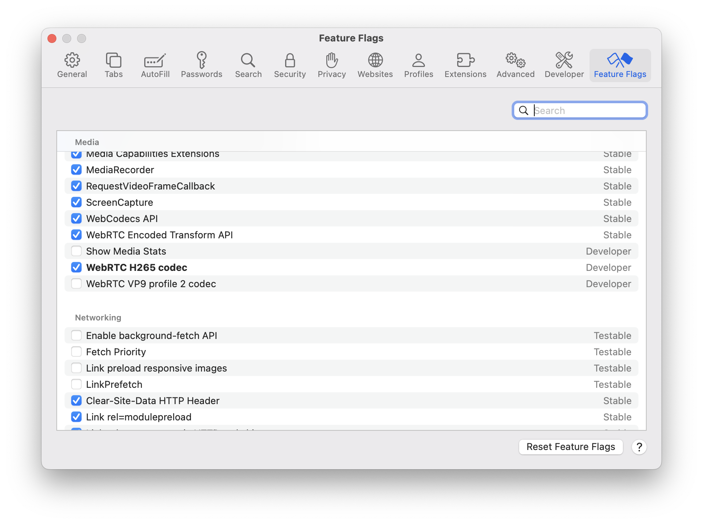

**Secure Reliable Transport (SRT)** is an open-source protocol that uses an intelligent packet retransmit mechanism on top of a UDP data flow, along with AES-128 and 256-bit encryption. [Dolby.io Real-time Streaming](https://dolby.io/products/real-time-streaming/) natively supports publishing from an SRT source.

This document will guide you on how to [broadcast](/millicast/broadcast/index.mdx) an SRT Stream to Dolby.io Real-time Streaming with SRT-capable software or hardware. 

> 👍 Getting Started
> 
> If you haven't already, begin by following the [Getting Started](/millicast/getting-started/introduction-to-streaming-apis.md) tutorial to create a Dolby.io application and start your first broadcast. You will need to create a publish token to generate the necessary SRT details.

# How-to find the SRT publish settings with the dashboard

The Dolby.io [Streaming Dashboard](/millicast/streaming-dashboard/index.md) helps generate the parameters you can use for configuring your encoders. 

Some examples of encoders supporting SRT include the [Osprey](/millicast/hardware-encoders/using-osprey-talon-whip-hardware-encoder.md) Talon, [Teradek](/millicast/hardware-encoders/broadcasting-teradek-vidiu.md) Wave, [Videon](/millicast/hardware-encoders/videon.md) EdgeCaster, [Haivision](/millicast/hardware-encoders/using-haivision-kb-encoder.md) KB Encoder, [Flowcaster](/millicast/software-encoders/using-whip-with-flowcaster.md), Adobe Premiere Pro, Avid Media Composer, and [vMix](/millicast/software-encoders/broadcasting-with-vmix.md).

## 1. Select a token from _Live broadcast_

Select a publish token that you will use for your SRT broadcast. 





## 2. Select the _Publishing_ tab

Click on the _Publishing_ tab for information on how to connect as a publisher to your Dolby.io account. There is a section specifically for all of the SRT publish settings.





## 3. Configure your encoder with the SRT settings

The settings you use will be dependent on the specific encoder being configured. Typically though, the source of the broadcast may be referred to as the caller of the Dolby.io service which will listen for the incoming stream. 

- For some encoders, a _single_ target URL parameter is all that is required. For this you use the combined **SRT publish URL** as the configured endpoint.
- For other encoders, it is a _multi part_ setting comprised of a Hostname (or URL) and a separate Stream ID entry. For this you use the **SRT publish path** and **SRT stream ID** separately. Some encoders will also distinguish the **port** separately from the publish path as a third configurable setting.

> 📘 Compressed SRT Token
> 
> You may note that these publish settings include your embedded _Publishing token_ that has been further compressed. You can find instructions for how this is done in the section below for using the REST APIs if you are trying to automate generation of the SRT stream ID.

### Basic Encoder Settings

The following are basic recommended settings for any encoder:

|                   |                          |
| :---------------- | :----------------------- |
| Codec             | **H.264**                |
| bframes           | **disabled**             |
| Profile           | **baseline, main, high** |
| Keyframe Interval | **2 seconds**            |

**Note:** If you cannot disable bframes, we recommend setting the Profile to `baseline`.

# How-to get the SRT publish settings using the REST APIs

These instructions should help with generating the SRT settings similar to what you would find in the dashboard when using the REST API endpoints to programmatically generate publishing tokens.

You will need to know the **Stream name** as well as the **Publishing token**. You can retrieve these values by making a `GET` request to the [/api/publish_token/\{tokenId\}](ref:publishtokenv1) endpoint. The SRT Encryption setting (**displaySrtPassphrase**) and **srtPassphrase** can also be retrieved from the API as seen is this example response: 

```json
{
  "status": "success",
  "data": {
    "id": 100,
    "label": "simple_token",
    "token": "abcdefghijklmnopqrstuvwxyz0123456789",
    "addedOn": "2023-01-01T00:00:00Z",
    "expiresOn": null,
    "isActive": true,
    "subscribeRequiresAuth": false,
    "streams": [
      {
        "streamName": "stream1",
        "isRegex": false
      }
    ],
    "integrationId": "None",
    "displaySrtPassphrase": true,
    "srtPassphrase": "abcdefghijk"
  }
}
```

## 1. Generate the SRT publish path

If you've used the **Auto** [region](/millicast/distribution/multi-region-support/index.md)  as your default then the **SRT publish path** will be `srt://srt-auto.millicast.com:10000`.  

For publish tokens configured for specific regions, the **srt://** endpoint will be unique for that region. These URLs can be fetched with a `GET` request to the [/api/cluster](ref:cluster) endpoint. The response will be similar to this:

```json
[{
    "id": "phx-1",
    "name": "Phoenix",
    "rtmp": "rtmp-phx-1.millicast.com",
    "srt": "srt-phx-1.millicast.com"
},...]
```

You may need to prepend the protocol `srt://` and append the port `:10000` to the end of the URL.

## 2. Generate the SRT stream ID

The token used with SRT publishing is not the same as the publishing token used for WHIP and RTMP. It is base 64 compressed as binary. This also means substituting certain characters from the original hex values of the original publishing token.

Generate the compressed SRT token from your publishing token.

```javascript
// Base64 encoding and replace '/' with '_', replace '+' with '-', and remove extra '=' padding if necessary.
function encode_token(token) {
    return Buffer.from(token, 'hex').toString('base64').replace(/\+/g, '-').replace(/\//g, '_').replace(/=/g, '')
}

const srtToken = encode_token(`${publishToken}`);
```

With the compressed `srtToken` you can then construct the streamId with the token and encryption parameters.

```javascript
let streamId = `${streamName}?t=${srtToken}`;

// Append the encryption and any other parameters
if (isEncrypted) {
    streamId += '&e';
}
if (priority) {
    streamId += `&priority=${priority}`;
}
if (sourceId) {
    streamId += `&sourceId=${sourceId}`;
}
```

If you only have the SRT token and it becomes necessary to retrieve the original publishing token, you can also do the inverse and decode it.

```javascript
function decode_token(srtToken) {
    return Buffer.from(srtToken.replace(/-/g, '+').replace(/_/g, '/'), 'base64').toString('hex')
}
```

## 3. Generate the SRT publish URL

When constructing a single publish URL, it is necessary to URL encode the **SRT Stream ID** and any additional parameters so that the endpoint properly passes all the settings through to the listening server.

```javascript

let encodedStreamId = encodeURIComponent(streamId);
let publishURL = '${srtPublishPath}?streamid=${encodedStreamId}';

```

# SRT passphrase encryption

With passphrase encryption you can further protect your stream from unauthorized access. You enable the encryption in the dashboard by toggling the **passphrase encryption** setting to on. This generates a passphrase that must be input when starting to broadcast.





When enabled, a `&e` parameter is appended to the **SRT stream ID**.

# Troubleshooting

There are some limitations when using SRT with Real-time Streaming:

- The SDK supports the H.264 and H.265 video codecs and the AAC audio codec.
- Multiple programs or sub-streams are not supported.
- The H.265 video codec is supported on Safari, but will only function if the developer feature is enabled under "Develop > Feature Flags". 

  



If you have needs like these, please [contact us](https://dolby.io/contact).

# Learn more

Learn more by exploring the [developer blog](https://dolby.io/blog/tag/broadcast/) and [code samples](https://github.com/orgs/dolbyio-samples/repositories?q=broadcast).


