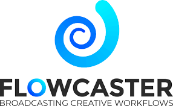

**Web Real-Time Communication (WebRTC)** is an open-source project that defines secure voice, audio, and data delivery between peers using web browsers or native clients. Dolby.io Real-time Streaming allows you to broadcast and distribute content using WebRTC for real-time global streaming to large-scale audiences.

## WebRTC support with WHIP

Most popular browsers including Chrome, Edge, Safari, Firefox, Opera and many native mobile applications support the use of WebRTC. [WebRTC HTTP Ingestion Protocol (WHIP)](https://dolby.io/blog/what-is-whip-intro-to-webrtc-streaming-part-1/) is an IETF protocol developed to standardize WebRTC ingestion. WebRTC support as a broadcast technology has been <a href="https://dolby.io/blog/whip-the-magic-bullet-for-webrtc-media-ingest/" target="_new">rapidly growing</a>.

Several software and hardware encoding solutions natively support ingesting and broadcasting WebRTC. You can find integration guides for more details such as with the following examples:

import { IconGrid, IconGridButton } from '@site/src/components/IconGrid';

<!-- prettier-ignore-start -->

<IconGrid>
    <IconGridButton large></IconGridButton>
    <IconGridButton large></IconGridButton>
    <IconGridButton large></IconGridButton>
    <IconGridButton large></IconGridButton>
    <IconGridButton large></IconGridButton>
    <IconGridButton large></IconGridButton>
</IconGrid>
<!-- prettier-ignore-end -->

The Dolby.io CDN for WebRTC Real-time Streaming supports streaming up to 4k 60fps video with 4:4:4 color encoded into H.264, H.265, VP8, VP9, and AV1. Additionally, Dolby.io fully supports transporting audio via the Opus codec, allowing for bitrates from 6 kb/s to 510 kb/s and sampling rates from 8 kHz (narrowband) to 48 kHz (full-band).

:::tip Support for WHIP, SRT, and RTMP
Dolby.io supports broadcasting [using SRT or RTMP](/millicast/broadcast/index.mdx) as well.
:::

WebRTC broadcasting is enabled via WHIP, to learn more about support for WebRTC egressing and playback learn more about [WHEP](/millicast/distribution/index.mdx).

## How-to find your WHIP publish settings

:::tip Getting Started
If you haven't already, begin by following the [Getting Started](/millicast/introduction-to-streaming-apis.mdx) tutorial to create a Dolby.io application and start your first broadcast. You will need to create a publish token to gather the necessary WHIP parameters.
:::

Log into the Dolby.io dashboard and go to the [Live Broadcast section](https://streaming.dolby.io/#/tokens) and select the publish token that you want to use for your WHIP streaming application.

### 1. Open the publish token settings

Open the publishing token's details by clicking the settings button from the item’s action menu.

import TokensMainSetting from '../assets/img/tokens-main-setting.png';

  

### 2. Gather your WHIP publish endpoint

In order for you to publish to Dolby.io Real-time Streaming with WebRTC you will need two things from the dashboard, the **WHIP endpoint** (including your Stream name) and the **Publishing token**.

Click on the **Publishing** tab for information on how to connect as a publisher to your Dolby.io account.

import WebRtcPublish from '../assets/img/webrtc-publish.png';

  

This information will authenticate you as a publisher on Dolby.io Real-time Streaming and allow you to successfully broadcast from a WebRTC source using your account.

How the WebRTC endpoint and the WebRTC token values are used is dependent on your software or hardware device. For example, some devices/encoders accept the values as separate parameters and some require them combined as a single URL. If your encoder has a separate token field, you will want to provide the WebRTC endpoint and the publishing token from the dashboard separately.

The following are examples of how these values can be used:

- As two separate fields, the endpoint, and the token. In the screen above, the examples are `https://director.millicast.com/api/whip/myStreamName` and `3bc330607a15a0ecebebd8c9ee2a559fd143c937174bd276e213a96425bb107e`
- Combine the endpoint and the token as a single WebRTC publish URL using `?auth=`. In the screen above the example is `https://director.millicast.com/api/whip/myStreamName?auth=3bc330607a15a0ecebebd8c9ee2a559fd143c937174bd276e213a96425bb107e`

:::caution The Hardware or Software MUST support WebRTC
Many hardware or software encoding solutions may include _endpoint_ and _token_ fields. This does not mean they support WebRTC or WHIP. You should review the tool's documentation to confirm it supports WebRTC before trying to stream to Dolby.io.

Dolby.io streaming also supports [SRT](/millicast/broadcast/using-srt.mdx) and [RTMP](/millicast/broadcast/using-rtmp-and-rtmps.mdx) streams for wider compatibility for tools that do not yet support WHIP.
:::

## Learn more

Learn more by exploring the [developer blog](https://dolby.io/blog/tag/broadcast/) and [code samples](https://github.com/orgs/dolbyio-samples/repositories?q=broadcast).
