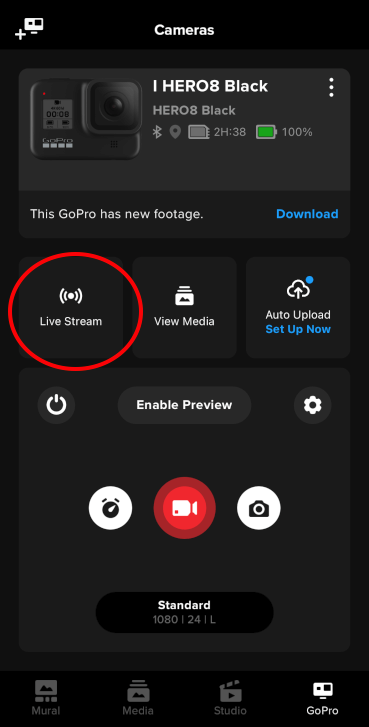
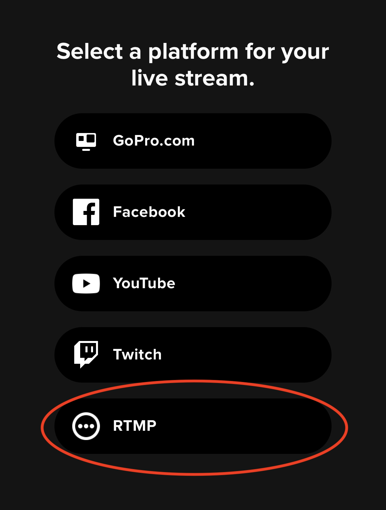
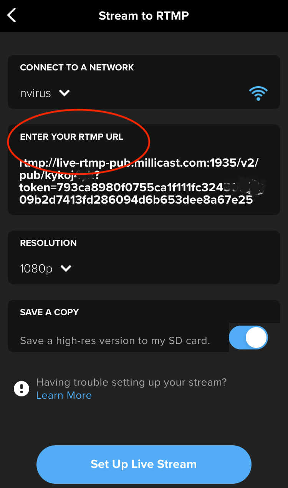
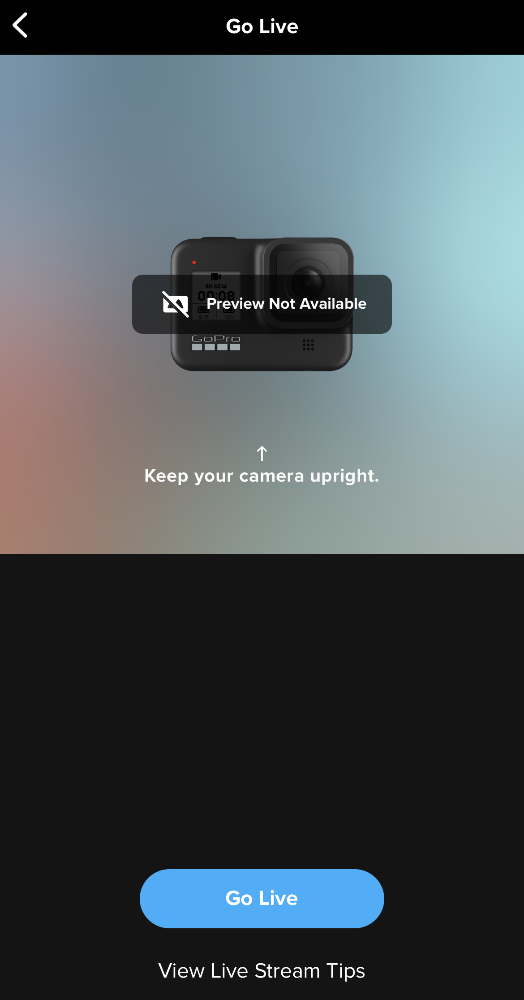
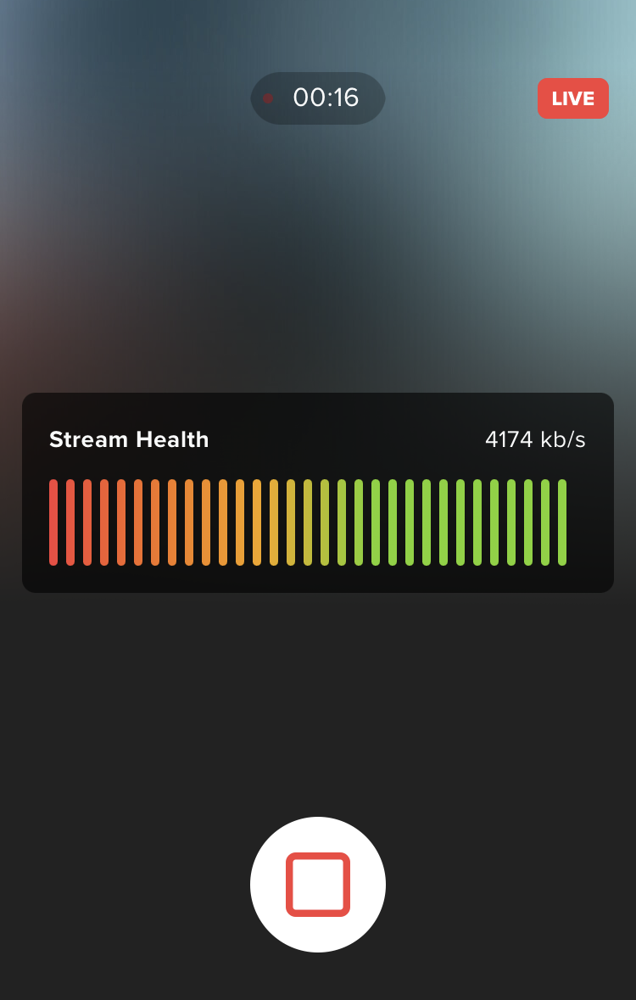
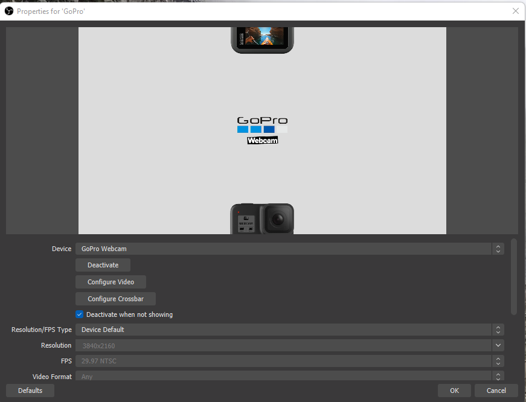

Sports and action cameras are designed to capture fast movements or provide a point-of-view perspective while in motion. Many of these types of cameras support WebRTC or RTMP output that can be used as a broadcast streaming source.

This guide has a few examples:

1. [Using the GoPro Quik App](/millicast/capture/action-cameras.md) using-the-gopro-quik-app)
2. [Using the GoPro Webcam Utility](/millicast/capture/action-cameras.md#using-the-gopro-webcam-utility)

If you are using an action camera that is not listed, you should be able to use similar settings for configuring streaming with an [RTMP](/millicast/broadcast/using-rtmp-and-rtmps.md) ingestion source.

## GoPro


[GoPro](https://gopro.com/) is a leader in action cameras. With the latest models of GoPro cameras, you can achieve sub-second latency by streaming with RTMP from your GoPro directly to Dolby.io for [distribution](/millicast/distribution/index.mdx) over WebRTC.

<ul class="checkBoxList">
<li> GoPro HERO Black</li>
<li> GoPro MAX</li>
</ul>

> 📘 Dolby.io Dashboard - Publish Token Details
> 
> You will need to have your Dolby.io **publishing token** and **stream name** in order to complete this setup. See the [Getting Started](/millicast/getting-started/using-the-dashboard.md) guide for instructions on creating a new app for the first time. You will also need the **RTMP publish path** from the _Publishing_ tab in the Dolby.io Dashboard. See the [RTMP](/millicast/broadcast/using-rtmp-and-rtmps.md) guide for more detail on where to find it.

### Using the GoPro Quik App

The GoPro [Quik App](https://gopro.com/en/us/shop/quik-app-video-photo-editor) allows remote connections to manage the camera and its settings since the GoPro HERO7 Black. 

An overview of the steps to begin capturing from a GoPro include:

1. Select Live Stream While Connected to Camera
2. Select RTMP as Platform
3. Enter your Dolby.io RTMP Publish URL
4. Go Live

The **Quick App** is a GoPro product, so the user interface and instructions may change in future releases from what is described below.  Visit the official [GoPro Support](https://community.gopro.com/s/?language=en_US) for resources like product manuals, help articles, and video tutorials on using the app if you have any questions.

#### 1. Select live stream while connected to camera

The _Live Stream_ button begins setup of a live stream for the camera.





#### 2. Select RTMP as platform

Some of the popular public streaming options are listed. To set up your private stream using Dolby.io, select _RTMP_ from the options.





#### 3. Enter your Dolby.io RTMP publish path

The _Publishing_ tab of the _Live broadcast - Publish tokens_ section of the Dolby.io dashboard includes the details you need.

<div style={{marginLeft: "20px"}}>

`RTMP publish path` + `/` + `RTMP publish stream name`

</div>

You can note that the **RTMP publish stream name** is already a concatenation of the _publishing token_ and _stream name_. Typically this will look something similar to:

```
rtmp://rtmp-auto.millicast.com:1935/v2/pub/${streamName}?token=${publishToken}
```

Connect to a local network and include this as the **RTMP URL**. Pick the resolution that best suits your needs.





Click the _Set Up Live Stream_ button.

#### 4. Go live

When ready to start capturing, click the `Go Live` button.





The Quik app will show you a timecode for the duration of the stream as well as an indicator of _Stream Health_ from the local network performance as indicated by the bit rate.





To verify everything is working, you view the stream using any suitable [playback](/millicast/playback/index.mdx) method, such as the hosted web viewer described in the [Getting Started](/millicast/introduction-to-streaming-apis.mdx) guide available directly from the Dolby.io Dashboard.

### Using the GoPro webcam utility

The GoPro [Webcam](https://community.gopro.com/s/article/GoPro-Webcam?language=en_US) desktop utility for Mac or Windows allows you to configure a GoPro HERO8 Black or later camera to capture a stream much like you would any other [web cameras](/millicast/capture/web-cameras.mdx) attached to a computer. 

The **Webcam Utility** is a GoPro product, so the behavior and instructions may change in future releases from what is described below.  Visit the official [GoPro Support](https://community.gopro.com/s/?language=en_US) for resources like Product Manuals, Help Articles, and Video Tutorials on using the app if you have any questions.

#### a) Stream with the Dolby.io dashboard

With the GoPro Webcam utility, your GoPro camera will be present as an option from the media device selection. Follow the same instructions for broadcasting described in [Part 1: Using the Streaming Dashboard](/millicast/getting-started/using-the-dashboard.md).


#### b) Stream using a GoPro from OBS

Similar to using the Dolby.io Dashboard, you can select the GoPro Webcam from the list of available devices. See the [OBS](/millicast/software-encoders/using-obs.md) guide for more detail on how to configure OBS to broadcast the captured stream.





### Troubleshooting

If you run into any trouble, see the official [GoPro Support](https://community.gopro.com/s/?language=en_US) for resources like Product Manuals, Help Articles, and Video Tutorials on using the app if you have any questions.

## Learn more

Once you have configured your camera for capture, visit the [broadcast](/millicast/broadcast/index.mdx), [distribution](/millicast/distribution/index.mdx), and [playback](/millicast/playback/index.mdx) guides to complete your project.

If you have a different type of action camera than the ones listed, reach out to our [support team](https://support.dolby.io/) to ask about compatibility.
