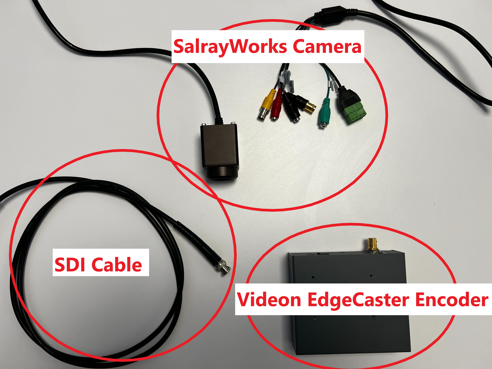
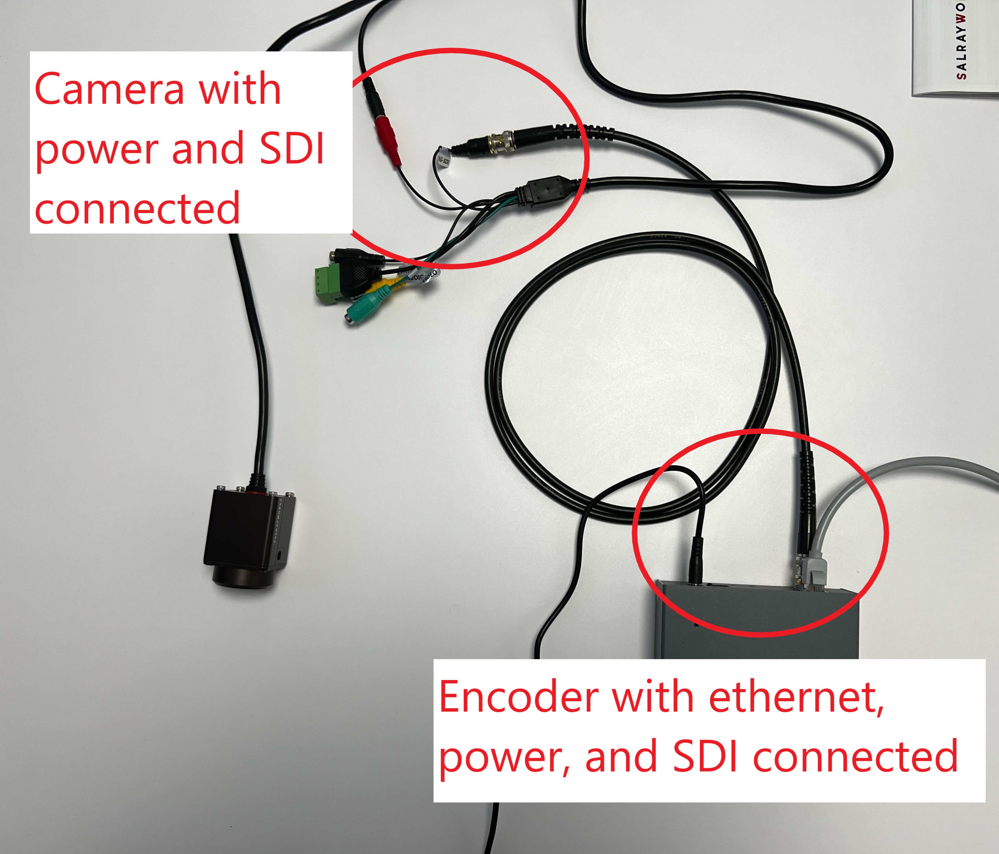

Dolby.io Real-time Streaming supports broadcast-grade workflows that use professional cameras and encoders to deliver high-quality, real-time video and audio streams globally to massive audiences. Broadcast-grade cameras are typically recommended for sports streaming, live events, and experiences where quality and low latency are prioritized. This guide will outline how to prepare professional cameras for capture so you can broadcast with Dolby.io Real-time Streaming.

When capturing video and audio for broadcast, there are a number of decisions that need to be made, such as:

- What video resolution and framerate should I capture?
- Should I use chroma subsampling or capture at 4:4:4?
- What bitrate and sampling rates should I capture audio at?
- Does my camera have a built-in encoder, or will I need to connect to one?
- Am I planning to broadcast with [RTMP, RTMPs](/millicast/broadcast/using-rtmp-and-rtmps.md), [SRT](/millicast/broadcast/using-srt.md), or [WebRTC](/millicast/hardware-encoders/using-osprey-talon-whip-hardware-encoder.md)?

These decisions may be impacted by the camera you are capturing with, the encoder you are planning to use to broadcast, and the Dolby.io CDN itself. 

The Dolby.io CDN for WebRTC Real-time Streaming supports streaming up to 4k 60fps video with 4:4:4 color encoded into H.264, H.265, VP8, VP9, and AV1. Additionally, Dolby.io also fully supports transporting audio via the [Opus codec](https://opus-codec.org/), allowing for bitrates from 6 kb/s to 510 kb/s and sampling rates from 8 kHz (narrowband) to 48 kHz (full-band). RTMP, RTMPs, and SRT streams can also be ingested and will be transmuxed into a WebRTC stream via the Dolby.io CDN, though their codec support may vary.

> 🚧 Codec support varies between RTMP, RTMPs, SRT, and WebRTC
> 
> Since RTMP, RTMPs, and SRT streams are transmuxed into WebRTC via the Dolby.io CDN they each have different audio and video codec support. Learn more in the [broadcast section](/millicast/broadcast/index.md) of the streaming guides.

Once you have calibrated the camera for the appropriate video resolution and audio resolution for your use case, you will then need to connect the camera to an encoder or calibrate the built-in encoder. Dolby.io supports broadcasting [RTMP and RTMPs streams](/millicast/broadcast/using-rtmp-and-rtmps.md), [SRT streams](/millicast/broadcast/using-srt.md), and [WebRTC streams](/millicast/hardware-encoders/using-osprey-talon-whip-hardware-encoder.md). To start streaming with Dolby.io Real-time Streaming, proceed to the [Broadcast](/millicast/broadcast/index.md) to learn about hardware and software encoder support.

# Preparing to broadcast with the SalrayWorks raySHOT camera

One example of preparing a professional camera for broadcasting is setting up the [SalrayWorks raySHOT Ultra Latency camera](http://salrayworks.com/eng/bbs/board.php?bo_table=pro_05&wr_id=4). The raySHOT Ultra Latency camera specializes in capturing video with a delay between 0-15ms allowing for exceptionally fast streaming when paired with Dolby.io Real-time Streaming. Using the decision list above, we can break down what our capture profile and broadcast workflow will look like for the camera:

- **What video resolution and framerate should I capture?** The camera is limited to 1080p and 60fps.
- **Should I use chroma subsampling or capture at 4:4:4?** The raySHOT supports 4:4:4 to allow for the lowest possible delay.
- **What bitrate and sampling rates should I capture audio at?** The camera only captures video.
- **Does my camera have a built-in encoder, or will I need to connect to one?** The camera does not have a built-in encoder, so we'll use a [Videon EdgeCaster](/millicast/hardware-encoders/videon.md).
- **Am I planning to broadcast with [RTMP, RTMPs](/millicast/broadcast/using-rtmp-and-rtmps.md), [SRT](/millicast/broadcast/using-srt.md), or [WebRTC](/millicast/hardware-encoders/using-osprey-talon-whip-hardware-encoder.md)?** Videon supports RTMP output, so we'll use that.

With our capture profile defined, we can look at our physical setup:

We have the camera, the encoder, and a serial digital interface (SDI) cable to connect the camera to the encoder. We can now power the camera and the encoder, connect the encoder to the internet via an ethernet cable, and connect the camera to the encoder with the SDI cable.

With everything connected, the SalrayWorks camera is now ready to capture broadcast-ready video and transport it to the encoder. At this stage, everything is set up and ready for capture. To learn about the next steps required for broadcasting, check out the [Videon guide](/millicast/hardware-encoders/videon.md) in the broadcasting section of the documentation.

