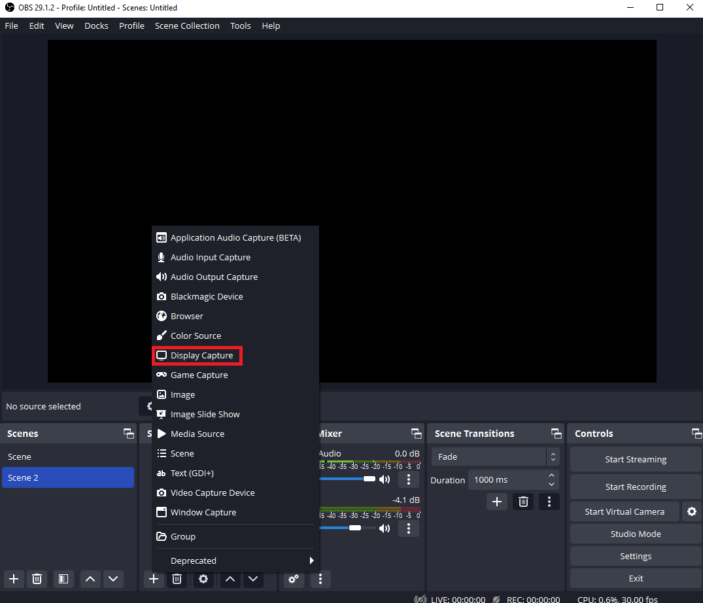

Screensharing or screen capturing is an important feature for virtual events, webinars, and many other types of broadcasts that involve sharing information. This guide will outline three options for managing screen capture in a way that is compatible with Dolby.io:

1. [Screensharing with the Dolby.io Dashboard Broadcaster](/millicast/capture/screensharing.md)screensharing-with-the-dolbyio-dashboard-broadcaster)
2. [Screensharing with OBS](/millicast/capture/screensharing.md)screensharing-with-obs)
3. [Screensharing with JavaScript](/millicast/capture/screensharing.md)screensharing-with-javascript)

> 🚧 Sharing Screen and Video
> 
> If you want to enable both screensharing and share your webcam at the same time, you must enable [multisource](/millicast/broadcast/multi-source-broadcasting.md) on the publishing token to broadcast multiple sources to the same stream.

# Screensharing with the Dolby.io dashboard broadcaster

Once you have created a Dolby.io account, you can begin using the Dolby.io dashboard to create and manage tokens, manage your Dolby.io account, and broadcast and view active streams.

Inside the dashboard, click the Broadcast button located adjacent to the token.


Inside the dashboard broadcaster, click on the camera icon in the bottom left corner. To share your screen, select the "Share Screen" option and start sharing.


With your screen shared to the dashboard broadcaster, you are now set up to capture content from your desktop. You can click start to begin broadcasting or proceed to [Broadcast](/millicast/broadcast/index.mdx) to learn about broadcast settings.

# Screensharing with OBS

[Open Broadcast Software](https://obsproject.com/), or OBS, is a popular screencasting and streaming app available as free open-source software. To connect a web camera to OBS you first need to [download](https://obsproject.com/) the software appropriate to your operating system. Once downloaded and installed, open the app.

Inside the app, click the plus icon within the Sources tab and add a Display Capture.





Select the screen you want to share and whether you want OBS to capture the cursor or not.


With your screen selected click "OK". You've now set up your screen for capture via OBS. To start streaming from OBS continue to the [broadcasting with OBS guide](/millicast/software-encoders/using-obs.md).

# Screensharing with JavaScript

Screen capturing with JavaScript is straightforward thanks to screen capture support with the [`getDisplayMedia`](https://developer.mozilla.org/en-US/docs/Web/API/MediaDevices/getDisplayMedia) method provided by the `MediaDevices` interface. The `getDisplayMedia` method is supported on both Windows and Mac devices for all major browsers, however, it isn’t currently available for mobile devices. For a full list of support for `getDisplayMedia` [see this table here](https://developer.mozilla.org/en-US/docs/Web/API/MediaDevices#browser_compatibility). 

To get started using `getDisplayMedia` we first need to define our display media options:

```javascript
const displayMediaOptions = {
    video: {
        displaySurface: "window",
    },
    audio: false,
};
```

In this case, display audio is not being captured, just the display window as a video feed. There are a number of different settings to adjust with the [full list available here](https://developer.mozilla.org/en-US/docs/Web/API/MediaDevices/getDisplayMedia). 

With our options defined, we can use the `getDisplayMedia` method to capture our screen:

```javascript
const screenCapture = await navigator.mediaDevices.getDisplayMedia(displayMediaOptions);
```

With that, the screen is now being captured. When this function is called, users will receive a permissions prompt from the browser which they will have to approve for the device to begin capturing content. This screen capture can then be passed as a `mediaStream` into the Dolby.io Millicast JavaScript SDK. To learn more about how you can begin broadcasting a screen capture, explore the Client SDK guides or check out this detailed blog for [screenshare streaming in JavaScript](https://dolby.io/blog/how-to-screen-capture-for-streaming-in-javascript/).

# Additional Client SDKs

You can find similar capabilities as JavaScript from one of the other Client SDKs listed below:

<div class="small-image-and-text-btn-container">
  <a href="/millicast/client-sdks/web.md" class="small-image-and-text-btn">
    <div class="small-image-and-text-btn-inner-container">
      <div>
        
      </div>
      <div class="small-image-and-text-btn-title">Web SDK</div>
    </div>
  </a>
  
  <a href="/millicast/client-sdks/ios" class="small-image-and-text-btn">
    <div class="small-image-and-text-btn-inner-container">
      <div>
        
      </div>
      <div class="small-image-and-text-btn-title">iOS SDK</div>
    </div>
  </a>
  
  <a href="/millicast/client-sdks/android" class="small-image-and-text-btn">
    <div class="small-image-and-text-btn-inner-container">
      <div>
        
      </div>
      <div class="small-image-and-text-btn-title">Android SDK</div>
    </div>
  </a>    
  
  <a href="/millicast/client-sdks/rn.md" class="small-image-and-text-btn">
    <div class="small-image-and-text-btn-inner-container">
      <div>
        
      </div>
      <div class="small-image-and-text-btn-title">React Native</div>
    </div>
  </a>    
  
  <a href="/millicast/client-sdks/desktop" class="small-image-and-text-btn">
    <div class="small-image-and-text-btn-inner-container">
      <div>
        
      </div>
      <div class="small-image-and-text-btn-title">Mac SDK</div>
    </div>
  </a>    
  
  <a href="/millicast/client-sdks/desktop" class="small-image-and-text-btn">
    <div class="small-image-and-text-btn-inner-container">
      <div>
        
      </div>
      <div class="small-image-and-text-btn-title">Linux SDK</div>
    </div>
  </a>    
  
  <a href="/millicast/client-sdks/flutter.md" class="small-image-and-text-btn">
    <div class="small-image-and-text-btn-inner-container">
      <div>
        
      </div>
      <div class="small-image-and-text-btn-title">Flutter SDK</div>
    </div>
  </a>    
    <a href="/millicast/client-sdks/desktop" class="small-image-and-text-btn">
    <div class="small-image-and-text-btn-inner-container">
      <div>
        
      </div>
      <div class="small-image-and-text-btn-title">.NET SDK</div>
    </div>
  </a>
</div>

