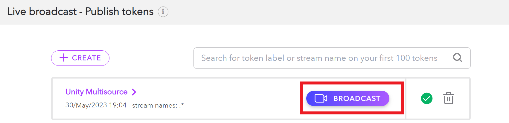
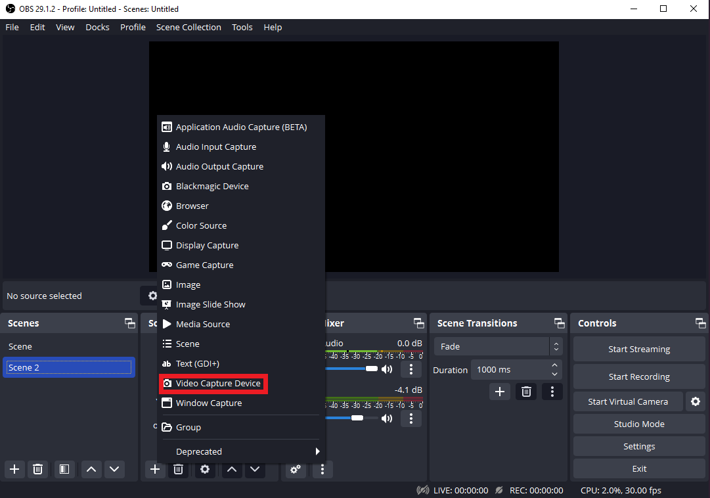

Web cameras are an easy and accessible way to capture content for broadcast with Dolby.io Streaming. Since web cameras are ubiquitous, there are many different software solutions to capture from a web camera. 

This guide outlines three options for managing web camera capture:

1. [Connecting a Web Camera to the Dolby.io Dashboard Broadcaster](/millicast/capture/web-cameras.md)connecting-a-web-camera-to-the-dolbyio-dashboard-broadcaster)
2. [Connecting a Web Camera to OBS](/millicast/capture/web-cameras.md)connecting-a-web-camera-to-obs)
3. [Capturing from a Web Camera using JavaScript](/millicast/capture/web-cameras.md)capturing-from-a-web-camera-using-javascript)

# Connecting a web camera to the Dolby.io dashboard broadcaster

Once you have created a Dolby.io account, you can begin using the [Dolby.io dashboard](https://streaming.dolby.io/#/tokens) to create and manage tokens, manage your Dolby.io account, and [broadcast](/millicast/broadcast/index.md) and view active streams. 

Inside the dashboard, click the Broadcast button located adjacent to the token.





Inside the dashboard broadcaster, click the camera icon in the bottom left corner to select your video input device. If the web camera is correctly connected to the device, it will be discoverable alongside other video devices and virtual cameras. 


Audio input devices function the same way and can be toggled by clicking on the microphone icon next to the camera icon.

With your web camera connected to the dashboard broadcaster, you are now set up to capture content from your web camera. You can click start to begin broadcasting or proceed to [Broadcast](/millicast/broadcast/index.md) to learn about the distinct settings.

# Connecting a web camera to OBS

[Open Broadcast Software](https://obsproject.com/), or OBS, is a popular screencasting and streaming tool available as free, open-source software. To connect a web camera to OBS, you first need to [download the software](https://obsproject.com/) appropriate for your operating system. 

Follow along with this video guide or read the steps below.

<div align="center"> <iframe width="560" height="315" src="https://www.youtube.com/embed/jUP4vyzbu5Y" title="YouTube video player" frameborder="0" allow="accelerometer; autoplay; clipboard-write; encrypted-media; gyroscope; picture-in-picture; web-share" allowfullscreen></iframe></div>


Once downloaded and installed, open the app.

Inside the app, click the "+" icon within the Sources tab and add a Video Capture Device.





When adding the Video Capture Device, make sure to select your Web Camera as the device you want to create a capture for.


With your camera selected, click "OK". You've now set up your Web Camera for capture via OBS. To start streaming from OBS, continue to the [broadcasting with OBS guide](/millicast/software-encoders/using-obs.md).

# Capturing from a web camera using JavaScript

If you are looking to prepare a Web Camera for capture within your application or platform, you'll need a programmatic solution. Dolby.io streaming supports [a number of SDKs](/millicast/client-sdks/index.md) for building streaming solutions bespoke to your project.

## Identify available cameras

To start capturing from a web camera, you must select the Web Camera device. You can accomplish this by first enumerating the devices with the [`mediaDevices.enumerateDevices()`](https://developer.mozilla.org/en-US/docs/Web/API/MediaDevices/enumerateDevices) function.

```javascript
navigator.mediaDevices
    .enumerateDevices()
    .then((devices) => {
      devices.forEach((device) => {
        console.log(`${device.kind}: ${device.label} id = ${device.deviceId}`);
      });
    })
```

The `enumerateDevices` function provides a list of audio and video input devices along with their respective `deviceId`. 

## Select the camera

Using the `deviceId`, you can select your web camera and "get" it using the [`getUserMedia`](https://developer.mozilla.org/en-US/docs/Web/API/MediaDevices/getUserMedia) function.

```javascript
navigator.mediaDevices.getUserMedia({
  video: {
    deviceId: myPreferredCameraDeviceId,
  },
});
```

Once you've selected the web camera with `getUserMedia` it is ready to capture video and audio.

# Additional Client SDKs

You can find similar capabilities to the JavaScript SDK from the other Client SDKs listed below:

<div class="small-image-and-text-btn-container">
  <a href="https://docs.dolby.io/streaming-apis/docs/web" class="small-image-and-text-btn">
    <div class="small-image-and-text-btn-inner-container">
      <div>
        
      </div>
      <div class="small-image-and-text-btn-title">Web SDK</div>
    </div>
  </a>
  
  <a href="https://docs.dolby.io/streaming-apis/docs/ios" class="small-image-and-text-btn">
    <div class="small-image-and-text-btn-inner-container">
      <div>
        
      </div>
      <div class="small-image-and-text-btn-title">iOS SDK</div>
    </div>
  </a>
  
  <a href="https://docs.dolby.io/streaming-apis/docs/android" class="small-image-and-text-btn">
    <div class="small-image-and-text-btn-inner-container">
      <div>
        
      </div>
      <div class="small-image-and-text-btn-title">Android SDK</div>
    </div>
  </a>    
  
  <a href="https://docs.dolby.io/streaming-apis/docs/rn" class="small-image-and-text-btn">
    <div class="small-image-and-text-btn-inner-container">
      <div>
        
      </div>
      <div class="small-image-and-text-btn-title">React Native</div>
    </div>
  </a>    
  
  <a href="https://docs.dolby.io/streaming-apis/docs/desktop" class="small-image-and-text-btn">
    <div class="small-image-and-text-btn-inner-container">
      <div>
        
      </div>
      <div class="small-image-and-text-btn-title">Mac SDK</div>
    </div>
  </a>    
  
  <a href="https://docs.dolby.io/streaming-apis/docs/desktop" class="small-image-and-text-btn">
    <div class="small-image-and-text-btn-inner-container">
      <div>
        
      </div>
      <div class="small-image-and-text-btn-title">Linux SDK</div>
    </div>
  </a>    
  
  <a href="https://docs.dolby.io/streaming-apis/docs/flutter" class="small-image-and-text-btn">
    <div class="small-image-and-text-btn-inner-container">
      <div>
        
      </div>
      <div class="small-image-and-text-btn-title">Flutter SDK</div>
    </div>
  </a>    

    <a href="https://docs.dolby.io/streaming-apis/docs/desktop" class="small-image-and-text-btn">
    <div class="small-image-and-text-btn-inner-container">
      <div>
        
      </div>
      <div class="small-image-and-text-btn-title">.NET SDK</div>
    </div>
  </a>
  
  <a href="https://docs.dolby.io/streaming-apis/docs/unity-getting-started" class="small-image-and-text-btn">
    <div class="small-image-and-text-btn-inner-container">
      <div>
        
      </div>
      <div class="small-image-and-text-btn-title">Unity plugin</div>
    </div>
  </a> 
  
  <a href="https://docs.dolby.io/streaming-apis/docs/player-plugin" class="small-image-and-text-btn">
    <div class="small-image-and-text-btn-inner-container">
      <div>
        
      </div>
      <div class="small-image-and-text-btn-title">Unreal plugin</div>
    </div>
  </a> 
</div>

