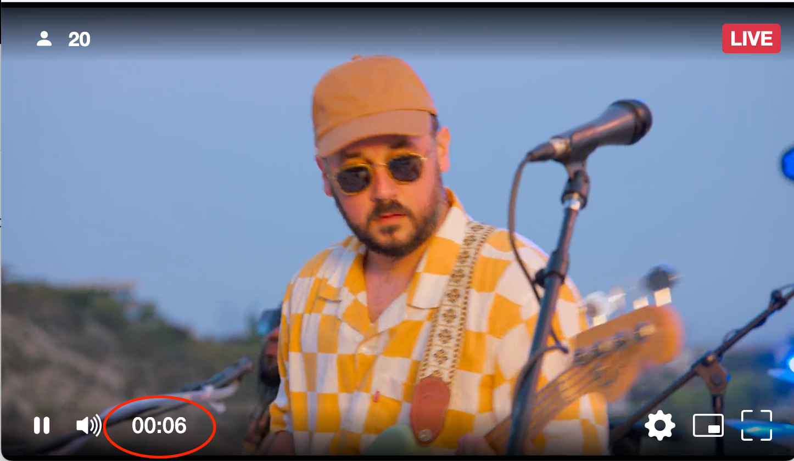
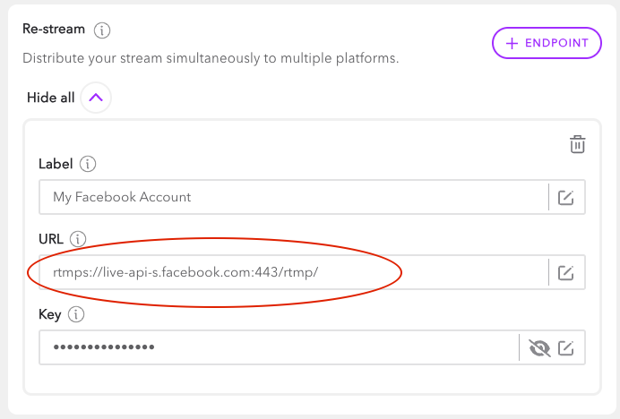
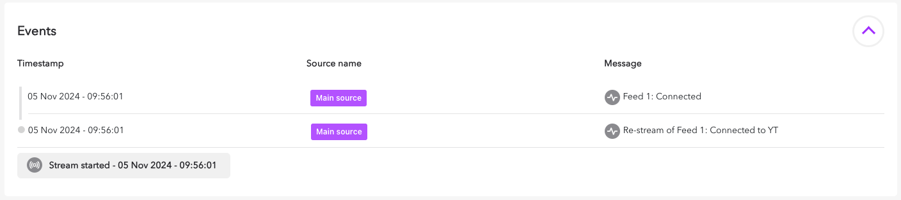
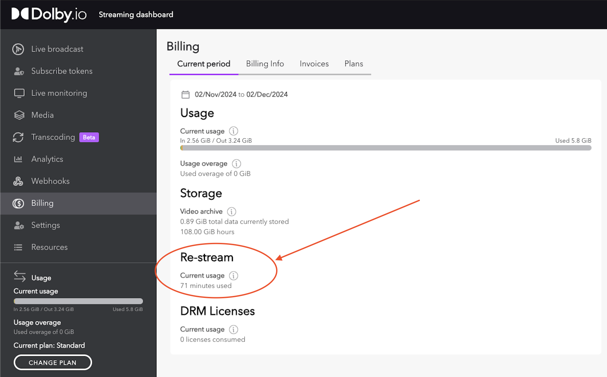
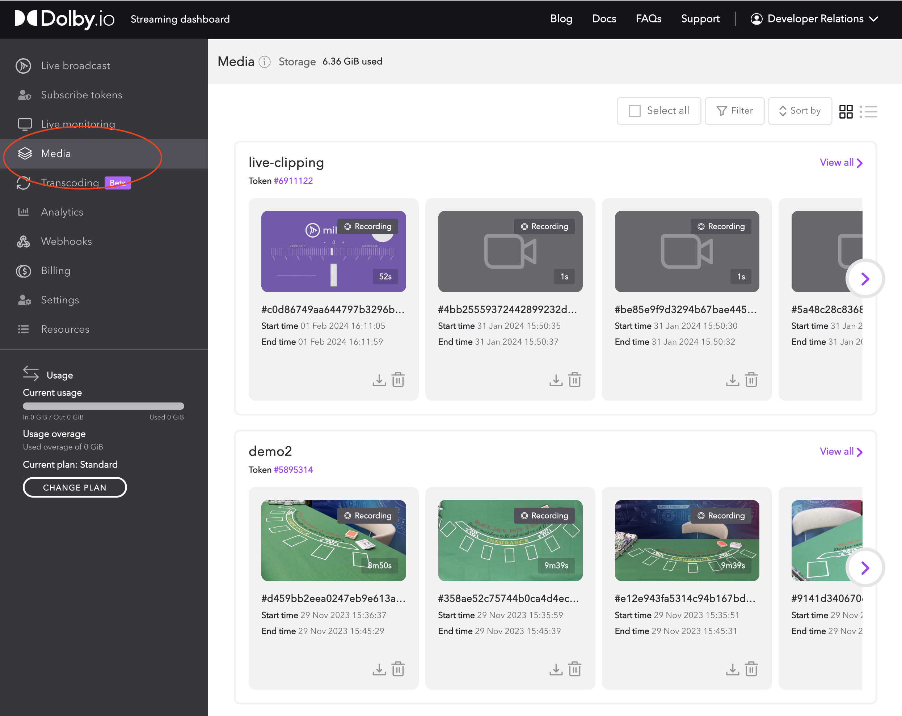
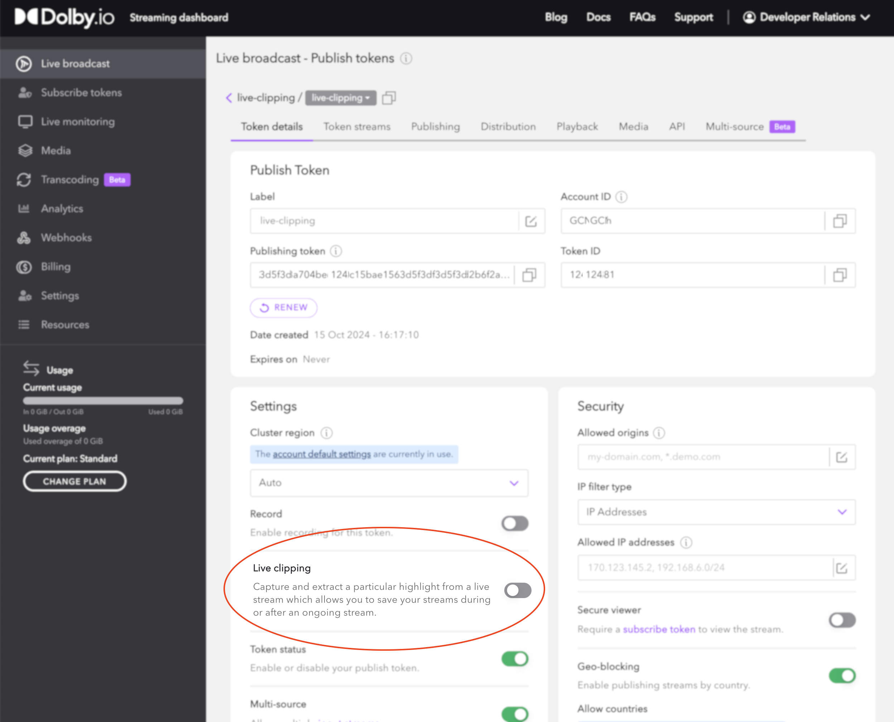
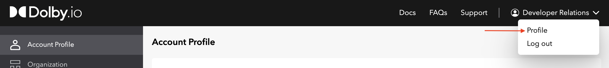
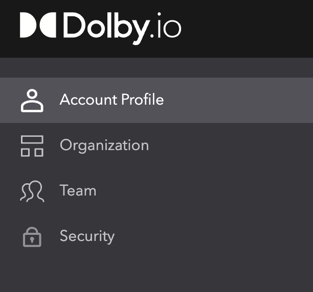
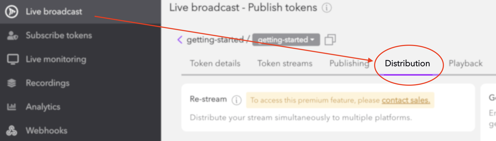

Updates to the Dolby.io Dashboard and Applications.

## 2024-12-12 | Dashboard & Hosted Player

## Dashboard

On the dashboard, users can now set the account-wide expiration rules rules for their recorded media.  This means that media can be auto-deleted without the need for additional API calls. This includes:

- [Recordings](/millicast/distribution/stream-recordings/index.md): The full-length stream recordings that are created when recording is enabled on a token
- [Clips](/millicast/distribution/stream-recordings/live-clipping.md): Clips generated from the [Media Asset API](/millicast/api/media-assets-create-media-asset/) when utilizing Dolby cloud storage
- [Timelines](/millicast/distribution/stream-recordings/live-clipping.md): Timelines are the "media cache" that clips are generated from and are required to create a clip. They are always stored on Dolby cloud storage.  By default timelines will expire after 1 day.  Users can change this value if they wish to be able to clip  further back in time.

These settings are available in the streaming dashboard under `Settings > Media`

 so that URLs would look like this to enable the timer: `https://viewer.millicast.com/?streamId=k9Mwad/multiview&showTimer=true`.  As a reminder, the timer is how long the viewer has been watching the stream and not how long the stream has been running.

An image of what the timer looks like can be seen in the red circle below:

## 2024-11-07 | Dashboard

With this latest dashboard release, we’ve introduced support for RTMPS endpoints in re-stream and enhanced visibility with re-stream events in the Live Monitor event log. Additionally, re-stream usage now appears in your billing overview for easier tracking.

## :new: RTMPS Re-Streaming

You can now configure RTMPS endpoints in the re-stream section of the distribution tab. This added security layer allows for secure re-streaming, broadening compatibility and enhancing stream stability across a wider variety of platforms.

### Monitor Re-Stream Events

A new event type is now available in the [Live Monitoring](/millicast/streaming-dashboard/live-monitoring.md) event log, enabling you to view re-stream related events and errors in real-time as they occur.

### Track Re-Stream Usage on Billing Page

Re-stream usage data now appears directly on your billing page, giving you a clear view of number of re-stream minutes consumed.

# 2024-10-15 | Dashboard

You'll find this latest dashboard release provides access to the new live clipping feature and ability to manage media assets such as recordings and clips.

You can find additional related changes in the [REST APIs and GraphQL Release Notes](/millicast/changelog/changelog-rest-apis.md).

## :new: Live Clipping

With **live clipping** you can capture a partial clip from an active ongoing stream that is immediately available. This can power many solutions such as social network sharing, replay capabilities, as well as archival and auditing. Learn more from the [Stream Recordings](/millicast/distribution/stream-recordings/index.md) guide.

### Media

The recordings menu has been replaced with a new **Media** section. This is where you can find any media being stored for your account. This view allows you to filter by type and all media is grouped by the token used to generate the media.

### Token Setting

Live clipping is a setting that must be enabled on a token in order to create clips. It is an optional on any [Publish Tokens](/millicast/managing-your-tokens) and has cost implications for storage and usage. This is a premium feature so please work with your account team to have it enabled for your account.

# 2024-09-26 | Dashboard

You'll find usability improvements included in our latest Dolby.io dashboard release. It is now easier to manage your account profile, organization, team and security settings. 

## Account Profile Dashboard

Select the Profile item from the account dropdown and you'll find additional settings you can use to manage your Dolby.io account.

From here you'll find additional menu items:

- **Account Profile:** This is where you can update your name, title, and contact details.
- **Organization:** Access your organization id and change the name to match your business.
- **Team:** Add additional users to your account to share access with your team.
- **Security:** Update your password, turn on two-factor, and manage active sessions.

# 2024-08-19 | Dashboard

## :new: Distribution Tab with Re-stream Configuration

With this dashboard update you can now find a new **Distribution** tab within the publish token with settings that allow you to modify how the CDN distributes the stream to end viewers.

- [Re-streaming](/millicast/distribution/re-streaming.md): fan-out a stream to up to ten (10) endpoints that accept incoming RTMP connections for syndicated broadcasting and distribution.
- [Geo-cascading](/millicast/distribution/multi-region-support/geo-cascading.md): configuration of edge servers that handle the last-mile distribution of a stream for playback can be found.

# 2024-07-25 | Millicast Player ([1.5.1](https://www.npmjs.com/package/@millicast/vue-viewer-plugin?activeTab=readme))

## :new: View Metadata

The [Hosted Player](/millicast/playback/hosted-viewer.md) now supports propagation of [metadata](/millicast/playback/frame-metadata.md) events to the application such as timecodes from SEI / AMF / PIC_TIMING.  There is a query parameter `&metadata=true` that will enable the processing of received metadata and displays it to a rendered canvas. Any unregistered metadata is sent to the browser console.

## :new: Force Playout Delay

You can adjust the playback buffer to make trade-offs between quality and latency. You need to specify both query string parameters `forcePlayoutDelayMin` and `forcePlayoutDelayMax` to enable this behavior

# 2024-02-15

## Dolby.io Dashboard

### Live Monitoring

Introduced the [Live Monitoring dashboard](/millicast/streaming-dashboard/live-monitoring.md), which allows customers to view information about stream ingests to quickly diagnose and triage any issues.

# 2023-10-27

## Dolby.io Dashboard

### Multi-source Builder

Introduced the [Multi-source Builder](/millicast/streaming-dashboard/multi-source-builder.md) that allows you to build and configure multiple publishing sources from the Streaming Dashboard. You can add multiple SRT, RTMP or WebRTC sources and use the user-interface to configure multi-bitrate publishing. The Multi-source tab also includes a URL to launch the hosted player with the multi-viewer configuration, customizable `iframe` code to embed the hosted player into your webpage, and the ability to export your multi-source configuration as a file.