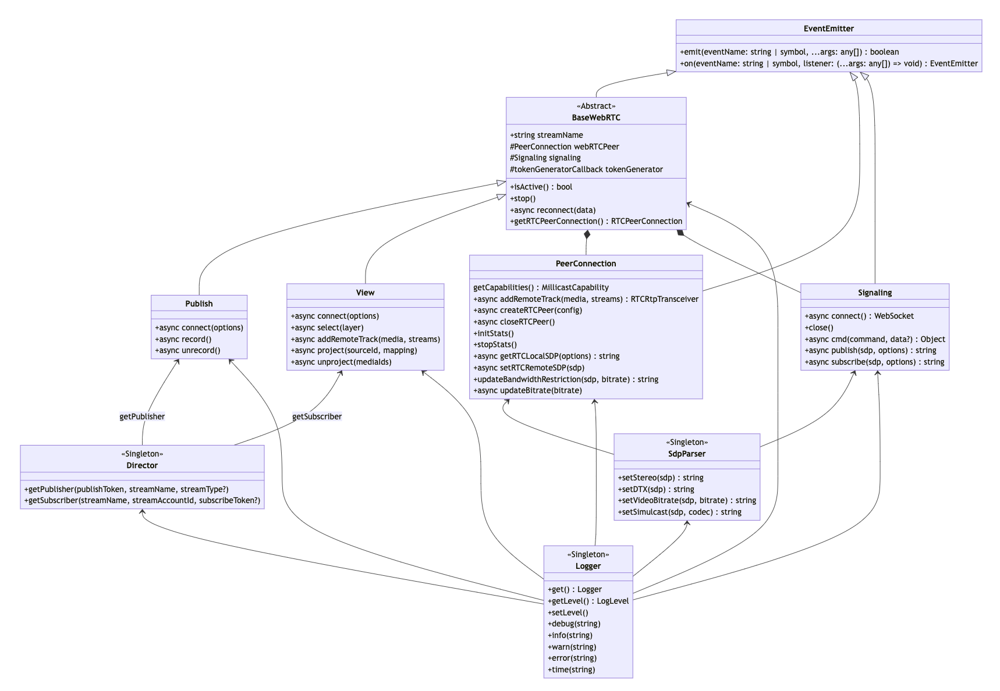

# Web SDK Changes

Updates to the [JavaScript Web SDK](https://github.com/millicast/millicast-sdk) for custom web applications, React Native applications, and the [VueJS Web Viewer Plugin](https://github.com/millicast/vue-viewer-plugin).

:::tip Release History
You can find the full history of previous releases with downloadable assets from the [millicast/millicast-sdk](https://github.com/millicast/millicast-sdk/releases) repository.
:::

## 2024-08-14 | Web SDK [0.2.1](https://github.com/millicast/millicast-sdk/releases/tag/v0.2.1)

This release includes some minor updates:

- The **duration** in which a client has been connected is now returned with the `diagnose()` report. Additionally, the `on('stats')` data set has been updated so that **bitrate** is shown in bytes per second and a new value **bitrateBitsPerSecond** will return the bit value.  
  See [Client Analytics](/millicast/playback/client-analytics-and-monitoring.md) for additional details on how to retrieve and use these values.
- When working with [Frame Metadata](/millicast/playback/frame-metadata.md), the **uuid** parameter is now optional and allows for improved support from encoders that send **PIC_TIMING** metadata sources.

View the [0.2.1 release](https://github.com/millicast/millicast-sdk/releases/tag/v0.2.1) tag for some additional details on these updates.

## 2024-07-17 | Web SDK [0.2.0](https://github.com/millicast/millicast-sdk/releases/tag/v0.2.0)

This release introduces some major improvements:

- With `sendMetadata()` you can publish metadata with your broadcast and synchronize playback events with frame-level accuracy.
- The `diagnose()` function can be used to troubleshoot the end-user quality of experience while gathering client-side analytics and key streaming metrics.
- The `forcePlayoutDelay` setting can be used when connecting to configure the buffer time the server will utilize for any lost frames that may occur under poor network conditions.
- You can enable [Simulcast](/millicast/using-webrtc-simulcast) (both viewing and publishing) on all chromium-based browsers including Edge.

### 🆕 Frame Metadata

A `metadata` event will be received with every frame as it is decoded for H.264 codecs that support **Supplemental Enhancement Information (SEI)**. This allows for the exchange of arbitrary data between broadcast and playback clients or the extraction of **Action Message Format (AMF)** metadata from many common broadcast encoders.

```javascript
await millicastView.connect({ codec: 'h264', metadata: true });

millicastView.on('metadata', (metadata) => {
  if (metadata.timecode) {
    console.log('received timecode messsage', metadata.timecode);
  }
});
```

> 📘 Frame Metadata
>
> Review the [Frame Metadata](/millicast/playback/frame-metadata.md) guide for additional details and instructions.

### 🆕 Client-side Diagnostics

To diagnose networking issues in your web applications it may be helpful to view [WebRTC statistics](/millicast/client-sdks/web/sdk/index.mdx#webrtc-stats) related to round-trip time, jitter, etc. This can also power [Client Analytics](/millicast/playback/client-analytics-and-monitoring.md) to populate application performance monitoring or observability tools such as [Datazoom](/millicast/datazoom) or [Datadog](/millicast/client-analytics/datadog.md). Using the new `statsIntervalMs`option you can customize the frequency in which the stats events are observed.

```javascript
const options = {
  peerConfig: {
    autoInitStats: true,
    statsIntervalMs: 5000,
  },
};

await millicastView.connect(options);

// This event will be fired every 5s instead of every 1s by default
millicastView.webRTCPeer.on('stats', (stats) => {
  console.log(stats);
});
```

With the `autoInitStats` setting it is no longer necessary to explicitly call `PeerConnection.initStats()`.

Introduced in 0.1.44, the`Logger.diagnose()` function has been extended and can be used to capture a historical snapshot of buffered stats events and application log history. Whenever seeking help to diagnose playback problems, the output of this function can be a valuable snapshot of an end-user problem report.

> 📘 Diagnostics
>
> Review the [Client Analytics](/millicast/playback/client-analytics-and-monitoring.md) guide for more details and instructions.

### 🆒 Playback Buffer

Use the `forcePlayoutDelay` parameter as a connection option. This configures the buffer time the server will utilize which can correct for lost frames that may occur under poor network conditions. The values for **min** and **max** values (in milliseconds) allow for configuring a trade-off between latency and quality.

```javascript
const options = {
  forcePlayoutDelay: {
    min: 200,
    max: 250,
  },
};

await millicastView.connect(options);
```

### Other Updates

View the [0.2.0 release](https://github.com/millicast/millicast-sdk/releases/tag/v0.2.0) tag for specific details on these updates.

- The `updated` [broadcast event](/millicast/playback/viewer-events.md) will now be available as a default event when connecting as an indication of cases where an audio track is added later and independent of the video feed.
- The 0.1.46 release included an `onMetadata` event that has been deprecated and replaced with `metadata` as the event type. Both events will continue to be emitted until version 0.3.0 and later.
- It is no longer necessary to specify a `streamName` to the constructor for **View** and **Publish** when provided to`Director.getSubscriber(streamName)`. It will continue to be accepted but will soon emit a deprecation warning and be removed entirely in the 1.0.0 release.
- The `updateBitrate()` function has been removed.

## 2024-03-11 | Web SDK [0.1.44](https://github.com/millicast/millicast-sdk/releases/tag/v0.1.44)

View the [0.1.44 release](https://github.com/millicast/millicast-sdk/releases/tag/v0.1.44) tag for the full list of changes.

### Features

Introduced a new `Logger.diagnose()` function to gather debugging information from playback clients. The data includes the SDK version, user agent, media stats, and application history into a format that can be helpful for reporting player problems. The number of data samples related to stream performance can be set with the `statsCount` parameter. See below for an example of the output from [diagnose](https://millicast.github.io/millicast-sdk/module-Logger.html#~diagnose):

```javascript
 {
  "version": "0.1.44",
  "timestamp": 1705005414689,
  "accountId": "...",
  "streamName": "demo",
  "subscriberId" "abc123",
  "userAgent": "Mozilla/5.0 (Macintosh; Intel Mac OS X 10_15_7) AppleWebKit/537.36 (KHTML, like Gecko) Chrome/120.0.0.0 Safari/537.36",
   "connection": "connected",
   "stats": [{
       "currentRoundTripTime": 0.045,
       "totalRoundTripTime": 5.175,
       "video": {
          "inbounds": [{
               "bitrate": 488504,
               "frameHeight": 720,
               "frameWidth": 1280,
               "framesPersecond": 30,
               "jitter": 0.002,
               "mimeType": "video/H264",
               ...
          }]},
       "audio": {...}
   }]
}
```

### Fixes

Added missed layer information in the `view` command. For [Simulcast](/millicast/using-webrtc-simulcast) broadcasts, some options specified during `view.connect()` for configuring the available `LayerInfo` were not being configured correctly. Learn more about the available [LayerInfo properties](https://millicast.github.io/millicast-sdk/global.html#LayerInfo).

## 2024-01-22 | Web SDK [0.1.43](https://github.com/millicast/millicast-sdk/releases/tag/v0.1.43)

View the [0.1.43 release](https://github.com/millicast/millicast-sdk/releases/tag/v0.1.43) tag for the full list of changes. You may also want to review the [Streaming Platform and Media Server Release Notes](changelog-dolbyio-platform-media-server.md) for details on the Geo-cascading, Backup Publishing, and Simulcast changes.

#### SDK Version

To improve traceability and reporting of issues, you can introspect the version of the SDK being used from `millicast.Logger.VERSION`.

```javascript
millicast.Logger.VERSION;
('0.1.43');
```

#### Broadcast Priority

To set up a broadcast that is resilient to failure (hardware, network, etc.) it is common to configure [Backup Publishing](/millicast/broadcast/redundant-ingest/index.mdx) where multiple sources are contributing to the same stream. The order in which the streams are started has been used to determine which stream is the primary and which one the backup. This can now be set explicitly with a `priority` value.

```javascript
try {
  await publisher.connect({ priority: 100 });
} catch (e) {
  console.error('Connection failed: ', e);
}
```

#### Safari Browser

Fix to better support Safari browser under slow network conditions and managing reconnection attempts.

#### Documentation

The SDK documentation has been simplified so that **Modules** and **Classes** are more clearly identified.

You can find a [class diagram](https://github.com/millicast/millicast-sdk/blob/main/developer-info.md#sdk-components) in the repository that can be helpful to understand the relationships between classes and their properties.



There have also been improvements to descriptions: https://millicast.github.io/millicast-sdk

## 2023-12-06 - Web SDK [0.1.42](https://github.com/millicast/millicast-sdk/releases/tag/v0.1.42)

### Improvements

Added documentation for demo packages.

### Fixes

- Now when connection is starting with `autoReconnect` set to false, reconnection is canceled properly in case of any connection error.
- Fixed documentation typos.

---

## 2023-10-17 - Web SDK [0.1.41](https://github.com/millicast/millicast-sdk/releases/tag/v0.1.41)

### Fixes

- Fixed an issue where enabling iCloud Private Relay impacted audio and video delivery.
- Security dependency updates.

---

## 2023-10-17 - Vue.js Web Viewer Plugin [1.1.3](https://github.com/millicast/vue-viewer-plugin/releases/tag/v1.1.3)

### Features

The plugin now uses the Web SDK [0.1.41](https://github.com/millicast/millicast-sdk/releases/tag/v0.1.41).

---

## 2023-10-12 - Vue.js Web Viewer Plugin [1.1.2](https://github.com/millicast/vue-viewer-plugin/releases/tag/v1.1.2)

### Features

The plugin now uses the Web SDK [0.1.40](https://github.com/millicast/millicast-sdk/releases/tag/v0.1.40).

### Fixes

Improved resolution settings. Now, when multiple quality options have the same resolution, only the highest bitrate is selected.

---

## 2023-10-11 - Web SDK [0.1.40](https://github.com/millicast/millicast-sdk/releases/tag/v0.1.40)

### Features

- The SDK now supports publishing H.265 in browsers that support this codec.
- Introduced automatic reconnection logic upon connection loss.
- Added examples to the sample application to demonstrate:
  - Multiview and switching sources
  - Quality selection when multi-bitrate (simulcast) is used for playback
- Improved the [broadcastEvent](https://millicast.github.io/millicast-sdk/Signaling.html#event:broadcastEvent) description, which now lists all event names and describes their meaning.

### Fixes

Security dependency updates.

---

## 2023-09-08 - Vue.js Web Viewer Plugin [1.1.1](https://github.com/millicast/vue-viewer-plugin/releases/tag/v1.1.1)

### Fixes

Fixed an issue where the main source label had a wrong value when the source did not arrive at first.

---

## 2023-09-06 - Vue.js Web Viewer Plugin [1.1.0](https://github.com/millicast/vue-viewer-plugin/releases/tag/v1.1.0)

### Features

- Added a grid layout for multiview.
- Introduced the **layout** query parameter. In the case of setting the layout parameter to `grid` and multisource to `true`, the default layout upon opening the stream is the grid layout.
- Introduced the **mainLabel** query parameter. When multisource is enabled, the new parameter allows changing the label of the main video.
- Added playback of side sources in low quality in multiview.

### Fixes

- Fixed black screen issues in multiview that occurred on iPhones.
- Fixed a vertical scrollbar issue in the hosted viewer.
- The quality selector now displays correct layers when using multiview with Simulcast.
- Enhanced experience for non-main content playback.
- Improved source connections and disconnections handling in multiview.
- The plugin now uses the **unproject** command to correctly unmount side sources in multiview.
- Media stats are now correctly displayed in multiview.
- Running time on Safari is now properly displayed.
- Now the scrollbar works properly when side panel content overflows.
- Fixed an issue where the viewer did not recover correctly from reconnections after stopping all publisher streams.
- The media stats table now reports the correct video bitrate for each source.

---

## 2023-03-20 - Web SDK [0.1.39](https://github.com/millicast/millicast-sdk/releases/tag/v0.1.39)

### Features

- Added a new **changes** section to sample applications.
- Updated JSDoc files with new reconnect behavior and data parameters.

### Changes

The [reconnect](https://millicast.github.io/millicast-sdk/BaseWebRTC.html#event:reconnect) event is now triggered with every reconnection attempt.

---

## 2023-03-06 - Web SDK [0.1.38](https://github.com/millicast/millicast-sdk/releases/tag/v0.1.38)

### Features

- Added support for the H.265 codec on browsers supporting the codec.
- Added the playout delay option to the Viewer.

### Fixes

Fixed the Viewer and Publisher example codes in the readme file.

---

## 2023-01-13 - Vue.js Web Viewer Plugin [1.0.0](https://github.com/millicast/vue-viewer-plugin/releases/tag/v1.0.0)

### Features

Introduced the Vue.js viewer plugin that allows developers to simplify Millicast services integration into their own Vue.js applications. For more information, see the [npmjs](https://www.npmjs.com/package/@millicast/vue-viewer-plugin) repository.

---

## 2023-01-12 - Web SDK [0.1.37](https://github.com/millicast/millicast-sdk/releases/tag/v0.1.37)

### Fixes

- Fixed links in the table of contents.
- Changed the name of the declaration types file.
- Updated documentation describing the `stopped` function in `Signaling.js`.

---

## 2022-12-27 - Web SDK [0.1.36](https://github.com/millicast/millicast-sdk/releases/tag/v0.1.36)

### Features

Added a typescript declaration file and its configuration. The type definition file is located in `millicast-sdk/packages/millicast-sdk/src/types/`.

### Fixes

- Disabled H.264 hardware accelerated codecs in Opera.
- Fixed an issue related to the `millicast.esm.js` file located in the `millicast-multiview-demo` folder. We also changed the import to use the CDN version instead of the file.

---

## 2022-10-28 - Web SDK [0.1.35](https://github.com/millicast/millicast-sdk/releases/tag/v0.1.35)

### Features

- Added typescript configuration corrections.
- Now the Millicast Web SDK supports integration with the React Native WebRTC plugin. This allows developers to simplify Millicast services integration into their own React Native applications. The previous React Native SDK was deprecated. For more information, see the [React Native documentation](/millicast/client-sdks/react-native/index.mdx).
