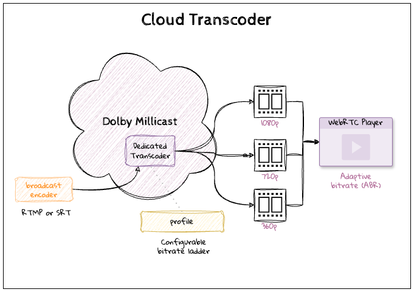
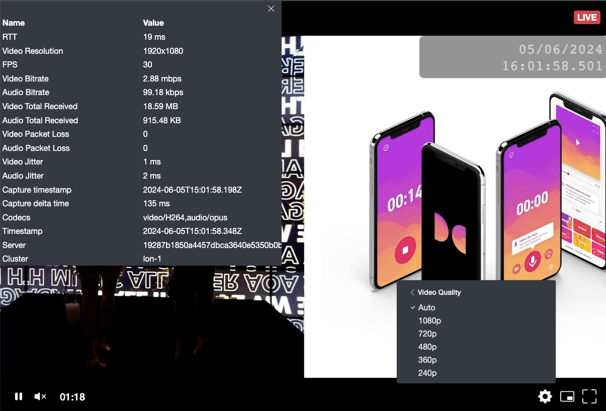

The **Cloud Transcoders** offered by the Dolby Millicast are responsible for ingesting (SRT or RTMP) and encoding contribution feeds into **adaptive-bitrate (ABR)** streaming renditions for WebRTC delivery. By adjusting the compression level, resolution, and quality of a video stream to match bandwidth availability it is possible to create an improved viewing experience. The adaptability ensures smoother playback but also conserves bandwidth, making the cloud transcoder an efficient and cost-effective solution optimized for ultra-low latency during the encoding process.





The transcoder allows ingesting B-frames and reducing the amount of data required for transmission. We support H.264 and H.265 codecs with seamless conversion to H.264.

*TODO: \< CalloutBetaFeature />

# Transcoder statuses

Each transcoder has a state that depends on the performed asynchronous operations, such as creating, starting, stopping, or deleting. 

| Transition | Status       | Description                                                                                                                                                                                                                                                                                           | Webhook |
| :--------- | :----------- | :---------------------------------------------------------------------------------------------------------------------------------------------------------------------------------------------------------------------------------------------------------------------------------------------------- | :------ |
| **Start**  | Queued       | A transcoder is queued when it is waiting for available resources to be available. This state typically happens after you **Start** a transcoder or **Create** a transcoder with `startNow=true`. If you **Create** a transcoder but do not start it right away it will begin in a _Shutdown_ status. |         |
|            | Provisioning | A transcoder is _Provisioning_ when the transcoder is starting up network configuration so that it can be used. During peak times of usage provisioning can take up to a minute.                                                                                                                      |         |
|            | Active       | An _Active_ transcoder is ready to use for any streams and begins accruing minutes.                                                                                                                                                                                                                   | ✓       |
|            | Error        | If there is a problem when starting or stopping a transcoder it may be set to an _Error_ status.                                                                                                                                                                                                      |         |
| **Stop**   | ShuttingDown | When you are done using a transcoder, stopping it will first issue a _ShuttingDown_ transition while the service is cleaned up and connections terminated. You should **Stop** a transcoder when not in use to avoid unnecessary charges.                                                             |         |
|            | Shutdown     | A transcoder in a _Shutdown_ state is not able to be used but is configured and ready to be started again when required.                                                                                                                                                                              | ✓       |
| **Delete** | Deleting     | A transcoder that is marked for deletion will be set to _Deleting_.                                                                                                                                                                                                                                   |         |
|            | Deleted      | A transcoder that has been _Deleted_ will still have a historical record, but is no longer usable or able to be re-started. You'll need to configure and start a new transcoder.                                                                                                                      | ✓       |

There are [webhooks](/millicast/webhooks/transcoder-webhooks.md) available to monitor the status change of transcoder instances.

# Parameters

You can create a transcoder for each video stream and set specific video quality requirements using the following parameters:

- **Height**: The height of output video frames that defines video resolution, in pixels.
- **Frame rate**: The frame rate of a video stream, which has to match your input frame rate, in frames per second.
- **Passthrough**: A boolean indicating whether the top layer of a video stream should be passed through (true) or transcoded (false). To maintain compatibility with WebRTC standards, set this parameter to true only when each Group of Pictures (GOP) in the top layer has a duration of 2 seconds.
- **Cluster**: A region to which a transcoder should be deployed.

The Streaming platform automatically selects default video quality ladders based on the provided height and frame rate of the top layer of your output. Alternatively, if the default ladders do not suit you, you can set your preferences using the **profile** parameter that allows selecting a specific profile. If you decide to set specific profiles, do not set **height**, **frame rate**, or **passthrough**.

When using a transcoder with passthrough enabled, the maximum video resolution is 4k. When passthrough is disabled, the Streaming platform supports a maximum of 1080p resolution and 60 frames per second.

# Starting and managing the cloud transcoder

<!--

 

 Dashboard changes will be probably released later

You can start and manage cloud transcoders either through the dashboard or Transcoder REST APIs.

## Dashboard

To create a dedicated transcoder in the dashboard and use it for your stream, follow these steps:

1. [Log in](https://dashboard.dolby.io/) to the dashboard and create a new publish token with a cluster set to Ashburn or Phoenix.
2. Click the name of the created token and select the **Publishing** tab.
3. Toggle the **Transcoding** setting to enable transcoding for the token. 
4. Click the **Create new transcoder** button.
5. Set your preferences in the pop-out window. In the **Basic** tab, enter the **transcoder name** and select the **associated stream** from the drop-down list. In the **Advanced** tab, you can additionally select the preferred **height**, **frame rate**, **profile ID**, and enable **passthrough**. 
6. Click the **Create** button to confirm your settings and create the transcoder.
7. Open the **Transcoding** tab from the left-side menu to find a list of all created transcoders. Click the name of the created transcoder to access additional information, such as its state, health, active quality layers, and connection log. You can also change its settings.
8. Click the **Start** button to start the transcoder.
9. Use the publish URL from the **Endpoint** section to publish your stream.

## REST APIs

\-->

The platform offers the Transcoder APIs for managing cloud transcoders. To create a dedicated transcoder, follow these steps:

1. Call the [Add Webhook]](/millicast/api/webhooks-add-webhook.api.mdx) API with the **isTranscoderHooks** parameter set to true. This way, you will be notified about status changes of your transcoder.

2. Call the [Create Transcoder]](/millicast/api/transcoder-create-transcoder.api.mdx) API providing values of all the required parameters. If you want to start your transcoder immediately after its creation, set the **startNow** parameter to true. Otherwise, call the [Start Transcoder]](/millicast/api/transcoder-start-transcoder.api.mdx) API to start the created transcoder.

   An example of the create request:

   ```json
   {
       "startNow": true,
       "passThrough": false,
       "name": "my example cloud transcoder",
       "dnsPrefix": "example",
       "cluster": "iad-1",
       "height": 1080,
       "frameRate": 60,
       "profile": null
   }
   ```

   A successful response contains the **Provisioning** status that changes to **Active** after about a minute:

   ```json Provisioning
   {
       "status": "success",
       "data": {
           "transcoderId": "1c649c88-d1cb-4891-bca7-8e07d2604a39",
           "accountId": 105881,
           "name": "my example cloud transcoder",
           "cluster": "iad-1",
           "dnsName": "example-accountId.transcoder.millicast.com",
           "profile": "1080p 60fps h264 no passthrough",
           "passThrough": false,
           "createdOn": "2024-02-19T12:31:35Z",
           "instance": {
               "instanceId": "08d4a61b-3ad5-475f-ace1-dc16bc848dd9",
               "dnsName": "example-accountId.transcoder.millicast.com",
               "createdOn": "2024-02-19T12:31:50Z",
               "status": "Provisioning"
           },
           "status": "Provisioning",
           "publishUrls": {
               "rtmp": "rtmp://example-accountId.transcoder.millicast.com:1935/v2/pub",
               "rtmps": "rtmps://example-accountId.transcoder.millicast.com:443/v2/pub",
               "srt": "srt://example-accountId.transcoder.millicast.com:10000"
           }
       }
   }
   ```
   ```json Active
   {
       "status": "success",
       "data": {
           "transcoderId": "1c649c88-d1cb-4891-bca7-8e07d2604a39",
           "accountId": 105881,
           "name": "my example cloud transcoder",
           "cluster": "iad-1",
           "dnsName": "example-accountId.transcoder.millicast.com",
           "profile": "1080p 60fps h264 no passthrough",
           "passThrough": false,
           "createdOn": "2024-02-19T12:31:35Z",
           "instance": {
               "instanceId": "08d4a61b-3ad5-475f-ace1-dc16bc848dd9",
               "dnsName": "example-accountId.transcoder.millicast.com",
               "createdOn": "2024-02-19T12:31:50Z",
               "status": "Provisioning"
           },
           "status": "Active",
           "publishUrls": {
               "rtmp": "rtmp://example-accountId.transcoder.millicast.com:1935/v2/pub",
               "rtmps": "rtmps://example-accountId.transcoder.millicast.com:443/v2/pub",
               "srt": "srt://example-accountId.transcoder.millicast.com:10000"
           }
       }
   }
   ```

   Notice that the response body contains publish URLs required for publishing your stream.

3. Construct a complete publish URL endpoint by adding your stream ID and publish token at the end of the received publish URLs. In the case of RTMP and RTMPS, you can pass your token as a string. SRT requires encoding the token and providing it as Base64-encoded data. For more information, see the [SRT](/millicast/broadcast/using-srt.md#how-to-get-the-srt-publish-settings-using-the-rest-apis) document.

   Examples:

   - rtmp://example-accountId.transcoder.millicast.com:1935/v2/pub**/streamName?token=publishToken**
   - rtmps://example-accountId.transcoder.millicast.com:443/v2/pub**/streamName?token=publishToken**
   - srt://example-accountId.transcoder.millicast.com:10000**?streamid=streamName?token=encodedPublishToken**

4. Once the stream begins publishing to the cloud transcoder the full ladder will be available for playback. To quickly verify the transcoder is working we recommend trying out [the hosted web player](/millicast/playback/hosted-viewer.md).





The platform also offers the [Configure Transcoder]](/millicast/api/transcoder-update-transcoder.api.mdx) API for updating transcoder settings and the [Stop Transcoder]](/millicast/api/transcoder-stop-transcoder.api.mdx) and [Delete Transcoder]](/millicast/api/transcoder-delete-transcoder.api.mdx) API for stopping and deleting a specific transcoder. A list of all available Transcoder APIs is available in the [REST API]](/millicast/api/transcoder-list-transcoders.api.mdx) documentation.

### Cloud Transcoding Ladder

> 👍 Quality and Latency
> 
> The Dolby Millicast Cloud Transcoder is specially tuned for delivering the highest quality at the lowest latency for the h264 codec.

| Height | Bitrate (varies between framerates) |
| :----- | :---------------------------------- |
| 4k     | passthrough only                    |
| 1080   | passthrough or 4500Kbps             |
| 720    | passthrough or 2700Kbps             |
| 480    | passthrough or 1600Kbps             |
| 360    | passthrough or 750Kbps              |
| 240    | 400Kbps                             |

, 

<!--

 

# Webhook events

The Dolby.io Streaming platform offers the following [webhook events](/millicast/webhooks/transcoder-webhooks.md) to notify about transcoder state changes:

- **Transcoder started**: Triggered whenever a transcoder is started and ready to use.
- **Transcoder stopped**: Triggered whenever a transcoder is stopped.
- **Transcoder error**: Triggered whenever an error occurs during transcoding.

\-->

# Troubleshooting

## DNS Propagation Delay - Host

When a transcoder is stopped and started again, DNS records can be cached by certain encoders. It may take time for the cache to be invalidated and the appropriate routing of a stream through a transcoder to go live. 

Try to `ping` both the hostname and IP address.

Some encoders have TTL settings that can exceed 60 minutes so a work-around is to use the IP address of the transcoder host in place of the DNS name.

## Feature Compatibility

The Dolby.io Streaming platform allows using cloud transcoders with all other features, even with [Multi-view](/millicast/playback/multiview.md) and [Redundant Ingest](/millicast/broadcast/redundant-ingest/index.md). However, publishing redundant feeds requires streaming feeds into two transcoders.

When using transcoding with recording, the platform records only the top layer.

When using transcoding with [Re-streaming](/millicast/distribution/re-streaming.md), the top layer regardless of passthrough enabled or disabled, will be re-streamed out to the specified re-stream endpoints.
