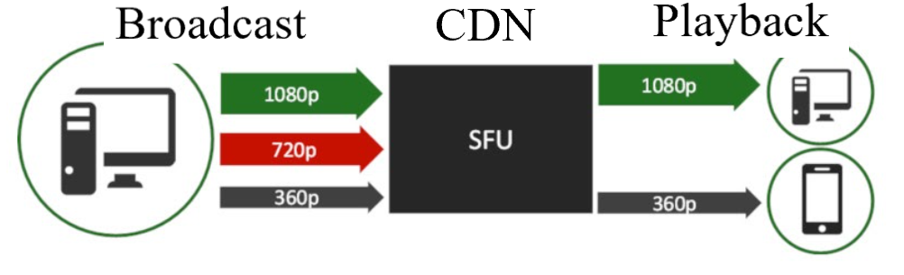

The Dolby.io Streaming Content Delivery Network (CDN) offers a range of server-side features that users can toggle and adjust via the REST APIs or your account Dashboard to ensure streams are secure, stable, and scalable. 

✓ **Scalability** to distribute content to large audiences across [multiple regions](/millicast/distribution/multi-region-support/index.md) in real-time.

✓ ** Stability** with features like [simulcast with WebRTC](/millicast/distribution/using-webrtc-simulcast.md) that provide redundancy and adaptability to maintain a good user experience across different network and device conditions while maintaining a high uptime and Quality of Experience (QoE).

✓ **Security** through features that protect your content by securing streams with subscriber tokens, [self-signed tokens](/millicast/streaming-dashboard/subscribe-tokens.md#creating-a-self-signed-token), allowing only [specific origins](/millicast/distribution/access-control/token-security.md), [geo-blocking](/millicast/distribution/access-control/geo-blocking.md), and [IP filtering](/millicast/distribution/access-control/token-security.md).

Distribution of streaming content requires scalability, stability, and security along with a robust platform with features including [stream recordings](/millicast/distribution/stream-recordings/index.md), [multi-source broadcasting](/millicast/broadcast/multi-source-broadcasting.md), [multi-bitrate delivery](/millicast/distribution/using-webrtc-simulcast.md), [backup publishing](/millicast/broadcast/redundant-ingest/index.md), [stream syndication](/millicast/distribution/syndication.md), and  [streaming analytics](/millicast/analytics/index.md).

# Start building

  
  <a class="dolbyio-card dolbyio-card-1" href="/streaming-apis/docs/getting-started">
    

      
    

    
Getting Started

    

      Quick start for using REST APIs to control content distribution.
    

  </a>
  

# Distribution of streaming content

Distribution of high-value content and intellectual property requires a platform that values security, stability, and scalability.

## Security

[How-to Manage Your Tokens](/millicast/streaming-dashboard/managing-your-tokens.md)  
**Tokens** are generated to authenticate and give access to a stream for a specific period of time. You will use separate tokens for publishing and subscribing to a stream so that only appropriate authorizations are granted depending on your requirements, such as:

- Specifying specific domain names or allowed origins
- Identifying IP addresses to filter

[How-to Setup Geo-blocking](/millicast/distribution/access-control/geo-blocking.md)  
**Geo-blocking** can be enabled to block specific geographic areas, such as countries or regions where you do not want the content to be streamed.

	<iframe width="560" height="315" src="https://www.youtube.com/embed/n4iXAJuw-aM" title="YouTube video player" frameborder="0" allow="accelerometer; autoplay; clipboard-write; encrypted-media; gyroscope; picture-in-picture; web-share" allowfullscreen></iframe>

### ISO/IEC 27001:2022 Certification

The Dolby.io Millicast platform has been assessed and found to be in accordance with the management system requirements in [ISO/IEC 27001:2022](https://www.iso.org/standard/27001). 

ISO 27001 is an internationally recognized standard for information security management systems (ISMS). Dolby.io's conformity to ISO/IEC standards means that we've established systems, plans, and security measures to protect and safely handle user data, along with general information security.

If you'd like confirmation of our certification, please see [the IAF's accreditation verification tool](https://www.iafcertsearch.org/certification/DQmrsq4w4DnUf2KBVA3WYdmR).

## Stability

Whether the stream has one viewer or hundreds of thousands, the stability of the stream is a top priority. To support stream stability and adaptability, Dolby.io provides several important features.

[Multi-source streaming](/millicast/broadcast/multi-source-broadcasting.md)  
Add redundancy with multiple independent broadcast sources as part of the same stream. This distribution of multiple audio and video tracks enables the viewer to playback a different feed in case an incoming source becomes unavailable.

[Audio multiplexing](/millicast/playback/audio-multiplexing.md)  
With **multiplexing**, this enables end users to receive multiple audio feeds as part of a single broadcast such that viewers can toggle between different audio tracks, such as variations in language, quality, etc.

[Simulcast](/millicast/distribution/using-webrtc-simulcast.md)  
**Simulcast** is a mechanism that allows for the distribution of a media stream composed of multiple bitrates and resolutions. The user can then view a stream that has a quality determined by network or device type allowing low-bandwidth conditions to receive an appropriate quality stream for the most stable experience possible in that scenario.

[Backup publishing](/millicast/broadcast/redundant-ingest/index.md)  
Similar to multi-source streaming, **backup publishing** allows for a parallel broadcast to be ingested from the same encoding source. In case of a failure, the system can fall over to another active backup stream.

## Scalability

To support global audiences into the hundreds of thousands of viewers, Dolby.io provides features that help with scaling streams to meet those demands without impacting the quality or stability of the stream.

[Multi-region support](/millicast/distribution/multi-region-support/index.md)  
We utilize a network of data centers distributed around the globe. This allows streams to maintain ultra-low latency and high scalability to audiences that may be scattered to many different regions.

[Stream syndication](/millicast/distribution/syndication.md)  
Through distribution partners, **syndication** allows you to send the same stream to multiple platforms. A tracking id can be used to correlate and analyze distribution data to monitor bandwidth utilization, viewer attendance with each provider, and other statistics that can help with billing.

[Recordings](/millicast/distribution/stream-recordings/index.md)  
A live broadcast can be archived by enabling the storage of a recording of the stream.

[Self-signed tokens](/millicast/streaming-dashboard/subscribe-tokens.md#creating-a-self-signed-token)  
To improve performance when tracking many individual streams among your users, you only need to generate one Dolby.io token and can then delegate that authorization by generating new self-signed **JWT tokens** in your application without needing to fetch a new subscriber token from Dolby.io for each new stream.

[Streaming analytics](/millicast/analytics/index.md)  
The Dolby.io dashboard provides data-rich information about streaming usage for your individual account. There are also **REST** and **GraphQL** endpoints to generate custom reports and behaviors by querying that data.

# Learn more

  

    <a class="small-text-only-btn" href="https://github.com/orgs/dolbyio-samples/repositories?q=distribution">
      
<svg viewBox="0 0 16 16" width="16" height="16" class="octicon octicon-mark-github" aria-hidden="true"><path fill-rule="evenodd" d="M8 0C3.58 0 0 3.58 0 8c0 3.54 2.29 6.53 5.47 7.59.4.07.55-.17.55-.38 0-.19-.01-.82-.01-1.49-2.01.37-2.53-.49-2.69-.94-.09-.23-.48-.94-.82-1.13-.28-.15-.68-.52-.01-.53.63-.01 1.08.58 1.23.82.72 1.21 1.87.87 2.33.66.07-.52.28-.87.51-1.07-1.78-.2-3.64-.89-3.64-3.95 0-.87.31-1.59.82-2.15-.08-.2-.36-1.02.08-2.12 0 0 .67-.21 2.2.82.64-.18 1.32-.27 2-.27.68 0 1.36.09 2 .27 1.53-1.04 2.2-.82 2.2-.82.44 1.1.16 1.92.08 2.12.51.56.82 1.27.82 2.15 0 3.07-1.87 3.75-3.65 3.95.29.25.54.73.54 1.48 0 1.07-.01 1.93-.01 2.2 0 .21.15.46.55.38A8.013 8.013 0 0016 8c0-4.42-3.58-8-8-8z"></path></svg>Explore GitHub sample code

    </a>     
    <a class="small-text-only-btn" href="https://dolby.io/blog/tag/distribution/">
      
Find related blog posts

    </a>
  

