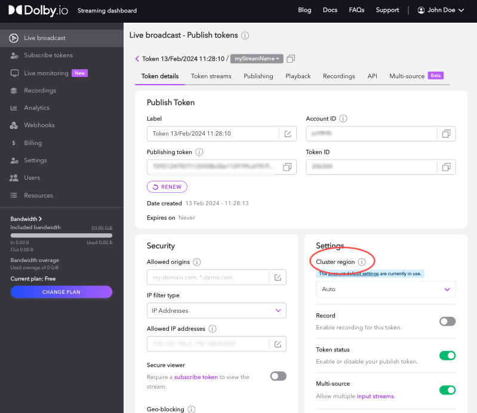
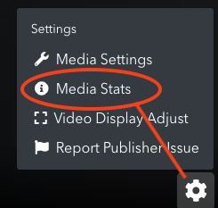
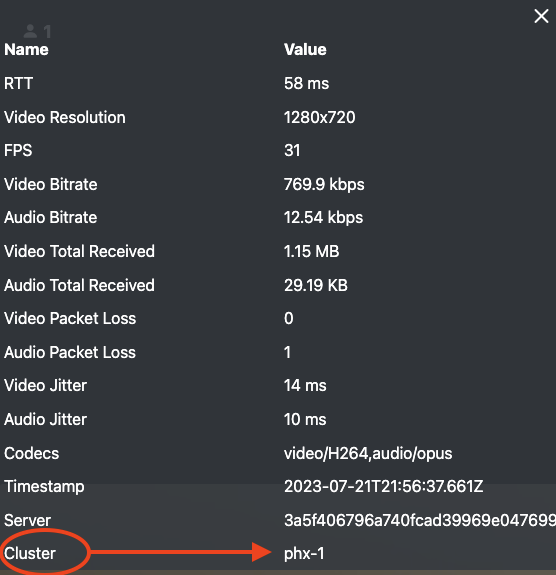

The WebRTC **Content Delivery Network (CDN)** refers to geographically distributed _clusters_ of servers which work together to provide real-time streaming worldwide at scale. Dolby.io distributes streaming content across multiple _regions_ through a network of cloud hosting providers. 

A traditional CDN needs to cache live stream segments on a network before they are able to be delivered to viewers over HTTP. This operation would generally add many seconds of latency to a live stream. The intelligent scaling provided by Dolby.io over global infrastructure is what enables increasingly large audiences with concurrent streams to experience ultra low latency.

This guide covers a few examples:

- [How-to Set the Cluster Region Using the Dashboard](/millicast/distribution/multi-region-support/index.md)how-to-set-the-cluster-region-using-the-dashboard)
- [How-to Identify the Cluster Region for an Active Stream](/millicast/distribution/multi-region-support/index.md)how-to-identify-the-cluster-region-for-an-active-stream)
- [How-to Get Available Cluster Regions with the REST API](/millicast/distribution/multi-region-support/index.md)how-to-get-the-available-cluster-regions)
- [How-to Set the Cluster Region for a Publish Token with the REST API](/millicast/distribution/multi-region-support/index.md)how-to-set-the-cluster-region-for-a-publish-token)

> 👍 Geo-Cascading
> 
> If you want to learn how to customize how traffic flows across regions, review the [Geo-cascading](/millicast/distribution/multi-region-support/geo-cascading.md) streaming guide.

# Overview

A _publishing token_ is configured with a specific **cluster region**. This value indicates which data center should be used as the origin when broadcasting. It can be explicitly set independently for each discrete token or be automatically assigned from the account's overall configuration.

- _Auto_ will use geo-detection to choose a region

When creating a publishing token, selecting the region that is closest to the [broadcast](/millicast/broadcast/index.mdx) location will improve latency and quality. The publishing cluster region setting can be configured to one of the following specific regions:

## North America

| Cluster Code | Region Location                  |
| :----------- | :------------------------------- |
| iad-1        | Ashburn, Virginia, United States |
| phx-1        | Phoenix, Arizona, United States  |

## South America

| Cluster Code | Region Location   |
| :----------- | :---------------- |
| sao-1        | Sao Paulo, Brazil |

## Europe

> ❗️ AMS Region Traffic
> 
> The `ams-1` region will be discontinued after _September 30, 2024_. For any active publish tokens, you should update them to use either the **lon-1** or **fra-1** regions. If you currently are using **auto** any streaming traffic will be re-routed automatically.

| Cluster Code | Region Location    |
| :----------- | :----------------- |
| fra-1        | Frankfurt, Germany |
| lon-1        | London, England    |

## Asia Pacific

| Cluster Code | Region Location   |
| :----------- | :---------------- |
| blr-1        | Bangalore, India  |
| sgp-1        | Singapore         |
| syd-1        | Sydney, Australia |

# Cluster regions in the dashboard

You can manage cluster regions by changing settings from user interface of the [Streaming Dashboard](/millicast/streaming-dashboard/index.md).

> 👍 Getting Started
> 
> If you haven't already, begin by following the [Getting Started](/millicast/getting-started/introduction-to-streaming-apis.md) tutorial to create a Dolby.io application and start your first broadcast. You will need to have a publishing token. See [Managing Your Tokens](/millicast/streaming-dashboard/managing-your-tokens.md) for more details about tokens.

> 📘 Blocking Regional Access
> 
> If you are looking to stop streaming traffic in a particular geographic region, see the [Geo-blocking](/millicast/distribution/access-control/geo-blocking.md) streaming guide for details on how to restrict access of content distribution.

## How-to set the cluster region using the dashboard

Open the Streaming section of the <a href="https://streaming.dolby.io/#/tokens" target="_new">Dolby.io Dashboard</a>. Select the publishing token you want to modify. Within the **Settings** section you can choose the _Cluster Region_ from the dropdown.





## How-to identify the cluster region for an active stream

When using the Dolby.io Dashboard [publisher](/millicast/streaming-dashboard/how-to-broadcast-in-dashboard.md) to broadcast or the viewer to playback you can select the gear setting to view the **Media Stats**. 





This will display a modal overlaying the stream with details about resolution, bitrate, etc. and will also display the **Cluster** value using one of the region codes.





# REST APIs

When working with clusters you can automate workflows using available REST APIs.

- The [/api/cluster](../../api/cluster-get-clusters-info.api.mdx) endpoint allows you to query available cluster regions or change the default cluster for your account
- The [/api/publish_token](../../api/publish-token-v-1-update-token.api.mdx) endpoint allows you to update the cluster for an existing publish token or to define a value when creating a new token

> 👍 Using the REST APIs
> 
> Review the [REST API](/millicast/getting-started/basic-api-tutorial.md) platform guide for more details on generating an API secret for authentication. You will need an _API Secret_ from the dashboard in order to make requests.

## How-to get the available cluster regions

You make a `GET` request with the [/api/cluster](../../api/cluster-get-clusters-info.api.mdx) endpoint to fetch details about the **defaultCluster** and a list of the **availableClusters** to find the list of available cluster regions.

The results may look like this:

```json
{
    "status": "success",
    "data": {
        "defaultCluster": "auto",
        "availableClusters": [
            {
                "id": "ams-1",
                "name": "Amsterdam",
                "rtmp": "rtmp-ams-1.millicast.com",
                "srt": "srt-ams-1.millicast.com"
            },
            {
                "id": "auto",
                "name": "Auto",
                "rtmp": "rtmp-auto.millicast.com",
                "srt": "srt-auto.millicast.com"
            },
            {
                "id": "blr-1",
                "name": "Bangalore",
                "rtmp": "rtmp-blr-1.millicast.com",
                "srt": "srt-blr-1.millicast.com"
            },
            {
                "id": "fra-1",
                "name": "Frankfurt",
                "rtmp": "rtmp-fra-1.millicast.com",
                "srt": "srt-fra-1.millicast.com"
            },
            {
                "id": "iad-1",
                "name": "Ashburn",
                "rtmp": "rtmp-iad-1.millicast.com",
                "srt": "srt-iad-1.millicast.com"
            },  
            {
                "id": "lon-1",
                "name": "London",
                "rtmp": "rtmp-lon-1.millicast.com",
                "srt": "srt-lon-1.millicast.com"
            },            
            {
                "id": "phx-1",
                "name": "Phoenix",
                "rtmp": "rtmp-phx-1.millicast.com",
                "srt": "srt-phx-1.millicast.com"
            },
            {
                "id": "sao-1",
                "name": "Sao Paulo",
                "rtmp": "rtmp-sao-1.millicast.com",
                "srt": "srt-sao-1.millicast.com"
            },          
            {
                "id": "sgp-1",
                "name": "Singapore",
                "rtmp": "rtmp-sgp-1.millicast.com",
                "srt": "srt-sgp-1.millicast.com"
            },
            {
                "id": "syd-1",
                "name": "Sydney",
                "rtmp": "rtmp-syd-1.millicast.com",
                "srt": "srt-syd-1.millicast.com"
            }          
        ]
    }
}
```

## How-to set the cluster region default

You make a `PUT` request with the [/api/cluster](../../api/cluster-get-clusters-info.api.mdx) endpoint to update the default account cluster that is used when creating new publishing tokens.

For example, you can use `curl` to set the default cluster for any new tokens to Amsterdam.

```shell
curl --request PUT \
  --url https://api.millicast.com/api/cluster \
  --header "Authorization: Bearer $DOLBYIO_API_SECRET"
  --data '{
    "defaultCluster": "ams-1"
  }'
  
```

## How-to set the cluster region for a publish token

You make a `POST` request to [/api/publish_token](../../api/publish-token-v-1-create-token.api.mdx) in order to create a new token. The **originCluster** parameter specifies the cluster to use. This should be specified using the abbreviated code. You can make a `PUT` request to [/api/publish_token/\{tokenId\}](../../api/publish-token-v-1-update-token.api.mdx) to change the cluster region for an existing token.

For example, you can create a new token for Amsterdam.

```shell
curl --request POST \
  --url https://api.millicast.com/api/publish_token \
  --header 'Content-Type: application/json' \
  --header "Authorization: Bearer $DOLBYIO_API_SECRET" \
  --data '{
      "label": "amsterdam-token",
      "streams": [{"streamName": "myStream"}],
      "originCluster": "ams-1"
    }'
```

> ❗️ Enable Multisource on your Stream Token
> 
> For using multi-source streams, your account must be allowed to use the multi-source feature and the Publish Token must have the `multisource` flag enabled. The default cluster region must not be set to auto, and must be set to the region from which you want to stream. Multi-source will not work if you publish the stream from two different locations that do not fall under same cluster/region coverage and the current default setting has not been modified. For more information, see [Multisource Broadcasting](/millicast/broadcast/multi-source-broadcasting.md).

# Troubleshooting

## Unauthorized

If you receive an **Unauthorized** error make sure that you are specifying an Authorization header and that it is passing in a valid API Secret from your Streaming dashboard.

```json
{"status":"fail","data":{"message":"Unauthorized"}}
```

## Unsupported media type

If you receive an **Unsupported Media Type** error make sure you are specifying the `Content-Type` header.

```json
{"status":"fail","data":{"message":"Unsupported Media Type"}}
```

## Validation error: CreateStreamNameModel

If you receive **Validation errors** from a REST request make sure you are providing all of the required parameters. For example, you may see this error if you don't specify the `streams` parameter as a list of dictionaries.

```json
{
    "status": "fail",
    "data": {
        "errors": {
            "$.streams[0]": [
                "The JSON value could not be converted to Millicast.CustomerApi.Models.Tokens.Request.CreateStreamNameModel. Path: $.streams[0] | LineNumber: 2 | BytePositionInLine: 28."
            ]
        },
        "message": "Validation errors"
    }
}
```

# Learn more

Learn more by exploring the [developer blog](https://dolby.io/blog/tag/distribution/) and [code samples](https://github.com/orgs/dolbyio-samples/repositories?q=distribution).


