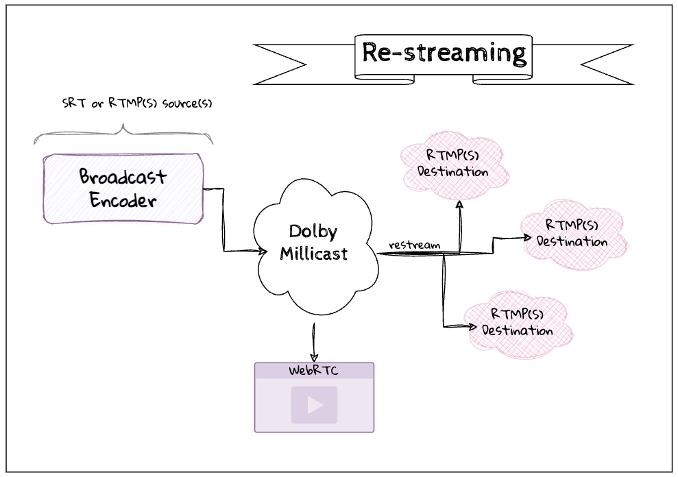
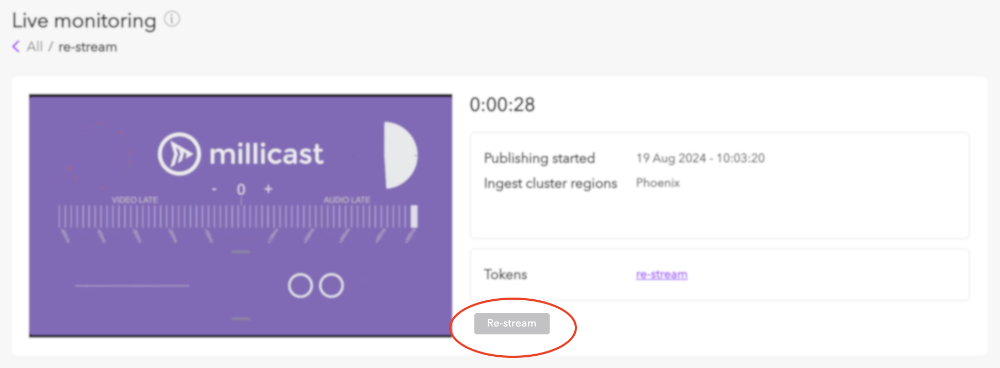

**Re-streaming** enables you to distribute your broadcasts to additional RTMP(S) output destinations while simultaneously providing real-time WebRTC playback. This can be useful for distribution to other B2B media partners or for extending reach to larger audiences on public consumer social media platforms.





## Overview

To distribute content to an RTMP(S) output source you will need to update the settings of your [Publish Tokens](/millicast/streaming-dashboard/managing-your-tokens.md). The publish token defines a `restream` property with a list of targets that are identified by:

- **url** - the media server that is able to accept RTMP(S) ingest including the rtmp:// and rtmps:// protocols and port number 
- **key** - the url path and/or additional parameters that should be passed to the server to uniquely identify the incoming RTMP(S) stream
- **label** - a text value to help with identifying and distinguishing multiple re-stream target endpoints

Support is available for:

✓ H.264 and AAC codecs

✓ SRT and RTMP(S) broadcast sources

✓ Up to ten (10) RTMP(S) output destinations

The outgoing RTMP(S) stream will be identical to the incoming source stream in terms of bitrate, codec, etc.

## How-to Setup Re-stream

### Using the Dashboard

When creating or updating a publish token you can enable and configure re-stream from the dashboard. These settings are found under the `Distribution` tab.


If the feature is enabled for your account plan, you'll be able to add, remove, and update any target endpoints that you want to forward your stream.

### Using the REST API

When creating or updating [Publish Tokens](/millicast/streaming-dashboard/managing-your-tokens.md) you will define a `restream` property. This is an array that takes a list of dictionaries each defining the **url**, **key**, and **label** for any RTMP destination targets.

```json
{
    ...,
    "restream": [{
        "url": "rtmp://...",
        "key": "***",
        "label": "Popular Social Media Site"
    }]
}
```

Only the first ten (10) destinations defined will be targets for re-streaming and any additional items or properties will be ignored.

Visit the [/api/publish_token](../api/publish-token-v-1-create-token.api.mdx) specification for more details about using this API.

## Multi-source Re-streaming

For scenarios such as [Multi-Source Broadcasting](/millicast/broadcast/multi-source-broadcasting.md) there may be more than one incoming source stream. Since not all media platforms are capable of accepting multiple RTMP ingest sources you may have unexpected results.

To disable re-streaming on specific feeds add the **norestream** boolean [publishing parameter](/millicast/broadcast/broadcast-parameters.md) to your configured publishing URLs. This is used to indicate which sources specifically should be used or not. For example, in a Multi-bitrate (MBR) configuration where there are multiple quality layers being ingested, you might re-stream only the highest quality layer and then add `&norestream` to any additional contribution layers. Similarly, if you have an interactive [multi-view](/millicast/playback/multiview.md) broadcast where multiple sources are sharing the same publishing token, you can configure the URLs to only re-stream your intended source.

## Feature compatability

### Cloud transcoder and Re-streaming

For workflows using both the [Cloud transcoder](/millicast/distribution/cloud-transcoder.md) and Re-streaming, the highest quality layer of the stream will be re-streamed out to the desired re-stream endpoints.

If **passthrough** is enabled, the top non-transcoded layer will be re-streamed. If **passthrough** is not enabled, the top transcoder layer will be re-streamed. 

### Redundant ingests and Re-streaming

If you are publishing [redundant ingest](/millicast/broadcast/redundant-ingest) feeds and Re-streaming, the first feed connected will be the one re-streamed out to the specified re-stream endpoints. 

## Troubleshooting

You can check the status of re-streams by visiting the [Live Monitoring](/millicast/streaming-dashboard/live-monitoring.md) section of the dashboard. You should see a `Re-stream` token as confirmation.





If re-stream is enabled for a stream, the events section of Live Monitoring will display when the re-streamed feed has started and ended. 


### Re-Stream is Playing Only Audio or Video

The re-stream feed is only showing audio or video. This may be because you are using an unsupported codec in the source broadcast. If you are using something other than H.264 or AAC you may experience dropped frames.

### Re-stream is Not Working with Web Broadcasts

If you are streaming using the [Live Broadcast](/millicast/streaming-dashboard/how-to-broadcast-in-dashboard.md) dashboard app or a custom built app using the [Web SDK](/millicast/client-sdks/web.md) you are using WebRTC to broadcast. Re-streaming is only available for [SRT](/millicast/broadcast/using-srt.md) and [RTMP](/millicast/broadcast/using-rtmp-and-rtmps.md) so you will need to use an encoder that supports one of those broadcast protocols in order for re-stream to be successful.

> ❗️ We're Here to Help
> 
> For any other issues not covered here, please reach out to your sales and solutions team who can review server logs that may help identify any configuration issues.
