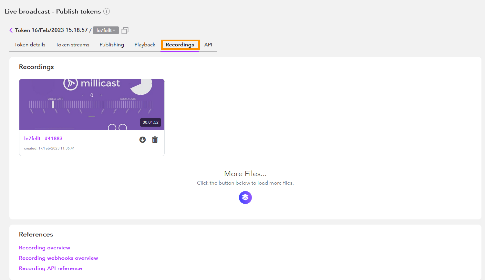
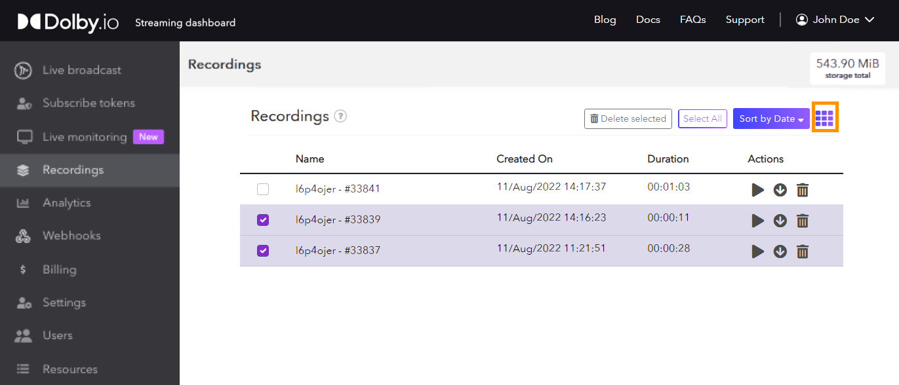
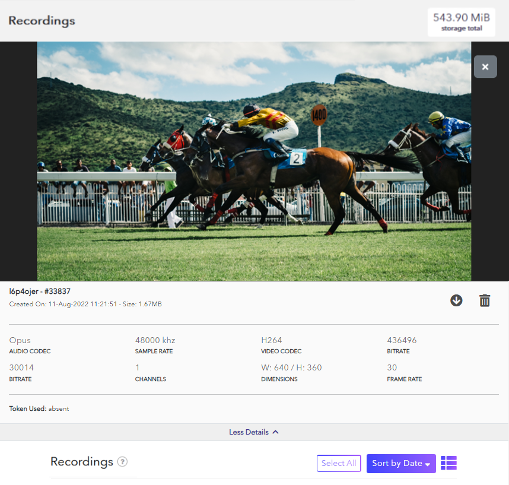
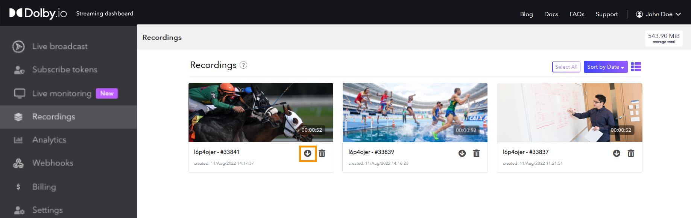
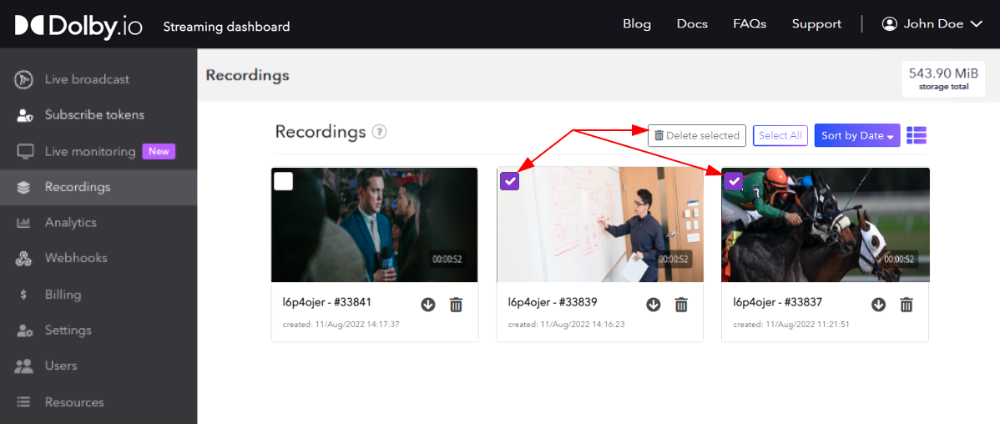
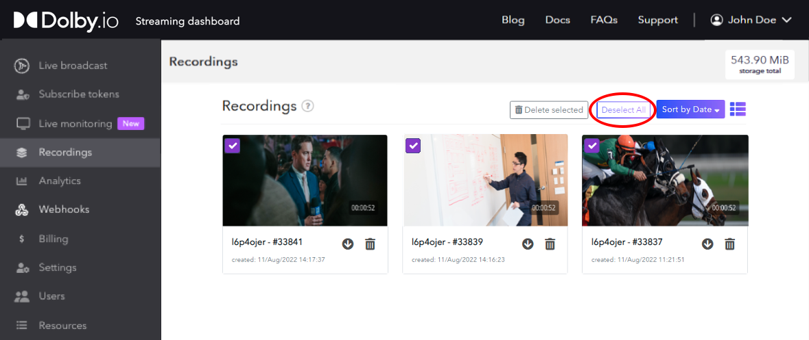

With [Stream Recordings](/millicast/distribution/stream-recordings/index.md) you will want to be able to retrieve and operate on any media assets that are created. You can do this manually using the [Streaming Dashboard](/millicast/streaming-dashboard/index.md) or automate workflows using the [Media Assets](ref:media-assets) REST endpoints. There are also [Media Webhooks](/millicast/webhooks/media-webhooks.md) available for building event-driven integrations.

# Recordings in the Dashboard

You can find recordings by visiting the [Streaming Dashboard](/millicast/streaming-dashboard/index.md).

## Find Recordings by Token

To find recordings for a specific token, open your Publish token from the **Live Broadcast** section and click the **Settings** button to open the management screen. Select the **Recordings tab** from the top of the panel. Each thumbnail is displayed with a reference to your recording. A newly created recording can take a few seconds to several minutes to render, depending on length. Once the recording has been processed, you can view it. You can click on the **More Files** button to see all the files recorded with the respective token.





## Find All Account Recordings

Alternatively, to find all your recordings, open the **Recordings** section of the dashboard. You can view your recordings either as a thumbnail grid or a basic list by clicking the **List View** button on the top right section menu. Additionally, you can see the current total storage used in the top right corner of the Recording page, or get your current billable storage in the **Billing** page.





, 

## Preview a Recording

To preview your recordings, click on the thumbnail image which will open the **Preview Player** and begin playing the video. The player also provides more information about your recording including length, quality, and dimensions. Click on the **More Details** button under the player to explore.





You can close the player using the close button located on the top right or you can scroll down to choose another video.

## Download Recordings

To download recordings, click the arrow icon visible on the thumbnail. You can also download your video using the icon menu under the preview player. Clicking the download icon immediately initiates a download.





> ❗️ Audio Missing?
> 
> The downloaded recording will use the Opus audio codec. Playback on various media players may not support Opus and audio may not be heard. You can use [VLC](https://www.videolan.org/) for playback and converting sound to AAC.

## Delete Recordings

The retention policy for recordings is determined by your business rules for removing and deleting the files.

Located next to the download button, the delete icon deletes the recording. To delete multiple videos you can select the checkboxes on the thumbnails and then click the **Delete Selected** button from the section menu on the top right.





To delete all items at once, click the **Select All** button from the same top section menu. This will select every thumb on the screen. Then, click the **Delete Selected** button to delete them all.





> ❗️ Deletion is Permanent
> 
> If you delete a recording or clip it is immediate and permanent. We are unable to recover a recording once it has been deleted and removed from the cloud servers.

, 

# Finding Media by API

The [Media Assets](ref:media-assets) API can help you with automating workflows with recordings and clips.

<GettingStartedRESTAPI />

Use the [List Media Assets](ref:media-assets-get) endpoint to query a list of media assets for your account. There are some parameters you can use to filter the results returned.

## How-to Find All Recordings and/or Clips

Use the `type` parameter to retrieve assets that match the given type. If you omit the parameter, both recordings and clips will be returned together.

```curl
curl --request GET \
  --url https://api.millicast.com/api/v3/media/assets?type=clip \
  --header 'authorization: Bearer abc123'
```

You can use this parameter to find _recording_ or _timeline_ assets as well. See the [List Media Assets](ref:media-assets-get) reference specification for the full list.

## How-to Find Recordings Still in Progress

Use the `status` parameter to retrieve assets that match a given status.

```curl
curl --request GET \
  --url https://api.millicast.com/api/v3/media/assets?status=processing \
  --header 'authorization: Bearer abc123'
```

You can use this parameter to find any _errored_ assets as well. See the [List Media Assets](ref:media-assets-get) reference specification for the full list.

## How-to Find Media By Name

Use the `name` parameter to find clips that were given a specific label or `streamName` to find just those that were captured for a specific broadcast.

```curl
curl --request GET \
  --url https://api.millicast.com/api/v3/media/assets?name=2024-10-01a \
  --header 'authorization: Bearer abc123'
```

, 

# Removing Media by API

Use the [Delete Media Assets](ref:media-assets-delete) endpoint to remove either recordings or clips. You'll need to first find the **mediaAssetId** before you can delete specific assets. This is given as a query parameter so that you can delete more than one asset at a time.

```curl
curl --request DELETE \
  --url https://api.millicast.com/api/v3/media/assets?id=1&id=2 \
  --header 'Authorization: Bearer abc123'
```

## How-to Remove All Media

To remove everything from your account you can use the [Delete All Media Assets](ref:media-assets-all-type-delete) REST endpoint. This operation works on one `type` at a time so will be called to remove `recording`, `clip`, and `timeline` independently.

> ❗️ Deletion is Permanent
> 
> If you delete a recording or clip it is immediate and permanent. We are unable to recover a recording once it has been deleted and removed from the cloud servers.

, 

# Downloading Media by API

Using the [Media Assets](ref:media-assets) API you can identify the cloud storage location where recordings and clips are stored. 

## How-to Retrieve a Recording

Recordings will typically be stored on Dolby's servers and made available for retrieval. You'll need to know the `mediaAssetId` of the item you want to download.

### Example GET Response

This is an example of a JSON response from the [/media/asset/{mediaAssetId}](ref:media-assets-mediaassetid-get) endpoint.

```json
{
  "status": "success",
  "data": {
    "id": "string",
    "type": "recording",
    "feed": {
      "tokenId": 0,
      "streamName": "string",
      "sourceId": "string",
      "simulcastId": "string",
      "priority": 0
    },
    "startTime": "2024-10-01",
    "stopTime": "2024-10-01",
    "name": "string",
    "storage": {
      "type": "gcs",
      "path": "string"
    },
    "status": "processing",
    "error": "string",
    "created": "2024-10-01",
    "expiration": "2024-10-01",
    "removed": "2024-10-01",
    "metadata": {
      "format": "string",
      "sizes": {
        "additionalProp": 0
      },
      "duration": 0,
      "tracks": [
        {
          "type": "string",
          "codec": "string",
          "bitrate": 0,
          "width": 0,
          "height": 0,
          "framerate": 0,
          "channels": 0,
          "samplerate": 0
        }
      ],
      "thumbnails": [
        "string"
      ]
    },
    "download": {
      "downloadUrl": "string",
      "downloadExpiresOn": "2024-10-01T18:47:26.836Z"
    }
  }
}
```

The `downloadUrl` gives you the storage location where a file is available to download using whichever software or libraries are most appropriate for your application needs.
