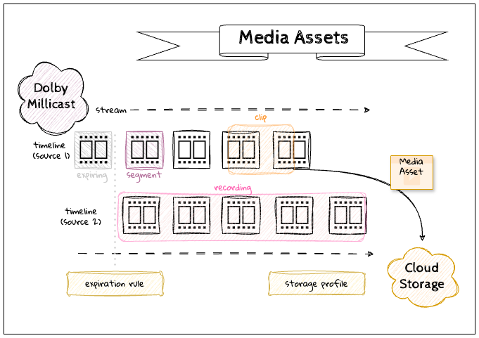

import DocCardList from '@theme/DocCardList';

With **_Stream Recording_** you can keep a copy of a real-time stream where media can be used for a variety of use cases such as video on demand (VOD) playback, archiving and auditing, event highlights and instant replay, etc. To support this variety of purposes there are options for the type of media assets that you will create from a stream.

- **Recordings** are full-length copies of a stream that will be processed and made available shortly after a broadcast is complete.
- Live **Clips** are media files from a broadcast stream that can be processed and retrieved immediately while the live stream is still in progress.

You can work with recordings and clips either from the [Streaming Dashboard](/millicast/streaming-dashboard/index.md) or using the [Media Assets](/millicast/api/media-assets-list-media-assets.api.mdx) REST API.

# How It Works

The collection of recordings and clips is referred to more broadly as **Media Assets** that have been created from your account. There are a few concepts to understand to make best use of the feature.

When a [Publish Token](/millicast/streaming-dashboard/managing-your-tokens.md) is enabled with recording or clipping, the system will generate a timeline for each incoming source. For simple streams, this may be a single broadcast source but for more complex workflows with [multi-bitrate contribution](/millicast/broadcast/multi-source-broadcasting.md) and [multi-view](/millicast/playback/multiview.md) applications that have multiple sources there may be more than one timeline. The **timeline** is a series of buffered segments that are kept in a cache so that they can be stored as a recording or a clip later. When a stream goes offline, one timeline ends and if it reconnects a new one begins.

There are costs associated with storage, so you can configure **expiration rules** for how long you want to maintain availability of a media stream and **storage profiles** so that you can have the service transfer files to your own preferred storage provider (AWS S3, GCS, etc.)

import CalloutStorageSurcharge from '../../callouts/_storage_surcharge.md';

<CalloutStorageSurcharge />

## Enable Recording and/or Clipping

You must configure a [Publish Token](/millicast/streaming-dashboard/managing-your-tokens.md) prior to beginning a broadcast to enable the capture of media.

| Media Type                                     | Enable                                                                                                                                                                                                                               | Create                                                                                                                 |
| :--------------------------------------------- | :----------------------------------------------------------------------------------------------------------------------------------------------------------------------------------------------------------------------------------- | :--------------------------------------------------------------------------------------------------------------------- |
| Recording                                      | The [Publish Token](/millicast/streaming-dashboard/managing-your-tokens.md) has a `record` property to enable recordings.                                                                                                            | Will begin after being enabled from a [Client SDK](/millicast/client-sdks/index.mdx) with an active publish connection. |
| Clip                                           | The [Publish Token](/millicast/streaming-dashboard/managing-your-tokens.md) has a `clip` property to enable live clipping.                                                                                                           |
|                                                |
| ⚠️ This feature is not available on all plans. | Processed on demand by calling the [/api/v3/media/assets](/millicast/api/media-assets-list-media-assets.api.mdx) ([Create Clip](/millicast/api/record-files-create-record-clip) REST endpoint with **start** and **stop** timestamps. |

For more detailed instructions, review one of the following tutorials:

<DocCardList
  items={[
    {
      type: 'link',
      href: '/millicast/live-clipping',
      docId: 'distribution/stream-recordings/live-clipping',
      label: 'How-to Create Live Clips',
      description: 'Learn how-to setup and create live clips.',
    },
    {
      type: 'link',
      href: '/millicast/starting-recording',
      docId: 'distribution/stream-recordings/starting-recording',
      label: 'How-to Start Recordings',
      description: 'Learn how-to setup and create recordings.',
    },
  ]}
/>

## Finding Your Media

You can find both recordings and clips in the [Streaming Dashboard](/millicast/streaming-dashboard/index.md) or by calling the [Media Assets](/millicast/api/media-assets-list-media-assets.api.mdx) REST endpoint.

| Media Type | Availability                                                                                                                                                                                                                                                                   | Storage                                                                                                                                                                                                                                                                                                                                                                                                                                                                                                                                                                                               |
| :--------- | :----------------------------------------------------------------------------------------------------------------------------------------------------------------------------------------------------------------------------------------------------------------------------- | :---------------------------------------------------------------------------------------------------------------------------------------------------------------------------------------------------------------------------------------------------------------------------------------------------------------------------------------------------------------------------------------------------------------------------------------------------------------------------------------------------------------------------------------------------------------------------------------------------- |
| Recording  | Recordings will be processed and made available shortly after the completion of a broadcast.                                                                                                                                                                                   | Recordings are stored within your Dolby account. You can retrieve them from the [Streaming Dashboard](/millicast/streaming-dashboard/index.md) or by downloading them using the [/api/v3/media/assets](/millicast/api/media-assets-list-media-assets.api.mdx) ([List Media Assets](/millicast/api/media-assets-list-media-assets.api.mdx) ) REST endpoint.                                                                                                                                                                                                                                                      |
| Clip       | Call the [/api/v3/media/assets](/millicast/api/media-assets-list-media-assets.api.mdx) ([List Media Assets](/millicast/api/media-assets-list-media-assets) REST endpoint to check the status of a clip or subscribe to [Media Webhooks](/millicast/webhooks/media-webhooks.md). | Clips are stored as configured by a storage profile. This can be set to send media directly to third-party cloud storage providers such as AWS S3 or GCS. You can specify where to store media when you call the [/api/v3/media/assets](/millicast/api/media-assets-list-media-assets.api.mdx) ([Create Clip](/millicast/api/record-files-create-record-clip) REST endpoint or as configured for your account from the [/api/v3/account/media/storage](/millicast/api/account-create-storage-profile.api.mdx) ([Get Storage Profile](/millicast/api/account-get-storage-profile) account configuration. |

For more detailed instructions, review one of the following tutorials:

<DocCardList
  items={[
    {
      type: 'link',
      href: '/millicast/how-to-get-media-assets',
      docId: 'distribution/stream-recordings/how-to-get-media-assets',
      label: 'How-to Get Media Assets',
      description: 'Learn how to filter and find recordings and clips.',
    },
    {
      type: 'link',
      href: '/millicast/how-to-setup-media-storage',
      docId: 'distribution/stream-recordings/how-to-setup-media-storage',
      label: 'How-to Setup Clip Storage',
      description: 'Learn how to configure third-party cloud storage for clipping.',
    },
  ]}
/>

## Media Properties

Media assets will have matching resolution and bitrate of the broadcasted stream. Any degradation of the broadcast stream due to bad network conditions will persist, however any client playback issues that result from adaptive bitrate playback will not impact the recordings or clips.

The video and audio codecs used during the broadcast will be reflected in the archived media assets.

| Video codec   | Media container |
| :------------ | :-------------- |
| H.264         | MP4             |
| VP8, VP9, AV1 | WebM            |

We recommend that encoding settings use an **I-Frame** period of `1s` when using the service to increase precision when aligning keyframes with media segments.

# Troubleshooting

To diagnose recording issues, such as missing recordings, review the details of the publishing settings, such as:

- Protocol: RTMP, SRT, WebRTC, or WHIP
- Encoder: Hardware and software type with version details
- Settings: Bitrate, FPS, Resolution, or Simulcast setting
- Network: Details about the network used. For example, a cellular connection may create issues with fluctuations in the network.

## Multi-source

When using [multi-source](/millicast/broadcast/multi-source-broadcasting.md) broadcasting, multiple independent broadcast timelines will be created.

For `clip` assets you can identify the specific source from which to clip, or if not specified multiple clips will be created.

For `recording` assets, you will get a discrete media file for each source.

You will need to use a separate media tool if you want to automate any transizing, transrating, or stitching operations.

## Media Duration

There are some limits to how large any individual media asset will be.

| Media Type | Minimum Duration | Maximum Duration |
| :--------- | :--------------- | :--------------- |
| Recording  | 10 seconds       | 24 hours         |
| Clip       | 10 seconds       | 8 hours          |

For long-running streams that exceed 12 hours, multiple media assets will be created.

## Media Expiration

Consideration should be made on how long you may want to store media before it expires and is no longer available for retrieval.

| Media Type | Default | Minimum | Maximum                  |
| :--------- | :------ | :------ | :----------------------- |
| Recording  | none    | 1 day   | account in good standing |
| Clip       | none    | 1 day   | account in good standing |
| Timelines  | 30 days | 1 day   | account in good standing |

## Missing Audio for 5.1

When publishing streams using 5.1 audio format, the audio is present on the viewer live stream, but not preserved in the recording. Multi-channel audio is currently not preserved in the recording archive. The audio is only present in the recording archive if using stereo and mono formats. Multi-source stream audio is also affected if the URL is set to `&videoOnly`.

## Dashboard Recording Error

If the dashboard displays recording errors, contact the [Dolby support](http://support.dolby.io) team and specify as many of your publishing settings as possible.

# Learn More

Learn more by exploring the [specification](/millicast/api/media-assets-list-media-assets.api.mdx), [developer blog](https://dolby.io/blog/tag/distribution/) and [code samples](https://github.com/orgs/dolbyio-samples/repositories?q=distribution).
