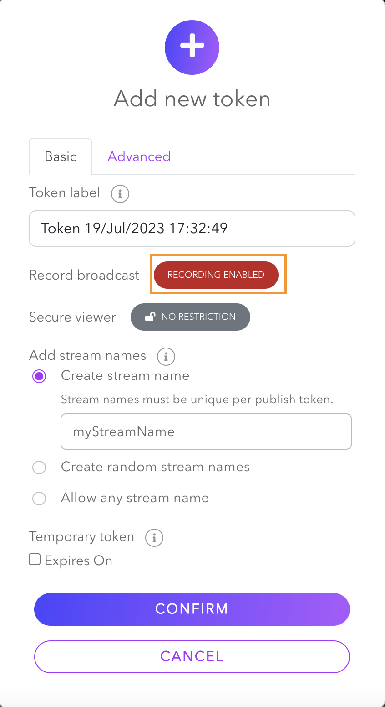
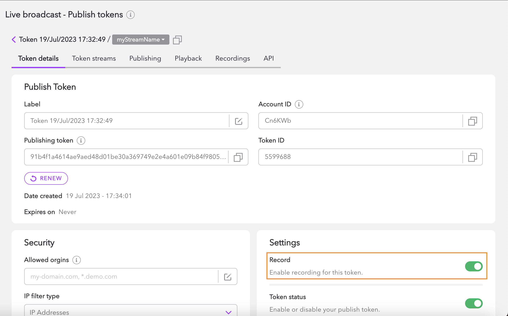
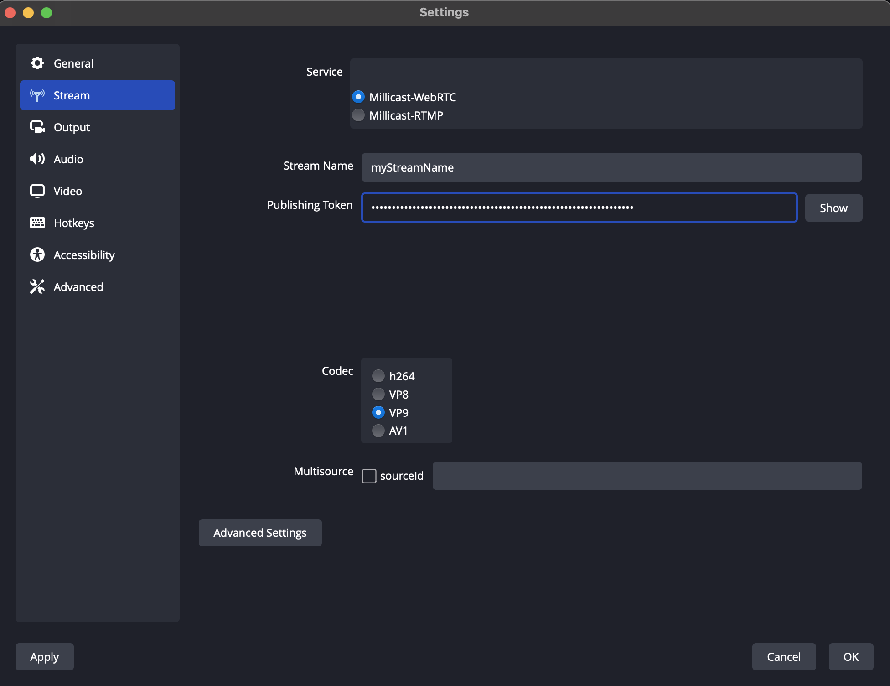

You can keep a recording of a full broadcast and download it to share or provide as video on demand. The recording will be made available shortly after the end of a broadcast. If you want a recording of a live event while it is in progress, you should learn more about [Live Clipping]((millicast/distribution/stream-recordings/live-clipping.md) feature.

Recording can be started when using the [Dashboard](#recording-from-the-dolbyio-dashboard), [Client SDKs](#recording-using-client-sdks), or third-party applications such as [OBS](#recording-from-obs). These approaches are described below.

## Recording from the Dolby.io dashboard

> 👍 Getting Started
> 
> If you haven't already, begin by following the [Getting Started](/millicast/introduction-to-streaming-apis.mdx) tutorial to create a Dolby.io application and start your first broadcast. You'll need your _publish token_ and _stream name_ for the steps described below.

1. Enable recording on a [publish token](/millicast/streaming-dashboard/managing-your-tokens.md) by clicking **Record broadcast** when creating a new token. 





  You can also update your existing publish token by enabling the **Record** option from the **Settings** section of **Token details**.





> 🚧 Updating Token Settings
> 
> The recording property cannot be updated while the token is being used in a live broadcast; you must stop broadcasting to update it.

2. Go into the [Dolby.io Live broadcast dashboard ](/millicast/streaming-dashboard/how-to-broadcast-in-dashboard.md)and click the **Broadcast** button. Once the record feature is active, a red **Record** indicator will show up next to the **Start** button. Clicking the **Broadcast** button before starting streaming results in recording the stream prior to beginning the stream.
3. Click the **Start** button to begin broadcasting with recording enabled.


4. Record the broadcast for at least 10 seconds.
5. Click the **Stop** button to stop the feed. Once you've stopped, close the broadcaster interface. This will return you to the tokens page on the Live broadcast page. 
6. Revisit the publish token's management screen used for this stream and enter into the **Recordings** tab to access all recording files.

## Recording from OBS

You can record your broadcasts if you are using 3rd party applications, such as [OBS](https://github.com/CoSMoSoftware/OBS-studio-webrtc/releases) or your own custom broadcaster application. If you have not broadcasted to Dolby.io Real-time Streaming from OBS, please read the [Using OBS](/millicast/software-encoders/using-obs.md) page to enable your first broadcast with the software. 

1. Set up OBS by visiting the **Settings** button to add the token information required.





2. Go back to the main page and click the **Start Recording** button under **Start Streaming** to start recording your screen.
3. Record the broadcast for at least 10 seconds.
4. Click the **Stop Recording** button. Recordings are available only in your local video or movie folder.

## Recording using Client SDKs

To start recording a stream using any Client SDK, enable recording in your publish token in the dashboard and set an optional recording parameter to true in publisher options, as in the following examples:

```cplusplus
millicast::Publisher::Option options;
options.record_stream = true;
publisher->connect();
// Wait for the on_connected callback
publisher->publish(options);
```
```java
Publisher.Option publisherOption = new Publisher.Option();
publisherOption.recordStream = true;
publisher.connect();
// Wait for the onConnected callback
publisher.publish(publisherOption);
```
```swift
let publisherOptions = MCClientOptions()
publisherOptions.recordStream = true
publisher!.connect()
// Wait for the onConnected callback
publisher!.publish(with: publisherOptions)
```
```javascript
const publishOptions = {
  // Other preferred options
  record: true,
};

// Start publishing a stream
try {
  await publisher.connect(publishOptions);
} catch (e) {
  console.error('Connection failed, handle error', e);
}
```
