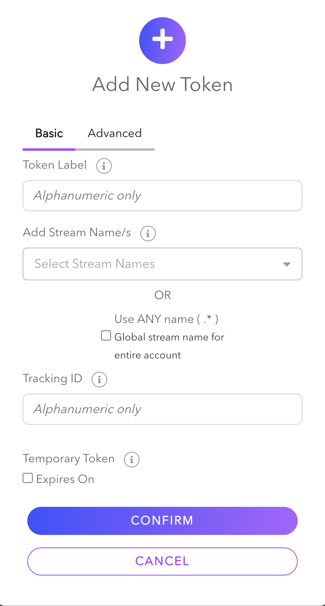

With Dolby.io Real-time Streaming you can syndicate content through multiple distribution partners or channels. This can be helpful to maximize the number of viewers or monetizing content through other platforms. In order to accomplish this, it is important to be able to track syndicated streams for analytics and billing.

## Syndication

Broadcast syndication defines a process for leasing the rights to distribute content through various third-parties. If you own the distribution rights to content you are broadcasting, you may want to sell the feed to other platforms to playback to their audience in order to maximize reach. It is important to do this securely while also metering who is consuming the content that you are distributing.

### Syndication workflow

The following is an **example workflow** for setting up syndicated substreams:

1. [Create a Publish token](/millicast/streaming-dashboard/managing-your-tokens.md) for your broadcast. Make sure this token has the **secured** setting enabled.
2. Before the broadcast begins, create a [Subscribe token with tracking](/millicast/distribution/syndication.md)creating-a-subscribe-token-with-tracking-id) for each 3rd party you are syndicating a stream. These Subscribe tokens function as "master" tokens for each platform you are syndicating content. The master Subscribe token can be used by the 3rd party to [self-sign other Subscribe tokens](/millicast/streaming-dashboard/subscribe-tokens.md)self-signing-subscribe-tokens) for their users if they need to secure their streams. 
3. Begin [broadcasting](/millicast/broadcast/index.mdx) your premium content via Dolby.io. The 3rd parties can use the provided Subscribe token to [access the stream](/millicast/playback/index.md) for their viewers or to [sign more Subscribe tokens for their viewers](/millicast/streaming-dashboard/subscribe-tokens.md)self-signing-subscribe-tokens).
4. When the stream is running, the media server will [gather statistics](/millicast/distribution/syndication.md)viewing-statistics) for the viewer associated with the tracking ID information. Since Dolby.io charges based on bandwidth, this data can be used to bill the 3rd parties relative to their consumed data.

### RTMP syndication

In certain circumstances, you may also choose to distribute content with RTMP to share on public commercial streaming platforms. Follow the [Simulcast WebRTC and RTMP on OBS guide](/millicast/software-encoders/using-obs.md)simulcast-both-webrtc-and-rtmp-contributing-sources) to learn how you can use OBS to create a real-time WebRTC stream and an RTMP stream simultaneously. It is important to note that the WebRTC stream will be real-time (_\<500ms_), while the RTMP stream may have more delay (_6s - 30s_).

## How-to track syndication

The Streaming platform lets you track the following data while using syndication:

- Bandwidth consumption per a distribution channel. The **trackingId** parameter, which groups viewers of the same stream, allows you to get the aggregated bandwidth usage of all viewers. This is useful for billing or user engagement analytics. 

- Bandwidth consumption of a specific viewer. By assigning a unique identifier to each viewer via the **customViewerData** parameter, you can access the bandwidth consumption of each viewer for analytics purposes. This form of tracking is not available for everyone and requires contacting sales.

To manage viewing access, there are two types of tokens you use to syndicate:

- [Subscribe tokens](/millicast/streaming-dashboard/token-api.md)subscribe-tokens) can be used to restrict access for "who" may view a stream. You can assign a `trackingId` to each token for correlating usage.
- [Self-signed Subscribe tokens](/millicast/streaming-dashboard/token-api.md)self-sign-subscribe-tokens) are JSON Web Tokens (JWT) that can be generated using a single _subscribe token_ as the parent. These tokens can also be used to restrict access for "who" may view a stream but are instead created, signed, and managed by the content owner or distributor.

### Creating a Subscribe token with tracking ID

You can create a subscribe token with a tracking ID using either the [Create Token](/millicast/api/subscribe-token-v-1-create-token.api.mdx) API or the [Dolby.io dashboard](https://dashboard.dolby.io/).

To use the [Create Token](/millicast/api/subscribe-token-v-1-create-token.api.mdx) API, add the following to your API request body:

```json Request body for Create Token
{
  "label": "with-tracking-2",
  "streams": [
    {
      "streamName": "test-stream",
      "isRegex": false
    }
  ],
  "tracking": {
    "trackingId": "JohnDoe"
  },
  "originCluster": "ams-1"
}
```

> 🚧 Region Origination
> 
> The published stream and Subscribe token must originate from the same cluster region. The "Auto" region may be selected for both if the broadcast region changes from stream to stream. For more information, see [Multi-region Support](/millicast/distribution/multi-region-support/index.md).

Alternatively, you can specify a tracking ID using the [Dolby.io dashboard](https://dashboard.dolby.io/)  when [creating a Subscribe token](/millicast/streaming-dashboard/subscribe-tokens.md)creating-a-subscriber-token). 





### Tracking with self-signed Subscribe tokens

Once you have created a Subscribe token with a tracking ID, you can self-sign the token by following [this procedure](/millicast/streaming-dashboard/subscribe-tokens.md)creating-a-self-signed-token). Be aware of the [limitations](/millicast/streaming-dashboard/subscribe-tokens.md)limitations).

### Viewing statistics

With your API Secret found on the Dolby.io dashboard, you can query information based on your viewer's tracking ID and other data using the following REST APIs: 

- [Total bandwidth per TrackingID per stream](/millicast/api/analytics-get-tracking-total-for-streams.api.mdx)
- [Series bandwidth per TrackingID per stream](/millicast/api/analytics-get-tracking-series-for-streams.api.mdx)
- [Total bandwidth for streams specified by TrackingID](/millicast/api/analytics-get-total-bandwidth-for-tracking-id.api.mdx)
- [Series bandwidth for streams specified by TrackingID](/millicast/api/analytics-get-series-bandwidth-for-tracking-id.api.mdx)

To get the bandwidth consumption of a specific viewer, use the [Viewer Records](/millicast/api/reporting/records-get-viewer-records.api.mdx) REST API.
